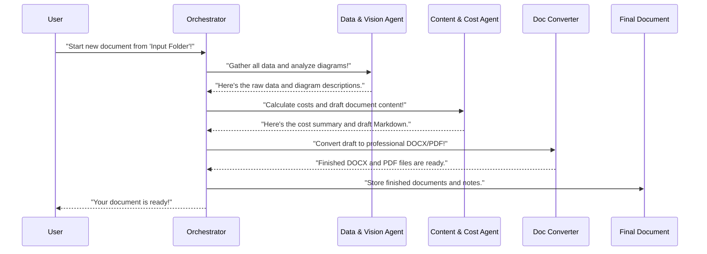

# Chapter 1: Main Application Orchestrator

Imagine you have a big pile of raw materials for a construction project: blueprints, material lists, cost estimates, and lots of notes. How do you turn all of that into a finished building? You need a project manager to coordinate everything!

In our project, `Agentic-Blueprint-Scribe-Lite`, we face a similar challenge. We have an "input folder" containing various pieces of information about a software design: text files describing features, diagram files (like architecture diagrams), and notes on expected resource usage. Our goal is to transform all this raw information into a professional, complete design document, ready to be shared.

This is where the **Main Application Orchestrator** comes in! Think of it as the ultimate project manager for creating your design document. Its main job is to coordinate all the different specialized "workers" (we call them "agents" in this project) to ensure they do their part in the correct order, turning your raw inputs into a beautiful, finished document.

### What Does "Orchestrator" Mean?

The word "orchestrator" might sound fancy, but it simply means something that arranges and coordinates elements to produce a desired effect, just like a conductor leads an orchestra.

Here's how our Orchestrator works:

1.  **Takes Your Request:** You tell it what input folder to use.
2.  **Calls the Right Specialists:** It knows which specialized "agents" are needed for each step of document creation.
3.  **Ensures Correct Order:** It makes sure each agent performs its task at the right time. For example, you can't write a document about a diagram before the diagram has been "understood" by an agent!
4.  **Manages Shared Information:** All agents need to share information. The Orchestrator uses a central "briefcase" (called a `manifest`) where agents put their results, making them available for the next agent in line.

### How to Use the Main Application Orchestrator

To kick off the entire document generation process, you simply run a Python script called `forge.py`. This script is our Main Application Orchestrator.

Let's say you have an input folder named `Input Resources/ml_training_platform` that contains all the raw data for your "ML Training Platform" design document. You would use a command like this in your terminal:

```bash
python forge.py "Input Resources/ml_training_platform"
```

When you run this command, the Orchestrator (`forge.py`) takes the path to your input folder and begins its work. It will then manage the entire process, leading to the creation of a `.docx` and `.pdf` file in the end.

The core part of `forge.py` that listens to your command looks like this:

```python
# --- File: forge.py ---
import typer
import pathlib

app = typer.Typer(add_completion=False)

@app.command()
def build(
    folder: pathlib.Path = typer.Argument(
        ..., # This means the argument is required
        exists=True, # The folder must exist
        file_okay=False, # It must be a directory, not a file
        dir_okay=True, # It's okay if it's a directory
        resolve_path=True, # Convert to a full path
        help="Dataset folder to process (e.g., 'Input Resources/ml_training_platform')",
    )
) -> None:
    """Generate a design-doc (Markdown → DOCX + PDF) for a single dataset folder."""
    # ... Orchestrator's magic happens here ...

if __name__ == "__main__":
    app()
```

This snippet shows that `forge.py` uses a library called `typer` to create command-line tools. The `build` function is what gets called when you run `python forge.py build <your_folder_path>`. The `folder` argument is where your input folder path goes.

### Inside the Orchestrator: How It Works

So, what exactly happens when you run `forge.py`? Let's peek behind the curtain.

Imagine our project manager (the Orchestrator) receiving the input folder. Here's a simplified sequence of actions it takes:



This diagram shows how the Orchestrator delegates tasks to specialized agents. Each agent does its part and then passes its results back to the Orchestrator (or updates the shared `manifest`), which then hands it off to the next agent in the sequence.

Let's look at the actual code in `forge.py` to see this sequence of calls:

```python
# --- File: forge.py (simplified) ---
# We're inside the 'build' function
# Imports for the specialized agents/modules
from src.ingestion import build_manifest
from src.vision_agent import enrich_with_captions
from src.drafting_agent import draft_markdown
from src.converter import md_to_docx_pdf
from src.store import record_run
from src.cost_inputs import load_usage
from src.cost_calculator import build_cost_frame
from src.pricing_agent import get_prices

def build(folder: pathlib.Path) -> None:
    # 1. Start by validating our environment (e.g., are required tools installed?)
    # validate_runtime() # (skipped for simplicity)

    # 2. First, let the Data Ingestion & Manifest agent gather all raw info
    manifest = build_manifest(folder) # See [Data Ingestion & Manifest](02_data_ingestion___manifest_.md)
    
    # 3. Next, let the Diagram Analysis (Vision Agent) analyze diagrams
    manifest = enrich_with_captions(manifest) # See [Diagram Analysis (Vision Agent)](04_diagram_analysis__vision_agent__.md)

    # 4. Handle cost-related inputs (Usage, Pricing, Calculation)
    usage_dict = load_usage(folder, manifest) # See [Cost Input Processing](03_cost_input_processing_.md)
    manifest["usage"] = usage_dict # Store it in our shared "briefcase"
    prices = get_prices() # See [Cloud Pricing Agent](05_cloud_pricing_agent_.md)
    manifest["prices"] = prices # Store prices too
    cost_df = build_cost_frame(manifest["slug"], usage_dict, prices) # See [Cost Calculation Engine](06_cost_calculation_engine_.md)
    manifest["cost_summary"] = cost_df # Add cost results to briefcase

    # 5. Then, let the Markdown Drafting (LLM Agent) write the document content
    md_path = draft_markdown(manifest) # See [Markdown Drafting (LLM Agent)](07_markdown_drafting__llm_agent__.md)

    # 6. Finally, let the Document Transformation agent convert it to DOCX/PDF
    docx_path, pdf_path = md_to_docx_pdf(md_path, manifest["slug"]) # See [Document Transformation](08_document_transformation_.md)

    # 7. Record what happened for future reference
    record_run(manifest["slug"], docx_path, pdf_path) # See [Run Metadata Storage](09_run_metadata_storage_.md)

    typer.echo(f"✓ Generated → {pdf_path}")
```

As you can see, the `build` function in `forge.py` makes a series of calls to functions imported from other files (like `src/ingestion.py`, `src/vision_agent.py`, etc.). Each of these calls represents the Orchestrator handing off a specific task to a specialized agent.

The `manifest` variable is super important here. Think of it as the shared "briefcase" or "project status report" that the Orchestrator carries around. Each agent adds its findings and results to this `manifest`, allowing the next agent to pick up where the previous one left off.

### Conclusion

You've just learned about the brain of the `Agentic-Blueprint-Scribe-Lite` project: the **Main Application Orchestrator**. It's the central command center that takes your input folder and intelligently coordinates various specialized "agents" to produce a complete design document. It ensures all steps, from gathering data to writing content and converting formats, happen in the correct order.

In the next chapter, we'll dive deeper into the very first step the Orchestrator takes: [Data Ingestion & Manifest](02_data_ingestion___manifest_.md). This is where all the raw information from your input folder is collected and organized!

---

Built by [Codalytix.com](Codalytix.com)
