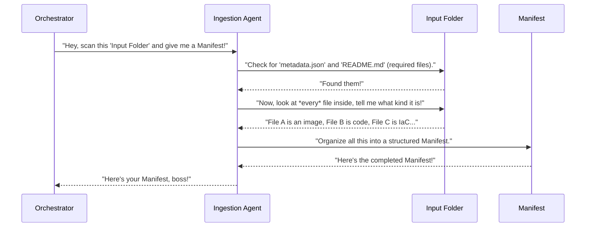

# Chapter 2: Data Ingestion & Manifest

In [Chapter 1: Main Application Orchestrator](01_main_application_orchestrator_.md), we learned that `forge.py` acts like a project manager, coordinating all the different "workers" (agents) to build your design document. But before a project manager can assign tasks, they need to know *what* materials they have to work with, right?

Imagine you're building a Lego castle. You have a big box of Lego bricks. Before you can follow the instructions, you first need to:
1.  **Open the box:** See what's inside.
2.  **Sort the bricks:** Put all the red bricks together, all the blue ones, all the special pieces, and so on.
3.  **Make a list:** Note down how many of each type of brick you have, and where they are.

This crucial first step of "seeing what's inside, sorting it, and making a list" is exactly what **Data Ingestion & Manifest** does for your project!

### What Problem Does It Solve?

When you run `python forge.py "Input Resources/ml_training_platform"`, your `Input Resources/ml_training_platform` folder might contain all sorts of files:

*   `architecture_diagram.png` (an image)
*   `main.py` (some Python code)
*   `network.tf` (infrastructure-as-code for cloud setup)
*   `README.md` (project description)
*   `metadata.json` (key project details)
*   Other text files or notes.

The [Main Application Orchestrator](01_main_application_orchestrator_.md) doesn't inherently know what's what. It needs help to:

1.  **Discover** all relevant files.
2.  **Identify** what *kind* of file each is (is it a diagram? code? a configuration file?).
3.  **Organize** all this discovered information into a single, easy-to-use structure.

This is the job of **Data Ingestion & Manifest**.

### Key Concepts

Let's break down the two parts:

#### 1. Data Ingestion (The Scanner/Inventory Clerk)

"Data Ingestion" simply means the process of **taking in** data. In our case, it's like an automated inventory clerk. This part of the system goes through your input project folder, file by file, and figures out what each file is.

It's smart enough to recognize specific types of files:

*   **Architectural Diagrams:** Images that usually start with `architecture_` (like `architecture_overview.png`). These are important because a later step ([Diagram Analysis (Vision Agent)](04_diagram_analysis__vision_agent__.md)) will "look" at them.
*   **Infrastructure-as-Code (IaC):** Files that define your cloud setup (like `.tf` files for Terraform).
*   **Code Files:** Actual programming code (like `.py` for Python, `.js` for JavaScript).
*   **Project Metadata:** Special files like `metadata.json` which contain important details about your project, and `README.md` which often has an overview.

#### 2. The Manifest (The Comprehensive Checklist)

Once the Data Ingestion "clerk" has scanned everything, it doesn't just forget what it found. It compiles all that discovered and categorized information into a highly organized structure called the **Manifest**.

Think of the Manifest as:

*   **A central "briefcase"**: As mentioned in Chapter 1, this is where all agents store and retrieve information.
*   **A comprehensive checklist/table of contents**: It lists exactly what files were found, what type they are, and other critical project details.
*   **The primary source of truth**: Every other "worker" (agent) in the `Agentic-Blueprint-Scribe-Lite` system will refer to this Manifest to know what to do next.

The Manifest is essentially a Python dictionary (a collection of key-value pairs, like a real-world dictionary with words and their definitions). It holds things like the project's title, description, and lists of all discovered image paths, code files, and IaC files.

### How the Orchestrator Uses It

You don't directly run the "Data Ingestion" step. Instead, the [Main Application Orchestrator](01_main_application_orchestrator_.md) automatically performs this as its very first task!

Remember the `forge.py` command?

```bash
python forge.py "Input Resources/ml_training_platform"
```

When you run this, the Orchestrator immediately calls a special function to start the Data Ingestion process. Here's a tiny peek at that call from `forge.py`:

```python
# --- File: forge.py (simplified) ---
from src.ingestion import build_manifest # Our Data Ingestion helper!

def build(folder: pathlib.Path) -> None:
    # ... other setup ...

    # 1. First, let the Data Ingestion & Manifest agent gather all raw info
    manifest = build_manifest(folder) # This is where the magic happens!
    
    # ... rest of the Orchestrator's steps ...
```

In this snippet, `manifest = build_manifest(folder)` is the line that kicks off the entire "Data Ingestion & Manifest" process. It takes your input `folder` path and returns the `manifest` dictionary, which then gets passed along to all the subsequent steps.

### Under the Hood: How Data Ingestion & Manifest Works

Let's simplify how the `build_manifest` function works internally.

#### High-Level Walkthrough

Here's what happens step-by-step when `build_manifest` is called by the Orchestrator:



#### Diving into the Code (`src/ingestion.py`)

The actual work of Data Ingestion and creating the Manifest happens inside a file named `src/ingestion.py`. Let's look at simplified pieces of it.

First, it defines some important "patterns" to recognize different file types:

```python
# --- File: src/ingestion.py (simplified) ---
import re, pathlib # Needed for file operations and pattern matching

# These are files we absolutely need at the top level of your input folder
REQUIRED_TOP = {"metadata.json", "README.md"}

# These are patterns (like special search filters) to identify file types
IMG_PATTERN = re.compile(r"architecture_.*\.(png|jpg|jpeg)$", re.I) # Looks for image files starting with 'architecture_'
IAC_PATTERN = re.compile(r".*\.tf$", re.I) # Looks for files ending with '.tf' (Terraform)
CODE_PATTERN = re.compile(r".*\.(py|js|ts|go|java)$", re.I) # Looks for common code file extensions
```

These `_PATTERN` variables are like smart search rules. `IMG_PATTERN`, for example, is designed to quickly spot your architecture diagrams.

Next, the `build_manifest` function itself:

```python
# --- File: src/ingestion.py (simplified) ---
# ... (imports and patterns from above) ...

def build_manifest(folder: pathlib.Path) -> dict: # Takes a folder path, returns a dictionary (the manifest)
    """
    Scans an input folder and creates a Manifest.
    """
    if not folder.is_dir(): # Basic check: Is it actually a folder?
        raise ValueError(f"{folder} is not a directory")

    # 1. Check for required files
    missing = [f for f in REQUIRED_TOP if not (folder / f).exists()]
    if missing:
        raise ValueError(f"Missing required file(s): {', '.join(missing)}")
    # This makes sure important files like metadata.json exist.

    # 2. Load basic project info from metadata.json
    metadata = json.loads((folder / "metadata.json").read_text(encoding="utf-8"))
    # This reads your project's name, description, etc. from metadata.json.

    # 3. Prepare lists to store found files
    images = [] # To store details about image files
    iac_files = [] # To store paths of Infrastructure-as-Code files
    code_files = [] # To store paths of code files
    other_files = [] # For everything else

    # 4. Scan *every* file in the folder (and its subfolders!)
    for p in folder.rglob("*"): # 'rglob("*")' means "go through everything recursively"
        if p.is_dir(): # Skip folders themselves, we only care about files
            continue
        rel = str(p.relative_to(folder)) # Get path relative to the input folder

        # 5. Categorize each file using our patterns
        if IMG_PATTERN.match(p.name): # Is it an image (like architecture_*.png)?
            images.append({"path": rel}) # Add its path to our images list
        elif IAC_PATTERN.match(p.name): # Is it an IaC file (like .tf)?
            iac_files.append(rel) # Add its path to the IaC list
        elif CODE_PATTERN.match(p.name): # Is it a code file (like .py)?
            code_files.append(rel) # Add its path to the code list
        else:
            other_files.append(rel) # If none of the above, it's an "other" file

    # 6. Build the final Manifest dictionary
    manifest = {
        "slug": folder.name, # A short name for the project
        "title": metadata.get("name"), # Project title from metadata.json
        "description": metadata.get("description"), # Project description
        "metadata": metadata, # All original metadata
        "images": images, # List of all discovered images
        "iac_files": iac_files, # List of all discovered IaC files
        "code_files": code_files, # List of all discovered code files
        "other_files": other_files, # List of all other files
    }
    return manifest # Send this comprehensive Manifest back to the Orchestrator!
```

This `build_manifest` function is the workhorse of this chapter. It systematically scans your input folder, categorizes every relevant file, pulls out key project details, and then bundles all of it into the `manifest` dictionary. This `manifest` becomes the central hub of information for all the subsequent steps in creating your document.

### Conclusion

You've just learned about **Data Ingestion & Manifest**, the critical first step in `Agentic-Blueprint-Scribe-Lite`. It's like the initial inventory of your project materials. Data Ingestion scans and categorizes all the files in your input folder, and then the Manifest organizes all that information into a single, structured checklist. This Manifest is then passed along by the [Main Application Orchestrator](01_main_application_orchestrator_.md) to all the other specialized "agents" as their primary source of truth.

Now that we have a complete list of all the project files, including potential cost-related information, the next step is to understand how we process those specific cost inputs.

[Next Chapter: Cost Input Processing](03_cost_input_processing_.md)

---

Built by [Codalytix.com](Codalytix.com)
