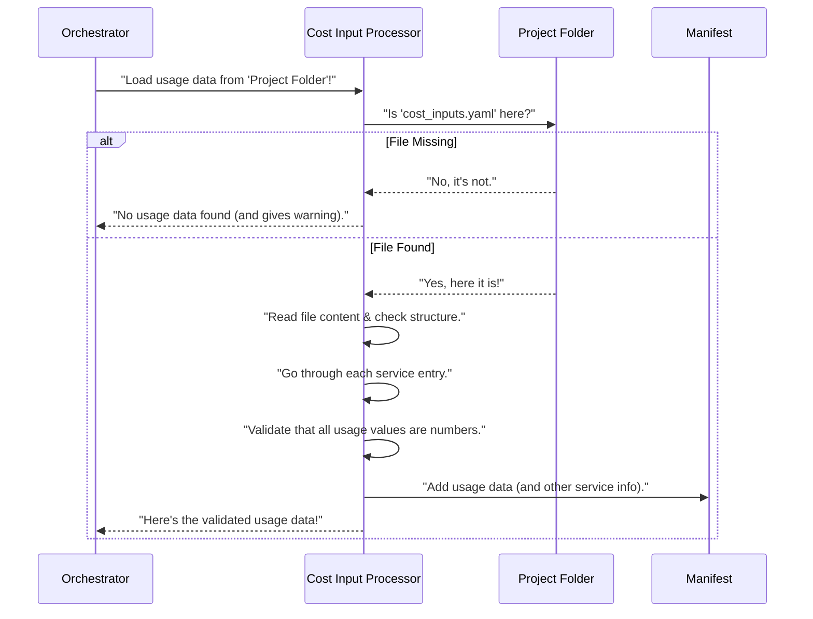

# Chapter 3: Cost Input Processing

In [Chapter 2: Data Ingestion & Manifest](02_data_ingestion___manifest_.md), we learned how `Agentic-Blueprint-Scribe-Lite` scans your project folder, finds all the important files, and organizes them into a central "briefcase" called the `manifest`. Now, we have a good overview of your project's components.

But what if you want to include *cost estimates* in your final design document? For example, if your design uses AWS cloud services like S3 (storage) or Lambda (serverless functions), you'd probably want to estimate how much they might cost based on how much you expect to use them.

This is where **Cost Input Processing** comes in! Think of it as your project's **finance department's data entry clerk**. Its main job is to carefully read the numbers you provide for expected cloud service usage, make sure they are correct, and then pass them on for calculations.

### What Problem Does It Solve?

Imagine you're designing an online store. You know you'll need:
*   Storage for product images (e.g., 500 GB in S3).
*   A certain number of database queries per month (e.g., 1 million DynamoDB reads).
*   Some processing time for customer orders (e.g., 100,000 Lambda invocations).

You, the designer, know these estimated usage numbers. But how do you tell `Agentic-Blueprint-Scribe-Lite` about them so it can calculate costs?

The problem is:
1.  **Finding the Numbers**: Where do you put these usage figures so the system can find them?
2.  **Understanding the Numbers**: How does the system know what `500` means – is it gigabytes? petabytes?
3.  **Ensuring Correctness**: What if you accidentally type "five hundred" instead of `500`? Or a negative number? The system needs to check these inputs.

**Cost Input Processing** solves these problems by providing a standardized way to input your usage estimates and ensuring they are ready for calculations.

### Key Concept: The `cost_inputs.yaml` File

To provide your usage estimates, you'll create a special file named `cost_inputs.yaml` inside your project's input folder.

*   **`cost_inputs.yaml`**: This file is like a form where you fill in your estimated usage for different AWS services.
*   **YAML Format**: YAML is a simple, human-friendly data format, often used for configuration files. It uses indentation to show how things are related.
*   **Numeric Values**: All your usage figures must be numbers (like `500` or `1.5`), not text.

**Example `cost_inputs.yaml`:**

Let's say for our online store, you expect the following usage for AWS services:

```yaml
# --- File: Input Resources/online_store/cost_inputs.yaml ---
S3:
  storage_gb: 500.0  # Estimated S3 storage in Gigabytes
  requests: 1000000  # Estimated number of S3 requests
Lambda:
  invocations: 100000 # Estimated number of Lambda function calls
  duration_ms: 5000000 # Total duration in milliseconds for all invocations
DynamoDB:
  read_units: 1000000 # Estimated read capacity units
  write_units: 500000 # Estimated write capacity units
```

In this example:
*   `S3`, `Lambda`, `DynamoDB` are the names of cloud services.
*   `storage_gb`, `requests`, `invocations`, etc., are the specific usage metrics for each service.
*   The numbers (`500.0`, `1000000`) are your estimated quantities.

### How the Orchestrator Uses It

Just like [Data Ingestion & Manifest](02_data_ingestion___manifest_.md), you don't directly run "Cost Input Processing". The [Main Application Orchestrator](01_main_application_orchestrator_.md) automatically calls it as part of its sequence!

Remember the `forge.py` script? After gathering all the general project data, the Orchestrator moves on to handling cost-related information.

Here's the relevant part from `forge.py`:

```python
# --- File: forge.py (simplified) ---
from src.cost_inputs import load_usage # Our Cost Input helper!

def build(folder: pathlib.Path) -> None:
    # ... (steps 1 & 2: build_manifest, enrich_with_captions) ...

    # 4. Handle cost-related inputs (Usage, Pricing, Calculation)
    usage_dict = load_usage(folder, manifest) # This is where the cost inputs are processed!
    manifest["usage"] = usage_dict # Store it in our shared "briefcase"

    # ... (rest of the Orchestrator's steps for pricing, calculation, etc.) ...
```

When `load_usage(folder, manifest)` is called, it does the following:
1.  **Looks for** `cost_inputs.yaml` in your project `folder`.
2.  **Reads** the numbers you've put in it.
3.  **Checks** if those numbers are valid (e.g., actually numbers).
4.  **Returns** a neat dictionary (`usage_dict`) containing all your estimated usage figures.
5.  **Adds** this `usage_dict` to the shared `manifest` "briefcase" so other agents (like the [Cost Calculation Engine](06_cost_calculation_engine_.md)) can use it.

If the `cost_inputs.yaml` file is missing, or if it contains errors (like text where a number should be), `load_usage` will gracefully handle it, often by issuing warnings, so the process doesn't completely stop, but you're informed.

### Under the Hood: How Cost Input Processing Works

Let's see what happens inside the `load_usage` function from `src/cost_inputs.py`.

#### High-Level Walkthrough

Here's the sequence of events when the `load_usage` function is called:



#### Diving into the Code (`src/cost_inputs.py`)

The actual work of parsing and validating `cost_inputs.yaml` happens inside `src/cost_inputs.py`.

First, let's look at the main function, `load_usage`:

```python
# --- File: src/cost_inputs.py (simplified) ---
import pathlib, yaml, warnings
from typing import Dict

def load_usage(dataset_folder: pathlib.Path, manifest: Dict) -> Dict[str, Dict[str, float]]:
    """
    Locate & validate `cost_inputs.yaml`.
    Returns usage dict. Missing file ⇒ {} plus warning.
    """
    path = dataset_folder / "cost_inputs.yaml" # Construct the full path to the file

    if not path.is_file(): # Check if the file actually exists
        warnings.warn(f"[Cost-Model] No cost_inputs.yaml found in {dataset_folder}")
        return {} # If not found, return an empty dictionary and a warning

    raw_yaml = yaml.safe_load(path.read_text(encoding="utf-8")) or {} # Read and parse the YAML file
    if not isinstance(raw_yaml, dict): # Check if the YAML is structured as a dictionary
        raise ValueError("[Cost-Model] cost_inputs.yaml must contain a mapping")

    # ... (code to build 'all_services' for warning messages) ...

    usage: Dict[str, Dict[str, float]] = {} # This will store our cleaned usage data
    for svc, blob in raw_yaml.items(): # Loop through each service (e.g., S3, Lambda)
        try:
            # Here, we use a helper to validate each service's usage numbers
            usage[svc] = CostRecord.validate_entry(svc, blob).root
        except Exception as e: # Catch any errors during validation
            raise ValueError(f"[Cost-Model] Invalid usage entry for '{svc}': {e}") from e

    # ... (code to issue warnings for missing or extra services) ...

    return usage # Return the clean usage dictionary
```

This `load_usage` function is the core of this chapter. It first finds the `cost_inputs.yaml` file. If it exists, it reads its content. Then, for each service listed in the YAML (like `S3` or `Lambda`), it calls a special helper to check its values.

Let's look at the `CostRecord.validate_entry` part mentioned above. This is handled by a special class called `CostRecord` (using a tool called `Pydantic`). You don't need to understand `Pydantic` deeply, just know its job here is to make sure your numbers are truly numbers.

```python
# --- File: src/cost_inputs.py (simplified) ---
from pydantic import RootModel # Part of the validation tool
from typing import Dict

# --- Pydantic record for *one* service usage ---
class CostRecord(RootModel[Dict[str, float]]):
    """
    This helps us validate that values for usage (like storage_gb) are numbers.
    """
    @classmethod
    def validate_entry(cls, service: str, blob: dict) -> "CostRecord":
        """
        Goes through each usage metric for a service and converts to float.
        Raises an error if a value is not numeric.
        """
        clean: Dict[str, float] = {}
        for k, v in blob.items(): # Loop through each metric (e.g., 'storage_gb', 'requests')
            try:
                clean[k] = float(v) # Try to convert the value to a decimal number
            except (TypeError, ValueError): # If it's not a number, catch the error
                raise ValueError(
                    f"Usage value for '{service}.{k}' must be numeric, got {v!r}"
                )
        return cls.model_validate(clean) # Return the cleaned, validated numbers
```

The `validate_entry` part is crucial. For each `S3` or `Lambda` entry in your `cost_inputs.yaml`, this code takes all its sub-values (like `storage_gb` or `invocations`) and tries to turn them into floating-point numbers (numbers with decimals, like `500.0`). If it encounters text like `"five hundred"` instead of `500`, it will immediately flag an error, telling you exactly where the mistake is. This ensures that the data passed to the next steps is always clean and reliable.

Finally, the `load_usage` function also has logic to issue warnings if it finds services listed in your `cost_inputs.yaml` that weren't mentioned anywhere else in your project (like in diagrams or `metadata.json`), or if services mentioned elsewhere are missing usage data in your `cost_inputs.yaml`. These warnings help you keep your cost estimates complete and accurate.

### Conclusion

You've now learned about **Cost Input Processing**, the "data entry clerk" that handles your estimated usage numbers for cloud services. It ensures that your `cost_inputs.yaml` file is correctly formatted and that all usage values are valid numbers. This crucial step prepares the data for later cost calculations, allowing `Agentic-Blueprint-Scribe-Lite` to generate comprehensive design documents with estimated costs.

With our project's data now ingested and our cost inputs processed, the Orchestrator is ready to move on to understanding the visual aspects of your design.

[Next Chapter: Diagram Analysis (Vision Agent)](04_diagram_analysis__vision_agent__.md)

---

Built by [Codalytix.com](Codalytix.com)
