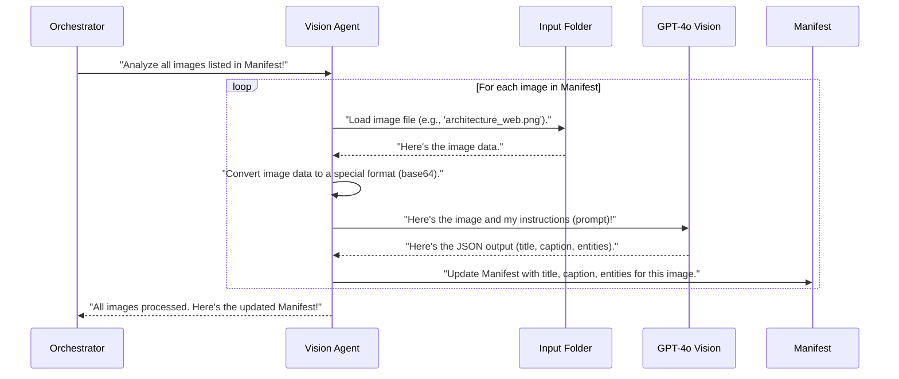

# Chapter 4: Diagram Analysis (Vision Agent)

In [Chapter 3: Cost Input Processing](03_cost_input_processing_.md), we learned how to provide numerical usage estimates for cloud services. Now, our `manifest` (the project's "briefcase") contains all the basic project details, lists of code files, and even our expected cost inputs.

But what about the visual part of your design? Often, a software design document includes architectural diagrams – pictures that show how different parts of the system connect. A human can easily look at a diagram and understand it, but how does our `Agentic-Blueprint-Scribe-Lite` system "see" and understand these images to describe them in the final document?

This is where **Diagram Analysis (Vision Agent)** comes in!

### What Problem Does It Solve?

Imagine you have a beautifully drawn architectural diagram like this one for a simple web application:


*(Image source: AWS Architecture Blog)*

While this image is clear to a person, to a computer, it's just a collection of pixels. It doesn't inherently know:
*   What this diagram is about.
*   What specific AWS services are shown (like "Amazon S3" or "AWS Lambda").
*   What the diagram's main purpose is.

The problem **Diagram Analysis (Vision Agent)** solves is to **automatically "look" at these images, understand their content, and then generate useful text descriptions** (like a title, a short explanation, and a list of key services). This generated text makes your diagrams understandable even without human intervention and integrates seamlessly into your final document.

Think of it as having an **expert art critic who specializes in technical diagrams**. This critic can glance at your architecture image and instantly tell you:
*   Its main subject (e.g., "Serverless Web Application Architecture").
*   A brief summary of what it shows (e.g., "This diagram illustrates a scalable serverless architecture utilizing API Gateway, Lambda, and S3 for a dynamic web application.").
*   The most important components or services depicted (e.g., "API Gateway, Lambda, S3, DynamoDB").

### Key Concepts

This "art critic" is built using a powerful type of Artificial Intelligence. Let's break down how it works:

#### 1. The Vision Agent

This is the "worker" or component in our system that is responsible for handling diagrams. When the [Main Application Orchestrator](01_main_application_orchestrator_.md) needs to understand a diagram, it delegates this task to the Vision Agent.

#### 2. GPT-4o Vision (The "Eyes" of the Agent)

The magic behind the Vision Agent's ability to "see" and understand images comes from a special AI model called **GPT-4o Vision**. You might have heard of GPT models for text (like ChatGPT); GPT-4o Vision is similar, but it can process both text *and* images.

It's like giving our art critic super-smart eyes and a brain that can analyze visual information. When the Vision Agent sends an image to GPT-4o Vision, the AI "looks" at the diagram, identifies shapes, text labels, and connections, and then uses its knowledge of AWS architecture to understand what's being depicted.

#### 3. Generating Descriptive Text

Once GPT-4o Vision has analyzed the image, it doesn't just return a raw understanding. We instruct it to produce specific, structured information that is directly useful for your design document:

*   **Title:** A concise, catchy title (5-7 words) for the diagram.
*   **Caption:** A short, explanatory sentence or two (max 40 words) describing the diagram's purpose or main components.
*   **Entities:** A list of key AWS services or components explicitly shown in the diagram.

This structured text is then saved back into the `manifest` (our shared "briefcase"), ready to be used by the [Markdown Drafting (LLM Agent)](07_markdown_drafting__llm_agent__.md) later to write the document.

### How to Use the Diagram Analysis (Vision Agent)

As a user, you don't directly run the Vision Agent. Instead, you simply:

1.  Place your architectural diagram images (e.g., `architecture_overview.png`, `architecture_data_flow.jpg`) inside your project's input folder.
2.  Ensure you have your OpenAI API key set up in your environment (as described in the project's main `README`). The Vision Agent uses this key to communicate with GPT-4o Vision.
3.  Run the [Main Application Orchestrator](01_main_application_orchestrator_.md) (the `forge.py` script).

The Orchestrator will automatically detect the image files (thanks to [Data Ingestion & Manifest](02_data_ingestion___manifest_.md)), then pass them to the Vision Agent for analysis.

Let's look at the line in `forge.py` that triggers this:

```python
# --- File: forge.py (simplified) ---
from src.vision_agent import enrich_with_captions # Our Vision Agent helper!

def build(folder: pathlib.Path) -> None:
    # ... (step 1: build_manifest) ...
    
    # 3. Next, let the Diagram Analysis (Vision Agent) analyze diagrams
    manifest = enrich_with_captions(manifest) # This is where images are "seen"!

    # ... (rest of the Orchestrator's steps) ...
```

The `enrich_with_captions(manifest)` function is the point where the Vision Agent takes the `manifest` (which contains a list of all detected images) and "enriches" it by adding the AI-generated titles, captions, and entities for each image.

### Under the Hood: How Diagram Analysis (Vision Agent) Works

Let's peek behind the curtain to see how the Vision Agent does its job.

#### High-Level Walkthrough

Here's the sequence of events when `enrich_with_captions` is called:



#### Diving into the Code (`src/vision_agent.py`)

The actual work of the Vision Agent happens inside the `src/vision_agent.py` file.

First, the Vision Agent needs to know how to talk to GPT-4o Vision, which it does using the `openai` library:

```python
# --- File: src/vision_agent.py (simplified) ---
import base64, json, os, pathlib, re
from io import BytesIO
from openai import OpenAI
from PIL import Image # For opening and converting images

# 1. Initialize OpenAI client (reads your OPENAI_API_KEY from environment)
client = OpenAI()
```
This sets up the connection to OpenAI's AI models. `Pillow` (imported as `PIL.Image`) is used to handle image files.

Next, the Vision Agent needs clear instructions for the AI. This is done through a "prompt":

```python
# --- File: src/vision_agent.py (simplified) ---
# ... (imports and client setup) ...

# 2. The instructions (prompt) for GPT-4o Vision
PROMPT_TMPL = """
You are an AWS Solutions Architect reviewing an architecture diagram.

Respond **only** with valid JSON using these keys:
{
  "title": string   // 5-7 words
  "caption": string // 1-2 sentences (max 40 words)
  "entities": [string] // up to 6 important AWS services present
}
No markdown fences, no additional text.
"""
```
This `PROMPT_TMPL` is crucial. It tells GPT-4o Vision *what role to play* (an AWS Solutions Architect) and, more importantly, *how to format its response*: as a JSON object with very specific keys (`title`, `caption`, `entities`). This ensures the output is predictable and easy for our system to use.

Before sending an image to the AI, it needs to be converted into a special text format called a "data URI" (base64 encoded). This makes it possible to send the image data directly within the AI request.

```python
# --- File: src/vision_agent.py (simplified) ---
# ... (prompt and other setup) ...

# 3. Helper function to convert a local image file to a data URI
def _encode_image(path: pathlib.Path) -> str:
    img = Image.open(path) # Open the image file
    buf = BytesIO()
    img.save(buf, format="PNG") # Convert to PNG format (good for AI)
    # Encode the image data into a base64 string and add the data URI prefix
    return "data:image/png;base64," + base64.b64encode(buf.getvalue()).decode()
```
This `_encode_image` function takes your `.png` or `.jpg` file, opens it, and converts its content into a text string that GPT-4o Vision can understand.

Finally, the main function `enrich_with_captions` orchestrates the entire process:

```python
# --- File: src/vision_agent.py (simplified) ---
# ... (all helper functions and setup from above) ...

# 5. The main function called by the Orchestrator
def enrich_with_captions(manifest: Dict) -> Dict:
    # Get the root path of the blueprint folder
    blueprint_root = pathlib.Path("Input Resources") / manifest["slug"]

    # Loop through each image entry that Data Ingestion found in the manifest
    for img in manifest["images"]:
        abs_path = blueprint_root / pathlib.Path(img["path"])
        if not abs_path.exists():
            print(f"[Vision] WARNING: {abs_path} not found, skipping.")
            continue # Skip if image file doesn't exist

        data_uri = _encode_image(abs_path) # Convert image to data URI

        # --- Call GPT-4o Vision! ---
        resp = client.chat.completions.create(
            model="gpt-4o-mini", # The AI model that understands vision
            max_tokens=200,      # Limit the length of the AI's response
            temperature=0.2,     # Control creativity (lower is more factual)
            messages=[
                {
                    "role": "user",
                    "content": [
                        {"type": "text", "text": PROMPT_TMPL.strip()}, # Our instructions
                        {"type": "image_url", "image_url": {"url": data_uri}}, # The image data
                    ],
                }
            ],
        )

        # Extract the JSON response from the AI's message
        payload = _extract_json(resp.choices[0].message.content)
        if payload:
            img.update(payload) # Add the title, caption, entities to the image's manifest entry
            print(f"[Vision] ✔ {img['path']} captioned.")
        else:
            print(f"[Vision] ✖ Could not parse JSON for {img['path']}.")

    return manifest # Return the updated manifest
```

This `enrich_with_captions` function does the heavy lifting:
1.  It goes through each image path that was found during [Data Ingestion & Manifest](02_data_ingestion___manifest_.md) and stored in `manifest["images"]`.
2.  For each image, it converts it into the `data_uri` format.
3.  It then makes a call to OpenAI's API, sending both the `PROMPT_TMPL` (our instructions) and the `data_uri` (the image itself). We specifically use `gpt-4o-mini`, which is a cost-effective model capable of vision.
4.  Once the AI responds, the `_extract_json` helper function carefully pulls out the JSON-formatted title, caption, and entities.
5.  Finally, these extracted details are added directly to the corresponding image entry within the `manifest`. This ensures that when the [Markdown Drafting (LLM Agent)](07_markdown_drafting__llm_agent__.md) later generates the document, it has all the descriptive text it needs for each diagram.

### Conclusion

You've now learned about **Diagram Analysis (Vision Agent)**, the crucial component that gives `Agentic-Blueprint-Scribe-Lite` the ability to "see" and understand your architectural diagrams. By leveraging powerful AI like GPT-4o Vision, it automatically generates descriptive titles, captions, and lists of key services, making your visual designs fully integrated and explained within your final document.

With our project's data ingested, cost inputs processed, and diagrams analyzed, the Orchestrator is now ready to get the latest pricing information for cloud services.

[Next Chapter: Cloud Pricing Agent](05_cloud_pricing_agent_.md)

---

Built by [Codalytix.com](Codalytix.com)
