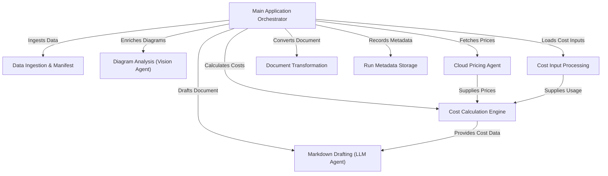

# Tutorial: Agentic-Blueprint-Scribe-Lite

This project, `Agentic-Blueprint-Scribe-Lite`, is an automated tool that **generates comprehensive design documents** for cloud architectures. It acts like a *virtual project manager*, orchestrating various AI agents to ingest data, analyze diagrams, draft detailed Markdown content, calculate cloud costs, and finally convert everything into professional DOCX and PDF formats, saving time and ensuring consistency.

**Source Repository:** [https://github.com/kmishra1204/Agentic-Blueprint-Scribe-Lite](https://github.com/kmishra1204/Agentic-Blueprint-Scribe-Lite)

## Chapters

1. [Main Application Orchestrator
](01_main_application_orchestrator_.md)
2. [Data Ingestion & Manifest
](02_data_ingestion___manifest_.md)
3. [Cost Input Processing
](03_cost_input_processing_.md)
4. [Diagram Analysis (Vision Agent)
](04_diagram_analysis__vision_agent__.md)
5. [Cloud Pricing Agent
](05_cloud_pricing_agent_.md)
6. [Cost Calculation Engine
](06_cost_calculation_engine_.md)
7. [Markdown Drafting (LLM Agent)
](07_markdown_drafting__llm_agent__.md)
8. [Document Transformation
](08_document_transformation_.md)
9. [Run Metadata Storage
](09_run_metadata_storage_.md)

---

Built by [Codalytix.com](Codalytix.com)
