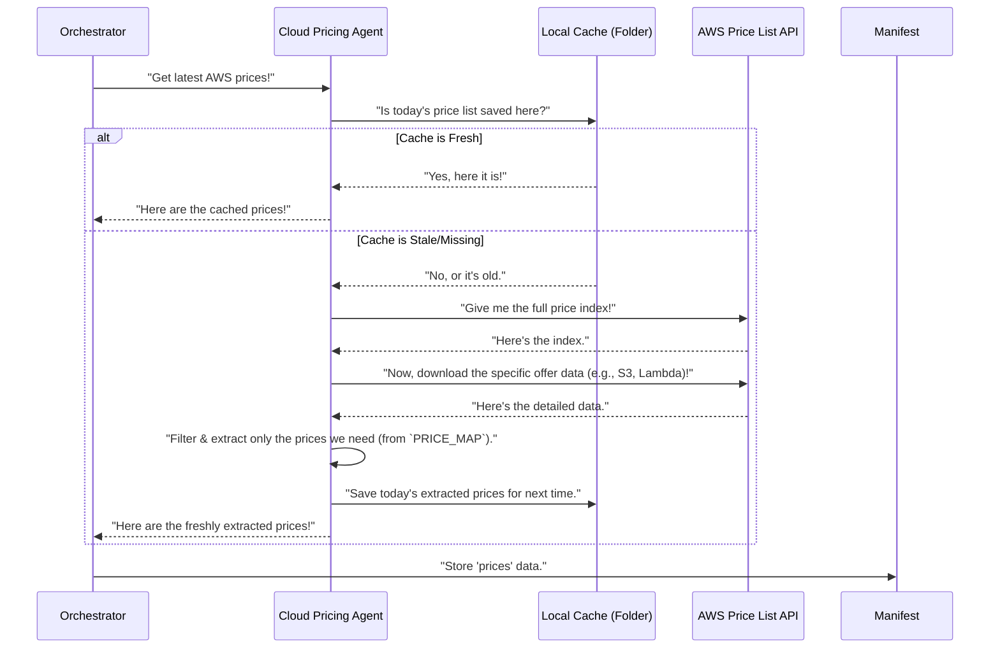

# Chapter 5: Cloud Pricing Agent

In [Chapter 4: Diagram Analysis (Vision Agent)](04_diagram_analysis__vision_agent__.md), we saw how `Agentic-Blueprint-Scribe-Lite` can "see" and understand your architectural diagrams, adding helpful descriptions to our project's central "briefcase" (the `manifest`). So far, we have a good grasp of your project's components and even your estimated usage for cloud services (from [Chapter 3: Cost Input Processing](03_cost_input_processing_.md)).

But one crucial piece of the cost puzzle is still missing: **the actual prices**! You might know you'll use "500 GB of S3 storage," but how much does 1 GB of S3 storage *actually cost* this month? Cloud service prices, especially for providers like AWS, can change, and there are millions of different pricing options.

This is where the **Cloud Pricing Agent** comes in! Think of it as your project's **dedicated market researcher for AWS service prices**. Its job is to find the most accurate, up-to-date prices for the specific AWS services you plan to use, making sure your cost estimations are spot on.

### What Problem Does It Solve?

Imagine you're trying to estimate the monthly bill for your new cloud application. You've already listed how much you expect to use various services in your `cost_inputs.yaml` file, like:

*   "We'll use 100,000 Lambda function calls."
*   "We need 500 GB of S3 storage."
*   "We'll have an EC2 instance running for 720 hours per month."

The problem is, knowing the *quantity* isn't enough to calculate the *cost*. You also need to know the *price per unit* for each of those quantities. For example, how much does *one* Lambda function call cost? Or *one* GB of S3 storage per month?

The **Cloud Pricing Agent** solves this by:

1.  **Finding the Latest Prices:** It reaches out directly to AWS to get the most current prices.
2.  **Saving Time and Money:** It remembers the prices it found for a day so it doesn't have to ask AWS again and again.
3.  **Getting Just What's Needed:** It doesn't download the *entire* massive AWS price list. Instead, it only picks out the very specific prices relevant to your project's cost model.

This ensures that when the time comes to calculate your estimated bill, the numbers are accurate and up-to-date.

### Key Concepts

Let's break down how our "market researcher" works:

#### 1. Live Price Fetching

The core ability of the Cloud Pricing Agent is to connect to **AWS's official Price List API**. This is a special tool provided by AWS that allows programs to ask for the current prices of all their services. It's like having an always-updated digital catalog of every AWS service and its cost.

#### 2. Local Caching (Remembering for a Day)

Fetching prices from AWS takes a little time and uses your internet connection. To make the process faster and more efficient, the Cloud Pricing Agent includes a **caching mechanism**.

Think of "caching" like this:
*   When the agent fetches prices for the first time today, it **saves a copy** of those prices in a special folder on your computer.
*   If you run `Agentic-Blueprint-Scribe-Lite` again later *on the same day*, the agent will first check this saved copy. If it's there and still fresh (less than a day old), it will just use that saved copy instead of downloading everything again from AWS. This saves time!
*   If it's a new day, or the saved copy is too old, it will fetch fresh prices from AWS again.

#### 3. Targeted Price Extraction

AWS has hundreds of services, each with many different ways to be priced (e.g., different regions, different payment models). Our project only needs a specific set of "on-demand" prices for common services.

The Cloud Pricing Agent doesn't download and store *everything*. Instead, it has a pre-defined "shopping list" (which we'll see in the code) of exactly which services and pricing metrics we care about. It then intelligently sifts through the massive AWS price list to **extract only those specific price points**. This makes the data clean and focused for our [Cost Calculation Engine](06_cost_calculation_engine_.md).

### How to Use the Cloud Pricing Agent

As a user, you don't directly interact with the Cloud Pricing Agent. Like the other specialized agents, it's automatically called by the [Main Application Orchestrator](01_main_application_orchestrator_.md).

You simply need to:

1.  Ensure you have an active internet connection when running the tool (at least once a day) so it can fetch the latest prices.
2.  Run the `forge.py` script as usual.

The Orchestrator will detect that cost calculations are part of the process, and it will automatically tell the Cloud Pricing Agent to get the necessary prices.

Here's the snippet from `forge.py` that triggers this:

```python
# --- File: forge.py (simplified) ---
from src.pricing_agent import get_prices # Our Cloud Pricing helper!

def build(folder: pathlib.Path) -> None:
    # ... (steps 1, 2, 3: build_manifest, enrich_with_captions, load_usage) ...

    # 4. Handle cost-related inputs (Usage, Pricing, Calculation)
    # ... (usage_dict is already loaded from cost_inputs.yaml) ...
    prices = get_prices() # This is where the pricing agent gets the latest prices!
    manifest["prices"] = prices # Store these prices in our shared "briefcase"

    # ... (rest of the Orchestrator's steps for calculation, drafting, etc.) ...
```

When `prices = get_prices()` is called, the Cloud Pricing Agent goes to work. It will either load prices from its local cache or fetch them live from AWS. Once it has the prices, it stores them in the `manifest["prices"]` part of our shared "briefcase," making them available for the next step: the [Cost Calculation Engine](06_cost_calculation_engine_.md).

### Under the Hood: How Cloud Pricing Agent Works

Let's peek behind the curtain to see how the Cloud Pricing Agent finds and manages prices.

#### High-Level Walkthrough

Here's the sequence of events when the `get_prices` function is called:



#### Diving into the Code (`src/pricing_agent.py`)

The heart of the Cloud Pricing Agent lives in `src/pricing_agent.py`.

First, let's look at the "shopping list" that tells the agent which prices to look for. This is defined in the `PRICE_MAP` variable. It's a bit complex in real code, but conceptually, it's a list of AWS services and the specific pricing details we want to capture:

```python
# --- File: src/pricing_agent.py (simplified) ---
# ... (imports and configuration for cache directory) ...

# Our "shopping list" of prices we care about
PRICE_MAP = {
    ("AmazonEC2", "Amazon EC2"): {
        "BoxUsage:c6i.large":   ("c6i_large_hrs",   "perHour"),
    },
    ("AWSLambda", "AWS Lambda"): {
        "Duration":             ("duration_gb_sec", "perGBSecond"),
        "Requests":             ("requests_m",      "perReqMillion"),
    },
    ("AmazonS3", "Amazon S3"): {
        "TimedStorage":         ("storage_gb_mo_hourly", "perGBHour"),
        "Requests-Tier1":       ("put_req_1k",       "per1K"),
    },
    # ... many more services and pricing details would be here ...
}
```

This `PRICE_MAP` is a crucial part. For each AWS service (like `"AmazonEC2"` or `"AWSLambda"`), it lists specific "usage types" (like `"BoxUsage:c6i.large"` or `"Requests"`) that AWS uses in its price list. For each usage type, we define a "friendly key" (like `"c6i_large_hrs"` or `"requests_m"`) that's easier for our project to use, and the "unit" (like `"perHour"`). This map tells the agent *exactly* what to look for.

Now, let's look at the main `get_prices` function, which is what the Orchestrator calls:

```python
# --- File: src/pricing_agent.py (simplified) ---
# ... (PRICE_MAP and other definitions) ...

# Helper to get the path for today's cache file
def _today_cache() -> pathlib.Path:
    # Creates a file name like "prices_2023-10-27.json"
    return CACHE_DIR / f"prices_{datetime.date.today().isoformat()}.json"

# The main function the Orchestrator calls
def get_prices() -> Dict[str, Dict[str, float]]:
    cache = _today_cache() # Get path for today's cache file

    if cache.is_file(): # Check if today's cached file exists
        # If it exists, load prices from the cache
        print("[Pricing] Loading prices from cache.")
        return json.loads(cache.read_text())

    # If cache is not found, fetch live prices
    print("[Pricing] Fetching live prices from AWS...")
    live = _fetch_live_prices() # Call the function to download and extract
    
    # Save the freshly fetched prices to the cache for today
    cache.write_text(json.dumps(live, indent=2))
    print("[Pricing] Prices fetched and cached.")
    return live # Return the live prices
```

This `get_prices` function demonstrates the caching logic. It first tries to load prices from a file saved for the current day in a `pricing_cache` folder. If that file exists, it's a quick win! If not, it calls `_fetch_live_prices()` to do the hard work of connecting to AWS, downloading the price list, and extracting the needed values. Once `_fetch_live_prices()` is done, `get_prices` saves those results to the cache for future use.

The `_fetch_live_prices()` function is where the agent connects to AWS and processes the massive price list. It's too complex to show in full detail here, but conceptually:

```python
# --- File: src/pricing_agent.py (simplified) ---
# ... (other code) ...

# Helper to download JSON data from a URL
def _download_json(url: str) -> dict:
    # Makes an internet request to the given URL and downloads the data
    # It also handles compressed data (like .gz files)
    # ... (error checking and parsing) ...
    return {"some": "data"} # Returns the downloaded JSON data

# Function to fetch and extract live prices
def _fetch_live_prices() -> Dict[str, Dict[str, float]]:
    prices: Dict[str, Dict[str, float]] = {} # This will store our extracted prices

    # 1. Download the main AWS price index (like a table of contents)
    index = _download_json(INDEX_URL) # INDEX_URL points to the main AWS price list

    # 2. Go through our PRICE_MAP (the "shopping list")
    for (offer_code, public_name), token_map in PRICE_MAP.items():
        # Get the URL for the specific service's detailed price list
        offer_meta = index["offers"].get(offer_code)
        if not offer_meta: continue
        url = f"https://pricing.us-east-1.amazonaws.com{offer_meta['currentVersionUrl']}"

        # 3. Download the detailed price list for this specific service
        offer_json = _download_json(url)

        # 4. Search within this detailed list to find the exact prices we need
        #    using the 'usageType' and 'pricePerUnit' information.
        #    This part is like finding a specific item in a large store catalog.
        #    It extracts the actual USD price.
        #    For example, it finds "AWS Lambda" -> "Requests" -> "USD price"
        # ... (complex logic to match usage types and extract USD values) ...

        prices.setdefault(public_name, {})[friendly_key] = extracted_usd_price

    return prices # Return the clean, extracted prices
```

The `_fetch_live_prices` function first gets a high-level index of all AWS services. Then, for each service defined in our `PRICE_MAP`, it finds the specific URL for that service's detailed pricing. It downloads this detailed file and then carefully sifts through it to find the exact "usage types" (e.g., "Requests" for Lambda, "TimedStorage" for S3) and their corresponding "USD" prices. These extracted prices are then stored in a clean dictionary, ready for the [Cost Calculation Engine](06_cost_calculation_engine_.md).

### Conclusion

You've just learned about the **Cloud Pricing Agent**, a vital component that ensures your cost estimations are accurate and up-to-date. By acting as a dedicated market researcher, it fetches live AWS pricing data, uses smart caching to save time, and extracts only the relevant price points needed for your project. This means you get reliable cost estimates without manually looking up every price.

With all the necessary data gathered — project details, cost inputs, diagram analysis, and now live pricing information — the Orchestrator is ready to crunch the numbers!

[Next Chapter: Cost Calculation Engine](06_cost_calculation_engine_.md)

---

Built by [Codalytix.com](Codalytix.com)
