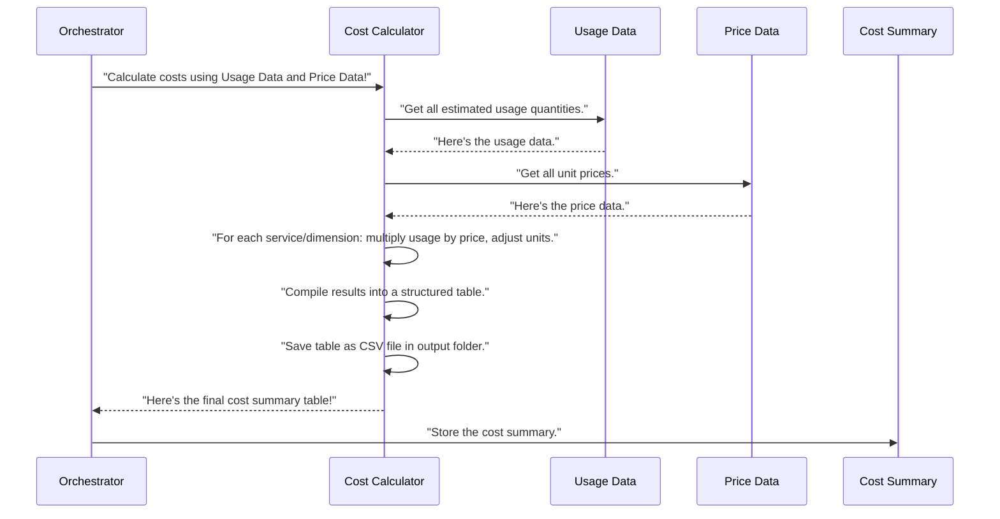

# Chapter 6: Cost Calculation Engine

In [Chapter 5: Cloud Pricing Agent](05_cloud_pricing_agent_.md), we learned how `Agentic-Blueprint-Scribe-Lite` acts as a dedicated market researcher, fetching the most up-to-date prices for cloud services. Before that, in [Chapter 3: Cost Input Processing](03_cost_input_processing_.md), we saw how you provide your estimated *usage* for those services (like "500 GB of S3 storage").

Now, we have two critical pieces of information in our `manifest` "briefcase":
1.  **Usage Data:** How much of each service you expect to use.
2.  **Unit Prices:** The cost of one unit of each service (e.g., cost per GB, cost per request).

But knowing these two things isn't enough to understand your total estimated bill! Imagine you have a shopping list for groceries with quantities (e.g., "3 apples," "2 loaves of bread") and a separate price list (e.g., "apples are $0.50 each," "bread is $3.00 per loaf"). You still need to do the math to find out your total bill!

This is where the **Cost Calculation Engine** comes in! Think of it as your project's **accountant**. Its main job is to take your usage estimates and the unit prices, multiply them, and then tell you the total estimated cost, just like an accountant calculates your monthly expenses.

### What Problem Does It Solve?

The primary problem the Cost Calculation Engine solves is **turning raw usage and price data into meaningful financial insights**. Without it, you'd have to manually:

1.  Look up each service you plan to use (e.g., S3 storage).
2.  Find your estimated usage for that service (e.g., 500 GB).
3.  Find its unit price (e.g., $0.023 per GB).
4.  Multiply them (500 GB * $0.023/GB = $11.50).
5.  Repeat this for *every single service and dimension* you use.
6.  Sum them all up for a total.
7.  Figure out which services are the most expensive.

This process is slow, tedious, and prone to human error. The **Cost Calculation Engine** automates all of this, providing accurate, clear cost breakdowns quickly.

### Key Concepts

Our project's accountant (the Cost Calculation Engine) works with a few key ideas:

#### 1. Input Data Gathering

Before it can calculate, it needs its "books" in order. Its main inputs are:
*   The `usage` dictionary: This comes from [Cost Input Processing](03_cost_input_processing_.md) and contains your estimated quantities (e.g., `S3: {storage_gb: 500.0}`).
*   The `prices` dictionary: This comes from the [Cloud Pricing Agent](05_cloud_pricing_agent_.md) and contains the unit costs (e.g., `S3: {storage_gb_mo_hourly: 0.0000315}`).

#### 2. The Core Calculation: Multiplication

This is the heart of the engine. For each service and each type of usage (like storage, requests, CPU hours), it simply multiplies the `usage` quantity by its corresponding `unit_price`.

Example: If you plan to use 500 GB of S3 storage, and the price is $0.023 per GB per month:
`500 GB * $0.023/GB = $11.50` (estimated monthly cost for S3 storage).

#### 3. Normalization (Making Units Match)

Sometimes, the way you specify usage (e.g., "hours per month") doesn't directly match the unit price from AWS (e.g., "cost per hour"). The Cost Calculation Engine is smart enough to **normalize** these. For example, if a price is given per *hour* and your usage is for a full month, it will multiply the hourly usage by the number of hours in a month (about 730) to get a true monthly cost. This ensures the calculations are always correct.

#### 4. Structured Output: The Cost Breakdown Table

Instead of just giving you one total number, the Cost Calculation Engine presents its findings in a highly organized way:
*   **A structured table (like an Excel sheet):** This table lists each service, the specific "dimension" of usage (e.g., `storage_gb`), your estimated `usage`, its `unit_price`, and the calculated `monthly_cost`.
*   **A CSV file:** This table is also saved as a `.csv` (Comma Separated Values) file in your project's output folder, so you can easily open it in spreadsheet software like Excel or Google Sheets.

This detailed breakdown helps you understand *where* your estimated costs are coming from.

### How to Use the Cost Calculation Engine

As a user, you **do not directly run** the Cost Calculation Engine. It's one of the specialized tasks automatically handled by the [Main Application Orchestrator](01_main_application_orchestrator_.md).

You simply need to:

1.  Provide your `cost_inputs.yaml` file (from [Chapter 3: Cost Input Processing](03_cost_input_processing_.md)).
2.  Have an internet connection (for the [Cloud Pricing Agent](05_cloud_pricing_agent_.md) to fetch prices).
3.  Run the `forge.py` script.

The Orchestrator will then automatically call the Cost Calculation Engine once it has both the usage data and the pricing information.

Here's the snippet from `forge.py` that triggers this:

```python
# --- File: forge.py (simplified) ---
from src.cost_inputs import load_usage
from src.pricing_agent import get_prices
from src.cost_calculator import build_cost_frame # Our Cost Accountant helper!

def build(folder: pathlib.Path) -> None:
    # ... (steps 1, 2: build_manifest, enrich_with_captions) ...

    # 4. Handle cost-related inputs (Usage, Pricing, Calculation)
    usage_dict = load_usage(folder, manifest) # Get usage from cost_inputs.yaml
    manifest["usage"] = usage_dict # Store it in our shared "briefcase"
    prices = get_prices() # Get unit prices from Cloud Pricing Agent
    manifest["prices"] = prices # Store prices too

    # This is where the Cost Calculation Engine does its magic!
    cost_df = build_cost_frame(manifest["slug"], usage_dict, prices)
    manifest["cost_summary"] = cost_df # Add the cost results to briefcase

    # ... (rest of the Orchestrator's steps for drafting, etc.) ...
```

When `cost_df = build_cost_frame(manifest["slug"], usage_dict, prices)` is called, the Cost Calculation Engine receives:
*   `manifest["slug"]`: A short name for your project, used to name the output CSV file.
*   `usage_dict`: The estimated usage quantities for each service.
*   `prices`: The unit prices fetched by the [Cloud Pricing Agent](05_cloud_pricing_agent_.md).

It then performs all the necessary calculations and returns a `cost_df` (a Pandas DataFrame, which is like a powerful in-memory spreadsheet). This `cost_df` is then stored in the `manifest["cost_summary"]`, making it available for the [Markdown Drafting (LLM Agent)](07_markdown_drafting__llm_agent__.md) to include in your final design document. It also saves a copy as a CSV file in your project's output folder (e.g., `output/your_project_name/your_project_name_cost_breakdown.csv`).

### Under the Hood: How Cost Calculation Engine Works

Let's peek behind the curtain to see how our accountant performs its calculations.

#### High-Level Walkthrough

Here's the sequence of events when the `build_cost_frame` function is called:



#### Diving into the Code (`src/cost_calculator.py`)

The core logic of the Cost Calculation Engine is found in the `src/cost_calculator.py` file.

First, a small but important helper for **normalization**:

```python
# --- File: src/cost_calculator.py (simplified) ---
_HOURS_PER_MONTH = 730  # Roughly 365 days / 12 months * 24 hours/day

def _normalize_usage(key: str, usage: float) -> float:
    """
    Adjusts usage to a monthly basis if the pricing dimension is hourly.
    Example: hourly storage usage gets multiplied by hours in a month.
    """
    if key.endswith("_hourly"): # Check if the dimension indicates hourly pricing
        return usage * _HOURS_PER_MONTH # Convert to monthly by multiplying
    return usage # Otherwise, no change needed
```
This `_normalize_usage` function ensures that if a service's price is given per *hour* (and its "key" ends with `_hourly`), the usage quantity is correctly converted to a *monthly* equivalent before multiplication. This makes sure all costs are consistently represented on a monthly basis.

Now, let's look at the main function, `build_cost_frame`, which the Orchestrator calls:

```python
# --- File: src/cost_calculator.py (simplified) ---
import pandas as pd # Tool to create powerful tables (DataFrames)
import pathlib # Tool to work with file paths
from typing import Dict, Any

def build_cost_frame(
    slug: str, # Project name, e.g., "ml_training_platform"
    usage: Dict[str, Dict[str, float]], # Your estimated usage numbers
    prices: Dict[str, Dict[str, float]], # The unit prices
) -> pd.DataFrame:
    """
    Calculates monthly costs for each service and dimension.
    Returns a Pandas DataFrame and saves a CSV file.
    """
    records: list[dict[str, Any]] = [] # This list will hold rows for our table

    # Loop through all services found in either usage or prices
    for svc_name in sorted(set(usage) | set(prices)):
        u_map = usage.get(svc_name, {}) # Get usage for this service
        p_map = prices.get(svc_name, {}) # Get prices for this service

        # Loop through each specific type of usage (dimension) for this service
        for dim in sorted(set(u_map) | set(p_map)):
            # ... (calculation logic will go here) ...
            pass # Placeholder for now
    
    # ... (code for creating DataFrame and saving CSV below) ...
    return pd.DataFrame(records) # Return the completed table
```
The `build_cost_frame` function starts by preparing an empty list called `records`. This list will be filled with dictionaries, where each dictionary represents one row in our final cost breakdown table (e.g., one row for S3 storage, one for Lambda invocations). It then loops through every unique service name that was found in either your `usage` data or the `prices` data. Inside that, it loops through each specific "dimension" (like `storage_gb` or `invocations`).

Next, inside that loop, the actual calculation happens:

```python
# --- File: src/cost_calculator.py (simplified, continuation of loop) ---
# ... (inside the 'for dim' loop from above) ...

            raw_usage = u_map.get(dim) # Your input usage for this dimension
            unit_price = p_map.get(dim) # The unit price for this dimension

            # Normalize usage if needed (e.g., convert hourly to monthly)
            norm_usage = (
                _normalize_usage(dim, raw_usage) if raw_usage is not None else None
            )

            # Calculate the monthly cost: price multiplied by normalized usage
            monthly_usd = (
                None # If either price or usage is missing, cost is unknown
                if (unit_price is None or norm_usage is None)
                else round(unit_price * norm_usage, 4) # Multiply and round to 4 decimal places
            )

            # Add this row's data to our list of records
            records.append(
                dict(
                    service      = svc_name,
                    dimension    = dim,
                    usage        = None if raw_usage is None else round(raw_usage, 4),
                    unit_price   = unit_price,
                    monthly_cost = monthly_usd,
                )
            )
# ... (end of loops) ...
```
In this snippet, for each dimension, it retrieves the `raw_usage` and `unit_price`. It then uses our `_normalize_usage` helper to get `norm_usage` (ensuring units match for monthly calculation). Finally, it multiplies `unit_price` by `norm_usage` to get the `monthly_usd` cost. If any information is missing (no usage or no price), the cost is marked as `None`. Each calculated row is then added to the `records` list.

Finally, after all calculations are done, the function turns the list of `records` into a professional-looking table and saves it:

```python
# --- File: src/cost_calculator.py (simplified, continued) ---
# ... (records list is now full of calculated costs) ...

    df = pd.DataFrame(records) # Turn our list of records into a data table (DataFrame)

    # Prepare the output folder path (e.g., 'output/my_project_name')
    out_path = pathlib.Path("output") / slug
    out_path.mkdir(parents=True, exist_ok=True) # Create folder if it doesn't exist

    # Save the data table as a CSV file
    # Example: output/my_project_name/my_project_name_cost_breakdown.csv
    df.to_csv(out_path / f"{slug}_cost_breakdown.csv", index=False)

    return df # Return the data table to the Orchestrator
```
This final part uses `pandas` (imported as `pd`) to create a `DataFrame` from the `records` list. A DataFrame is like a powerful, structured table in Python. It then creates the necessary output folder (if it doesn't exist) and saves this DataFrame as a `.csv` file. This CSV file is your official cost breakdown report, easily viewable in any spreadsheet program. The `df` (DataFrame) is also returned to the Orchestrator to be stored in the `manifest` for later use by the [Markdown Drafting (LLM Agent)](07_markdown_drafting__llm_agent__.md).

### Conclusion

You've now met the **Cost Calculation Engine**, the diligent accountant of `Agentic-Blueprint-Scribe-Lite`. It expertly combines your estimated usage with live pricing data to produce accurate monthly cost breakdowns. By automating these calculations and presenting them in a clear, structured table and CSV file, it provides crucial financial insights for your design document without any manual effort on your part.

With all the data gathered, analyzed, and now costs calculated, the Orchestrator is ready to start writing the actual content of your design document!

[Next Chapter: Markdown Drafting (LLM Agent)](07_markdown_drafting__llm_agent__.md)

---

Built by [Codalytix.com](Codalytix.com)
