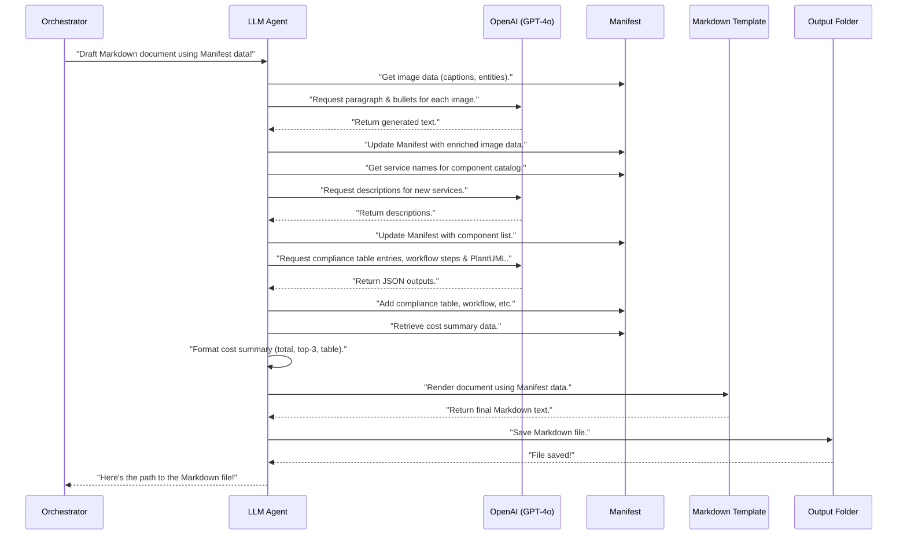

# Chapter 7: Markdown Drafting (LLM Agent)

In [Chapter 6: Cost Calculation Engine](06_cost_calculation_engine_.md), we learned how `Agentic-Blueprint-Scribe-Lite` precisely calculates estimated cloud costs and organizes them into a clear table. By now, our project's central "briefcase" (the `manifest`) is brimming with valuable information:
*   Details about your project from `metadata.json`.
*   Descriptions of your architectural diagrams generated by the [Diagram Analysis (Vision Agent)](04_diagram_analysis__vision_agent__.md).
*   Your estimated cloud service usage from `cost_inputs.yaml`.
*   The latest cloud prices from the [Cloud Pricing Agent](05_cloud_pricing_agent_.md).
*   And the comprehensive cost summary from the [Cost Calculation Engine](06_cost_calculation_engine_.md).

Imagine you've gathered all the ingredients for a delicious, multi-course meal, and even prepped some of them. You have all the data, but it's still just a collection of ingredients. What you need now is a skilled chef to combine them all, cook them perfectly, and present them as a beautiful, coherent meal!

This is exactly what the **Markdown Drafting (LLM Agent)** does for your design document!

### What Problem Does It Solve?

You have lots of pieces of information, but a design document needs to be a well-written, flowing story. It needs paragraphs, structured lists, diagrams with captions, cost summaries, and other professional sections. Doing this manually would mean:
*   Copying and pasting text.
*   Rewriting diagram descriptions into full paragraphs.
*   Summarizing cost tables.
*   Writing explanations for how your system works.
*   Ensuring everything flows logically and looks professional.

This manual process is tedious, time-consuming, and can lead to inconsistencies.

The **Markdown Drafting (LLM Agent)** solves this by acting as your project's **lead author or ghostwriter**. It takes all the rich data collected by the other agents and automatically drafts the entire detailed design document in **Markdown format**.

Think of it as a super-smart writer who can:
*   Read all your notes and data.
*   Understand the context.
*   Write clear, concise paragraphs.
*   Generate multi-step workflows.
*   Compile lists of components.
*   Create structured tables (like compliance matrices or cost summaries).
*   All while following a pre-defined document structure, making sure your "meal" is presented perfectly!

### Key Concepts

This "ghostwriter" is powered by a **Large Language Model (LLM)** like GPT-4o. Let's explore how it works:

#### 1. The LLM Agent (The Ghostwriter)

This is the central "worker" responsible for writing content. When the [Main Application Orchestrator](01_main_application_orchestrator_.md) needs the document drafted, it hands over the entire `manifest` to the LLM Agent.

#### 2. GPT-4o (The "Brain" of the Author)

The intelligence behind the LLM Agent comes from powerful AI models like **GPT-4o**. We provide these models with the data from the `manifest` and specific instructions (called "prompts"). The AI then uses its vast knowledge to generate human-like text, fulfilling our requests.

#### 3. Structured Content Generation

We don't just tell the LLM, "Write a document." Instead, we ask it to generate specific pieces of content in specific ways:
*   **Diagram Explanations**: Turning short captions from the [Diagram Analysis (Vision Agent)](04_diagram_analysis__vision_agent__.md) into full paragraphs and bulleted lists.
*   **Component Catalog**: Listing key AWS services used in your design and providing a brief description for each.
*   **Compliance Matrix**: Creating a table that maps AWS services to security controls and how they are enforced.
*   **Workflow Steps**: Generating a logical, step-by-step description of how your system operates, which can also be used to create a visual diagram (PlantUML).
*   **Cost Summary**: Integrating the calculated costs (total, top contributors, and the full table) from the [Cost Calculation Engine](06_cost_calculation_engine_.md) into a readable section.

#### 4. Templating (The Document Layout)

Once the LLM Agent generates all these pieces of content, how do they fit into a cohesive document? This is where **templating** comes in, using a tool called **Jinja**.

Think of a template as a fill-in-the-blanks document. It has a pre-defined structure (headings, sections, placeholders like `{{ diagram.caption }}`). The LLM Agent generates the content, and then this content, along with other data from the `manifest`, is "poured" into the template. The template then produces the final Markdown file.

### How to Use the Markdown Drafting (LLM Agent)

As a user, you **do not directly run** the Markdown Drafting (LLM Agent). It's an automated step performed by the [Main Application Orchestrator](01_main_application_orchestrator_.md).

You simply need to:
1.  Provide your input folder with all the relevant files (metadata, diagrams, cost inputs).
2.  Ensure your OpenAI API key is configured (as it uses GPT-4o).
3.  Run the `forge.py` script as usual.

The Orchestrator will automatically trigger the Markdown Drafting (LLM Agent) after all other data collection and analysis steps are complete.

Here's the relevant part from `forge.py`:

```python
# --- File: forge.py (simplified) ---
from src.drafting_agent import draft_markdown # Our Markdown Drafting helper!

def build(folder: pathlib.Path) -> None:
    # ... (steps 1, 2, 3, 4: data ingestion, vision analysis, cost inputs, cost calculation) ...

    # 5. Then, let the Markdown Drafting (LLM Agent) write the document content
    md_path = draft_markdown(manifest) # This is where the drafting magic happens!

    # ... (rest of the Orchestrator's steps for document transformation, etc.) ...
```

When `md_path = draft_markdown(manifest)` is called, the Markdown Drafting (LLM Agent) takes the `manifest` (our comprehensive "briefcase" of data) and begins generating and assembling the document's content. It then saves the final document as a Markdown (`.md`) file in your project's `output` folder and returns its path.

### Under the Hood: How Markdown Drafting (LLM Agent) Works

Let's peek behind the curtain to see how our ghostwriter creates your document.

#### High-Level Walkthrough

Here's the sequence of events when the `draft_markdown` function is called:



#### Diving into the Code (`src/drafting_agent.py`)

The core logic of the Markdown Drafting (LLM Agent) lives in `src/drafting_agent.py`.

First, let's see how it talks to the AI model:

```python
# --- File: src/drafting_agent.py (simplified) ---
import json
from openai import OpenAI

_CLIENT: Optional[OpenAI] = None

def _call_gpt(prompt: str, *, temp: float = 0.4, maxtok: int = 512) -> str:
    """Small wrapper around Chat Completions."""
    global _CLIENT
    if _CLIENT is None:
        _CLIENT = OpenAI()
    rsp = _CLIENT.chat.completions.create(
        model="gpt-4o", # The AI model used for drafting
        temperature=temp,
        max_tokens=maxtok,
        messages=[{"role": "user", "content": prompt}],
    )
    return rsp.choices[0].message.content.strip()

def _safe_json(raw: str) -> Dict:
    """Safely parses JSON from AI responses."""
    try:
        return json.loads(raw)
    except Exception:
        return {}
```
The `_call_gpt` function is the agent's voice, sending instructions (`prompt`) to GPT-4o and getting back its generated text. `_safe_json` is a helper to ensure that if the AI is asked to produce JSON, we can reliably read it, even if there are minor formatting issues.

One of the first things the agent does is enhance the diagram descriptions:

```python
# --- File: src/drafting_agent.py (simplified) ---
# ... (imports and helper functions) ...

def draft_markdown(manifest: Dict) -> pathlib.Path:
    # ... (template-friendly defaults) ...

    # -------- 1.  diagram enrichment  ------------------------------------
    for img in manifest["images"]:
        img["filename"] = pathlib.Path(img["path"]).name

        caption = img.get("caption", "") # Get the short caption from Vision Agent
        
        # ❶ Generate a detailed paragraph
        para    = _call_gpt(
            f"Write a 120-140 word explanation of this AWS diagram:\n\"{caption}\"",
            temp=0.55, maxtok=220,
        )
        # Self-auditing: ask AI to refine its own output for clarity and length
        para    = _call_gpt(
            "Improve clarity and ensure ≤140 words if necessary:\n\n" + para,
            temp=0.4, maxtok=220,
        )
        img["paragraph"] = para

        # ❷ Generate a bullet list of services
        bullets = list(dict.fromkeys(img.get("bullets") or img.get("entities") or []))
        if len(bullets) < 5:
            raw = _call_gpt(
                f"List 5 **unique** AWS services (Markdown bullets) present or implied:\n\"{caption}\"",
                temp=0.3, maxtok=60,
            )
            # Combine existing and newly generated bullets, remove duplicates
            bullets = list(
                dict.fromkeys(
                    bullets + [ln.strip("-• *") for ln in raw.splitlines() if ln.strip()]
                )
            )
        # Ensure exactly 5 bullets, adding placeholders if needed
        bullets = bullets[:5] + ["(additional service)"] * (5 - len(bullets))
        img["bullets"], img["show_bullets"] = bullets, True

    # ... (other sections) ...
    return md_path
```
This section iterates through each image found in your `manifest`. For each image, it takes the short `caption` generated by the [Diagram Analysis (Vision Agent)](04_diagram_analysis__vision_agent__.md) and uses `_call_gpt` twice: first to generate a full paragraph explanation, and then to refine that paragraph for clarity and length. It also generates a bulleted list of 5 key AWS services associated with the diagram. These new `paragraph` and `bullets` fields are added directly to the image's entry in the `manifest`.

Next, the agent generates other structured content for your document:

```python
# --- File: src/drafting_agent.py (simplified) ---
# ... (imports and other sections) ...

def draft_markdown(manifest: Dict) -> pathlib.Path:
    # ... (diagram enrichment logic) ...

    # -------- 2.  catalogue · compliance · workflow ----------------------
    # Build component list (service name + description)
    manifest["components"] = _build_component_list(manifest["metadata"].get("aws_services", []))
    
    # Generate compliance table (asking GPT for control and enforcement for each service)
    manifest["compliance_table"] = _generate_compliance_table(
        [c["name"] for c in manifest["components"]], # List of services
        manifest["metadata"].get("compliance", []),  # Compliance tags from metadata
        manifest["metadata"],
        manifest["images"],
    )
    
    # Generate workflow steps and PlantUML diagram code
    wf = _generate_workflow([c["name"] for c in manifest["components"]], manifest["slug"])
    manifest["workflow_steps"] = wf["steps"]
    manifest["workflow_plantuml"] = wf["plantuml"] if shutil.which("plantuml") else None

    # ... (cost summary & appendices) ...
    return md_path
```
Here, the agent orchestrates calls to several helper functions:
*   `_build_component_list`: Takes the list of `aws_services` from your `metadata.json` and uses `_describe_aws_service` (which might call GPT-4o for unknown services) to get a short description for each.
*   `_generate_compliance_table`: This is a fascinating part. It asks GPT-4o to act as a "cloud-compliance auditor" and, for each service, suggest a "control" and how it's "enforced," based on your architecture description and diagram hints. It expects the AI to respond in a JSON format (`{ "control": "...", "enforced_by": "..." }`), which is then extracted and added to the `manifest`.
*   `_generate_workflow`: Asks GPT-4o to generate a 7-step sequence of how the system works and, importantly, also generates the PlantUML code for a sequence diagram. This ensures consistency between the textual workflow and the potential visual diagram. It even has repair passes if the AI's initial output isn't perfect.

The agent also handles the cost summary:

```python
# --- File: src/drafting_agent.py (simplified) ---
# ... (imports and other sections) ...

def draft_markdown(manifest: Dict) -> pathlib.Path:
    # ... (diagram enrichment, catalogue, compliance, workflow) ...

    # -------- 3.  cost summary (optional) --------------------------------
    if "cost_summary" in manifest: # Only if cost data exists
        df = manifest["cost_summary"].copy() # Get the DataFrame from Cost Calculation Engine

        # (a) Adjust S3 hourly to monthly for consistent display
        s3_mask = df["dimension"] == "storage_gb_mo_hourly"
        df.loc[s3_mask, "unit_price"] = (
            pd.to_numeric(df.loc[s3_mask, "unit_price"], errors="coerce") * 730
        )
        df.loc[s3_mask, "dimension"] = "storage_gb_mo"
        
        # (b) Ensure numeric types and round for display
        for col in ("qty", "unit_price", "monthly_cost"):
            if col not in df.columns: df[col] = pd.NA # Make sure columns exist
        df["qty"]          = pd.to_numeric(df["qty"], errors="coerce")
        df["unit_price"]   = pd.to_numeric(df["unit_price"], errors="coerce").round(6)
        df["monthly_cost"] = pd.to_numeric(df["monthly_cost"], errors="coerce").round(2)

        # (c) Calculate total cost
        manifest["total_cost"] = df["monthly_cost"].sum(skipna=True).round(2)

        # (d) Find top-3 cost contributors for a quick summary
        top3_raw = (
            df.dropna(subset=["monthly_cost"])
              .groupby("service", as_index=False)["monthly_cost"]
              .sum()
        )
        top3 = top3_raw.nlargest(3, "monthly_cost").round(2)
        manifest["top_costs"] = top3.to_dict("records")

        # (e) Format the full table for pretty printing in Markdown
        df_fmt = df.copy()
        df_fmt["qty"]          = df_fmt["qty"].map(lambda v: f"{v:,.2f}" if pd.notna(v) else "—")
        df_fmt["unit_price"]   = df_fmt["unit_price"].map(lambda v: f"{v:,.6f}" if pd.notna(v) else "—")
        df_fmt["monthly_cost"] = df_fmt["monthly_cost"].map(lambda v: f"{v:,.2f}" if pd.notna(v) else "—")
        manifest["cost_table"] = (
            df_fmt.fillna("—")
            .sort_values(["service", "dimension"])
            .to_dict("records")
        )
    else: # If no cost data, provide empty defaults
        manifest.update({"total_cost": None, "top_costs": [], "cost_table": []})

    # ... (appendices & rendering) ...
    return md_path
```
This section takes the `cost_summary` (which is a Pandas DataFrame from the [Cost Calculation Engine](06_cost_calculation_engine_.md)) and further processes it. It ensures all numbers are correct for display, calculates the `total_cost`, identifies the `top_costs` (the three most expensive services), and then formats the entire cost table into a clean, Markdown-friendly format. All these cost-related details are then added to the `manifest`.

Finally, after all the content is generated and organized within the `manifest`, the agent uses the templating engine to create the final Markdown file:

```python
# --- File: src/drafting_agent.py (simplified) ---
# ... (all content generation logic) ...

def draft_markdown(manifest: Dict) -> pathlib.Path:
    # ... (all content generation and manifest enrichment) ...

    # -------- 4.  appendices scaffold ------------------------------------
    if not manifest["appendices"]:
        manifest["appendices"] = [ # Add default appendices if none are provided
            {"title": "Glossary", "body": "_Add domain-specific terms here._"},
            {
                "title": "Revision history",
                "body": f"{datetime.date.today()}: initial draft generated by Doc-Forge Lite",
            },
        ]

    # -------- 5.  render Markdown ---------------------------------------
    try:
        # Use Jinja to fill the "design_doc_template.md.j2" with all data from manifest
        md_text = TEMPLATE_ENV.get_template("design_doc_template.md.j2").render(**manifest)
    except TemplateError as exc:
        raise RuntimeError(f"[drafting_agent] Jinja render failed → {exc}") from exc

    # Prepare output directory
    out_dir = pathlib.Path("output") / manifest["slug"]
    out_dir.mkdir(parents=True, exist_ok=True)
    
    # Save the final Markdown text to a file
    md_path = out_dir / f"{manifest['slug']}.md"
    md_path.write_text(md_text, encoding="utf-8")
    print(f"[Draft] Markdown → {md_path}")
    return md_path
```
This final section ensures there are default appendices if you haven't specified any. Then, the crucial step: `TEMPLATE_ENV.get_template("design_doc_template.md.j2").render(**manifest)`. This line takes the `design_doc_template.md.j2` file (which lives in the `templates` folder) and essentially fills in all the placeholders (`{{ ... }}` and ``) with the data now available in the `manifest`. The result is a complete Markdown text string, which is then saved as a `.md` file in your project's output folder. This Markdown file is the draft of your final design document!

### Conclusion

You've just learned about the **Markdown Drafting (LLM Agent)**, the project's intelligent ghostwriter. It takes all the rich data collected by the previous agents and, powered by AI like GPT-4o, automatically drafts a comprehensive and professionally structured design document in Markdown format. From expanding diagram captions to generating complex tables and workflows, it ensures your project's story is told clearly and completely.

Now that we have a fully drafted Markdown document, the final step is to convert it into widely usable formats like DOCX and PDF.

[Next Chapter: Document Transformation](08_document_transformation_.md)

---

Built by [Codalytix.com](Codalytix.com)
