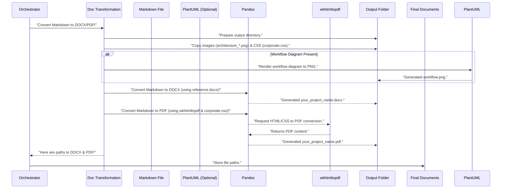

# Chapter 8: Document Transformation

In [Chapter 7: Markdown Drafting (LLM Agent)](07_markdown_drafting__llm_agent_.md), we learned how `Agentic-Blueprint-Scribe-Lite` acts as your project's intelligent "ghostwriter," taking all the gathered information and drafting a complete design document in **Markdown format**. Markdown is fantastic for writing and editing because it's simple text, but it's not always the best format for sharing with everyone.

Imagine you've just finished writing a brilliant book on your computer. You wrote it all out, perfectly structured, but it's just a raw text file. Now, you need to turn that text file into a beautiful, polished book that you can print or send to others as a sleek PDF, or even as a Word document (DOCX) for easy review. You wouldn't send out the raw text file, right? You need a **publishing house** to handle the final layout, printing, and distribution!

This is exactly what **Document Transformation** does for your `Agentic-Blueprint-Scribe-Lite` project!

### What Problem Does It Solve?

After the [Markdown Drafting (LLM Agent)](07_markdown_drafting__llm_agent_.md) completes your `design_document.md` file, this Markdown file is like our finished manuscript. While it's great for internal use and version control, many people prefer documents in formats like:

*   **DOCX (Microsoft Word Document):** Easy to open, edit (for review), and comment on for most users.
*   **PDF (Portable Document Format):** Perfect for sharing, ensuring the document looks exactly the same on any device, preserving all fonts, images, and layout.

The problem **Document Transformation** solves is converting that raw Markdown draft into these professional, final output formats. It makes sure that:

1.  **Styling is Consistent:** The document looks polished, not just plain text.
2.  **Images are Included:** Your architectural diagrams are visible and correctly placed.
3.  **Embedded Diagrams Work:** Special diagrams you might have requested (like PlantUML sequence diagrams) are turned into actual images within the document.
4.  **Table of Contents:** A clickable table of contents is generated for easy navigation.

It's like the **layout editor preparing a manuscript for printing and distribution**, ensuring every page looks perfect before it's sent out to the world!

### Key Concepts

Our project's "publishing house" relies on some powerful tools:

#### 1. The Converter (Our Publishing House)

This is the component in `Agentic-Blueprint-Scribe-Lite` specifically tasked with turning the Markdown file into DOCX and PDF. It takes the Markdown draft and applies all the necessary magic to produce the final, polished versions.

#### 2. Pandoc (The Universal Document Translator)

Think of **Pandoc** as a highly skilled, multilingual typesetter. It's a free, external tool that is incredibly good at converting documents from one format to another. It can take Markdown and turn it into DOCX, PDF, HTML, and many other formats, understanding how to handle things like headings, lists, tables, and images.

*   When we want a **DOCX** file, Pandoc takes our Markdown and uses a special "reference DOCX" file (like a style guide) to apply our desired fonts, colors, and paragraph styles.
*   When we want a **PDF** file, Pandoc acts as the orchestrator, often calling other tools to do the actual PDF printing.

#### 3. wkhtmltopdf (The Web-to-PDF Printer)

For creating PDFs, especially when they might contain complex styling or need a specific look, Pandoc can use another external tool called **wkhtmltopdf**. This tool is like a super-smart web browser that can "print" a web page (HTML with CSS styling) directly into a PDF document. It ensures that the document's design (`corporate.css` in our case) is rendered perfectly, just as it would appear in a browser.

#### 4. Templates and Styling (The Layout Guides)

To make sure your final DOCX and PDF documents look professional and consistent, Document Transformation uses:

*   **`reference.docx`**: For DOCX output, this is like a master template that defines the look and feel (fonts, sizes, margins). Pandoc uses it as a blueprint for styling.
*   **`corporate.css`**: For PDF output (via wkhtmltopdf), this is a Cascading Style Sheet file. Think of it as a set of design rules (like "all headings should be blue" or "all paragraphs should have this font"). It ensures a clean, professional appearance.

These files ensure that the output is not just a conversion but also adheres to a predefined, attractive layout.

### How to Use Document Transformation

As a user, you **do not directly run** the Document Transformation process. Just like the other specialized agents, it's automatically handled by the [Main Application Orchestrator](01_main_application_orchestrator_.md) as the second-to-last step!

You simply need to:

1.  Have your input folder ready with all the project details.
2.  Ensure that Pandoc and wkhtmltopdf are installed on your system (the project's main `README` guides you on this setup).
3.  Run the `forge.py` script as usual.

After the [Markdown Drafting (LLM Agent)](07_markdown_drafting__llm_agent_.md) creates the Markdown file, the Orchestrator will automatically pass this file to the Document Transformation component.

Here's the relevant snippet from `forge.py`:

```python
# --- File: forge.py (simplified) ---
from src.converter import md_to_docx_pdf # Our Document Transformation helper!

def build(folder: pathlib.Path) -> None:
    # ... (steps 1-5: data ingestion, vision, cost inputs, pricing, calculation, markdown drafting) ...

    # 6. Finally, let the Document Transformation agent convert it to DOCX/PDF
    docx_path, pdf_path = md_to_docx_pdf(md_path, manifest["slug"]) # Conversion magic!

    # ... (rest of the Orchestrator's steps for run metadata storage) ...
```

When `docx_path, pdf_path = md_to_docx_pdf(md_path, manifest["slug"])` is called, the Document Transformation component receives the path to your newly drafted Markdown file (`md_path`) and your project's `slug` (short name). It then proceeds to generate both the DOCX and PDF versions of your document in the `output/your_project_name/` folder, returning the paths to these new files.

### Under the Hood: How Document Transformation Works

Let's peek behind the curtain to see how our "publishing house" prepares your document. The main logic resides in the `src/converter.py` file.

#### High-Level Walkthrough

Here's the sequence of events when the `md_to_docx_pdf` function is called:



#### Diving into the Code (`src/converter.py`)

The actual work of Document Transformation happens inside the `src/converter.py` file.

First, the converter makes sure all necessary assets (your images and styling files) are in the right place:

```python
# --- File: src/converter.py (simplified) ---
import pathlib
import shutil
import re
import subprocess # To run external tools like Pandoc, PlantUML, wkhtmltopdf

# Regular expression to find architecture images
IMG_PATTERN = re.compile(r"architecture_.*\.(png|jpe?g)$", re.I)

def _copy_assets(slug: str, out_dir: pathlib.Path) -> None:
    """
    Copy diagrams and CSS files into the output folder.
    This helps Pandoc find them when converting.
    """
    src_dir = pathlib.Path("Input Resources") / slug
    if src_dir.exists():
        for fp in src_dir.iterdir():
            # Copy all files matching our image pattern
            if fp.is_file() and IMG_PATTERN.match(fp.name):
                shutil.copy2(fp, out_dir / fp.name)

    # Copy the main styling CSS file
    for css in pathlib.Path("templates").glob("*.css"):
        shutil.copy2(css, out_dir / css.name)

# ... other functions ...
```
This `_copy_assets` function searches your original input folder for `architecture_` images and copies them to the output directory. It also copies the `corporate.css` styling file, ensuring both are available for the conversion tools.

Next, if your document includes a PlantUML sequence diagram (generated by the [Markdown Drafting (LLM Agent)](07_markdown_drafting__llm_agent__.md)), the converter makes sure it becomes a real image:

```python
# --- File: src/converter.py (simplified) ---
# ... (imports and _copy_assets) ...

def _render_plantuml(uml_text: str | None, out_dir: pathlib.Path, slug: str) -> None:
    """
    Converts PlantUML text into an image (PNG).
    Tries local 'plantuml' tool first, then a public online server as fallback.
    """
    if not uml_text:
        return # No PlantUML text to render

    uml_file = out_dir / f"{slug}_workflow.puml"
    uml_file.write_text(uml_text, encoding="utf-8") # Save the PlantUML text

    try:
        # Try to run the 'plantuml' command-line tool
        subprocess.check_call(["plantuml", "-tpng", uml_file.name], cwd=out_dir)
        print(f"[PlantUML] PNG → {slug}_workflow.png")
        return
    except (FileNotFoundError, subprocess.CalledProcessError):
        # If local tool fails or not found, try the online server (simplified here)
        print("[PlantUML] Falling back to online PlantUML server...")
        # (Simplified: actual code uses urllib and zlib for online rendering)
        pass

# ... other functions ...
```
The `_render_plantuml` function takes the PlantUML code, saves it to a temporary `.puml` file, and then tries to use the `plantuml` command (an external tool you install) to convert it into a `.png` image. If the local tool isn't found or fails, it can fall back to using an online PlantUML server (this part is simplified in the snippet above, but it means it can still generate the image even if you don't have the local tool fully set up).

Finally, the main `md_to_docx_pdf` function orchestrates the calls to Pandoc for both DOCX and PDF conversion:

```python
# --- File: src/converter.py (simplified) ---
# ... (imports and helper functions) ...

# Reference document for DOCX styling
REFERENCE_DOC = pathlib.Path("templates/reference.docx")

def md_to_docx_pdf(
    md_path: pathlib.Path, # Path to the Markdown file (e.g., output/proj/proj.md)
    slug: str,             # Project name (e.g., "my_project")
    plantuml_text: str | None = None, # Optional PlantUML code
) -> Tuple[pathlib.Path, pathlib.Path]:
    """
    Convert Markdown to DOCX & PDF using Pandoc and wkhtmltopdf.
    """
    out_dir = md_path.parent # Get the directory where the Markdown file is
    out_dir.mkdir(parents=True, exist_ok=True) # Ensure output folder exists

    _copy_assets(slug, out_dir) # Copy images and CSS
    _render_plantuml(plantuml_text, out_dir, slug) # Render PlantUML if present

    # ----------------------------- DOCX Conversion -------------------------
    cmd_docx = ["pandoc", md_path.name, "-o", f"{slug}.docx", "--toc", "--toc-depth=2"]
    if REFERENCE_DOC.exists():
        # Use our custom style guide for the DOCX file
        cmd_docx.extend(["--reference-doc", REFERENCE_DOC.resolve().as_posix()])

    # Run the Pandoc command for DOCX
    subprocess.check_call(cmd_docx, cwd=out_dir)
    print(f"[Convert] DOCX → {out_dir / f'{slug}.docx'}")

    # ------------------------------ PDF Conversion -------------------------
    cmd_pdf = [
        "pandoc", md_path.name, "-o", f"{slug}.pdf",
        "--pdf-engine", "wkhtmltopdf", # Tell Pandoc to use wkhtmltopdf for PDF
        "--toc", "--toc-depth=2",
        "--css", "corporate.css", # Apply our corporate CSS for styling
        # ... other options for quality and embedding ...
    ]
    # Run the Pandoc command for PDF
    subprocess.check_call(cmd_pdf, cwd=out_dir)
    print(f"[Convert] PDF  → {out_dir / f'{slug}.pdf'}")

    # Return the paths to the newly created DOCX and PDF files
    return out_dir / f"{slug}.docx", out_dir / f"{slug}.pdf"
```
The `md_to_docx_pdf` function first calls the helpers to copy assets and render PlantUML. Then it constructs and runs two separate `pandoc` commands using Python's `subprocess.check_call`:

1.  **For DOCX:** It tells Pandoc to convert `md_path.name` (our Markdown file) to `f"{slug}.docx"`. The `--toc` and `--toc-depth=2` options tell it to include a Table of Contents. Crucially, `--reference-doc` points to our `templates/reference.docx`, ensuring the output Word document uses our specific company styles.
2.  **For PDF:** It again uses `pandoc` but tells it to use `wkhtmltopdf` as the `--pdf-engine`. It also applies the `corporate.css` file via `--css` for styling, ensuring the PDF looks good. This command also adds a Table of Contents.

After these commands run successfully, you'll find your beautifully formatted `.docx` and `.pdf` files in your project's `output` folder!

### Conclusion

You've just learned about **Document Transformation**, the project's "publishing house." It takes your neatly drafted Markdown document and, using powerful external tools like Pandoc and wkhtmltopdf, converts it into professional, shareable DOCX and PDF formats. By applying predefined templates and rendering all images and diagrams correctly, it ensures your final design document is polished, consistent, and ready for distribution.

With your final documents generated, the very last step is to record what happened, so you have a history of your runs.

[Next Chapter: Run Metadata Storage](09_run_metadata_storage_.md)

---

Built by [Codalytix.com](Codalytix.com)
