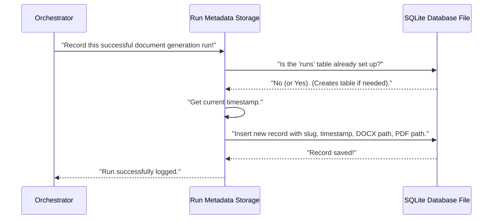

# Chapter 9: Run Metadata Storage

In [Chapter 8: Document Transformation](08_document_transformation_.md), we reached a huge milestone! Our `Agentic-Blueprint-Scribe-Lite` project took your Markdown draft and, like a professional publishing house, converted it into beautiful, shareable DOCX and PDF documents. You now have your finished design document ready to go!

But what happens after you've generated one document? What if you run the tool again next week for an updated version, or perhaps for a completely different project? How do you keep track of all the documents you've generated? Where are they stored, and when were they created?

This is where **Run Metadata Storage** comes in! Think of it as your project's **diligent archivist or librarian**. Every time `Agentic-Blueprint-Scribe-Lite` successfully creates a design document, this component carefully records important details about that "run" into a historical log.

### What Problem Does It Solve?

Imagine you're managing a big library. Every time a new book is published (which, in our case, is a new design document being generated), you wouldn't just put it on a shelf and forget about it. You'd want to record:
*   The **name** of the book (your project's name or "slug").
*   **When** it was published (the timestamp of the run).
*   **Where** it's located (the file paths to the generated DOCX and PDF).

Without this archivist, it would be difficult to:
1.  **Find old documents:** You might remember generating a document for "Project X" last month, but where exactly did the files go?
2.  **Track progress:** How many documents have been generated over time?
3.  **Reference specific versions:** Which version was generated on what date?

**Run Metadata Storage** solves these problems by creating a simple, easy-to-manage historical record of every document generation activity.

### Key Concepts

Our "archivist" works with a few simple concepts:

#### 1. Metadata

"Metadata" simply means "data about data." In our context, when `Agentic-Blueprint-Scribe-Lite` completes a run, the metadata it records includes:
*   **Project Slug:** A short, unique name for your project (e.g., `ml_training_platform`).
*   **Timestamp:** The exact date and time the document was generated.
*   **DOCX Path:** The full path on your computer to the generated Microsoft Word document.
*   **PDF Path:** The full path on your computer to the generated PDF document.

#### 2. SQLite Database

To store this metadata, the project uses an **SQLite database**. Don't let the word "database" sound scary!
*   Think of an SQLite database as a **single, self-contained file** on your computer that acts like a very organized spreadsheet.
*   It's super easy to use because you don't need to install any special server software. The database lives entirely within one file (named `docforge.db` in our project).
*   This makes it perfect for simple logging tasks like ours, where we just need to add new rows (records) to a table (like a sheet in a spreadsheet).

#### 3. Historical Log

By storing these records in the SQLite database, we create a **historical log** of all document generation activities. You can later "query" or "look up" information in this database to see a complete history of your `Agentic-Blueprint-Scribe-Lite` runs.

### How to Use Run Metadata Storage

As a user, you **do not directly interact** with the Run Metadata Storage component. It's the very last, automated step performed by the [Main Application Orchestrator](01_main_application_orchestrator_.md) after your DOCX and PDF files have been successfully created.

You simply need to:

1.  Run the `forge.py` script as usual to generate your document.

That's it! The Orchestrator will automatically handle the logging.

Remember the main `forge.py` script? Here's the final part that triggers the Run Metadata Storage:

```python
# --- File: forge.py (simplified) ---
from src.store import record_run # Our Run Metadata Storage helper!

def build(folder: pathlib.Path) -> None:
    # ... (all previous steps: data ingestion, vision, cost calculation, markdown drafting, document transformation) ...

    # 7. Record what happened for future reference
    record_run(manifest["slug"], docx_path, pdf_path) # The archivist logs the run!

    typer.echo(f"✓ Generated → {pdf_path}") # Final success message
```

As you can see, after `md_to_docx_pdf` finishes its work and returns the paths to the generated DOCX and PDF files, the `record_run` function is called. It receives the project `slug` and these two file paths, and then it silently logs them into the `docforge.db` file.

When this step completes, you'll also see a confirmation message in your terminal, similar to:
```
[Store] Logged run for 'ml_training_platform' → docforge.db
```
This confirms that the run's metadata has been successfully recorded.

### Under the Hood: How Run Metadata Storage Works

Let's peek behind the curtain to see how our "archivist" does its job. The main logic resides in the `src/store.py` file.

#### High-Level Walkthrough

Here's the sequence of events when the `record_run` function is called:



#### Diving into the Code (`src/store.py`)

The actual work of creating the database and adding records happens inside `src/store.py`.

First, a small function ensures the database file and table are ready:

```python
# --- File: src/store.py (simplified) ---
import sqlite3, datetime, pathlib

DB_PATH = pathlib.Path("docforge.db") # This is where our database file will live

def _init_db():
    """Create table if not present."""
    with sqlite3.connect(DB_PATH) as conn: # Connect to or create the SQLite database file
        conn.execute( # Run a command to create a table named 'runs' if it doesn't exist
            """
            CREATE TABLE IF NOT EXISTS runs (
                id          INTEGER PRIMARY KEY AUTOINCREMENT,
                slug        TEXT,
                timestamp   TEXT,
                docx_path   TEXT,
                pdf_path    TEXT
            )
            """
        )
        conn.commit() # Save the changes to the database file
```
The `_init_db()` function is responsible for setting up our "spreadsheet" file (`docforge.db`) and ensuring it has a "sheet" called `runs` with columns for `id`, `slug`, `timestamp`, `docx_path`, and `pdf_path`. The `IF NOT EXISTS` part is important – it means this command will only create the table if it doesn't already exist, preventing errors on subsequent runs.

Next, the `record_run` function does the actual logging:

```python
# --- File: src/store.py (simplified) ---
# ... (imports and _init_db from above) ...

def record_run(slug: str, docx_path: pathlib.Path, pdf_path: pathlib.Path):
    """Insert a row recording this document build."""
    _init_db() # First, make sure the database and table are ready

    # Get the current time, formatted as text
    now = datetime.datetime.utcnow().isoformat(timespec="seconds")

    with sqlite3.connect(DB_PATH) as conn: # Connect to our database file again
        conn.execute( # Insert a new row into the 'runs' table
            "INSERT INTO runs (slug, timestamp, docx_path, pdf_path) VALUES (?,?,?,?)",
            (slug, now, str(docx_path), str(pdf_path)), # The values for our new row
        )
        conn.commit() # Save this new record to the database file
    print(f"[Store] Logged run for '{slug}' → {DB_PATH}")
```
The `record_run` function first calls `_init_db()` to make sure everything is set up. Then, it gets the current Universal Coordinated Time (UTC) as a formatted text string (like `"2023-10-27T10:30:00"`). Finally, it connects to the `docforge.db` file and uses an `INSERT` command to add a new row with the `slug`, `timestamp`, and the string versions of the `docx_path` and `pdf_path` into the `runs` table. `conn.commit()` is vital here, as it saves the new record to the database file.

After you run `Agentic-Blueprint-Scribe-Lite`, you will find a file named `docforge.db` in the root directory of your project. You can use any SQLite browser tool (many are free and easy to find online) to open this file and view the `runs` table, seeing all your recorded document generations!

### Conclusion

You've just learned about **Run Metadata Storage**, the project's diligent archivist. This small but important component automatically records key details about every successful document generation, such as the project name, the time it was created, and the paths to the final DOCX and PDF files. By storing this information in a simple SQLite database, `Agentic-Blueprint-Scribe-Lite` provides you with a valuable historical log for easy tracking and reference.

This marks the end of our journey through the core components of `Agentic-Blueprint-Scribe-Lite`! You now understand how each piece works together, from initial data ingestion to the final document transformation and logging.

---

Built by [Codalytix.com](Codalytix.com)
