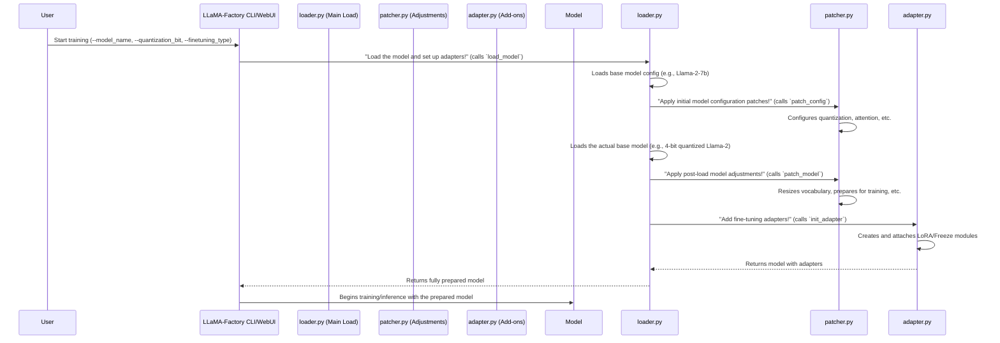

# Chapter 5: Model Loading & Adapters

In the previous chapter, [Data Processing Pipeline](04_data_processing_pipeline_.md), you learned how LLaMA-Factory takes your raw data and prepares it for the model to understand. Now that the "ingredients" are ready, we need to bring in the "chef" itself: the large language model (LLM).

Imagine LLaMA-Factory as having a vast "model garage" or a "brain bank." When you want to work with a large language model, you don't build it from scratch. Instead, you go to this garage and pick a pre-trained LLM, which is like a highly intelligent, but general-purpose, brain.

This chapter, **Model Loading & Adapters**, is all about how LLaMA-Factory brings that core large language model into your project, makes it fit better on your computer, and gives it specialized "tools" or "attachments" to learn new skills efficiently.

## What is Model Loading & Adapters?

This part of LLaMA-Factory is responsible for:

1.  **Loading the Base LLM**: Fetching the pre-trained, massive brain of the model (e.g., Llama-2, Mistral) from online repositories or local storage.
2.  **Optimizing the Model**: Making these huge models smaller and faster so they can run on your computer, even if you don't have a supercomputer. This often involves techniques like **quantization**.
3.  **Attaching Adapters**: Adding small, specialized modules (like **LoRA** or **Freeze** modules) that allow you to fine-tune the model efficiently without needing to retrain its entire brain. This saves a lot of time and computational power.
4.  **Patching Logic**: Ensuring the model works smoothly with various advanced features like fast attention mechanisms (FlashAttention) or multi-modal capabilities (like processing images alongside text). Think of this as installing crucial software updates or drivers.

**A Central Use Case:** Let's say you want to **train a new language model** specifically for writing short poems. You wouldn't train a giant model like Llama-2-7b from scratch! Instead, you'd:

1.  **Load** the existing Llama-2-7b base model.
2.  Maybe **optimize** it (e.g., make it 4-bit quantized) so it fits better on your GPU.
3.  **Attach** a tiny **LoRA adapter** to it. This adapter will specialize in poetry, while the main Llama-2 brain handles general language understanding.
4.  Ensure it's **patched** to work with any special hardware or software features you might have.

This entire process is handled by the Model Loading & Adapters system.

## Key Concepts

Let's break down these ideas.

### 1. Loading the Base LLM: Bringing in the Giant Brain

The very first step is to bring the foundational large language model into your system. LLaMA-Factory primarily uses the Hugging Face Transformers library to do this. You tell it the model's name (e.g., `meta-llama/Llama-2-7b-hf`), and it handles downloading and loading the model's structure and its pre-trained "knowledge" (weights).

### 2. Model Optimizations: Making the Brain Faster and Smaller

Large language models can be absolutely massive, requiring tens or hundreds of gigabytes of memory. This is where optimizations like **quantization** come in.

**Quantization** is like compressing a huge image file. It reduces the precision of the numbers (weights) inside the model, making them take up less space and sometimes allowing faster calculations.

*   **8-bit Quantization (Int8)**: Numbers are stored using 8 bits. This is a good balance between size reduction and minimal performance loss.
*   **4-bit Quantization (Int4)**: Numbers are stored using only 4 bits, achieving even greater compression. This is often used with techniques like QLoRA for fine-tuning on consumer GPUs.

By reducing the model's "footprint," quantization allows you to run bigger models on hardware with less memory, like your gaming GPU!

### 3. Adapters: Attaching Specialized Tools

Training a full LLM is extremely expensive. It's like teaching an entire human brain a new language by retraining *every single neuron*. Instead, LLaMA-Factory uses **adapters**, which are small, efficient ways to update a large model without changing its core. It's like adding a small, specialized "poetry module" to a general-purpose brain, so it learns new skills faster without forgetting everything else.

The two main adapter types in LLaMA-Factory are:

*   **LoRA (Low-Rank Adaptation)**: This is the most popular method. Instead of training the entire model, LoRA inserts tiny, trainable "adapter layers" into the existing model. When you fine-tune, *only these tiny layers* learn, making the process much faster and requiring less memory. The base model's original "knowledge" remains largely untouched. The strength of this adapter is controlled by `lora_rank` (how many new "paths" for learning).
*   **Freeze Tuning**: This method "freezes" most of the model's layers, meaning they don't learn or change. Only a select few layers (usually the very top ones, closer to the output) are "unfrozen" and allowed to learn. It's like keeping most of the brain locked, and only allowing a small specific part to adapt.

### 4. Patching Logic: Ensuring Compatibility

Sometimes, models need special adjustments to work with specific hardware or software features, or to fix minor incompatibilities. LLaMA-Factory's "patching" logic handles these behind-the-scenes adjustments. This includes:

*   **Attention Mechanisms**: Enabling faster attention types like FlashAttention 2.
*   **Multi-Modal Components**: Making sure models that handle images (like LLaVA) are correctly set up to process both text and visual inputs.
*   **Vocabulary Resizing**: Adjusting the model's vocabulary if you add new special tokens during data processing.

## How to Use Model Loading & Adapters

You typically interact with these concepts through the [Hyperparameter Management (HParams)](03_hyperparameter_management__hparams__.md) settings, either via the [Command Line Interface (CLI)](01_command_line_interface__cli__.md) or the [Web User Interface (WebUI)](02_web_user_interface__webui__.md).

To achieve our use case (fine-tuning Llama-2-7b with LoRA for poetry, possibly quantized):

**Via CLI:**

```bash
lmf train \
    --model_name_or_path meta-llama/Llama-2-7b-hf \
    --finetuning_type lora \
    --lora_rank 8 \
    --quantization_bit 4 \
    --dataset my_poetry_dataset \
    --output_dir my_poetry_model
```

**What happens?**
*   `--model_name_or_path meta-llama/Llama-2-7b-hf`: LLaMA-Factory will load the Llama-2-7b model.
*   `--finetuning_type lora`: It will prepare the model for LoRA fine-tuning.
*   `--lora_rank 8`: The LoRA adapter will have a rank of 8 (a measure of its complexity and capacity to learn).
*   `--quantization_bit 4`: The model will be loaded using 4-bit quantization, saving memory.
*   `--dataset my_poetry_dataset`: (From [Data Processing Pipeline](04_data_processing_pipeline_.md)) This is the data it will learn from.
*   `--output_dir my_poetry_model`: Where the fine-tuned adapter will be saved.

**Via WebUI:**

In the WebUI, you'd navigate to the "Train" tab, and:
1.  Select `meta-llama/Llama-2-7b-hf` from the "Base Model" dropdown.
2.  Choose "LoRA" from the "Fine-tuning Method" dropdown.
3.  Enter `8` in the "LoRA Rank" input box.
4.  Select "4-bit (QLoRA)" under "Quantization Bit."
5.  Select `my_poetry_dataset` from "Dataset(s)".
6.  Type `my_poetry_model` in the "Output Directory" box.
7.  Finally, click the "Start Training" button.

The WebUI simply translates your clicks into the same underlying hyperparameters that the CLI uses.

## Under the Hood: The Model Garage at Work

When you initiate a command to train (or evaluate, or chat with) a model, here's a simplified flow of how LLaMA-Factory loads and prepares it:



### Diving into the Code

Let's look at the core files involved in this process.

1.  **`src/llamafactory/model/loader.py`**: This is the main entry point for loading models.

    ```python
    # File: src\llamafactory\model\loader.py (simplified)
    # ... imports ...
    from .adapter import init_adapter # Used to attach adapters
    from .patcher import patch_config, patch_model # Used for initial and post-load adjustments
    from .model_utils.quantization import configure_quantization # For quantization setup

    def load_tokenizer(model_args): # Handles loading the tokenizer
        # ... logic to load tokenizer ...
        patch_tokenizer(tokenizer, model_args) # Calls patcher to adjust tokenizer
        return {"tokenizer": tokenizer, "processor": processor}

    def load_config(model_args): # Loads model configuration (like hidden sizes, etc.)
        # ... logic to load config ...
        return config

    def load_model(tokenizer, model_args, finetuning_args, is_trainable=False, add_valuehead=False):
        # 1. Load configuration and apply initial patches
        config = load_config(model_args)
        patch_config(config, tokenizer, model_args, init_kwargs, is_trainable) # Sets up quantization, attention

        # 2. Load the base model (e.g., AutoModelForCausalLM)
        # This will use the quantization settings applied by patch_config
        if model_args.train_from_scratch:
            model = load_class.from_config(config, trust_remote_code=model_args.trust_remote_code)
        else:
            model = load_class.from_pretrained(**init_kwargs)

        # 3. Apply post-load patches to the model itself
        patch_model(model, tokenizer, model_args, is_trainable, add_valuehead) # Resizes vocab, prepares for training

        # 4. Initialize and attach adapters (LoRA, Freeze, Full)
        model = init_adapter(config, model, model_args, finetuning_args, is_trainable)

        # ... other final setup (e.g., count parameters) ...
        return model
    ```
    **Explanation:** The `load_model` function is the core. It first loads the model's *configuration* (`config`), allowing `patch_config` to adjust it (e.g., setting up quantization parameters). Then, it loads the actual model (`model`) using `from_pretrained`. After the model is loaded, `patch_model` makes further direct changes to the model. Finally, `init_adapter` is called to attach any specified fine-tuning adapters.

2.  **`src/llamafactory/model/patcher.py`**: This file contains various "patch" functions that modify the model's configuration or the model itself.

    ```python
    # File: src\llamafactory\model\patcher.py (simplified)
    # ... imports ...
    from .model_utils.attention import configure_attn_implementation
    from .model_utils.quantization import configure_quantization
    from .model_utils.embedding import resize_embedding_layer
    from .model_utils.checkpointing import prepare_model_for_training

    def patch_tokenizer(tokenizer, model_args):
        # Adds new tokens, ensures max length, etc.
        # ...
        pass

    def patch_processor(processor, tokenizer, model_args):
        # Sets properties for multi-modal processors
        # ...
        pass

    def patch_config(config, tokenizer, model_args, init_kwargs, is_trainable):
        # Configures quantization *before* model loading
        configure_quantization(config, tokenizer, model_args, init_kwargs)
        # Configures FlashAttention, RoPE, etc.
        configure_attn_implementation(config, model_args)
        # ... many other config adjustments ...

    def patch_model(model, tokenizer, model_args, is_trainable, add_valuehead):
        # Resizes vocabulary if new tokens were added
        if model_args.resize_vocab:
            resize_embedding_layer(model, tokenizer)
        # Prepares model for training (e.g., enables gradient checkpointing)
        if is_trainable:
            prepare_model_for_training(model, model_args)
        # ... other post-load adjustments ...
    ```
    **Explanation:** `patch_config` modifies the `config` object *before* the model is loaded, influencing how `from_pretrained` (in `loader.py`) loads the model (e.g., applying quantization). `patch_model` makes direct changes to the `model` object *after* it's loaded, such as adjusting its embedding layers or preparing it for efficient training.

3.  **`src/llamafactory/model/adapter.py`**: This file handles the logic for attaching and managing different fine-tuning adapters.

    ```python
    # File: src\llamafactory\model\adapter.py (simplified)
    # ... imports ...
    from peft import LoraConfig, get_peft_model, PeftModel, TaskType # PEFT library for LoRA
    from .model_utils.quantization import QuantizationMethod # For checking quantization methods
    from .model_utils.misc import find_all_linear_modules # To find modules for LoRA

    def _setup_full_tuning(model, finetuning_args, is_trainable, cast_trainable_params_to_fp32):
        # Sets all model parameters to be trainable (requires_grad=True)
        # ...
        pass

    def _setup_freeze_tuning(model, finetuning_args, is_trainable, cast_trainable_params_to_fp32):
        # Sets most parameters to not be trainable (requires_grad=False)
        # while keeping specific layers trainable.
        # ...
        pass

    def _setup_lora_tuning(config, model, model_args, finetuning_args, is_trainable, cast_trainable_params_to_fp32):
        # If resuming training, loads existing LoRA adapters
        if model_args.adapter_name_or_path is not None:
            # ... load existing adapter logic ...
            model = PeftModel.from_pretrained(model, adapter_to_resume, is_trainable=is_trainable)
        # If starting new LoRA training
        if is_trainable and adapter_to_resume is None:
            # Identifies where to insert LoRA layers (e.g., all linear modules)
            target_modules = find_all_linear_modules(model) if finetuning_args.lora_target[0] == "all" else finetuning_args.lora_target

            # Creates the LoRA configuration based on HParams
            lora_config = LoraConfig(
                task_type=TaskType.CAUSAL_LM,
                r=finetuning_args.lora_rank,
                target_modules=target_modules,
                lora_alpha=finetuning_args.lora_alpha,
                lora_dropout=finetuning_args.lora_dropout,
                use_dora=finetuning_args.use_dora,
            )
            # Attaches the LoRA adapter to the model using PEFT
            model = get_peft_model(model, lora_config)
        return model

    def init_adapter(config, model, model_args, finetuning_args, is_trainable):
        # This function acts as a dispatcher
        if finetuning_args.finetuning_type == "full":
            _setup_full_tuning(...)
        elif finetuning_args.finetuning_type == "freeze":
            _setup_freeze_tuning(...)
        elif finetuning_args.finetuning_type == "lora":
            model = _setup_lora_tuning(...) # Calls the LoRA setup
        else:
            raise NotImplementedError(...)
        return model
    ```
    **Explanation:** The `init_adapter` function is the central dispatcher. Based on your `finetuning_type` hyperparameter (e.g., `lora`, `freeze`, `full`), it calls the appropriate internal setup function. For LoRA, `_setup_lora_tuning` creates a `LoraConfig` object (defining the LoRA rank, dropout, etc.) and then uses the `peft.get_peft_model` function to wrap your base model with the LoRA adapter. This creates a new `PeftModel` that efficiently handles training only the adapter layers.

4.  **`src/llamafactory/model/model_utils/quantization.py`**: This file contains the logic for setting up quantization.

    ```python
    # File: src\llamafactory\model\model_utils\quantization.py (simplified)
    # ... imports ...
    from transformers import BitsAndBytesConfig, GPTQConfig, HqqConfig, EetqConfig
    from ...extras.constants import QuantizationMethod

    def configure_quantization(config, tokenizer, model_args, init_kwargs):
        # Checks if a model is already pre-quantized or if we should apply it on-the-fly
        if model_args.quantization_bit is not None: # On-the-fly quantization requested
            if model_args.quantization_method == QuantizationMethod.BNB: # bitsandbytes (4-bit, 8-bit)
                if model_args.quantization_bit == 4:
                    init_kwargs["quantization_config"] = BitsAndBytesConfig(load_in_4bit=True, ...)
                elif model_args.quantization_bit == 8:
                    init_kwargs["quantization_config"] = BitsAndBytesConfig(load_in_8bit=True)
                # ... sets device_map, etc. ...
            elif model_args.quantization_method == QuantizationMethod.HQQ: # HQQ quantization
                init_kwargs["quantization_config"] = HqqConfig(...)
            # ... similar logic for EETQ, GPTQ ...
    ```
    **Explanation:** The `configure_quantization` function is called by `patch_config`. It inspects your `quantization_bit` and `quantization_method` hyperparameters. Based on these, it creates the appropriate quantization configuration object (e.g., `BitsAndBytesConfig`) and adds it to `init_kwargs`. When `from_pretrained` (in `loader.py`) is later called, it uses this `quantization_config` to load the model in the specified compressed format.

Together, these files ensure that your chosen base model is loaded correctly, optimized for your hardware, and equipped with the necessary adapters and patches for efficient fine-tuning.

## Conclusion

The Model Loading & Adapters system in LLaMA-Factory acts as your "model garage," handling the complex tasks of bringing large language models into your project. It loads the base LLM, applies crucial optimizations like quantization to save memory, and attaches intelligent adapters like LoRA or Freeze modules for efficient fine-tuning. It also ensures compatibility through various patching mechanisms. You now understand how LLaMA-Factory prepares the "brain" for its learning journey.

With the data prepared and the model loaded and adapted, the stage is set for the actual learning process. In the next chapter, we'll delve into the different [Training Workflows (Stages)](06_training_workflows__stages__.md) LLaMA-Factory offers to teach your model new skills.

---

Built by [Codalytix.com](Codalytix.com)
