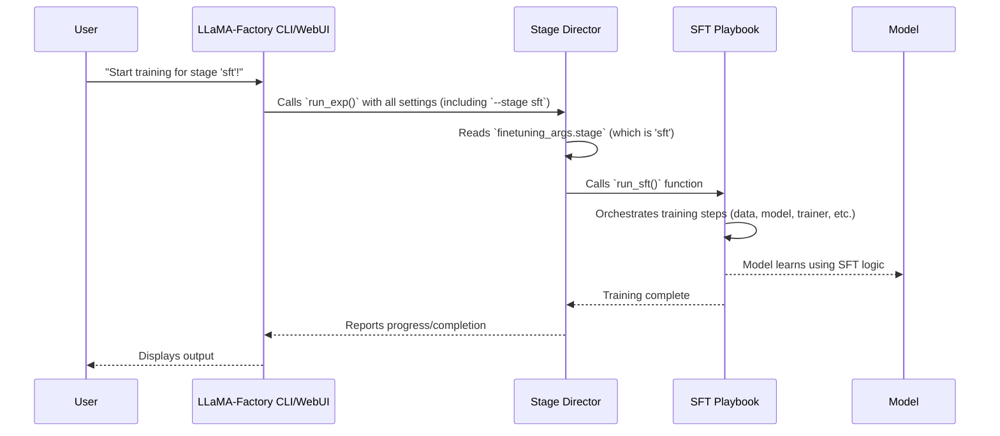

# Chapter 6: Training Workflows (Stages)

In the previous chapter, [Chapter 5: Model Loading & Adapters](05_model_loading___adapters_.md), you learned how LLaMA-Factory brings a powerful large language model into your project, optimizes it, and equips it with specialized "adapters" for efficient learning. With your model now prepared and your data perfectly processed (as you learned in [Chapter 4: Data Processing Pipeline](04_data_processing_pipeline_.md)), it's time for the actual learning to begin!

Imagine LLaMA-Factory as a versatile training facility for intelligent robots. You have the robot (your model) and the training materials (your data). But robots can be trained for many different jobs: some need to follow instructions precisely, others need to learn from human feedback, and some just need to expand their general knowledge. Each job requires a different "training program" or "curriculum."

In LLaMA-Factory, these different training programs are called **Training Workflows** or **Stages**.

## What are Training Workflows (Stages)?

Training Workflows (Stages) define the specific **training programs** the LLaMA-Factory can run on your language models. Each stage represents a distinct goal and uses a particular set of training steps and loss functions (the mathematical rules that guide the model's learning).

**A Central Use Case:** Let's say you want to **train a new language model** to become better at following specific instructions, like answering questions or writing summaries based on given prompts. This common goal is achieved through a specific training stage called **Supervised Fine-tuning (SFT)**. However, if your goal was to teach the model to *judge* which answer is better, you'd need a completely different stage!

LLaMA-Factory supports several key training stages, each designed for a different purpose:

*   **SFT (Supervised Fine-tuning)**:
    *   **Goal**: To teach the model to follow instructions, generate specific types of responses, or complete tasks based on input examples. It's like giving the model "homework assignments" with clear correct answers.
    *   **Common Use**: Chatbots, instruction-following models, summarization.
    *   **Analogy**: Teaching a student by giving them practice problems with known solutions.

*   **PT (Pre-training)**:
    *   **Goal**: To continue training a model on a vast amount of text data, similar to how it was initially trained. This expands its general knowledge and language understanding.
    *   **Common Use**: Adapting a model to a new language or domain (e.g., medical texts, legal documents).
    *   **Analogy**: Sending a student to a general knowledge academy to learn more about the world.

*   **RM (Reward Model Training)**:
    *   **Goal**: To train a separate "reward model" that can judge the quality of a language model's response. This reward model is crucial for later stages that learn from human preferences.
    *   **Common Use**: Preparing for preference-based fine-tuning (like PPO or DPO).
    *   **Analogy**: Training a judge to evaluate a student's essay based on criteria.

*   **DPO (Direct Preference Optimization)**:
    *   **Goal**: To directly fine-tune a language model based on human preferences (e.g., "response A is better than response B") *without* needing a separate reward model. It directly optimizes the model to generate preferred responses.
    *   **Common Use**: Aligning models with human values, improving response quality.
    *   **Analogy**: Directly telling a student, "This is a better answer than that, so learn from it."

*   **PPO (Proximal Policy Optimization)**:
    *   **Goal**: To fine-tune a language model using reinforcement learning, often in combination with a reward model. The model generates responses, the reward model scores them, and the language model learns to generate higher-scoring responses.
    *   **Common Use**: Advanced alignment with human feedback, complex conversational agents.
    *   **Analogy**: Letting a student try different answers, and then giving them a "score" for each attempt, helping them learn through trial and error.

*   **KTO (Kahneman-Tversky Optimization)**:
    *   **Goal**: Another method for aligning models with human preferences, focusing on simpler "win/loss" labels for pairs of responses, leveraging concepts from behavioral economics.
    *   **Common Use**: Alternative to DPO for preference-based fine-tuning.
    *   **Analogy**: Similar to DPO, but with a slightly different way of interpreting "better" and "worse" feedback.

Each of these stages has its own specific `workflow.py` file that orchestrates the unique training steps and loss functions required for that type of learning.

## How to Use Training Workflows

Choosing a training stage in LLaMA-Factory is very straightforward, usually done through the `--stage` hyperparameter.

**Via CLI:**

To train a model using Supervised Fine-tuning (SFT) for our instruction-following use case, you would add `--stage sft` to your `lmf train` command:

```bash
lmf train \
    --model_name_or_path meta-llama/Llama-2-7b-hf \
    --dataset alpaca_gpt4_en \
    --stage sft \ # This selects the SFT training workflow!
    --finetuning_type lora \
    --output_dir my_sft_model
```

**What happens?**
When LLaMA-Factory sees `--stage sft`, it knows to activate the Supervised Fine-tuning program. It will then load your `alpaca_gpt4_en` dataset, apply the SFT-specific data processing, and configure the training loop to optimize the model for instruction following.

If you wanted to train a Reward Model instead, you would simply change `--stage sft` to `--stage rm`.

**Via WebUI:**

In the [Web User Interface (WebUI)](02_web_user_interface__webui__.md), you'd navigate to the "Train" tab, and there would be a dropdown menu labeled "Training Stage" or similar. You would simply select "SFT" (or "PT", "RM", "DPO", "PPO", "KTO") from this list.

The WebUI seamlessly translates your selection into the `--stage` hyperparameter for you.

## Under the Hood: The Stage Director

So, how does LLaMA-Factory know which specific "training program" to run when you specify a `--stage`? Think of LLaMA-Factory as having a central **Stage Director** (`tuner.py`). When you tell it which stage to run (e.g., `sft`), the Stage Director looks up the correct "playbook" (`workflow.py` file) for that stage and tells it to begin.

Here's a simplified sequence of what happens when you initiate a training command with a specific stage:



### Diving into the Code

The core logic for dispatching to different training stages is found in `src/train.py` and `src/llamafactory/train/tuner.py`.

1.  **`src/train.py`**: This is the main entry point for all training operations in LLaMA-Factory. It simply calls the `run_exp` function.

    ```python
    # File: src\train.py (simplified)
    from llamafactory.train.tuner import run_exp

    def main():
        run_exp() # This is the function that starts everything!

    if __name__ == "__main__":
        main()
    ```
    **Explanation:** When you type `lmf train`, Python executes this `main` function, which in turn calls `run_exp()`.

2.  **`src/llamafactory/train/tuner.py`**: This file acts as our "Stage Director." It receives all the hyperparameters (including `finetuning_args.stage`) and then dispatches the call to the appropriate workflow function.

    ```python
    # File: src\llamafactory\train\tuner.py (simplified)
    from ..hparams import get_train_args # To get our hyperparameters
    from .dpo import run_dpo # Import DPO workflow function
    from .kto import run_kto # Import KTO workflow function
    from .ppo import run_ppo # Import PPO workflow function
    from .pt import run_pt   # Import PT workflow function
    from .rm import run_rm   # Import RM workflow function
    from .sft import run_sft # Import SFT workflow function

    def _training_function(config: dict[str, Any]) -> None:
        args = config.get("args")
        # Get all the parsed hyperparameters (Model, Data, Training, Finetuning, Generating)
        model_args, data_args, training_args, finetuning_args, generating_args = get_train_args(args)

        # This is where the dispatching happens based on your --stage setting!
        if finetuning_args.stage == "pt":
            run_pt(model_args, data_args, training_args, finetuning_args, callbacks)
        elif finetuning_args.stage == "sft":
            run_sft(model_args, data_args, training_args, finetuning_args, generating_args, callbacks)
        elif finetuning_args.stage == "rm":
            run_rm(model_args, data_args, training_args, finetuning_args, callbacks)
        elif finetuning_args.stage == "ppo":
            run_ppo(model_args, data_args, training_args, finetuning_args, generating_args, callbacks)
        elif finetuning_args.stage == "dpo":
            run_dpo(model_args, data_args, training_args, finetuning_args, callbacks)
        elif finetuning_args.stage == "kto":
            run_kto(model_args, data_args, training_args, finetuning_args, callbacks)
        else:
            raise ValueError(f"Unknown task: {finetuning_args.stage}.")

    def run_exp(args: Optional[dict[str, Any]] = None, callbacks: Optional[list["TrainerCallback"]] = None) -> None:
        # Reads command-line arguments or config file, then calls the _training_function
        _training_function(config={"args": args, "callbacks": callbacks})
    ```
    **Explanation:** The `_training_function` is the heart of the Stage Director. It retrieves the `stage` value from the `finetuning_args` (which came from your `--stage` setting). Then, it uses a simple `if/elif` structure to call the specific `run_sft`, `run_pt`, `run_rm`, `run_ppo`, `run_dpo`, or `run_kto` function. Each of these `run_*` functions is located in its own `workflow.py` file, as shown below.

3.  **Specific Workflow Files (e.g., `src/llamafactory/train/sft/workflow.py`)**: Each `workflow.py` file contains the detailed "playbook" for its respective stage.

    ```python
    # File: src\llamafactory\train\sft\workflow.py (simplified)
    # ... imports for data collators, datasets, trainer, etc. ...
    from ...data import SFTDataCollatorWith4DAttentionMask, get_dataset, get_template_and_fix_tokenizer
    from ...model import load_model, load_tokenizer
    from .trainer import CustomSeq2SeqTrainer # The specialized trainer for SFT

    def run_sft(
        model_args: "ModelArguments",
        data_args: "DataArguments",
        training_args: "Seq2SeqTrainingArguments",
        finetuning_args: "FinetuningArguments",
        generating_args: "GeneratingArguments",
        callbacks: Optional[list["TrainerCallback"]] = None,
    ):
        # 1. Load the tokenizer (from Model Loading & Adapters chapter)
        tokenizer_module = load_tokenizer(model_args)
        tokenizer = tokenizer_module["tokenizer"]
        template = get_template_and_fix_tokenizer(tokenizer, data_args)

        # 2. Get and preprocess the dataset (from Data Processing Pipeline chapter)
        dataset_module = get_dataset(template, model_args, data_args, training_args, stage="sft", **tokenizer_module)

        # 3. Load the model and attach adapters (from Model Loading & Adapters chapter)
        model = load_model(tokenizer, model_args, finetuning_args, training_args.do_train)

        # 4. Prepare data collator (how data batches are created)
        data_collator = SFTDataCollatorWith4DAttentionMask(
            template=template, model=model, **tokenizer_module,
        )

        # 5. Initialize the specific Trainer for SFT
        trainer = CustomSeq2SeqTrainer(
            model=model,
            args=training_args,
            finetuning_args=finetuning_args,
            data_collator=data_collator,
            callbacks=callbacks,
            **dataset_module,
            **tokenizer_module,
        )

        # 6. Start the training!
        if training_args.do_train:
            train_result = trainer.train(resume_from_checkpoint=training_args.resume_from_checkpoint)
            trainer.save_model() # Save the trained model
            trainer.save_metrics("train", train_result.metrics)
            trainer.save_state()
            # Optionally plot loss
    ```
    **Explanation:** The `run_sft` function is a comprehensive workflow. It first uses functionalities from previous chapters (like [Model Loading & Adapters](05_model_loading___adapters_.md) for `load_tokenizer` and `load_model`, and [Data Processing Pipeline](04_data_processing_pipeline_.md) for `get_dataset`). It then sets up an `SFTDataCollator` specific to SFT and initializes `CustomSeq2SeqTrainer`, which contains the actual training loop and loss function relevant to supervised fine-tuning. Finally, it calls `trainer.train()` to start the learning process. Other workflow files (like `dpo/workflow.py` or `ppo/workflow.py`) will have similar structures but will use different data collators, trainers, and loss functions specific to their unique training goals.

This modular design makes LLaMA-Factory flexible, allowing you to easily switch between different training objectives by simply changing the `--stage` parameter.

## Conclusion

Training Workflows (Stages) are the distinct "training programs" LLaMA-Factory uses to teach your language models new skills. Each stage, like Supervised Fine-tuning (SFT), Pre-training (PT), or Direct Preference Optimization (DPO), has a specific purpose and its own dedicated `workflow.py` file that orchestrates the unique steps and loss functions. By understanding and selecting the appropriate stage, you can guide your model towards very specific learning objectives.

With your model trained and ready, the next crucial step is to understand how well it has learned. In the next chapter, we'll explore the [Evaluation Framework](07_evaluation_framework_.md) to measure your model's performance.

---

Built by [Codalytix.com](Codalytix.com)
