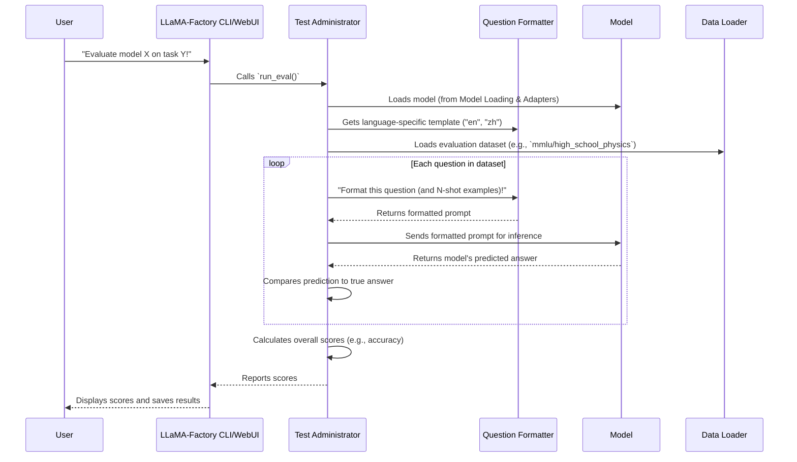

# Chapter 7: Evaluation Framework

In the previous chapter, [Training Workflows (Stages)](06_training_workflows__stages__.md), you learned how to put your large language model through various "training programs" to teach it new skills. After all that hard work, how do you know if your model actually got smarter? Did it learn what you wanted it to? This is where the **Evaluation Framework** comes in!

Imagine LLaMA-Factory is a school, and your fine-tuned language model is a student who just finished a course. The Evaluation Framework is like the school's **testing department** or the system for giving out **report cards**. It's responsible for systematically checking the student's (model's) understanding and performance using standardized tests.

## What is the Evaluation Framework?

The Evaluation Framework is LLaMA-Factory's "quality assurance department." Its job is to **objectively measure how well your fine-tuned LLM performs** on specific tasks. It does this by giving the model a set of known questions or prompts and then comparing its answers to the correct ones.

**A Central Use Case:** Let's say you've just completed [Supervised Fine-tuning (SFT)](06_training_workflows__stages__.md) on your Llama-2 model to make it better at answering science questions. You want to know if it can now ace a science exam. The Evaluation Framework will:

1.  **Load** a special "science exam" dataset (like MMLU or C-Eval).
2.  **Format** each question appropriately for your model.
3.  **Ask** your model each question and record its answers.
4.  **Score** the answers (e.g., compute accuracy) to give you a clear percentage of how well it did.

This framework provides concrete numbers (metrics) that tell you if your model is improving, stagnating, or even getting worse.

## Key Concepts

Let's break down the main components of this testing process.

### 1. Evaluation Datasets: The Standardized Exams

Just like schools use standardized tests, LLaMA-Factory uses **standardized evaluation datasets** to measure model performance. These datasets are specifically designed to test various capabilities, from common sense to specialized knowledge. They typically contain:

*   **Questions**: The prompts given to the model.
*   **Choices**: For multiple-choice questions (e.g., A, B, C, D).
*   **Correct Answers**: The ground truth to compare the model's output against.

Examples of such datasets, which LLaMA-Factory supports, are:

*   **MMLU (Massive Multitask Language Understanding)**: A large English benchmark covering many subjects.
*   **C-Eval**: A comprehensive Chinese evaluation suite.

Each of these datasets has a specific structure (e.g., `question`, `A`, `B`, `C`, `D`, `answer`).

### 2. Prompting for Evaluation: Asking the Questions

Before the model can answer, the raw dataset question needs to be formatted into a prompt that the LLM understands. This involves:

*   **Adding instructions**: Telling the model what kind of question it is (e.g., "The following are multiple choice questions...").
*   **Structuring choices**: Presenting options clearly (e.g., "A. Option 1", "B. Option 2").
*   **Few-shot Learning (N-shot)**: Optionally, you can give the model a few *examples* of questions and their correct answers *before* asking the actual test question. This helps the model understand the format and task better. For example, if `n_shot` is 5, the model sees 5 question-answer pairs from the training part of the dataset, then the actual test question.

### 3. Inference: The Model Takes the Test

Once a question is formatted, it's passed to the model. The model then uses its learned knowledge to generate a response or predict the most likely answer. This process of the model making a prediction is called **inference**.

For multiple-choice questions, the evaluation framework looks at the model's internal "probabilities" for each choice (A, B, C, D) and picks the one it thinks is most likely.

### 4. Metrics: The Report Card Grades

After the model makes its predictions, the Evaluation Framework compares them to the correct answers and calculates metrics. These are quantitative scores that tell you about the model's performance:

*   **Accuracy**: For multiple-choice questions, this is simply the percentage of correct answers.
*   **BLEU (Bilingual Evaluation Understudy)**: A metric for evaluating the quality of text generated by the model (e.g., for translation or summarization tasks). It compares how much overlap there is between the model's output and human-written reference translations.
*   **ROUGE (Recall-Oriented Understudy for Gisting Evaluation)**: Another metric for text generation, particularly useful for summarization, by measuring overlap of words or phrases.

For our science exam example, we'd primarily be interested in **accuracy**. If we were evaluating summarization, we'd look at BLEU or ROUGE.

## How to Use the Evaluation Framework

You'll primarily interact with the Evaluation Framework using the [Command Line Interface (CLI)](01_command_line_interface__cli__.md) or the [Web User Interface (WebUI)](02_web_user_interface__webui__.md).

**Via CLI:**

To evaluate your fine-tuned science model on the MMLU dataset (specifically the `high_school_physics` subject), you would use the `lmf eval` command. Remember, we need to specify:
*   The model to evaluate (`--model_name_or_path`).
*   The evaluation dataset (`--task`).
*   The language of the evaluation (`--lang`).
*   How many few-shot examples to provide (`--n_shot`).

```bash
lmf eval \
    --model_name_or_path my_sft_model \
    --task mmlu_test \
    --lang en \
    --n_shot 5 \
    --output_dir results/mmlu_physics_eval
```
**What happens?**
*   `--model_name_or_path my_sft_model`: LLaMA-Factory loads your previously trained model (e.g., from [Model Loading & Adapters](05_model_loading___adapters_.md)).
*   `--task mmlu_test`: It identifies that you want to run the MMLU benchmark on its test split. LLaMA-Factory will then automatically iterate through all subjects within MMLU (or a specific one if specified via `subject` hyperparameter) and load their respective datasets.
*   `--lang en`: It uses the English evaluation prompt template.
*   `--n_shot 5`: For each question, it will include 5 examples from the training split of the dataset before the actual question.
*   `--output_dir results/mmlu_physics_eval`: The evaluation results (scores and predictions) will be saved here.

After running, you'll see a score report printed in your terminal, and detailed results saved to the specified directory.

**Via WebUI:**

In the [Web User Interface (WebUI)](02_web_user_interface__webui__.md), you'd typically go to an "Evaluate & Predict" tab (or similar). There, you would:
1.  **Select your model** (e.g., "my_sft_model") from a dropdown.
2.  **Choose the evaluation task** (e.g., "mmlu_test") from another dropdown.
3.  **Select the language** (e.g., "English").
4.  **Specify the number of few-shot examples** (e.g., "5").
5.  **Click an "Evaluate" button**.

The WebUI then runs the same underlying evaluation process and displays the results in a user-friendly format on the screen.

## Under the Hood: The Test Administrator

So, how does LLaMA-Factory manage this entire evaluation process? Think of it as a dedicated "Test Administrator" (`evaluator.py`). When you initiate an `eval` command, this administrator takes charge: loading the right tests, giving them to the model, and scoring the results.

Here's a simplified sequence of what happens:



### Diving into the Code

Let's look at the key files that make the Evaluation Framework tick.

1.  **`src/llamafactory/eval/evaluator.py`**: This is the main orchestrator for evaluation.

    ```python
    # File: src\llamafactory\eval\evaluator.py (simplified)
    from datasets import load_dataset # To load evaluation datasets
    from ..hparams import get_eval_args # To get evaluation hyperparameters
    from ..model import load_model, load_tokenizer # To load the model
    from .template import get_eval_template # To get evaluation prompt templates

    class Evaluator:
        def __init__(self, args: Optional[dict[str, Any]] = None) -> None:
            # Get all evaluation settings
            self.model_args, self.data_args, self.eval_args, finetuning_args = get_eval_args(args)
            # Load tokenizer and model
            self.tokenizer = load_tokenizer(self.model_args)["tokenizer"]
            self.model = load_model(self.tokenizer, self.model_args, finetuning_args)
            # Get the correct evaluation template (en, zh, etc.)
            self.eval_template = get_eval_template(self.eval_args.lang)
            # Pre-compute token IDs for choices (A, B, C, D)
            self.choice_inputs = [self.tokenizer.encode(ch, add_special_tokens=False)[-1] for ch in CHOICES]

        @torch.inference_mode() # Ensures no gradient calculation, making it faster
        def batch_inference(self, batch_input: dict[str, "torch.Tensor"]) -> list[str]:
            # Run model forward pass
            logits = self.model(**batch_input).logits
            lengths = torch.sum(batch_input["attention_mask"], dim=-1)
            # Get logits for the last token of each sequence (where the answer choice would be)
            word_probs = torch.stack([logits[i, lengths[i] - 1] for i in range(len(lengths))], dim=0)
            # Apply softmax to get probabilities for A, B, C, D choices
            choice_probs = torch.nn.functional.softmax(word_probs[:, self.choice_inputs], dim=-1).detach()
            # Pick the choice with the highest probability
            return [chr(ord("A") + offset.item()) for offset in torch.argmax(choice_probs, dim=-1)]

        def eval(self) -> None:
            # Determine evaluation task and split (e.g., "mmlu", "test")
            eval_task = self.eval_args.task.split("_")[0]
            eval_split = self.eval_args.task.split("_")[1]

            # Load mapping for subjects (e.g., physics, chemistry for MMLU)
            # ... (code for loading subject mapping) ...

            category_corrects = {subj: np.array([], dtype="bool") for subj in SUBJECTS}
            for subject in tqdm(categorys.keys(), desc="Processing subjects"):
                # Load the specific subject dataset (e.g., mmlu/high_school_physics)
                dataset = load_dataset(path=os.path.join(self.eval_args.task_dir, eval_task), name=subject, ...)

                inputs, outputs, labels = [], [], []
                for i in trange(len(dataset[eval_split]), desc="Formatting batches", leave=False):
                    # Select N-shot examples from the training split
                    support_set = dataset["train"].shuffle().select(range(min(self.eval_args.n_shot, len(dataset["train"]))))
                    # Format the question with N-shot examples using the eval template
                    messages = self.eval_template.format_example(
                        target_data=dataset[eval_split][i],
                        support_set=support_set,
                        subject_name=categorys[subject]["name"],
                    )
                    # Tokenize the formatted prompt (from Data Processing Pipeline)
                    input_ids, _ = self.template.encode_oneturn(tokenizer=self.tokenizer, messages=messages)
                    inputs.append({"input_ids": input_ids, "attention_mask": [1] * len(input_ids)})
                    labels.append(messages[-1]["content"]) # The correct answer (A, B, C, D)

                for i in trange(0, len(inputs), self.eval_args.batch_size, desc="Predicting batches", leave=False):
                    # Pad and prepare a batch of inputs for the model
                    batch_input = self.tokenizer.pad(inputs[i : i + self.eval_args.batch_size], return_tensors="pt").to(self.model.device)
                    # Get predictions from the model
                    preds = self.batch_inference(batch_input)
                    outputs += preds

                # Compare predictions to labels and store correctness
                corrects = np.array(outputs) == np.array(labels)
                category_name = categorys[subject]["category"]
                category_corrects[category_name] = np.concatenate([category_corrects[category_name], corrects], axis=0)
                category_corrects["Average"] = np.concatenate([category_corrects["Average"], corrects], axis=0)
                # ... save individual subject results ...

            self._save_results(category_corrects, results)

    def _save_results(self, category_corrects: dict[str, "NDArray"], results: dict[str, dict[int, str]]) -> None:
        # Format and print overall scores, then save to files
        # ... (code to print and save results.json and results.log) ...

    def run_eval() -> None:
        Evaluator().eval()
    ```
    **Explanation:**
    *   The `Evaluator` class's `__init__` sets everything up: it loads your model (using logic from [Model Loading & Adapters](05_model_loading___adapters_.md)), tokenizer, and the correct evaluation template based on your [Hyperparameter Management (HParams)](03_hyperparameter_management__hparams__.md) settings. It also prepares the token IDs for the answer choices (A, B, C, D).
    *   `batch_inference` is where the model predicts. It takes a batch of formatted questions, feeds them to the model, and then intelligently extracts the probability for each answer choice (A, B, C, D) from the model's output to determine the prediction.
    *   The main `eval()` method loops through subjects/tasks in your chosen evaluation dataset (which are loaded using `datasets.load_dataset`). For each question, it calls `self.eval_template.format_example` to prepare the prompt (including N-shot examples), then uses the tokenizer (`self.template.encode_oneturn` from [Data Processing Pipeline](04_data_processing_pipeline_.md)) to convert the text into numerical inputs for the model. Finally, it uses `batch_inference` to get the model's answers, compares them to the true labels, and aggregates the results.
    *   `_save_results` handles printing the final score report and saving the detailed predictions and scores to files.

2.  **`src/llamafactory/eval/template.py`**: This file defines the actual templates for formatting evaluation questions.

    ```python
    # File: src\llamafactory\eval\template.py (simplified)
    from dataclasses import dataclass
    from ..extras.constants import CHOICES

    @dataclass
    class EvalTemplate:
        system: str # System instruction for the model
        choice: str # Format for choices (e.g., "\n{choice}. {content}")
        answer: str # Prefix for the answer (e.g., "\nAnswer:")

        def _parse_example(self, example: dict[str, str]) -> tuple[str, str]:
            # Takes a raw example and formats question and choices
            candidates = [self.choice.format(choice=ch, content=example[ch]) for ch in CHOICES if ch in example]
            return "".join([example["question"]] + candidates + [self.answer]), example["answer"]

        def format_example(
            self, target_data: dict[str, str], support_set: list[dict[str, str]], subject_name: str
        ) -> list[dict[str, str]]:
            # Combines N-shot examples with the target question
            messages = []
            for k in range(len(support_set)): # Loop for N-shot examples
                prompt, response = self._parse_example(support_set[k])
                messages.append({"role": "user", "content": prompt})
                messages.append({"role": "assistant", "content": response})

            # Add the actual question to be evaluated
            prompt, response = self._parse_example(target_data)
            messages.append({"role": "user", "content": prompt})
            messages.append({"role": "assistant", "content": response})
            # Add the system instruction to the very first message
            messages[0]["content"] = self.system.format(subject=subject_name) + messages[0]["content"]
            return messages

    eval_templates: dict[str, "EvalTemplate"] = {}

    def _register_eval_template(name: str, system: str, choice: str, answer: str) -> None:
        eval_templates[name] = EvalTemplate(system=system, choice=choice, answer=answer)

    def get_eval_template(name: str) -> "EvalTemplate":
        eval_template = eval_templates.get(name, None)
        assert eval_template is not None, f"Template {name} does not exist."
        return eval_template

    _register_eval_template(
        name="en",
        system="The following are multiple choice questions (with answers) about {subject}.\n\n",
        choice="\n{choice}. {content}",
        answer="\nAnswer:",
    )
    # ... other templates like "zh" ...
    ```
    **Explanation:**
    *   The `EvalTemplate` dataclass defines the structure for how questions are presented to the model (system instruction, how choices are shown, and the "Answer:" prefix).
    *   `_parse_example` takes a single question from the dataset and formats it into a prompt string.
    *   `format_example` is crucial for N-shot evaluation: it takes `N` support examples and the `target_data` (the actual question to be answered), formats each, and combines them into a list of messages. It also injects the initial `system` instruction.
    *   `_register_eval_template` is used internally to define templates for different languages (like `"en"` for English or `"zh"` for Chinese), each with its specific phrasing for instructions and answers.

3.  **`scripts/eval_bleu_rouge.py`**: While `evaluator.py` handles multiple-choice accuracy, this script handles metrics for text *generation* tasks.

    ```python
    # File: scripts\eval_bleu_rouge.py (simplified)
    import json
    import logging
    import time
    from datasets import load_dataset
    import jieba # For Chinese word segmentation
    from nltk.translate.bleu_score import SmoothingFunction, sentence_bleu # For BLEU
    from rouge_chinese import Rouge # For ROUGE

    def compute_metrics(sample):
        # Breaks predicted and reference text into words (using jieba for Chinese)
        hypothesis = list(jieba.cut(sample["predict"]))
        reference = list(jieba.cut(sample["label"]))

        # Computes BLEU score
        bleu_score = sentence_bleu([list(sample["label"])], list(sample["predict"]), smoothing_function=SmoothingFunction().method3)

        # Computes ROUGE scores
        if len(" ".join(hypothesis).split()) == 0 or len(" ".join(reference).split()) == 0:
            result = {"rouge-1": {"f": 0.0}, "rouge-2": {"f": 0.0}, "rouge-l": {"f": 0.0}}
        else:
            rouge = Rouge()
            scores = rouge.get_scores(" ".join(hypothesis), " ".join(reference))
            result = scores[0]

        metric_result = {}
        for k, v in result.items():
            metric_result[k] = round(v["f"] * 100, 4)
        metric_result["bleu-4"] = round(bleu_score * 100, 4)
        return metric_result

    def main(filename: str):
        # Loads a JSON file containing predictions and labels
        dataset = load_dataset("json", data_files=filename, split="train")
        # Applies compute_metrics to each sample in the dataset
        dataset = dataset.map(compute_metrics, num_proc=8, remove_columns=dataset.column_names)
        score_dict = dataset.to_dict()

        average_score = {}
        for task, scores in sorted(score_dict.items()):
            print(f"{task}: {sum(scores) / len(scores):.4f}")
            average_score[task] = sum(scores) / len(scores)

        with open("predictions_score.json", "w", encoding="utf-8") as f:
            json.dump(average_score, f, indent=4)
    ```
    **Explanation:** This script is designed to be run *after* a model has generated free-form text predictions (saved to a file) and you want to evaluate the quality of those generations.
    *   `compute_metrics` is the core function. It takes a model's `predict`ed text and a `label` (the human-written correct text) and calculates BLEU and ROUGE scores. It handles tokenizing the text (especially for Chinese with `jieba`).
    *   `main` loads a dataset of predictions and labels, then uses `dataset.map` to apply `compute_metrics` to every example, finally calculating and printing the average scores.

Together, these files provide a comprehensive system for measuring and reporting your LLaMA-Factory model's performance on various benchmarks.

## Conclusion

The Evaluation Framework is your model's crucial "report card" system in LLaMA-Factory. It provides a systematic way to measure performance on standardized datasets, using appropriate prompting techniques, running inference, and calculating key metrics like accuracy, BLEU, or ROUGE. By using the `lmf eval` command or the WebUI, you can get clear, quantifiable insights into how well your fine-tuned language models are performing. You now understand how to assess your model's progress and capabilities.

With your model trained and evaluated, the final exciting step is to put it to real-world use! In the next chapter, we'll explore the [Chat/Inference Engine](08_chat_inference_engine__.md) to interact with your models directly.

---

Built by [Codalytix.com](Codalytix.com)
