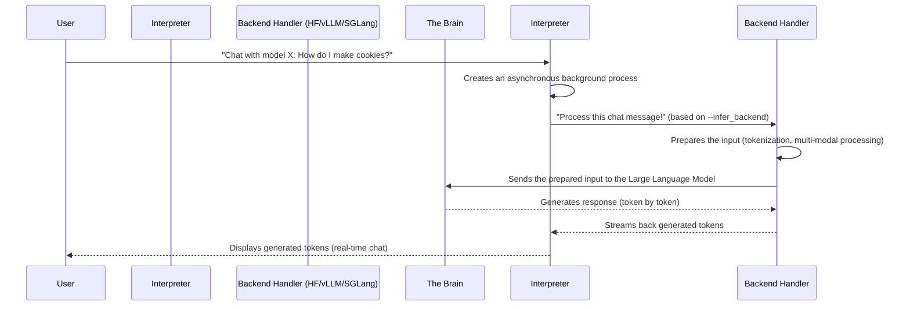

# Chapter 8: Chat/Inference Engine

In the previous chapter, [Chapter 7: Evaluation Framework](07_evaluation_framework_.md), you learned how to test your fine-tuned language model to see how well it learned. But what if you want to simply *talk* to your model? Or have it generate new text for you in real-time, just like ChatGPT? This is where the **Chat/Inference Engine** comes into play.

Imagine LLaMA-Factory has trained a brilliant, articulate robot (your LLM). The Evaluation Framework was like giving the robot a test. The Chat/Inference Engine is like the **"conversation booth"** or the **"text generator"** that lets you interact directly with this robot. You type in a message, and the robot responds.

## What is the Chat/Inference Engine?

The Chat/Inference Engine is LLaMA-Factory's **communication hub** that enables direct interaction with your loaded language models. It's the system that turns your questions into something the model understands, sends it to the model for a response, and then delivers the model's answer back to you.

It solves a crucial problem: Large language models are very complex. Just like you wouldn't directly connect to your computer's brain to type a document, you don't directly manipulate a model's millions of numbers to get a response. The Inference Engine acts as an **interpreter and manager**.

**A Central Use Case:** Let's say you've fine-tuned a Llama-2 model to be a helpful assistant for cooking recipes (as we discussed in [Training Workflows (Stages)](06_training_workflows__stages__.md)). Now you want to actually *ask* it for a recipe! The Chat/Inference Engine allows you to:

1.  **Input your cooking question**: "How do I make chocolate chip cookies?"
2.  **Send it to your model**: The engine packages your question for the model.
3.  **Receive the recipe**: The engine gets the model's generated recipe.
4.  **See it token by token**: Often, the engine can even stream the recipe to you word by word, just like a real conversation!

This engine handles all the complexities, including making sure the model responds quickly and efficiently.

## Key Concepts

Let's look at the important ideas behind how this conversation hub works.

### 1. Inference: The Model's Thinking Process

**Inference** is the core process where a trained model takes an input (like your question) and generates an output (like a recipe). It's the "thinking" part of the LLM. When you chat with a model, you are continuously running inference.

### 2. Backend Inference Engines: The Hidden Powerhouses

Running massive LLMs efficiently requires specialized software. LLaMA-Factory's Chat/Inference Engine doesn't do the raw number-crunching itself; instead, it provides a consistent way to interact with different **backend inference engines**. Think of these as different powerful motors your car might have:

*   **Hugging Face (HF) Transformers**: The standard, general-purpose library for LLMs. It's widely compatible but might not be the absolute fastest for very heavy loads.
*   **vLLM**: A highly optimized engine designed for very fast and efficient inference, especially when handling many requests at once. It's like a specialized racing engine for maximum speed.
*   **SGLang**: Another efficient engine that focuses on reducing latency (how long it takes for the first word to appear) for interactive chat.

The LLaMA-Factory engine chooses the right backend based on your needs, making sure you get the best performance without having to learn each backend's specific quirks.

### 3. Streaming Output: Real-time Conversation

Imagine typing a message to a friend and waiting minutes for their entire reply to appear. That wouldn't feel like a natural chat! **Streaming output** means the model sends you its response token by token (word by word or part-of-word by part-of-word) as it generates them. This makes the interaction feel much more responsive and natural, just like a real-time conversation.

### 4. Multi-Modal Chat: Beyond Just Text

Some advanced models can understand more than just text. They can see images, hear audio, or watch videos. The Chat/Inference Engine is designed to handle this **multi-modal chat**, ensuring that if you include an image in your question ("What is this a picture of? `<image>`"), the model receives and processes that visual information correctly before generating its text answer.

## How to Use the Chat/Inference Engine

You can use the Chat/Inference Engine in LLaMA-Factory primarily through the [Command Line Interface (CLI)](01_command_line_interface__cli__.md), the [Web User Interface (WebUI)](02_web_user_interface__webui__.md), or by importing it directly into your Python code.

### 1. Via the Command Line Interface (CLI)

The simplest way to start a chat with your model is using the `lmf chat` command.

```bash
lmf chat \
    --model_name_or_path my_recipe_llama \
    --template llama2 \
    --infer_backend hf
```

**What happens?**

*   `--model_name_or_path my_recipe_llama`: This tells LLaMA-Factory which fine-tuned model to load for the chat. (This model was created using [Model Loading & Adapters](05_model_loading___adapters_.md)).
*   `--template llama2`: This ensures your input messages are formatted correctly for the Llama-2 model, matching how it was trained (from [Data Processing Pipeline](04_data_processing_pipeline_.md)).
*   `--infer_backend hf`: This explicitly chooses the Hugging Face Transformers backend for inference. You could change this to `vllm` or `sglang` if you have those installed and want more speed.

After running this command, you'll see a command-line interface where you can type your questions, and the model will respond:

```
Welcome to the CLI application, use `clear` to remove the history, use `exit` to exit the application.

User: How do I make chocolate chip cookies?
Assistant: To make delicious chocolate chip cookies, you'll need... (model streams response)
```

You can type `clear` to reset the conversation history or `exit` to quit.

### 2. Via the Web User Interface (WebUI)

If you launched the WebUI with `lmf webui` (as learned in [Chapter 2: Web User Interface (WebUI)](02_web_user_interface__webui__.md)), you can navigate to the "Chat" tab.

There, you'll find:
*   A dropdown to **select your model**.
*   An input box to type your messages.
*   A display area for the model's responses.
*   Options to adjust parameters like `temperature` (how creative the model is) or `max_new_tokens` (how long the response can be) – these are [Hyperparameter Management (HParams)](03_hyperparameter_management__hparams__.md) for generation.

The WebUI uses the same underlying Chat/Inference Engine to power this interactive experience.

### 3. Via Python API (Advanced)

For developers, LLaMA-Factory also provides a Python API to programmatically interact with the inference engine. This is how the CLI and WebUI internally communicate with the engine.

```python
# Simplified example of using ChatModel in Python
from llamafactory.chat import ChatModel

# Configure your model and generation settings (like from CLI/WebUI)
# This is where your HParams from Chapter 3 come in!
args = {
    "model_name_or_path": "my_recipe_llama",
    "template": "llama2",
    "infer_backend": "hf",
    "temperature": 0.7,
    "max_new_tokens": 512,
}

# Load the chat model engine
chat_model = ChatModel(args=args)

# Start a chat
messages = [{"role": "user", "content": "Tell me a short bedtime story."}]

print("Assistant: ", end="", flush=True)
for new_text in chat_model.stream_chat(messages):
    print(new_text, end="", flush=True)

# Output: Assistant: Once upon a time, in a cozy little burrow... (streams response)
```
**What happens?**
You create an instance of `ChatModel`, passing in your desired settings. Then, you can call `chat_model.stream_chat()` to get the response token by token, or `chat_model.chat()` to get the full response at once.

## Under the Hood: The Communication Hub

So, how does LLaMA-Factory manage these conversations and delegate to different backend engines? It uses a clever modular design.

### The Communication Flow: The Interpreter's Journey

When you send a message to the model, here's a simplified sequence of how the Chat/Inference Engine processes it:



### Diving into the Code

Let's look at the core files that form the Chat/Inference Engine.

1.  **`src/llamafactory/chat/chat_model.py`**: This file acts as the primary "Interpreter" or dispatcher. It's the public interface you interact with.

    ```python
    # File: src\llamafactory\chat\chat_model.py (simplified)
    import asyncio
    from threading import Thread
    from typing import Any, Optional
    from ..extras.constants import EngineName
    from .hf_engine import HuggingfaceEngine # Import HF backend
    from .sglang_engine import SGLangEngine # Import SGLang backend
    from .vllm_engine import VllmEngine     # Import vLLM backend
    from .base_engine import BaseEngine, Response # Base class for all engines

    def _start_background_loop(loop: "asyncio.AbstractEventLoop") -> None:
        asyncio.set_event_loop(loop)
        loop.run_forever()

    class ChatModel:
        def __init__(self, args: Optional[dict[str, Any]] = None) -> None:
            model_args, data_args, finetuning_args, generating_args = get_infer_args(args)
            if model_args.infer_backend == EngineName.HF:
                self.engine: BaseEngine = HuggingfaceEngine(model_args, data_args, finetuning_args, generating_args)
            elif model_args.infer_backend == EngineName.VLLM:
                self.engine: BaseEngine = VllmEngine(model_args, data_args, finetuning_args, generating_args)
            elif model_args.infer_backend == EngineName.SGLANG:
                self.engine: BaseEngine = SGLangEngine(model_args, data_args, finetuning_args, generating_args)
            else:
                raise NotImplementedError(f"Unknown backend: {model_args.infer_backend}")

            # Starts an asynchronous loop in a separate thread for non-blocking operations
            self._loop = asyncio.new_event_loop()
            self._thread = Thread(target=_start_background_loop, args=(self._loop,), daemon=True)
            self._thread.start()

        def stream_chat(self, messages: list[dict[str, str]], **input_kwargs) -> Generator[str, None, None]:
            # This method acts as a bridge, running the async stream_chat from the engine
            # in the background thread and yielding results synchronously.
            generator = self.astream_chat(messages, **input_kwargs)
            while True:
                try:
                    task = asyncio.run_coroutine_threadsafe(generator.__anext__(), self._loop)
                    yield task.result()
                except StopAsyncIteration:
                    break

        async def astream_chat(self, messages: list[dict[str, str]], **input_kwargs) -> AsyncGenerator[str, None]:
            # This is the actual asynchronous call to the chosen backend engine's stream_chat method.
            async for new_token in self.engine.stream_chat(messages, **input_kwargs):
                yield new_token
    ```
    **Explanation:**
    *   The `ChatModel`'s `__init__` function is the dispatcher. It checks the `infer_backend` setting (from [Hyperparameter Management (HParams)](03_hyperparameter_management__hparams__.md)) and creates an instance of the specific backend engine (e.g., `HuggingfaceEngine`, `VllmEngine`).
    *   It also sets up a special `asyncio` event loop in a separate thread. This allows the chat model to perform non-blocking (asynchronous) operations, which is crucial for streaming, while the main program can still respond.
    *   The `stream_chat` method (for synchronous use) internally calls `astream_chat` (the asynchronous version) which then forwards the request to the `self.engine.stream_chat()` method of the chosen backend. It handles getting tokens from the async backend and yielding them one by one.

2.  **`src/llamafactory/chat/base_engine.py`**: This defines the common "blueprint" or interface that all backend engines must follow.

    ```python
    # File: src\llamafactory\chat\base_engine.py (simplified)
    from abc import ABC, abstractmethod
    from collections.abc import AsyncGenerator
    from dataclasses import dataclass
    from typing import Any, Literal, Optional, Union

    @dataclass
    class Response: # How the model's full response is structured
        response_text: str
        response_length: int
        prompt_length: int
        finish_reason: Literal["stop", "length"]

    class BaseEngine(ABC): # All backend engines inherit from this
        name: Any # Name of the engine (HF, VLLM, SGLANG)
        # ... other common attributes like model, tokenizer, template ...

        @abstractmethod
        def __init__(self, *args, **kwargs) -> None:
            r"""Initialize an inference engine."""
            ...

        @abstractmethod
        async def chat(self, messages: list[dict[str, str]], **input_kwargs) -> list["Response"]:
            r"""Get a list of responses of the chat model."""
            ...

        @abstractmethod
        async def stream_chat(self, messages: list[dict[str, str]], **input_kwargs) -> AsyncGenerator[str, None]:
            r"""Get the response token-by-token of the chat model."""
            ...

        @abstractmethod
        async def get_scores(self, batch_input: list[str], **input_kwargs) -> list[float]:
            r"""Get a list of scores of the reward model."""
            ...
    ```
    **Explanation:**
    *   `BaseEngine` is an `ABC` (Abstract Base Class), meaning it cannot be used directly. It defines methods that *must* be implemented by any class that inherits from it (like `HuggingfaceEngine` or `VllmEngine`).
    *   `chat`, `stream_chat`, and `get_scores` are the core operations every engine needs to support (though some, like vLLM, might not support `get_scores`).
    *   The `Response` dataclass defines a standard way to package a model's full generated reply, including its length and why it stopped.

3.  **`src/llamafactory/chat/hf_engine.py`**: This is one specific implementation of a backend engine, using the Hugging Face Transformers library.

    ```python
    # File: src\llamafactory\chat\hf_engine.py (simplified)
    import torch
    from transformers import GenerationConfig, TextIteratorStreamer
    from threading import Thread
    from typing import Any, Callable, Optional, Union
    from typing_extensions import override
    from ..extras.constants import IMAGE_PLACEHOLDER # For multi-modal input
    from ..model import load_model, load_tokenizer # To load the model/tokenizer
    from .base_engine import BaseEngine, Response

    class HuggingfaceEngine(BaseEngine):
        def __init__(self, model_args, data_args, finetuning_args, generating_args) -> None:
            # Loads the model and tokenizer (from Model Loading & Adapters chapter)
            tokenizer_module = load_tokenizer(model_args)
            self.tokenizer = tokenizer_module["tokenizer"]
            self.processor = tokenizer_module["processor"] # For multi-modal processing
            self.model = load_model(self.tokenizer, model_args, finetuning_args, is_trainable=False)
            self.template = get_template_and_fix_tokenizer(self.tokenizer, data_args)
            self.generating_args = generating_args.to_dict()

        @staticmethod
        def _process_args(model, tokenizer, processor, template, generating_args, messages, **input_kwargs) -> tuple[dict[str, Any], int]:
            # Handles multi-modal inputs: adds placeholders like <image> to messages
            # This uses the template's mm_plugin (from Data Processing Pipeline chapter)
            if input_kwargs.get("images") is not None and not any(IMAGE_PLACEHOLDER in m["content"] for m in messages):
                messages[0]["content"] = IMAGE_PLACEHOLDER * len(input_kwargs["images"]) + messages[0]["content"]

            # Formats messages and tokenizes them (from Data Processing Pipeline chapter)
            messages = template.mm_plugin.process_messages(messages, input_kwargs.get("images"), [], [], processor)
            prompt_ids, _ = template.encode_oneturn(tokenizer, messages + [{"role": "assistant", "content": ""}])
            prompt_ids, _ = template.mm_plugin.process_token_ids(prompt_ids, None, input_kwargs.get("images"), [], [], tokenizer, processor)
            prompt_length = len(prompt_ids)

            # Prepares inputs for the model (input_ids, attention_mask)
            inputs = torch.tensor([prompt_ids], device=model.device)
            gen_kwargs = dict(inputs=inputs, attention_mask=torch.ones_like(inputs))
            gen_kwargs["generation_config"] = GenerationConfig(**generating_args)

            # Prepares multi-modal inputs (like pixel_values for images)
            mm_inputs = template.mm_plugin.get_mm_inputs(images=input_kwargs.get("images"), batch_ids=[prompt_ids], processor=processor)
            gen_kwargs.update({k: v.to(model.device) for k, v in mm_inputs.items()})

            return gen_kwargs, prompt_length

        @staticmethod
        @torch.inference_mode()
        def _chat(model, tokenizer, processor, template, generating_args, messages, **input_kwargs) -> list["Response"]:
            # Uses _process_args to get model inputs
            gen_kwargs, prompt_length = HuggingfaceEngine._process_args(
                model, tokenizer, processor, template, generating_args, messages, **input_kwargs
            )
            # Calls the Hugging Face model's generate method
            generate_output = model.generate(**gen_kwargs)
            # Decodes the model's output IDs back into text
            response = tokenizer.batch_decode(generate_output[:, prompt_length:])
            return [Response(response_text=response[0], response_length=len(response[0]), prompt_length=prompt_length, finish_reason="stop")]

        @staticmethod
        @torch.inference_mode()
        def _stream_chat(model, tokenizer, processor, template, generating_args, messages, **input_kwargs) -> Callable[[], str]:
            # Uses _process_args to get model inputs
            gen_kwargs, _ = HuggingfaceEngine._process_args(
                model, tokenizer, processor, template, generating_args, messages, **input_kwargs
            )
            # Sets up a TextIteratorStreamer to get tokens one by one
            streamer = TextIteratorStreamer(tokenizer, skip_prompt=True)
            gen_kwargs["streamer"] = streamer
            # Runs model.generate in a separate thread to enable streaming
            thread = Thread(target=model.generate, kwargs=gen_kwargs, daemon=True)
            thread.start()
            return streamer.__next__ # Returns a function to get the next token

        @override
        async def chat(self, messages: list[dict[str, str]], **input_kwargs) -> list["Response"]:
            # The async method simply calls the static _chat method in a separate thread
            return await asyncio.to_thread(self._chat, self.model, self.tokenizer, self.processor, self.template, self.generating_args, messages, **input_kwargs)

        @override
        async def stream_chat(self, messages: list[dict[str, str]], **input_kwargs) -> AsyncGenerator[str, None]:
            # The async method calls the static _stream_chat method
            # and yields tokens received from the streamer
            stream = self._stream_chat(self.model, self.tokenizer, self.processor, self.template, self.generating_args, messages, **input_kwargs)
            while True:
                try:
                    yield await asyncio.to_thread(stream)
                except StopAsyncIteration:
                    break
    ```
    **Explanation:**
    *   The `HuggingfaceEngine`'s `__init__` loads the actual model and tokenizer from the [Model Loading & Adapters](05_model_loading___adapters_.md) system.
    *   `_process_args` is crucial: it takes your chat messages, combines them with system instructions or multi-modal placeholders (`IMAGE_PLACEHOLDER`), and then uses the model's tokenizer (part of the [Data Processing Pipeline](04_data_processing_pipeline_.md)) to convert them into numerical inputs the model understands (`input_ids`, `attention_mask`). It also processes any image/video/audio inputs.
    *   `_chat` performs standard, non-streaming inference by calling the Hugging Face model's `generate` method and then decoding the full response.
    *   `_stream_chat` is for streaming. It uses `transformers.TextIteratorStreamer` to get tokens one by one as the model generates them. It runs `model.generate` in a separate `Thread` so that the main program isn't blocked while waiting for tokens.
    *   The `chat` and `stream_chat` (async) methods are just wrappers that call the static `_chat` and `_stream_chat` methods, typically running them in a background thread for non-blocking execution.

4.  **`src/llamafactory/chat/vllm_engine.py`**: This file provides an alternative implementation for the `BaseEngine`, optimized for speed using vLLM. While the public `chat` and `stream_chat` methods look similar to `hf_engine.py`, their internal `_generate` method uses vLLM's specialized APIs.

    ```python
    # File: src\llamafactory\chat\vllm_engine.py (simplified)
    from typing_extensions import override
    from ..extras.packages import is_vllm_available
    from ..model import load_config, load_tokenizer
    from .base_engine import BaseEngine, Response

    if is_vllm_available():
        from vllm import AsyncEngineArgs, AsyncLLMEngine, SamplingParams # vLLM specific imports
        from vllm.lora.request import LoRARequest # For LoRA support in vLLM

    class VllmEngine(BaseEngine):
        def __init__(self, model_args, data_args, finetuning_args, generating_args) -> None:
            # Initializes the vLLM engine, which handles loading the model directly
            # It takes many arguments to configure vLLM's performance
            engine_args = {
                "model": model_args.model_name_or_path,
                "dtype": model_args.infer_dtype,
                "max_model_len": model_args.vllm_maxlen,
                # ... many other vLLM specific settings ...
            }
            self.model = AsyncLLMEngine.from_engine_args(AsyncEngineArgs(**engine_args))

            # Loads tokenizer and template (similar to HuggingfaceEngine)
            tokenizer_module = load_tokenizer(model_args)
            self.tokenizer = tokenizer_module["tokenizer"]
            self.template = get_template_and_fix_tokenizer(self.tokenizer, data_args)
            self.template.mm_plugin.expand_mm_tokens = False # vLLM handles token expansion internally

        async def _generate(self, messages: list[dict[str, str]], **input_kwargs) -> AsyncIterator[Any]:
            # Formats messages and gets prompt IDs (similar to HF engine)
            paired_messages = messages + [{"role": "assistant", "content": ""}]
            prompt_ids, _ = self.template.encode_oneturn(self.tokenizer, paired_messages)

            # Prepares vLLM specific sampling parameters (temperature, top_p, max_tokens etc.)
            sampling_params = SamplingParams(max_tokens=input_kwargs.get("max_new_tokens"))
            
            # Prepares multi-modal data for vLLM
            multi_modal_data = None
            if input_kwargs.get("images") is not None:
                multi_modal_data = {"image": self.template.mm_plugin._regularize_images(input_kwargs["images"])["images"]}
            # ... similar for videos/audios ...

            # Calls vLLM's generate method directly
            result_generator = self.model.generate(
                {"prompt_token_ids": prompt_ids, "multi_modal_data": multi_modal_data},
                sampling_params=sampling_params,
                # ... other vLLM specific arguments like lora_request ...
            )
            return result_generator

        @override
        async def chat(self, messages: list[dict[str, str]], **input_kwargs) -> list["Response"]:
            # Consumes the entire generator to get the final output
            final_output = None
            generator = await self._generate(messages, **input_kwargs)
            async for request_output in generator:
                final_output = request_output
            # Extracts response text and details from vLLM's output format
            return [Response(response_text=final_output.outputs[0].text, response_length=len(final_output.outputs[0].token_ids), prompt_length=len(final_output.prompt_token_ids), finish_reason=final_output.outputs[0].finish_reason)]

        @override
        async def stream_chat(self, messages: list[dict[str, str]], **input_kwargs) -> AsyncGenerator[str, None]:
            # Yields text delta as it comes from vLLM's generator
            generated_text = ""
            generator = await self._generate(messages, **input_kwargs)
            async for result in generator:
                delta_text = result.outputs[0].text[len(generated_text):]
                generated_text = result.outputs[0].text
                yield delta_text

        @override
        async def get_scores(self, batch_input: list[str], **input_kwargs) -> list[float]:
            raise NotImplementedError("vLLM engine does not support `get_scores`.")
    ```
    **Explanation:**
    *   The `VllmEngine`'s `__init__` sets up the `vLLM` `AsyncLLMEngine` directly, which handles model loading and management.
    *   The `_generate` method formats the input messages into `prompt_token_ids` and prepares `SamplingParams` specific to vLLM. It then directly calls `self.model.generate()`, which is vLLM's core generation function. It also handles multi-modal data by passing it to vLLM's `generate` call.
    *   The `chat` and `stream_chat` methods then consume the `result_generator` provided by vLLM's `generate` function, either by waiting for the full response or yielding tokens as they become available.
    *   Note that `get_scores` is not supported by the vLLM engine, as it's primarily designed for fast text generation, not scoring.

5.  **`scripts/vllm_infer.py`**: This script provides an example of how to perform *batch inference* (generating many responses at once) using the vLLM engine, which is different from the real-time chat interface.

    ```python
    # File: scripts\vllm_infer.py (simplified)
    import json
    from tqdm import tqdm
    from llamafactory.data import get_dataset, get_template_and_fix_tokenizer
    from llamafactory.hparams import get_infer_args
    from llamafactory.model import load_tokenizer
    from llamafactory.extras.packages import is_vllm_available

    if is_vllm_available():
        from vllm import LLM, SamplingParams # vLLM specific imports

    def vllm_infer(model_name_or_path: str, dataset: str = "alpaca_en_demo", **kwargs):
        # Gets inference arguments (HParams)
        model_args, data_args, _, generating_args = get_infer_args(kwargs)

        # Loads tokenizer and template (similar to chat engines)
        tokenizer_module = load_tokenizer(model_args)
        tokenizer = tokenizer_module["tokenizer"]
        template_obj = get_template_and_fix_tokenizer(tokenizer, data_args)

        # Initializes the vLLM engine (blocking version for batch processing)
        llm = LLM(model=model_args.model_name_or_path, trust_remote_code=True)

        # Loads the dataset (from Data Processing Pipeline chapter)
        dataset_module = get_dataset(template_obj, model_args, data_args, None, "ppo", **tokenizer_module)
        train_dataset = dataset_module["train_dataset"]

        # Configures sampling parameters for generation
        sampling_params = SamplingParams(max_tokens=generating_args.max_new_tokens)

        # Prepares inputs for vLLM
        vllm_inputs, prompts, labels = [], [], []
        for i in range(len(train_dataset)): # Loops through dataset examples
            # Processes input IDs and multi-modal data
            vllm_inputs.append({"prompt_token_ids": train_dataset["input_ids"][i], "multi_modal_data": None})
            prompts.append(tokenizer.decode(train_dataset["input_ids"][i]))
            labels.append(tokenizer.decode(train_dataset["labels"][i]))

        # Performs batch generation using vLLM
        results = llm.generate(vllm_inputs, sampling_params)

        # Collects and saves all generated predictions
        all_preds = [result.outputs[0].text for result in results]
        with open("generated_predictions.jsonl", "w", encoding="utf-8") as f:
            for text, pred, label in zip(prompts, all_preds, labels):
                f.write(json.dumps({"prompt": text, "predict": pred, "label": label}, ensure_ascii=False) + "\n")
    ```
    **Explanation:**
    *   This script is distinct from the real-time chat. It's meant for situations where you want to generate responses for a whole *dataset* at once (batch processing), which is useful for things like preparing data for [Evaluation Framework](07_evaluation_framework_.md) or just getting predictions on a large scale.
    *   It initializes the `vllm.LLM` (the synchronous version of vLLM) directly.
    *   It then loops through a dataset, prepares inputs for each example, and passes them to `llm.generate()` in a batch, getting all predictions at once.
    *   The results are then saved to a JSONL file.

Together, these files demonstrate how LLaMA-Factory's Chat/Inference Engine provides a flexible and efficient way to interact with your large language models, whether you need real-time streaming, multi-modal capabilities, or high-throughput batch generation.

## Conclusion

The Chat/Inference Engine is LLaMA-Factory's sophisticated "communication hub" that allows you to directly interact with your trained large language models. It handles the complexities of running inference, supports various powerful backend engines like Hugging Face Transformers, vLLM, and SGLang, and provides features like real-time streaming and multi-modal input. Whether through the CLI, WebUI, or Python API, you now have the tools to put your trained models to work and converse with them directly.

---

Built by [Codalytix.com](Codalytix.com)
