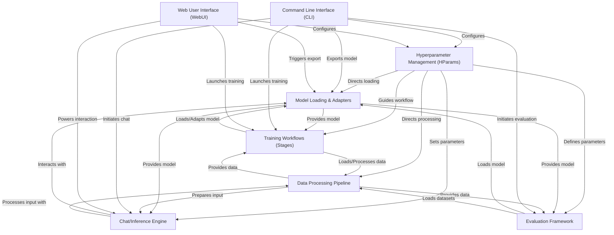

# Tutorial: LLaMA-Factory

LLaMA-Factory is a comprehensive toolkit designed to **simplify** the *efficient fine-tuning* of over 100 large language models. It provides a structured workflow from managing training settings and preparing diverse datasets to running various fine-tuning methods and evaluating model performance. Users can interact with it via a **command-line interface** or a *graphical web interface* for training, inference, and evaluation.

**Source Repository:** [https://github.com/hiyouga/LLaMA-Factory.git](https://github.com/hiyouga/LLaMA-Factory.git)

## Chapters

1. [Command Line Interface (CLI)
](01_command_line_interface__cli__.md)
2. [Web User Interface (WebUI)
](02_web_user_interface__webui__.md)
3. [Hyperparameter Management (HParams)
](03_hyperparameter_management__hparams__.md)
4. [Data Processing Pipeline
](04_data_processing_pipeline_.md)
5. [Model Loading & Adapters
](05_model_loading___adapters_.md)
6. [Training Workflows (Stages)
](06_training_workflows__stages__.md)
7. [Evaluation Framework
](07_evaluation_framework_.md)
8. [Chat/Inference Engine
](08_chat_inference_engine_.md)

---

Built by [Codalytix.com](Codalytix.com)
