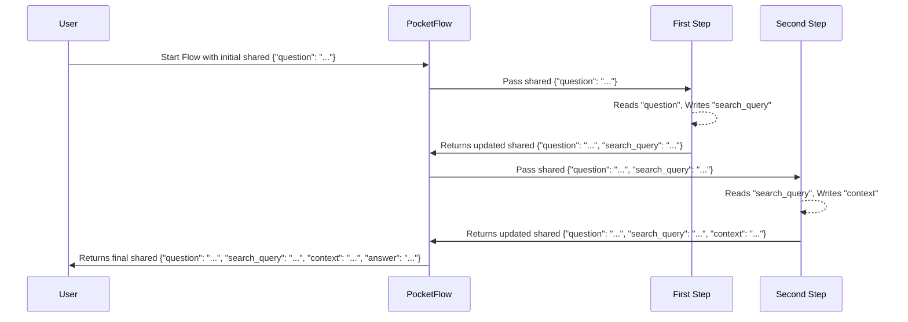

# Chapter 1: Shared State

Welcome to PocketFlow! In this first chapter, we're going to explore a fundamental concept called the "Shared State." Think of it as the central nervous system of your PocketFlow applications.

### Why do we need a "Shared State"?

Imagine you're baking a cake. You have different steps: mixing dry ingredients, mixing wet ingredients, combining them, and then baking. Each step needs information from previous steps (like the amount of flour, or the whisked eggs). How do all these steps share what they've done or what they need?

In programming, especially when building complex workflows, different parts of your program (which we'll call "nodes" in PocketFlow, and you'll learn more about them in [Node (and variants)](02_node__and_variants__.md)) need to communicate and pass data around. For example, if you're building an agent that answers questions:

1.  It first needs to know **the user's question**.
2.  Then, it might decide to **search the web**, so it needs to store the **search query**.
3.  After searching, it gets **search results**, which it needs to remember.
4.  Finally, it uses all this information to **craft an answer**.

How do you pass the original question, then the search query, then the search results, and finally the answer between all these different steps?

PocketFlow solves this with the "Shared State."

### What is the "Shared State"?

The "Shared State" in PocketFlow is simply a **Python dictionary**. That's right, just like the dictionaries you might already know in Python, where you store information using `key: value` pairs.

```python
# A simple Python dictionary
my_data = {
    "name": "Alice",
    "age": 30
}
print(my_data["name"]) # Output: Alice
```

In PocketFlow, this dictionary acts like a **common whiteboard** accessible to all parts of your workflow. Every "node" (a step in your process) can:

*   **Read** information from the whiteboard.
*   **Write** new information onto the whiteboard.
*   **Update** existing information on the whiteboard.

This "whiteboard" is passed along from one step to the next, ensuring that all information, no matter how it was generated, is available to any node at any point in the "Flow" (which we'll cover in [Flow (and variants)](05_flow__and_variants__.md)).

### How is "Shared State" used in a PocketFlow Application?

Let's look at a real-world example from the `pocketflow-a2a` (agent-to-agent) application, which we mentioned earlier as our question-answering agent.

#### 1. Starting the Flow with Initial Data

When your PocketFlow application begins, you usually provide the initial data needed for the first step. This data is put into the `shared` dictionary.

From `cookbook/pocketflow-a2a/main.py`:

```python
# ... (imports and other code) ...

def main():
    # ... (code to get question) ...
    
    # Create the agent flow (more on this later!)
    agent_flow = create_agent_flow()
    
    # Initialize the shared state with our starting question
    shared = {"question": question} # <--- Here's our shared state!
    print(f"🤔 Processing question: {question}")
    
    # Run the flow, passing the shared state
    agent_flow.run(shared) # <--- The flow takes the shared state
    
    # After the flow finishes, we can get the answer from shared
    print("\n🎯 Final Answer:")
    print(shared.get("answer", "No answer found"))

if __name__ == "__main__":
    main()
```

In this code, we create a dictionary `shared` and put the user's `question` into it. Then, this `shared` dictionary is given to the `agent_flow.run()` method. This `shared` dictionary will now travel through all the steps (nodes) of our agent's workflow!

#### 2. Nodes Reading from "Shared State"

Different steps in our agent's workflow need to read information from this `shared` dictionary. For example, our `DecideAction` node needs to know the original question and any previous research (context).

From `cookbook/pocketflow-a2a/nodes.py`:

```python
from pocketflow import Node
# ... (other imports) ...

class DecideAction(Node):
    def prep(self, shared): # <--- The 'shared' dictionary is passed here
        """Prepare the context and question for the decision-making process."""
        # Get the current context (if it exists, otherwise "No previous search")
        context = shared.get("context", "No previous search")
        # Get the question from the shared store
        question = shared["question"] # <--- Reading from shared
        # The return value is passed to the 'exec' method (more on this in Chapter 3!)
        return question, context
    
    # ... (exec and post methods) ...
```

Notice how `shared` is passed into the `prep` method of our `DecideAction` node. Inside, we can easily access `shared["question"]` and `shared.get("context", ...)` to get the information we need.

#### 3. Nodes Writing to "Shared State"

Nodes also need to add new information or update existing information in the `shared` dictionary. For instance, after our `DecideAction` node figures out what to do, it might store a `search_query` if it decides to search the web. Or, the `AnswerQuestion` node will eventually store the `answer`.

From `cookbook/pocketflow-a2a/nodes.py`:

```python
# ... (DecideAction class) ...

class DecideAction(Node):
    # ... (prep and exec methods) ...
    
    def post(self, shared, prep_res, exec_res): # <--- 'shared' is here too!
        """Save the decision and determine the next step in the flow."""
        # If LLM decided to search, save the search query
        if exec_res["action"] == "search":
            shared["search_query"] = exec_res["search_query"] # <--- Writing to shared!
            print(f"🔍 Agent decided to search for: {exec_res['search_query']}")
        else:
            shared["context"] = exec_res["answer"] # <--- Or writing the answer as context
            print(f"💡 Agent decided to answer the question")
        # ... (return action) ...

class SearchWeb(Node):
    # ... (prep and exec methods) ...
    
    def post(self, shared, prep_res, exec_res):
        """Save the search results and go back to the decision node."""
        previous = shared.get("context", "")
        # Add the search results to the context in the shared store
        shared["context"] = previous + "\n\nSEARCH: " + shared["search_query"] + "\nRESULTS: " + exec_res # <--- Updating shared!
        
        print(f"📚 Found information, analyzing results...")
        # ... (return action) ...

class AnswerQuestion(Node):
    # ... (prep and exec methods) ...
    
    def post(self, shared, prep_res, exec_res):
        """Save the final answer and complete the flow."""
        # Save the answer in the shared store
        shared["answer"] = exec_res # <--- Writing the final answer to shared!
        
        print(f"✅ Answer generated successfully")
        # ... (return "done") ...
```

As you can see, the `shared` dictionary is updated throughout the process. `DecideAction` adds `search_query` or updates `context`. `SearchWeb` adds `search_results` to `context`. And finally, `AnswerQuestion` puts the `answer` into `shared`. When the whole "Flow" finishes, `main.py` can simply look into the `shared` dictionary to find the `answer`.

### How "Shared State" Works Internally

You might be wondering, "How does this `shared` dictionary actually get passed around behind the scenes?"

Imagine our "Flow" (which orchestrates all the steps) as a manager. When you start a Flow, you give this manager the `shared` dictionary.

1.  The **manager** (Flow) takes the `shared` dictionary.
2.  It then calls the **first employee** (Node A) and gives them a copy of the `shared` dictionary.
3.  Node A does its work, reading from and writing to its copy of `shared`.
4.  When Node A is done, it returns the *modified* `shared` dictionary back to the manager.
5.  The manager then calls the **next employee** (Node B) and gives *them* the latest version of the `shared` dictionary.
6.  Node B does its work, reading from and writing to `shared`.
7.  This continues until all steps are completed.
8.  Finally, the manager returns the completed `shared` dictionary back to you.

Here's a simplified diagram of how the `shared` state moves through a Flow:



#### The Code Behind the Scenes

This seamless passing of `shared` happens deep inside the PocketFlow library. Let's peek at `pocketflow/__init__.py` (the core of PocketFlow).

Every `Node` in PocketFlow inherits from `BaseNode`. `BaseNode` has a special method called `_run` that handles the execution of a single node. Notice how `shared` is passed to it:

```python
# From pocketflow/__init__.py

class BaseNode:
    # ... (other methods) ...
    
    def _run(self, shared): # <--- 'shared' is the first parameter
        p = self.prep(shared) # Call prep, passing shared
        e = self._exec(p)     # Call internal exec
        return self.post(shared, p, e) # Call post, passing shared
    
    # ... (other methods) ...
```

This `_run` method is responsible for calling the `prep`, `exec`, and `post` methods (which you'll learn about in [Node Lifecycle Methods (prep, exec, post)](03_node_lifecycle_methods__prep__exec__post__.md)) of each node, and it *always* passes the `shared` dictionary along.

The `Flow` class (which manages the sequence of nodes) uses an internal method called `_orch` to orchestrate how nodes are called one after another. This method also handles passing `shared` around:

```python
# From pocketflow/__init__.py

class Flow(BaseNode):
    # ... (constructor and other methods) ...
    
    def _orch(self, shared, params=None): # <--- 'shared' is passed to the orchestrator
        curr = copy.copy(self.start_node) # Start with the first node
        last_action = None
        while curr: # As long as there's a current node
            curr.set_params(p)
            last_action = curr._run(shared) # <--- Call the node's _run method with shared
            # Get the next node based on the action (more on this in Chapter 4!)
            curr = copy.copy(self.get_next_node(curr, last_action))
        return last_action
    
    # ... (other methods) ...
```

The `_orch` method takes the `shared` dictionary and passes it to each `curr._run(shared)` call. This ensures that the same `shared` dictionary (and all the data it contains) is available to every node as the flow progresses.

### Conclusion

The "Shared State" is the unsung hero of PocketFlow. It's a simple Python dictionary that acts as a central communication hub, allowing all parts of your complex workflow to read, write, and update data seamlessly. This mechanism is crucial for maintaining context and ensuring that information flows smoothly through your application, from the initial input to the final output.

Now that you understand *how* data is passed around, let's dive into *who* uses this data: the **Nodes** themselves!

[Next Chapter: Node (and variants)](02_node__and_variants__.md)

---

Generated by [AI Codebase Knowledge Builder](https://github.com/The-Pocket/Tutorial-Codebase-Knowledge)