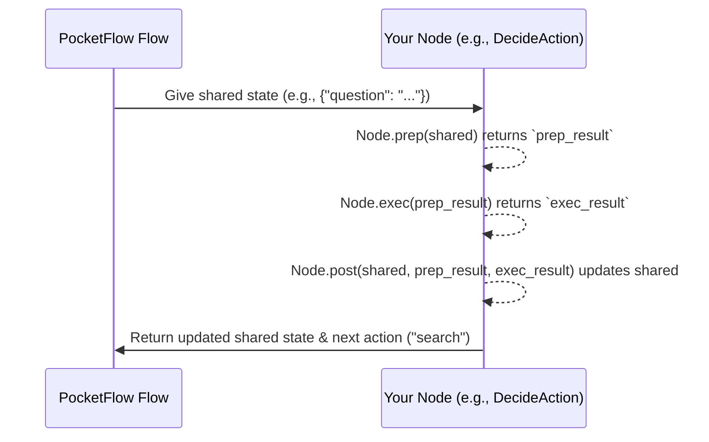

# Chapter 2: Node (and variants)

Welcome back! In [Chapter 1: Shared State](01_shared_state_.md), we learned that the "Shared State" is like a central whiteboard where all parts of your PocketFlow application can read and write data. But who are these "parts" that actually do the reading and writing? That's where **Nodes** come in!

### What Problem Do Nodes Solve?

Imagine you have a complex task, like building that question-answering agent we talked about. This big task isn't just one giant step; it's a sequence of smaller, specific steps:

1.  **Decide** what to do (search or answer).
2.  **Search** the web (if needed).
3.  **Answer** the question.

If we just had one massive piece of code trying to do everything, it would be messy, hard to understand, and even harder to change or reuse parts of it.

PocketFlow solves this by letting you break down your big task into these small, manageable pieces called **Nodes**. Think of a Node as a single, focused step in a recipe. Each Node does one specific job, like "chopping vegetables" or "baking the cake." It receives ingredients (input, often from the Shared State), performs its task, and produces a result (which it might write back to the Shared State).

### What is a Node?

At its core, a **Node** is the smallest unit of work in PocketFlow. You define a Node by creating a Python class that inherits from `pocketflow.Node`.

Each Node is designed to:
*   **Receive information:** It takes the current `shared` state (our central whiteboard) as input.
*   **Do its job:** It performs a specific task.
*   **Produce results:** It can modify the `shared` state or return a specific "action" to guide the next steps.

Let's look at a very simplified Node from our agent example. Don't worry about `prep`, `exec`, and `post` methods too much now; we'll cover them in detail in [Chapter 3: Node Lifecycle Methods (prep, exec, post)](03_node_lifecycle_methods__prep__exec__post__.md). For now, just focus on the idea that a Node does one job.

```python
from pocketflow import Node

class DecideAction(Node):
    def exec(self, inputs):
        """This method is where the main work of the node happens."""
        # In a real scenario, an LLM would decide if we need to 'search' or 'answer'.
        # For now, let's just pretend it always decides to search.
        print("🤔 Agent deciding what to do next...")
        return {"action": "search", "search_query": "PocketFlow tutorial"}

    # We'll learn about prep and post methods in the next chapter!
```

This `DecideAction` Node's job is simply to figure out the next step. It performs some internal logic (in the `exec` method) and returns a decision.

### Variants of Node

PocketFlow offers different types of Nodes to handle various situations:

#### 1. `AsyncNode`: For Tasks That Wait (Asynchronous)

Imagine a step in your recipe where you need to wait for something, like fetching data from the internet or waiting for a long-running process to finish. If your program just stops and waits, everything else grinds to a halt!

`AsyncNode` is designed for these kinds of tasks. It allows your PocketFlow application to "start" a long task, then potentially do other things (if your overall [Flow (and variants)](05_flow__and_variants__.md) allows it, which we'll cover later) instead of just sitting idle. When the long task is ready, the `AsyncNode` continues.

Think of it like putting water on to boil for pasta while you start chopping vegetables. You don't just stand there staring at the pot; you do something else in parallel.

You define an `AsyncNode` by inheriting from `pocketflow.AsyncNode` and using `async`/`await` keywords in its methods.

```python
import asyncio # Needed for async operations
from pocketflow import AsyncNode

class FetchRecipes(AsyncNode):
    async def exec_async(self, ingredient):
        """Fetches recipes from a (simulated) slow internet source."""
        print(f"🌐 Fetching recipes for '{ingredient}'... (this might take a moment)")
        # Simulate a network request that takes 2 seconds
        await asyncio.sleep(2)
        print(f"✅ Recipes for '{ingredient}' fetched!")
        return ["Pizza", "Pasta"] # Example recipes

    # AsyncNodes use prep_async, exec_async, post_async.
    # We'll cover these more in Chapter 3.
```
Notice the `async` keyword before `def` and `await` before `asyncio.sleep()`. This tells Python that this function can pause its execution without blocking the entire program, allowing other `async` tasks (if any) to run.

#### 2. `BatchNode`: For Processing Many Items Together

What if a single step needs to process a *list* of things? For example, reading a huge CSV file and processing it in smaller chunks, or performing the same operation on multiple items.

`BatchNode` is perfect for this. It takes a collection of items (a "batch"), applies its core logic (`exec` method) to *each individual item* in that batch, and then collects all the results for a final summary step (`post` method).

Imagine baking cookies:
*   You prepare all the dough (this is `prep` in a BatchNode, yielding each cookie).
*   You bake each cookie one by one (this is `exec` running for *each cookie*).
*   Then, you gather all the baked cookies and put them on a cooling rack (this is `post`, receiving all the results from `exec`).

```python
from pocketflow import BatchNode

class ProcessNumbers(BatchNode):
    def prep(self, shared):
        """Provides the list of items to process."""
        print("📋 Preparing a batch of numbers to process...")
        return [10, 20, 30] # This is our batch of items

    def exec(self, number):
        """Processes a single number from the batch."""
        print(f"🔢 Processing individual number: {number}")
        return number * 2 # Double each number

    def post(self, shared, prep_res, exec_res_list):
        """Combines results from all processed items."""
        # exec_res_list will contain [20, 40, 60]
        total_sum = sum(exec_res_list)
        shared["total_processed_sum"] = total_sum
        print(f"📊 Sum of all processed results: {total_sum}")
        return "done" # Signifies we're finished with this node's work
```
In `BatchNode`, the `prep` method is expected to return a collection of items. The `exec` method is then called for *each item* in that collection. Finally, the `post` method receives a *list* of all the results from those individual `exec` calls.

### How to Use Nodes (A Simple Demo)

While Nodes are typically connected within a [Flow (and variants)](05_flow__and_variants__.md), you can run a single Node directly for demonstration purposes to see how it interacts with the `shared` state.

```python
from pocketflow import Node

class CapitalizeName(Node):
    def prep(self, shared):
        """Get the name from the shared state."""
        return shared.get("user_name", "world") # Default to "world" if no name

    def exec(self, name):
        """Capitalize the name."""
        return name.upper()

    def post(self, shared, prep_res, exec_res):
        """Store the capitalized name back to shared state."""
        shared["capitalized_name"] = exec_res
        print(f"Transformed '{prep_res}' to '{exec_res}'")
        return "finished"

# Let's see our Node in action!
initial_data = {"user_name": "alice"}
print(f"Shared state BEFORE node: {initial_data}")

my_node = CapitalizeName()
# We use my_node._run() here for direct demonstration.
# Usually, a Flow will call this method for you.
my_node._run(initial_data)

print(f"Shared state AFTER node: {initial_data}")
```

**Expected Output:**
```
Shared state BEFORE node: {'user_name': 'alice'}
Transformed 'alice' to 'ALICE'
Shared state AFTER node: {'user_name': 'alice', 'capitalized_name': 'ALICE'}
```

As you can see, the `CapitalizeName` node successfully read "alice" from `shared`, processed it, and then wrote "ALICE" back into `shared` under a new key.

### How Nodes Work Internally

So, how does PocketFlow actually make these Nodes do their job and pass the `shared` state around?

#### The Steps a Node Takes

When a [Flow (and variants)](05_flow__and_variants__.md) (our "manager" from Chapter 1) tells a Node to run, here's a simplified sequence of what happens:

1.  The **Flow** provides the current `shared` dictionary to the Node.
2.  The **Node** first calls its `prep` method, giving it the `shared` dictionary. `prep` does any initial setup and returns data needed for the main task.
3.  Next, the **Node** calls its `exec` method, passing it the result from `prep`. This is where the Node's core work happens.
4.  Finally, the **Node** calls its `post` method, giving it the `shared` dictionary again, along with the results from `prep` and `exec`. `post` is typically where the Node updates the `shared` dictionary and returns an "action" string to tell the Flow what to do next.
5.  The **Node** then returns control (and the updated `shared` dictionary) back to the **Flow**.

Here's a simple diagram to visualize this:



#### A Peek Under the Hood

Let's look at the actual (simplified) code in `pocketflow/__init__.py` that makes this happen.

All Nodes in PocketFlow inherit from `BaseNode`. `BaseNode` has a crucial method called `_run` that orchestrates the `prep`, `exec`, and `post` calls:

```python
# From pocketflow/__init__.py (simplified)
class BaseNode:
    # ... (other methods) ...
    
    def _run(self, shared): # This is the main entry point for a node's execution
        # 1. Call the 'prep' method, passing the shared state
        p = self.prep(shared) 
        
        # 2. Call the internal '_exec' method, passing the result from prep
        e = self._exec(p)     
        
        # 3. Call the 'post' method, passing shared, prep_res, and exec_res
        return self.post(shared, p, e) 
    
    # ... (other methods) ...
```

This `_run` method ensures that your `prep`, `exec`, and `post` methods are called in the correct order and receive the necessary data, including the `shared` state.

Now, let's see how `_exec` behaves differently for different Node types:

*   **`Node`'s `_exec`**: The standard `Node` wraps your `exec` method with retry logic (which we won't dive into here, but it's good to know!).
    ```python
    # From pocketflow/__init__.py (simplified)
    class Node(BaseNode):
        # ... (constructor and other methods) ...
        def _exec(self, prep_res):
            # This method can handle retries or other logic before calling your 'exec'
            return self.exec(prep_res) # Ultimately calls your custom exec method
    ```

*   **`BatchNode`'s `_exec`**: This is where the magic for batch processing happens. Instead of calling `exec` once, it calls `_exec` (which in turn calls your `exec` for a single item) for *each item* in the batch:
    ```python
    # From pocketflow/__init__.py (simplified)
    class BatchNode(Node):
        def _exec(self, items):
            # For each item in the batch, call the parent Node's _exec method.
            # This means your 'exec' method will be run for each individual item.
            return [super(BatchNode, self)._exec(i) for i in (items or [])]
    ```

*   **`AsyncNode`'s `_run_async` and `_exec`**: These methods are designed to be `await`-able, allowing them to pause and resume. Notice they call `async` versions of `prep`, `exec`, and `post`.
    ```python
    # From pocketflow/__init__.py (simplified)
    class AsyncNode(Node):
        # ... (async prep, exec, post methods) ...
        
        async def _exec(self, prep_res): 
            # This awaits your exec_async method
            return await self.exec_async(prep_res)
            
        async def _run_async(self, shared): 
            # This is the async entry point for an AsyncNode
            p = await self.prep_async(shared) # Await prep
            e = await self._exec(p)           # Await exec
            return await self.post_async(shared, p, e) # Await post
    ```

These internal details show how PocketFlow handles the differences between regular, batch, and asynchronous operations, providing a consistent way for you to define your workflow steps.

### Conclusion

Nodes are the fundamental building blocks of any PocketFlow application. They encapsulate specific units of work, interacting with the Shared State to get inputs and provide outputs. By understanding `Node`, `AsyncNode`, and `BatchNode`, you're equipped to break down complex problems into manageable, reusable steps.

Now that you know what Nodes are, let's dive deeper into *how* you actually define the work a Node does by exploring its lifecycle methods: `prep`, `exec`, and `post`.

[Next Chapter: Node Lifecycle Methods (prep, exec, post)](03_node_lifecycle_methods__prep__exec__post__.md)

---

Generated by [AI Codebase Knowledge Builder](https://github.com/The-Pocket/Tutorial-Codebase-Knowledge)