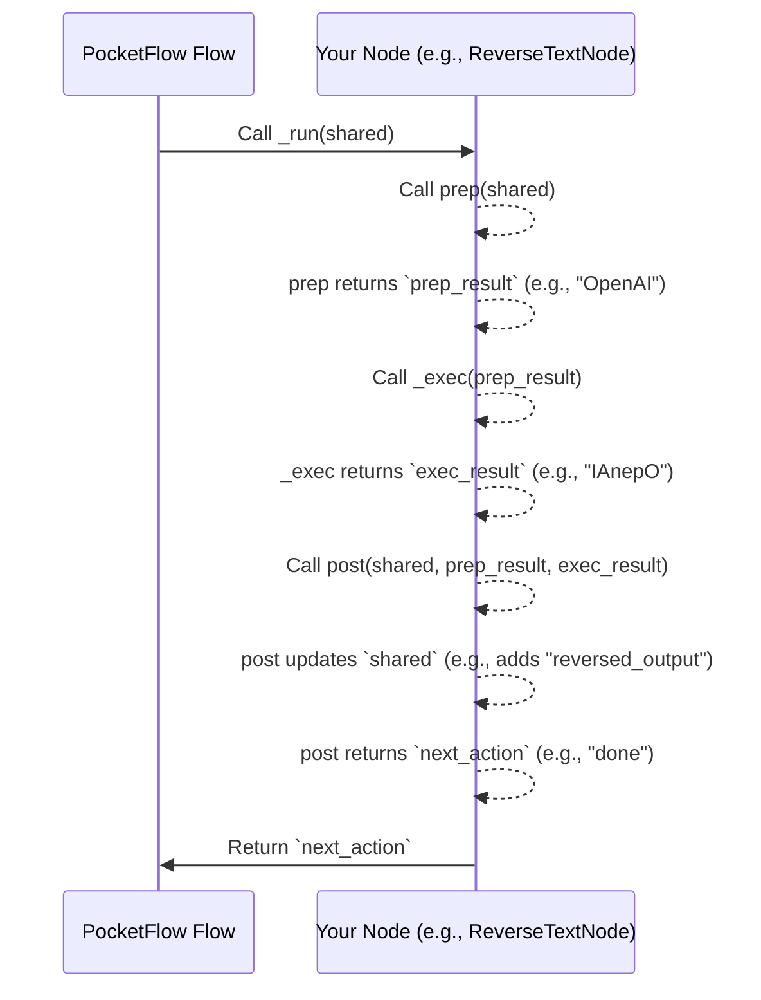

# Chapter 3: Node Lifecycle Methods (prep, exec, post)

Welcome back! In [Chapter 2: Node (and variants)](02_node__and_variants__.md), we learned that **Nodes** are the building blocks of your PocketFlow application, each designed to perform a specific task. We saw that they interact with the [Shared State](01_shared_state_.md) to get information and store results.

But how exactly does a Node perform its job? What steps does it take from receiving its initial inputs to producing its final outputs? This is where the **Node Lifecycle Methods** come in: `prep`, `exec`, and `post`.

### Why Do Nodes Have a Lifecycle?

Imagine you're making a simple cup of coffee:

1.  **Gather ingredients and tools**: You need coffee beans, water, a mug, and a coffee maker. (This is like `prep`)
2.  **Brew the coffee**: You put the beans and water into the machine and press the button. (This is like `exec`)
3.  **Pour, add milk/sugar, clean up**: You pour the coffee into your mug, add your favorite additions, and clean the machine. You also decide if you need another cup! (This is like `post`)

Just like making coffee, most tasks, even small ones, have these three distinct phases: preparation, the main work, and then handling the results and deciding what to do next. PocketFlow's Nodes are designed with this in mind, making your code cleaner, more organized, and easier to understand.

Each **Node** in PocketFlow follows this three-stage lifecycle, like a miniature workflow within itself:

*   **`prep`**: "Preparation"
*   **`exec`**: "Execution"
*   **`post`**: "Post-processing"

Let's break down each stage.

### The Three Stages of a Node's Life

#### 1. `prep`: The Preparation Stage

The `prep` method (short for "preparation") is where your Node gets ready to do its main job. Think of it as collecting all the "ingredients" or necessary information for the next step.

*   **What it does**: Gathers and pre-processes inputs. It typically reads information from the `shared` state.
*   **What it receives**: The current `shared` dictionary (our central whiteboard).
*   **What it returns**: Whatever data the `exec` method will need. This could be a single value, a tuple, or a dictionary. If `exec` doesn't need anything specific, `prep` can return `None` or just let `pass` be called implicitly.

**Analogy**: Collecting all your ingredients (flour, sugar, eggs) and tools (bowl, whisk) before you start baking.

**Example from `pocketflow-a2a`**:
The `DecideAction` node needs the user's `question` and any `context` (previous research) to decide what to do.

```python
from pocketflow import Node

class DecideAction(Node):
    def prep(self, shared):
        """Prepare the context and question for the decision-making process."""
        context = shared.get("context", "No previous search") # Get context
        question = shared["question"] # Get question
        # Return both as a tuple for the 'exec' method
        return question, context 
    # ... (exec and post methods will go here) ...
```
In this `prep` method, `DecideAction` retrieves the `question` and `context` from the `shared` dictionary. These two pieces of information are then returned as a tuple, which will be passed directly to the `exec` method.

#### 2. `exec`: The Execution Stage

The `exec` method (short for "execution") is the heart of your Node. This is where the main, heavy-lifting task of the Node happens.

*   **What it does**: Performs the core task of the node, such as calling an LLM, running a calculation, or processing data.
*   **What it receives**: The exact data that was returned by the `prep` method.
*   **What it returns**: The direct result of its core task. This result will then be passed to the `post` method.

**Analogy**: The actual baking process in the oven.

**Example from `pocketflow-a2a` (continued)**:
The `DecideAction` node's `exec` method takes the `question` and `context` from `prep` and uses them to ask an LLM what action to take (search or answer).

```python
# ... (DecideAction class, continued from above) ...
import yaml
from utils import call_llm # Assuming a utility for LLM calls

class DecideAction(Node):
    # ... (prep method) ...
        
    def exec(self, inputs): # 'inputs' here will be (question, context) from prep
        """Call the LLM to decide whether to search or answer."""
        question, context = inputs # Unpack the tuple from prep
        
        print(f"🤔 Agent deciding what to do next...")
        
        # This is where we'd build a prompt and call an LLM.
        # We'll simulate a simple decision for now:
        if "weather" in question.lower():
            decision = {"action": "search", "search_query": "current weather"}
        else:
            decision = {"action": "answer", "answer": "I don't know yet."}
        
        return decision # Return the decision for the 'post' method
    # ... (post method will go here) ...
```
Here, `exec` receives the `question` and `context` prepared by `prep`. It then simulates calling an LLM to decide on an action and returns that decision.

#### 3. `post`: The Post-processing Stage

The `post` method is the final stage. This is where your Node handles the results, updates the [Shared State](01_shared_state_.md) with new information, and critically, determines the *next step* in the overall "Flow."

*   **What it does**: Handles the results from `exec`, updates the `shared` state, and determines the next node in the overall [Flow (and variants)](05_flow__and_variants__.md).
*   **What it receives**:
    *   The current `shared` dictionary (so it can update it).
    *   The result from `prep` (`prep_res`).
    *   The result from `exec` (`exec_res`).
*   **What it returns**: A string (or `None`). This string is called an "action" and tells the [Flow (and variants)](05_flow__and_variants__.md) which Node to run next. If you return `"done"`, it signals the flow to stop.

**Analogy**: Plating the cooked food, adding garnishes, serving it, cleaning up, and deciding if you need to prepare the next course.

**Example from `pocketflow-a2a` (continued)**:
The `DecideAction` node's `post` method takes the LLM's decision from `exec`, updates the `shared` state, and tells the [Flow (and variants)](05_flow__and_variants__.md) what to do next (`"search"` or `"answer"`).

```python
# ... (DecideAction class, continued from above) ...

class DecideAction(Node):
    # ... (prep and exec methods) ...
    
    def post(self, shared, prep_res, exec_res):
        """Save the decision and determine the next step in the flow."""
        # Check the action returned by exec
        if exec_res["action"] == "search":
            shared["search_query"] = exec_res["search_query"] # Write to shared!
            print(f"🔍 Agent decided to search for: {exec_res['search_query']}")
            return "search" # Tell the Flow to go to the "search" node
        else:
            shared["context"] = exec_res["answer"] # Write the answer as context
            print(f"💡 Agent decided to answer the question")
            return "answer" # Tell the Flow to go to the "answer" node
```
Here, `post` updates `shared` based on the `exec_res` (the LLM's decision). Crucially, it returns `"search"` or `"answer"`. These strings are signals that the [Flow (and variants)](05_flow__and_variants__.md) uses to decide which Node to run next.

### Putting it all Together: A Simple Node Example

Let's see a complete, simple example of a Node using all three lifecycle methods. We'll create a `ReverseTextNode` that takes text, reverses it, and stores the result.

```python
from pocketflow import Node

class ReverseTextNode(Node):
    def prep(self, shared):
        """1. Get the text from the shared state."""
        original_text = shared.get("user_input", "Hello PocketFlow!")
        print(f"📖 Prep: Getting '{original_text}' from shared state.")
        return original_text # Pass this to exec

    def exec(self, text_to_reverse):
        """2. Reverse the text."""
        reversed_text = text_to_reverse[::-1] # Python trick to reverse string
        print(f"🔄 Exec: Reversing text. Result: '{reversed_text}'")
        return reversed_text # Pass this to post

    def post(self, shared, original_text_from_prep, reversed_text_from_exec):
        """3. Store the reversed text and signal 'done'."""
        shared["reversed_output"] = reversed_text_from_exec # Update shared state
        print(f"✅ Post: Stored '{reversed_text_from_exec}' in shared state.")
        print(f"Original from prep: '{original_text_from_prep}' (not used here, but available!)")
        return "done" # Signal to Flow that we are done
```

Now, let's run this simple node and see how the `shared` state changes:

```python
# Demo: Running the ReverseTextNode
initial_shared = {"user_input": "OpenAI"}
print(f"Shared BEFORE node: {initial_shared}\n")

my_node = ReverseTextNode()
# We use my_node._run() for direct demo; a Flow calls this for you normally.
my_node._run(initial_shared)

print(f"\nShared AFTER node: {initial_shared}")
```

**Expected Output:**
```
Shared BEFORE node: {'user_input': 'OpenAI'}

📖 Prep: Getting 'OpenAI' from shared state.
🔄 Exec: Reversing text. Result: 'IAnepO'
✅ Post: Stored 'IAnepO' in shared state.
Original from prep: 'OpenAI' (not used here, but available!)

Shared AFTER node: {'user_input': 'OpenAI', 'reversed_output': 'IAnepO'}
```

As you can see, `prep` read "OpenAI", `exec` reversed it to "IAnepO", and `post` stored "IAnepO" back into `shared`.

### How Node Lifecycle Works Internally

You might remember from [Chapter 2: Node (and variants)](02_node__and_variants__.md) that a special `_run` method within PocketFlow is responsible for calling your `prep`, `exec`, and `post` methods. Let's visualize this process again:



This diagram shows how PocketFlow orchestrates the calling of your three lifecycle methods, passing the necessary `shared` state and intermediate results (`prep_result`, `exec_result`) between them.

#### A Peek Under the Hood

The magic happens in the `BaseNode` class in `pocketflow/__init__.py`. This is the fundamental blueprint for all Nodes.

```python
# From pocketflow/__init__.py (simplified for clarity)

class BaseNode:
    # ... (other methods like __init__, set_params, next) ...
    
    def prep(self,shared): pass # Your custom prep method overrides this
    def exec(self,prep_res): pass # Your custom exec method overrides this
    def post(self,shared,prep_res,exec_res): pass # Your custom post method overrides this
    
    def _exec(self,prep_res): 
        # This internal method usually just calls your 'exec'
        # unless it's a special node like BatchNode or AsyncNode.
        return self.exec(prep_res)
        
    def _run(self,shared): 
        # This is the core orchestrator for a single node
        p = self.prep(shared) # Step 1: Call prep, get prep_result (p)
        e = self._exec(p)     # Step 2: Call internal _exec, get exec_result (e)
        return self.post(shared,p,e) # Step 3: Call post, passing shared and results
        
    # ... (other methods) ...
```

When you define your `ReverseTextNode`, you're effectively overriding the empty `prep`, `exec`, and `post` methods provided by `BaseNode`. The `_run` method ensures that your custom logic for each stage is called in the correct sequence, with the correct inputs.

For `AsyncNode` (which you saw in [Chapter 2: Node (and variants)](02_node__and_variants__.md)), the lifecycle methods are `prep_async`, `exec_async`, and `post_async`, and they are `await`-ed internally by `_run_async`. For `BatchNode`, the `_exec` method (which wraps your `exec`) is called multiple times, once for each item in the batch. But the fundamental `prep` -> `exec` -> `post` flow remains consistent.

### Conclusion

Understanding the `prep`, `exec`, and `post` lifecycle methods is key to building effective PocketFlow applications. They provide a clear, structured way to define each step of your workflow: gathering inputs, performing the main task, and then handling results while setting up the next step. This design helps keep your code organized, reusable, and easy to debug.

Now that you know what Nodes are and how their individual lifecycle methods work, let's learn how to connect these Nodes together to form a coherent sequence, guiding your workflow from one step to the next!

[Next Chapter: Node Transitions (>>, -)](04_node_transitions_________.md)

---

Generated by [AI Codebase Knowledge Builder](https://github.com/The-Pocket/Tutorial-Codebase-Knowledge)