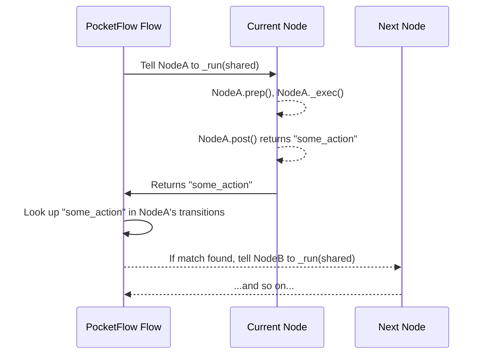

# Chapter 4: Node Transitions (>>, -)

Welcome back! In [Chapter 3: Node Lifecycle Methods (prep, exec, post)](03_node_lifecycle_methods__prep__exec__post__.md), we explored how a single **Node** performs its work by going through `prep`, `exec`, and `post` stages. Each `post` method, you might remember, can return a string, an "action."

But what happens *after* a Node finishes its job and returns an action? How does PocketFlow know which Node to run *next*? This is where **Node Transitions** come in!

### What Problem Do Node Transitions Solve?

Imagine our question-answering agent again. It's not just one step; it's a series of interconnected steps:

1.  **`DecideAction`**: Figures out if it needs to search or answer.
2.  **`SearchWeb`**: If a search is needed, this node goes to the internet.
3.  **`AnswerQuestion`**: If it's ready, this node crafts the final answer.

These steps don't just happen randomly. They follow a specific order, often with choices along the way. For example:

*   After `DecideAction`, if it decides to "search", we want to go to `SearchWeb`.
*   But if it decides to "answer", we want to go to `AnswerQuestion`.
*   And after `SearchWeb` finishes, we might want to go *back* to `DecideAction` to re-evaluate!

Node Transitions in PocketFlow are like drawing arrows on a flowchart, telling your application exactly how the "flow" of execution should move from one Node to the next.

### What are Node Transitions?

Node transitions are the "paths" or "arrows" that connect your Nodes, defining the sequence and branching logic of your workflow. PocketFlow provides two main ways to create these transitions using special Python operators:

1.  **Default Transition (`>>`)**: "Just go to the next one."
2.  **Conditional Transition (`- "action" >>`)**: "Go to a specific one, based on a decision."

Let's explore each.

#### 1. Default Transition: `node_a >> node_b`

This is the simplest type of transition. It means: "After `node_a` completes, the flow automatically moves to `node_b`."

*   **How it works**: When `node_a` finishes its `post` method and doesn't explicitly return any action string (or returns `None`), PocketFlow assumes a "default" action. This transition then routes the flow to `node_b`.
*   **Analogy**: Imagine a straight train track. After your train leaves one station, it automatically goes to the very next station on that track.

**Example:**
Let's create two simple nodes, `StartNode` and `EndNode`. `StartNode` just prints a message and finishes.

```python
from pocketflow import Node, Flow

class StartNode(Node):
    def post(self, shared, prep_res, exec_res):
        print("Hello from StartNode!")
        # We don't return anything, so it's implicitly "default"
        # Or you could explicitly 'return "default"'
        return None # Same as returning "default" or nothing at all

class EndNode(Node):
    def post(self, shared, prep_res, exec_res):
        print("Goodbye from EndNode!")
        return "done" # Signal to Flow to stop

# Connect them using the default transition:
start_node = StartNode()
end_node = EndNode()

start_node >> end_node # <-- This is the default transition!

my_flow = Flow(start=start_node) # Define the start of the flow
# To run, you'd typically call my_flow.run({})
# Output:
# Hello from StartNode!
# Goodbye from EndNode!
```
When `start_node` finishes, because we connected it with `>>`, the flow automatically moves to `end_node`.

#### 2. Conditional Transition: `node_a - "action" >> node_b`

This transition is for when a Node makes a decision and needs to guide the flow to different paths.

*   **How it works**:
    1.  `node_a`'s `post` method (from [Chapter 3: Node Lifecycle Methods (prep, exec, post)](03_node_lifecycle_methods__prep__exec__post__.md)) returns a specific *string* (e.g., `"search"`, `"answer"`, `"retry"`).
    2.  If this returned string matches the `"action"` specified in the transition (e.g., `"search"`), then the flow moves to `node_b`.
    3.  If `node_a` returns an action that *doesn't* match any of its defined conditional transitions, the flow will **terminate**. This is important! Your flow needs a path for every action it might return.
*   **Analogy**: You're at a train station. The conductor announces, "Train for 'Express' services on Track 1, 'Local' services on Track 2." You choose your track based on the "action" (service type). If no train matches your desired service, you're stuck at the station!

**Example from `pocketflow-a2a`:**
Remember our `DecideAction` node? Its `post` method returns either `"search"` or `"answer"`. We use conditional transitions to route the flow based on this:

```python
# Simplified from cookbook/pocketflow-a2a/nodes.py
from pocketflow import Node

class DecideAction(Node):
    # ... prep and exec methods ...
    
    def post(self, shared, prep_res, exec_res):
        # exec_res contains the decision (e.g., {"action": "search", "search_query": "..."})
        if exec_res["action"] == "search":
            shared["search_query"] = exec_res["search_query"]
            print(f"Agent decided to search for: {exec_res['search_query']}")
            return "search" # <-- This action string is crucial!
        else: # Assumed to be "answer"
            shared["context"] = exec_res["answer"]
            print(f"Agent decided to answer the question")
            return "answer" # <-- This action string is crucial!

class SearchWeb(Node):
    def post(self, shared, prep_res, exec_res):
        print("Search results processed.")
        # After searching, we might want to go back to DecideAction
        return "decide" # <-- New action to loop back!

class AnswerQuestion(Node):
    def post(self, shared, prep_res, exec_res):
        print("Answer generated.")
        return "done" # <-- Signal to stop the flow
```

Now, let's see how these Nodes are connected in `cookbook/pocketflow-a2a/flow.py` using conditional transitions:

```python
# Simplified from cookbook/pocketflow-a2a/flow.py
from pocketflow import Flow
# Assume DecideAction, SearchWeb, AnswerQuestion are defined as above

# Create instances of each node
decide = DecideAction()
search = SearchWeb()
answer = AnswerQuestion()

# Connect the nodes using conditional transitions:
# If DecideAction returns "search", go to SearchWeb
decide - "search" >> search 

# If DecideAction returns "answer", go to AnswerQuestion
decide - "answer" >> answer

# After SearchWeb completes and returns "decide", go back to DecideAction
search - "decide" >> decide

my_flow = Flow(start=decide) # The flow starts at DecideAction
```

In this setup:
*   If `decide.post` returns `"search"`, the flow goes to `search`.
*   If `decide.post` returns `"answer"`, the flow goes to `answer`.
*   If `search.post` returns `"decide"`, the flow loops back to `decide`.

This demonstrates how `post` methods provide the *signals*, and transitions provide the *wiring* that guides your workflow through different paths.

### How Node Transitions Work Internally

So, how does PocketFlow magically connect these nodes using `>>` and `- "action" >>`? It all happens within the `BaseNode` and `Flow` classes.

#### The Orchestration Steps

When a [Flow (and variants)](05_flow__and_variants__.md) is running and a Node finishes its `_run` method (which internally calls your `prep`, `exec`, and `post`), here's what happens behind the scenes:

1.  The **Current Node** finishes its `post` method and returns an `action` string (e.g., "search", "answer", or `None` for "default").
2.  The **Flow** (our "manager") receives this `action` string.
3.  The **Flow** looks at the `Current Node`'s "transition map" (a dictionary it built when you defined `>>` and `- "action" >>`).
4.  The **Flow** uses the `action` string as a "key" to find the "next Node" in that map.
5.  If a match is found, the **Flow** then proceeds to run that `Next Node`.
6.  If no match is found for the given `action`, the **Flow** stops.

Here's a simplified sequence diagram:



#### A Peek Under the Hood

Let's look at the actual (simplified) code in `pocketflow/__init__.py` to see how these connections are made and used.

**1. Connecting Nodes (`>>` and `- "action" >>`)**

Python allows classes to define special methods for operators like `>>` (right shift) and `-` (subtraction). PocketFlow uses these "magic methods" to make connecting nodes feel natural.

*   **`__rshift__` (for `>>`)**: This method is called when you use `node_a >> node_b`.
    ```python
    # From pocketflow/__init__.py (BaseNode)
    class BaseNode:
        # ... other methods ...
        def __rshift__(self, other):
            # This is called for `self >> other` (e.g., node_a >> node_b)
            # It stores 'other' as the default successor for 'self'.
            return self.next(other) # Calls self.next(other, "default")
    ```
    The `self.next(other)` method (explained below) stores `other` as the node to go to by default.

*   **`__sub__` (for `-`)**: This method is called when you use `node_a - "action"`.
    ```python
    # From pocketflow/__init__.py (BaseNode)
    class BaseNode:
        # ... other methods ...
        def __sub__(self, action):
            # This is called for `self - action` (e.g., node_a - "search")
            # It returns a special temporary object that waits for the `>>`
            if isinstance(action, str):
                return _ConditionalTransition(self, action) # Creates a helper object
            raise TypeError("Action must be a string")
    ```
    This `__sub__` method doesn't connect the node immediately. Instead, it creates a small helper object called `_ConditionalTransition`. This helper object stores the `src` node (the one before `-`) and the `action` string.

*   **`_ConditionalTransition.__rshift__` (completing `- "action" >>`)**: When you then add `>> node_b` to the helper object (e.g., `_ConditionalTransition("search") >> node_b`), this method is called.
    ```python
    # From pocketflow/__init__.py (_ConditionalTransition)
    class _ConditionalTransition:
        def __init__(self, src, action):
            self.src, self.action = src, action
        
        def __rshift__(self, tgt):
            # This is called for `_ConditionalTransition_object >> tgt` (e.g., search_obj >> node_b)
            # It connects the original source node (src) to the target node (tgt)
            # using the action string.
            return self.src.next(tgt, self.action)
    ```
    Finally, this method calls the `next` method on the original source node (`self.src`), passing both the `tgt` node and the `action` string.

*   **`BaseNode.next(node, action="default")` (The actual connection logic)**: Both `>>` and `- "action" >>` ultimately call this core method to store the connections.
    ```python
    # From pocketflow/__init__.py (BaseNode)
    class BaseNode:
        # ... other methods ...
        def next(self, node, action="default"):
            # 'successors' is a dictionary: { "action_string": next_node_instance }
            # This is where the mapping is stored!
            if action in self.successors:
                warnings.warn(f"Overwriting successor for action '{action}'")
            self.successors[action] = node
            return node # Returns the 'node' just for chaining convenience
    ```
    Each `BaseNode` has a dictionary called `self.successors`. This dictionary stores which node to go to for each possible `action` string. So, `decide - "search" >> search` basically means: "For `decide` node, if the action is 'search', the next node is `search`."

**2. Finding the Next Node (`Flow.get_next_node`)**

When a node finishes its `_run` method, the `Flow` needs to figure out which node to execute next.

```python
# From pocketflow/__init__.py (Flow)
class Flow(BaseNode):
    # ... other methods ...
    def get_next_node(self, curr, action):
        # 'curr' is the node that just finished (e.g., decide)
        # 'action' is the string it returned (e.g., "search" or "answer")
        
        # Look up the next node in the 'curr' node's successors dictionary
        nxt = curr.successors.get(action or "default") # If action is None, default to "default"
        
        if not nxt and curr.successors:
            warnings.warn(f"Flow ends: '{action}' not found in {list(curr.successors)}")
        return nxt
    
    def _orch(self, shared, params=None):
        # ... (simplified from Chapter 1) ...
        curr = copy.copy(self.start_node) 
        last_action = None
        while curr: # As long as there's a current node
            # ... run the current node ...
            last_action = curr._run(shared) # <--- Node returns action here!
            
            # Get the next node based on the action
            curr = copy.copy(self.get_next_node(curr, last_action)) # <--- Here it uses get_next_node!
        return last_action
```
The `Flow`'s `_orch` method repeatedly calls `get_next_node` to determine the `curr` node for the next iteration of the `while` loop, effectively moving the execution through your defined workflow paths.

### Conclusion

Node Transitions (`>>` and `- "action" >>`) are powerful tools in PocketFlow that allow you to define the sequence and branching logic of your application. They transform a collection of individual Nodes into a coherent, dynamic workflow, allowing your application to react to decisions made by its various steps. By understanding how to connect Nodes, you can build complex processes that adapt and flow based on real-time outcomes.

Now that you know how to create individual Nodes and connect them, it's time to put it all together into the main orchestrator: the **Flow** itself!

[Next Chapter: Flow (and variants)](05_flow__and_variants__.md)

---

Generated by [AI Codebase Knowledge Builder](https://github.com/The-Pocket/Tutorial-Codebase-Knowledge)