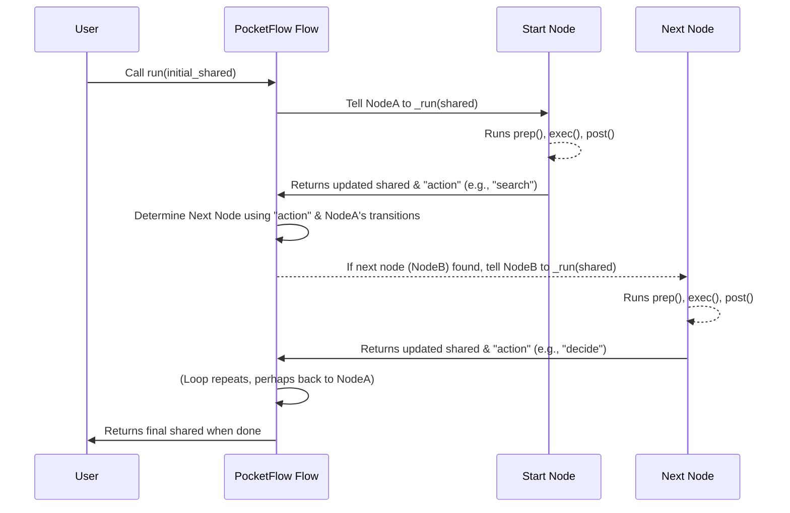

# Chapter 5: Flow (and variants)

Welcome back! In [Chapter 4: Node Transitions (>>, -)](04_node_transitions_________.md), we learned how to connect individual [Nodes](02_node__and_variants__.md) using `>>` for default paths and `- "action" >>` for conditional branching. These transitions are like drawing the lines on a map, telling your workflow where to go next.

But who reads the map? Who actually starts the journey and makes sure each [Node](02_node__and_variants__.md) is executed in the correct order, following those transitions? That's the job of the **Flow**!

### What Problem Do Flows Solve?

Imagine you have a detailed recipe (your collection of [Nodes](02_node__and_variants__.md) and their [Transitions](04_node_transitions_________.md)). The recipe tells you: "First, chop vegetables. Then, sauté them. If they're soft, add sauce; otherwise, keep sautéing."

But the recipe doesn't cook itself! You, the **chef**, must read the recipe, perform each step, and decide what to do next based on the instructions.

In PocketFlow, your [Nodes](02_node__and_variants__.md) are the individual cooking steps, and the [Node Transitions (>>, -)](04_node_transitions_________.md) are the "then" and "if/else" instructions. The **Flow** is the **chef** – the central orchestrator that:

1.  **Starts** the workflow at a specific [Node](02_node__and_variants__.md).
2.  **Manages** the [Shared State](01_shared_state_.md) as it passes from [Node](02_node__and_variants__.md) to [Node](02_node__and_variants__.md).
3.  **Follows** the defined [Node Transitions (>>, -)](04_node_transitions_________.md) to determine the next step.
4.  **Keeps going** until the workflow explicitly stops (e.g., a [Node](02_node__and_variants__.md) returns `"done"`) or runs out of defined paths.

Without a Flow, your individual [Nodes](02_node__and_variants__.md) and their connections wouldn't actually *run* as a cohesive application.

### What is a Flow?

At its core, a **Flow** is a special type of [Node](02_node__and_variants__.md) that doesn't do its own `exec` work. Instead, its job is to **orchestrate** the execution of other [Nodes](02_node__and_variants__.md). You create a Flow by providing it with a `start` [Node](02_node__and_variants__.md).

Think of it as the conductor of an orchestra. It knows which musician (Node) starts, and then it directs the other musicians based on the score (transitions) until the piece (workflow) is complete.

#### 1. `Flow`: For Synchronous Workflows

The standard `Flow` class is used for workflows where each [Node](02_node__and_variants__.md) completes its work fully before the next [Node](02_node__and_variants__.md) begins. This is perfect for tasks that run sequentially, like our question-answering agent.

#### 2. `AsyncFlow`: For Asynchronous Workflows

As we briefly touched upon in [Chapter 2: Node (and variants)](02_node__and_variants__.md), some [Nodes](02_node__and_variants__.md) (`AsyncNode`s) can perform tasks that involve waiting, like fetching data from the internet. If you have an `AsyncNode` in your workflow, or if your application needs to remain responsive while long tasks run, you'll need an `AsyncFlow`.

`AsyncFlow` is designed to orchestrate [AsyncNodes](02_node__and_variants__.md) (and regular [Nodes](02_node__and_variants__.md) too!), allowing your program to "pause" waiting for one task to finish while potentially doing other things if your application context allows (e.g., in a web server handling multiple requests). This is vital for web applications, real-time agents, or any scenario where you don't want the entire program to freeze.

We'll cover asynchronous execution in more detail in [Chapter 7: Asynchronous Execution](07_asynchronous_execution_.md).

#### Other Flow Variants (Briefly Mentioned)

PocketFlow also provides `BatchFlow` and `AsyncBatchFlow` for processing multiple items at once, and `AsyncParallelBatchFlow` for processing multiple items asynchronously and in parallel. We'll dive into these powerful variants in [Chapter 6: Batch Processing (Nodes and Flows)](06_batch_processing__nodes_and_flows__.md). For now, let's focus on the basics!

### How to Use Flow

Using a `Flow` in PocketFlow typically involves three steps:

1.  **Define your [Nodes](02_node__and_variants__.md)**: Create instances of your custom [Node](02_node__and_variants__.md) classes.
2.  **Connect your [Nodes](02_node__and_variants__.md)**: Use [Node Transitions (>>, -)](04_node_transitions_________.md) to define the paths between them.
3.  **Create and Run the Flow**: Instantiate `Flow` (or `AsyncFlow`) with your starting [Node](02_node__and_variants__.md), and then call its `run()` (or `run_async()`) method, passing the initial [Shared State](01_shared_state_.md).

Let's revisit our question-answering agent example.

#### 1. Creating a `Flow` (Synchronous Example)

In our agent, we have `DecideAction`, `SearchWeb`, and `AnswerQuestion` [Nodes](02_node__and_variants__.md). These are all standard `Node`s, so we'll use a `Flow`.

Here's how `cookbook/pocketflow-a2a/flow.py` defines the flow:

```python
# Simplified from cookbook/pocketflow-a2a/flow.py
from pocketflow import Flow
from nodes import DecideAction # and other nodes...

# Assume DecideAction, SearchWeb, AnswerQuestion classes are defined.
class DecideAction: pass 
class SearchWeb: pass
class AnswerQuestion: pass

def create_agent_flow():
    # 1. Create instances of each node
    decide = DecideAction()
    search = SearchWeb()
    answer = AnswerQuestion()
    
    # 2. Connect the nodes using transitions
    decide - "search" >> search
    decide - "answer" >> answer
    search - "decide" >> decide # Loop back!
    
    # 3. Create the Flow, specifying the start node
    return Flow(start=decide) 
```
This `create_agent_flow()` function returns a fully configured `Flow` object, ready to be run. The `start=decide` tells the `Flow` that `DecideAction` is the very first [Node](02_node__and_variants__.md) to execute.

#### 2. Running a `Flow`

Once you have your `Flow` object, you run it by calling its `run()` method and providing the initial [Shared State](01_shared_state_.md). This is typically done in your `main` function:

```python
# Simplified from cookbook/pocketflow-a2a/main.py
# (Flow is not explicitly imported here as it's returned by create_agent_flow)
from flow import create_agent_flow

def main():
    question = "What is PocketFlow?"
    
    # Create the agent flow using our helper function
    agent_flow = create_agent_flow()
    
    # Initialize the shared state with our starting question
    shared = {"question": question} 
    print(f"🤔 Processing question: {question}")
    
    # Run the flow, passing the shared state
    agent_flow.run(shared) # <--- This starts the whole workflow!
    
    # After the flow finishes, we can get the answer from shared
    print("\n🎯 Final Answer:")
    print(shared.get("answer", "No answer found"))

if __name__ == "__main__":
    main()
```
When `agent_flow.run(shared)` is called, the `Flow` takes over. It starts with the `decide` [Node](02_node__and_variants__.md), manages the [Shared State](01_shared_state_.md) through its `prep`, `exec`, and `post` lifecycle, reads the action returned by `post`, looks up the next [Node](02_node__and_variants__.md) using the transitions, and repeats this process until a [Node](02_node__and_variants__.md) returns `"done"` or there's no defined path for the returned action.

#### 3. Running an `AsyncFlow` (Asynchronous Example)

If your workflow includes `AsyncNode`s, you need to use `AsyncFlow` and `await` its `run_async` method.

Here's how `cookbook/pocketflow-async-basic/flow.py` sets up an `AsyncFlow`:

```python
# Simplified from cookbook/pocketflow-async-basic/flow.py
from pocketflow import AsyncFlow, Node
# Assume FetchRecipes is an AsyncNode, others are regular Nodes
class FetchRecipes: pass # Dummy
class SuggestRecipe: pass
class GetApproval: pass
class NoOp: pass

def create_async_flow():
    fetch = FetchRecipes()
    suggest = SuggestRecipe()
    approve = GetApproval()
    end = NoOp()
    
    fetch - "suggest" >> suggest
    suggest - "approve" >> approve
    approve - "retry" >> suggest
    approve - "accept" >> end
    
    # Create the AsyncFlow
    flow = AsyncFlow(start=fetch) # <--- AsyncFlow instance!
    return flow
```

And to run it, you'd typically use `asyncio.run()` or `await` it inside another `async` function:

```python
# Simplified example of running AsyncFlow
import asyncio
# from flow import create_async_flow # Assume this function exists

async def run_my_async_agent():
    my_async_flow = create_async_flow()
    initial_shared = {"query": "chicken"}
    print(f"Starting async recipe flow for '{initial_shared['query']}'...")
    await my_async_flow.run_async(initial_shared) # <--- Await the async flow!
    print("Async recipe flow finished.")

# To run an async function at the top level
if __name__ == "__main__":
    asyncio.run(run_my_async_agent())
```
The key difference is the `AsyncFlow` and the use of `await` when running it, which is necessary for handling asynchronous operations efficiently.

### How Flow Works Internally

The `Flow` acts as the primary loop, making sure your workflow progresses. Let's see how it operates behind the scenes.

#### The Orchestration Steps

When you call `flow.run(shared)` (or `await flow.run_async(shared)` for `AsyncFlow`):

1.  The **Flow** initializes itself with the `start_node` you provided and the `shared` dictionary.
2.  It then enters a **loop** that continues as long as there's a "next [Node](02_node__and_variants__.md)" to execute.
3.  Inside the loop, the **Flow** tells the **Current Node** (the `start_node` first, then subsequent nodes) to `_run(shared)` (or `_run_async(shared)`).
4.  The **Current Node** executes its `prep`, `exec`, and `post` methods, possibly modifying the `shared` dictionary, and returns an `action` string.
5.  The **Flow** receives this `action` string.
6.  The **Flow** then uses the `get_next_node` method (which uses the [Node Transitions (>>, -)](04_node_transitions_________.md) you defined) to find the appropriate **Next Node** based on the `action`.
7.  If a `Next Node` is found, the loop continues with that node. If no `Next Node` is found for the given `action`, the loop stops, and the `Flow` finishes.

Here's a simplified diagram:



#### A Peek Under the Hood

The main orchestration logic for a `Flow` resides in its `_orch` method.

```python
# From pocketflow/__init__.py (simplified Flow class)
class Flow(BaseNode):
    def __init__(self, start=None):
        super().__init__()
        self.start_node = start # Stores the very first node

    def get_next_node(self, curr, action):
        # This method (from BaseNode) looks up the next node
        # using the 'curr' node's stored transitions (Chapter 4)
        nxt = curr.successors.get(action or "default")
        if not nxt and curr.successors:
            # Warn if no path found, flow will terminate
            warnings.warn(f"Flow ends: '{action}' not found in {list(curr.successors)}")
        return nxt

    def _orch(self, shared, params=None):
        # 'curr' is the current node being executed in the loop
        curr = copy.copy(self.start_node) # Start with a copy of the start node
        last_action = None
        
        while curr: # Loop as long as there's a 'curr' node to execute
            curr.set_params(params or self.params) # Pass any parameters
            
            # Execute the current node and get its returned action
            last_action = curr._run(shared) 
            
            # Find the next node based on the action returned
            # We copy the next node to ensure each run is independent
            curr = copy.copy(self.get_next_node(curr, last_action))
            
        return last_action # Return the very last action when the flow stops
    
    # The public run method calls _orch internally
    def _run(self, shared): 
        prep_result = self.prep(shared) # Flow can have its own prep
        orchestration_result = self._orch(shared) # Call the orchestrator
        return self.post(shared, prep_result, orchestration_result) # And its own post
```

For `AsyncFlow`, the `_orch_async` method is similar, but it knows to `await` the `_run_async` method of `AsyncNode`s:

```python
# From pocketflow/__init__.py (simplified AsyncFlow class)
class AsyncFlow(Flow, AsyncNode): # It inherits from both Flow and AsyncNode
    async def _orch_async(self, shared, params=None):
        curr = copy.copy(self.start_node)
        last_action = None
        
        while curr:
            curr.set_params(params or self.params)
            
            # Key difference: Await if the current node is an AsyncNode
            if isinstance(curr, AsyncNode):
                last_action = await curr._run_async(shared)
            else:
                last_action = curr._run(shared) # Regular Node, run synchronously
                
            curr = copy.copy(self.get_next_node(curr, last_action))
            
        return last_action
    
    # The public run_async method calls _orch_async internally
    async def _run_async(self, shared):
        prep_result = await self.prep_async(shared) # AsyncFlow has async prep
        orchestration_result = await self._orch_async(shared) # Await orchestrator
        return await self.post_async(shared, prep_result, orchestration_result) # AsyncFlow has async post
```

These internal methods are the "engine" that drives your PocketFlow application, seamlessly moving the [Shared State](01_shared_state_.md) from one [Node](02_node__and_variants__.md) to the next according to your defined [Transitions](04_node_transitions_________.md).

### Conclusion

The `Flow` (and its asynchronous counterpart, `AsyncFlow`) is the central orchestrator of your PocketFlow application. It takes your individual [Nodes](02_node__and_variants__.md) and their carefully defined [Node Transitions (>>, -)](04_node_transitions_________.md) and brings them to life, guiding the [Shared State](01_shared_state_.md) through the entire workflow. By creating a `Flow`, you transform a collection of isolated steps into a dynamic, intelligent process that can solve complex problems.

Now that you understand how to build and run a complete workflow, let's explore how PocketFlow helps you handle situations where you need to process many items efficiently using **Batch Processing**!

[Next Chapter: Batch Processing (Nodes and Flows)](06_batch_processing__nodes_and_flows__.md)

---

Generated by [AI Codebase Knowledge Builder](https://github.com/The-Pocket/Tutorial-Codebase-Knowledge)