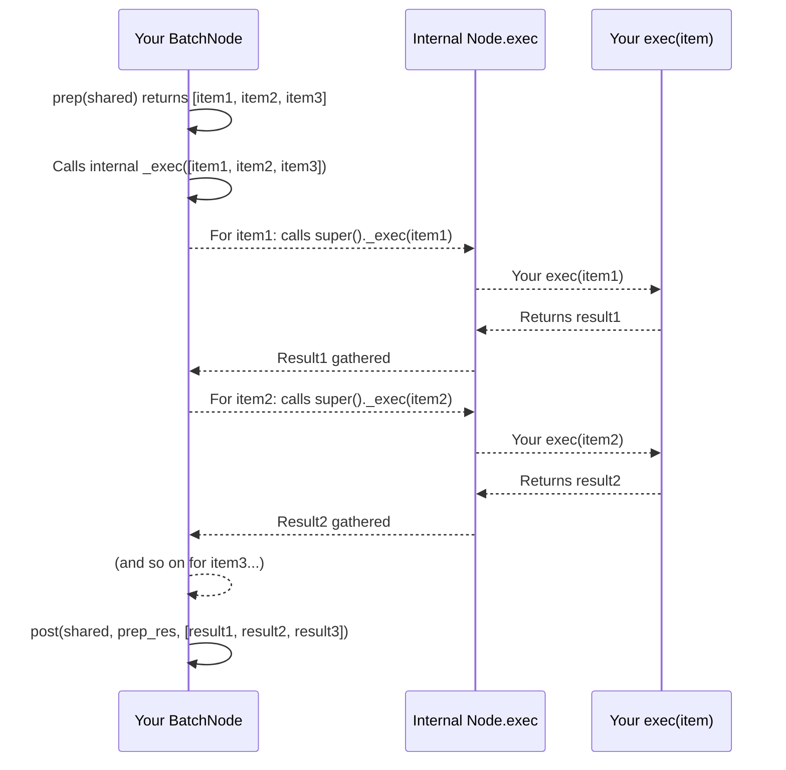
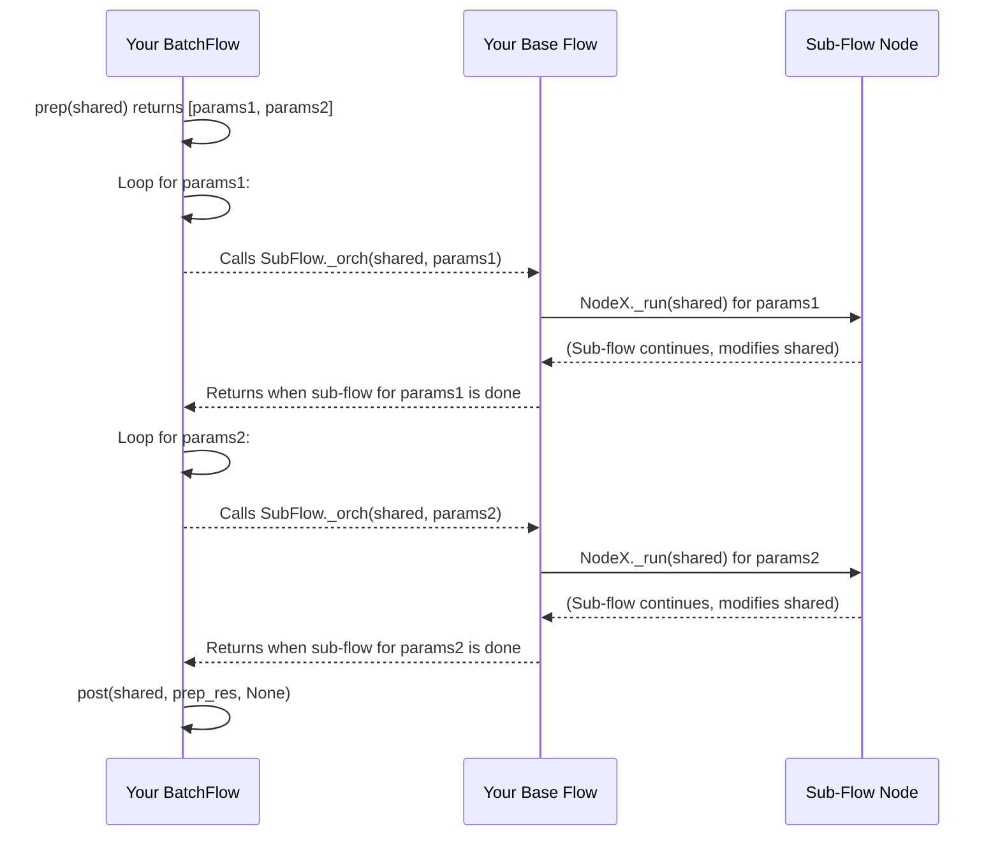

# Chapter 6: Batch Processing (Nodes and Flows)

Welcome back! In [Chapter 5: Flow (and variants)](05_flow__and_variants__.md), we learned how **Flows** act as the central orchestrator, guiding your workflow through different [Nodes](02_node__and_variants__.md) using [Node Transitions (>>, -)](04_node_transitions_________.md). You now know how to build a single, sequential (or conditionally branching) process.

But what if your task isn't just one item, but *many*? Imagine you need to:
*   Process a giant CSV file, row by row or in chunks.
*   Apply the same set of image filters to hundreds of photos.
*   Translate a document into multiple languages.

Running your single-item [Node](02_node__and_variants__.md) or [Flow](05_flow__and_variants__.md) repeatedly in a simple loop might work, but it's not the most efficient or "PocketFlow" way. It doesn't gracefully handle things like progress tracking, error aggregation, or parallel execution for many items.

This is where **Batch Processing** comes in! PocketFlow provides specialized tools, `BatchNode` and `BatchFlow` (and their asynchronous/parallel cousins), to simplify running the same operation on many items. They help you process collections of data efficiently and elegantly.

### What Problem Does Batch Processing Solve?

Consider processing a very large CSV file with millions of rows. You probably don't want to load the *entire* file into memory at once, and processing it row by row might be slow. You'd ideally want to:

1.  Read the file in smaller "chunks" (e.g., 10,000 rows at a time).
2.  Perform some calculation on *each* chunk.
3.  Combine the results from all chunks at the very end to get a grand total.

Similarly, if you're applying image filters, you might want to apply "grayscale", "blur", and "sepia" to "image1.jpg", then repeat that for "image2.jpg", "image3.jpg", and so on.

Batch processing allows you to define a single unit of work (either a [Node](02_node__and_variants__.md) or a mini-[Flow](05_flow__and_variants__.md)) and then tell PocketFlow to apply it to a collection of inputs, automatically handling the iteration and aggregation.

### Key Concepts in Batch Processing

PocketFlow offers two main abstractions for batch processing: `BatchNode` and `BatchFlow`.

#### 1. `BatchNode`: Processing Multiple Items within a Single Node

A `BatchNode` is a specialized [Node](02_node__and_variants__.md) designed to handle a collection of inputs. Instead of its `exec` method running once for a single input, it runs *once for each item* in a collection, and its `post` method then collects all those individual results.

Think of it like an assembly line:
*   **`prep`**: You get a big box of parts (e.g., all the rows of a CSV file, broken into chunks). Your `prep` method "yields" or returns this collection.
*   **`exec`**: Each "part" (each chunk of rows) goes to a single worker. This worker (your `exec` method) processes *just that one part*.
*   **`post`**: After all workers have processed their parts, a final supervisor (your `post` method) collects all the individual results and combines them into a final summary.

**Example: Processing a CSV File with `BatchNode`**

Let's look at `CSVProcessor` from `cookbook/pocketflow-batch-node/nodes.py`. This `BatchNode` processes a CSV file in chunks.

```python
from pocketflow import BatchNode
import pandas as pd

class CSVProcessor(BatchNode):
    def __init__(self, chunk_size=1000):
        super().__init__()
        self.chunk_size = chunk_size
    
    def prep(self, shared):
        """1. Split CSV file into chunks."""
        # pandas can read large CSVs in chunks using 'chunksize'
        chunks = pd.read_csv(shared["input_file"], chunksize=self.chunk_size)
        print(f"📋 Prep: Reading '{shared['input_file']}' in chunks of {self.chunk_size}.")
        return chunks # This collection is given to exec, item by item!
    
    def exec(self, chunk):
        """2. Process a single chunk of the CSV."""
        # This 'exec' runs for EACH 'chunk' provided by 'prep'.
        total_sales_in_chunk = chunk["amount"].sum()
        num_transactions_in_chunk = len(chunk)
        print(f"🔢 Exec: Processed chunk with {num_transactions_in_chunk} transactions.")
        return {
            "total_sales": total_sales_in_chunk,
            "num_transactions": num_transactions_in_chunk
        }
    
    def post(self, shared, prep_res, exec_res_list):
        """3. Combine results from all chunks."""
        # 'exec_res_list' is a list containing the results from ALL 'exec' calls.
        total_sales_overall = sum(res["total_sales"] for res in exec_res_list)
        total_transactions_overall = sum(res["num_transactions"] for res in exec_res_list)
        
        shared["statistics"] = {
            "total_sales": total_sales_overall,
            "total_transactions": total_transactions_overall
        }
        print(f"📊 Post: Combined results. Total sales: {total_sales_overall}")
        return "show_stats" # Action for the next node in the flow
```

**How to run a `BatchNode` (Demo):**

```python
# A simple CSV file for demonstration (imagine it's large!)
# sales.csv content:
# amount,product
# 10.50,A
# 20.00,B
# 5.25,C
# ... (many more rows)

# You'd typically generate this or use a real file
with open("sales.csv", "w") as f:
    f.write("amount,product\n")
    for i in range(5000): # 5000 rows
        f.write(f"{10 + i % 10},{'item_' + str(i)}\n")

initial_shared = {"input_file": "sales.csv"}
print(f"Shared BEFORE BatchNode: {initial_shared}")

csv_processor = CSVProcessor(chunk_size=1000) # Process in 1000-row chunks
csv_processor.run(initial_shared) # We call .run() directly for demo

print(f"\nShared AFTER BatchNode: {initial_shared}")
print(f"Final statistics: {initial_shared.get('statistics')}")
```

**Expected Output (simplified):**
```
Shared BEFORE BatchNode: {'input_file': 'sales.csv'}
📋 Prep: Reading 'sales.csv' in chunks of 1000.
🔢 Exec: Processed chunk with 1000 transactions.
🔢 Exec: Processed chunk with 1000 transactions.
🔢 Exec: Processed chunk with 1000 transactions.
🔢 Exec: Processed chunk with 1000 transactions.
🔢 Exec: Processed chunk with 1000 transactions.
📊 Post: Combined results. Total sales: 52250.0

Shared AFTER BatchNode: {'input_file': 'sales.csv', 'statistics': {'total_sales': 52250.0, 'total_transactions': 5000}}
Final statistics: {'total_sales': 52250.0, 'total_transactions': 5000}
```
Notice how `exec` was called 5 times (once for each 1000-row chunk), and `post` then received all 5 results to sum them up.

#### 2. `BatchFlow`: Running a Sub-Flow Multiple Times

A `BatchFlow` is a specialized [Flow](05_flow__and_variants__.md) that takes another [Flow](05_flow__and_variants__.md) (let's call it the "sub-flow") and runs it multiple times, once for each item or set of parameters you provide. It's like having a factory manager (`BatchFlow`) who tells a mini-assembly line (`sub-flow`) to produce many items, one after another.

*   **`BatchFlow.prep`**: Prepares a list of "job orders." Each job order is a small dictionary of parameters unique to that specific run of the sub-flow.
*   **`BatchFlow` Orchestration**: For each "job order" returned by its `prep`, the `BatchFlow` runs its entire "sub-flow."
*   **`BatchFlow.post`**: Can be used to summarize or react after *all* sub-flow runs are complete. (Note: In `BatchFlow`, the `post` method's `exec_res` parameter is often `None` because the individual sub-flow results are not automatically collected by the `BatchFlow` itself into `exec_res_list` like they are in `BatchNode`. You typically manage shared state changes within the sub-flows or aggregate in the `post` of the `BatchFlow` if needed, by accessing the `shared` state.)

**Example: Processing Multiple Images with Different Filters**

Consider `cookbook/pocketflow-batch-flow/flow.py`. We want to apply a `LoadImage`, `ApplyFilter`, `SaveImage` process (our sub-flow) to multiple images with multiple filters.

First, define the `base_flow` (our sub-flow for a *single* image-filter combination):

```python
from pocketflow import Flow, Node # Import necessary classes

# Dummy Node classes for illustration (actual logic in cookbook/pocketflow-batch-flow/nodes.py)
class LoadImage(Node):
    def post(self, shared, prep_res, exec_res):
        print(f"  > Loaded {shared['input']}")
        return "apply_filter"
class ApplyFilter(Node):
    def post(self, shared, prep_res, exec_res):
        print(f"  > Applied {shared['filter']} to {shared['input']}")
        return "save"
class SaveImage(Node):
    def post(self, shared, prep_res, exec_res):
        print(f"  > Saved processed {shared['input']} with {shared['filter']}")
        return "done"

def create_base_flow():
    """Our sub-flow for processing a single image with one filter."""
    load = LoadImage()
    filter_node = ApplyFilter()
    save = SaveImage()
    
    # Define transitions within the sub-flow
    load - "apply_filter" >> filter_node
    filter_node - "save" >> save
    
    return Flow(start=load) # This is the Flow for ONE image/filter combination
```

Now, define the `ImageBatchFlow` that uses this `base_flow`:

```python
from pocketflow import BatchFlow
# from .create_base_flow import create_base_flow # Assuming base_flow is imported

class ImageBatchFlow(BatchFlow):
    def prep(self, shared):
        """Prep: Generate parameters for each image-filter combination."""
        images = ["cat.jpg", "dog.jpg"] # Simplified list of images
        filters = ["grayscale", "blur"] # Simplified list of filters
        
        params = []
        for img in images:
            for f in filters:
                params.append({
                    "input": img,     # This will be shared["input"] for a sub-flow run
                    "filter": f       # This will be shared["filter"] for a sub-flow run
                })
        print(f"📋 BatchFlow Prep: Preparing {len(params)} processing jobs.")
        return params # This list of dictionaries drives the batch processing
```

**How to run a `BatchFlow` (Demo):**

```python
def create_full_batch_flow():
    base_flow = create_base_flow() # Get our single-image sub-flow
    
    # Wrap it in a BatchFlow, telling it what sub-flow to run repeatedly
    batch_flow = ImageBatchFlow(start=base_flow) 
    
    return batch_flow

print("Starting BatchFlow demonstration...")
full_flow = create_full_batch_flow()
initial_shared = {} # BatchFlow's prep doesn't depend on initial shared here
full_flow.run(initial_shared)
print("\nBatchFlow demonstration finished.")
```

**Expected Output (simplified):**
```
Starting BatchFlow demonstration...
📋 BatchFlow Prep: Preparing 4 processing jobs.
  > Loaded cat.jpg
  > Applied grayscale to cat.jpg
  > Saved processed cat.jpg with grayscale
  > Loaded cat.jpg
  > Applied blur to cat.jpg
  > Saved processed cat.jpg with blur
  > Loaded dog.jpg
  > Applied grayscale to dog.jpg
  > Saved processed dog.jpg with grayscale
  > Loaded dog.jpg
  > Applied blur to dog.jpg
  > Saved processed dog.jpg with blur

BatchFlow demonstration finished.
```
The `BatchFlow`'s `prep` created 4 sets of parameters. For each set, the entire `create_base_flow()` sequence was executed, demonstrating the power of running a sub-flow in a batch.

#### 3. Asynchronous and Parallel Batch Processing

For even more powerful batch processing, especially when tasks involve waiting (like network requests) or can be truly independent, PocketFlow provides asynchronous and parallel variants:

*   **`AsyncBatchNode`**: The asynchronous version of `BatchNode`. Its `exec_async` method processes items *sequentially* but allows the overall program to remain responsive by awaiting other tasks.
*   **`AsyncParallelBatchNode`**: An asynchronous `BatchNode` that processes items in the batch *in parallel*. This is incredibly useful for speeding up tasks like translating multiple texts concurrently.

*   **`AsyncBatchFlow`**: The asynchronous version of `BatchFlow`. It runs its sub-flow for each batch item *sequentially* but asynchronously.
*   **`AsyncParallelBatchFlow`**: An asynchronous `BatchFlow` that runs its sub-flows for all batch items *in parallel*. This is great for processing multiple images or datasets where each item's processing is independent.

We'll cover asynchronous execution and these parallel versions in more detail in [Chapter 7: Asynchronous Execution](07_asynchronous_execution_.md). However, here's a glimpse of `AsyncParallelBatchNode` from `cookbook/pocketflow-parallel-batch/main.py`:

```python
import asyncio
from pocketflow import AsyncParallelBatchNode

# Dummy async function for demonstration
async def call_llm(prompt):
    await asyncio.sleep(0.1) # Simulate network delay
    return "Translated: Hello"

class TranslateTextNodeParallel(AsyncParallelBatchNode):
    async def prep_async(self, shared):
        """Prepares (text, language) tuples for parallel translation."""
        text = shared.get("text", "Default text")
        languages = shared.get("languages", ["Spanish", "French"])
        return [(text, lang) for lang in languages] # A list of items for exec_async

    async def exec_async(self, data_tuple):
        """Translates a single (text, language) tuple using an async LLM call."""
        text, language = data_tuple
        # Imagine a real prompt here
        result = await call_llm(f"Translate to {language}: {text}")
        print(f"  > Exec: Translated {language} text")
        return {"language": language, "translation": result}

    async def post_async(self, shared, prep_res, exec_res_list):
        """Collects all parallel translation results."""
        print(f"✅ Post: All translations collected ({len(exec_res_list)} total).")
        # In a real app, you'd save these to shared state or files.
        return "default" # Or "done"
```

To run this, you'd wrap it in an `AsyncFlow` and `await` it:

```python
from pocketflow import AsyncFlow

def create_parallel_translation_flow():
    translate_node = TranslateTextNodeParallel()
    return AsyncFlow(start=translate_node)

async def demo_parallel_translation():
    shared_data = {
        "text": "Hello, PocketFlow!",
        "languages": ["Spanish", "French", "German"]
    }
    translation_flow = create_parallel_translation_flow()
    print("Starting parallel translation demo...")
    await translation_flow.run_async(shared_data) # This runs all translations in parallel
    print("Parallel translation demo finished.")

if __name__ == "__main__":
    asyncio.run(demo_parallel_translation())
```
**Expected Output (order of 'Exec' might vary due to parallelism):**
```
Starting parallel translation demo...
  > Exec: Translated Spanish text
  > Exec: Translated German text
  > Exec: Translated French text
✅ Post: All translations collected (3 total).
Parallel translation demo finished.
```
Notice how all "Exec" messages appear very quickly, as they run at the same time.

### How Batch Processing Works Internally

The magic of batch processing happens in how `BatchNode` and `BatchFlow` override the internal `_exec` or `_run` methods to handle collections.

#### `BatchNode` Internal Logic

When you call `my_batch_node.run(shared)`:

1.  The base `_run` method first calls your `prep(shared)`, which returns a collection of items (e.g., `[chunk1, chunk2, chunk3]`).
2.  Instead of directly calling your `exec` once, the `BatchNode`'s overridden `_exec` method iterates through this collection.
3.  For *each item* in the collection, it calls the `exec` method of its parent `Node` (which is your specific `exec(item)`).
4.  It gathers all the individual results into a list.
5.  Finally, the base `_run` calls your `post(shared, prep_res, exec_res_list)`, passing this list of results.



**Code Peek (`pocketflow/__init__.py`):**
```python
class BatchNode(Node):
    def _exec(self, items):
        # This is where the magic happens for BatchNode!
        # It iterates through each 'item' returned by your prep method.
        # For each 'item', it calls the parent Node's _exec, which in turn calls your exec(item).
        # It collects all these individual results into a list.
        return [super(BatchNode, self)._exec(i) for i in (items or [])]
```

#### `BatchFlow` Internal Logic

When you call `my_batch_flow.run(shared)`:

1.  The `BatchFlow`'s overridden `_run` method first calls its own `prep(shared)`, which returns a list of parameter dictionaries (`[params1, params2, ...]`).
2.  It then enters a loop. For *each set of parameters* in the list:
    *   It takes a copy of the original `shared` state (or modifies it as needed for the batch).
    *   It passes these parameters to its `start_node` (your sub-flow's first node).
    *   It then calls the sub-flow's `_orch` method, effectively running the *entire sub-flow* with those parameters.
3.  After all sub-flow runs are complete, it calls its own `post`.



**Code Peek (`pocketflow/__init__.py`):**
```python
class BatchFlow(Flow): # BatchFlow inherits from Flow
    def _run(self, shared):
        pr = self.prep(shared) or [] # Get parameters from BatchFlow's prep
        for bp in pr: # Loop through each set of batch parameters
            # Call the parent Flow's _orch method, which runs the sub-flow.
            # It updates shared based on the specific batch parameters (bp).
            self._orch(shared, {**self.params, **bp})
        return self.post(shared, pr, None) # Call BatchFlow's post
```

#### Parallel Batch Logic (`AsyncParallelBatchNode`, `AsyncParallelBatchFlow`)

For parallel versions, the core difference lies in using `asyncio.gather` to run multiple tasks concurrently:

*   **`AsyncParallelBatchNode._exec`**: Instead of a list comprehension that runs sequentially, it uses `asyncio.gather` to `await` all `super()._exec(i)` calls at the same time.
    ```python
    class AsyncParallelBatchNode(AsyncNode, BatchNode):
        async def _exec(self, items):
            # This is the key: asyncio.gather runs all exec_async calls in parallel!
            return await asyncio.gather(*(super(AsyncParallelBatchNode, self)._exec(i) for i in items))
    ```

*   **`AsyncParallelBatchFlow._run_async`**: Similarly, it uses `asyncio.gather` to `await` all `_orch_async` calls (each running a sub-flow) in parallel.
    ```python
    class AsyncParallelBatchFlow(AsyncFlow, BatchFlow):
        async def _run_async(self, shared): 
            pr = await self.prep_async(shared) or []
            # This is the key: asyncio.gather runs all sub-flows in parallel!
            await asyncio.gather(*(self._orch_async(shared, {**self.params, **bp}) for bp in pr))
            return await self.post_async(shared, pr, None)
    ```

These internal mechanisms ensure that PocketFlow efficiently manages the execution of multiple items, whether sequentially or in parallel, providing a clean and powerful API for batch processing.

### Conclusion

Batch processing is a powerful feature in PocketFlow that helps you handle large collections of data or repeatedly apply a workflow to many items. By using `BatchNode` (for processing within a single step) or `BatchFlow` (for running a sub-workflow multiple times), you can build more efficient, scalable, and organized applications. The asynchronous and parallel variants unlock even greater performance for I/O-bound or independent tasks.

Now that you understand how to process batches, let's dive deeper into the world of **Asynchronous Execution** to truly unlock the full potential of parallel and responsive applications!

[Next Chapter: Asynchronous Execution](07_asynchronous_execution_.md)

---

Generated by [AI Codebase Knowledge Builder](https://github.com/The-Pocket/Tutorial-Codebase-Knowledge)