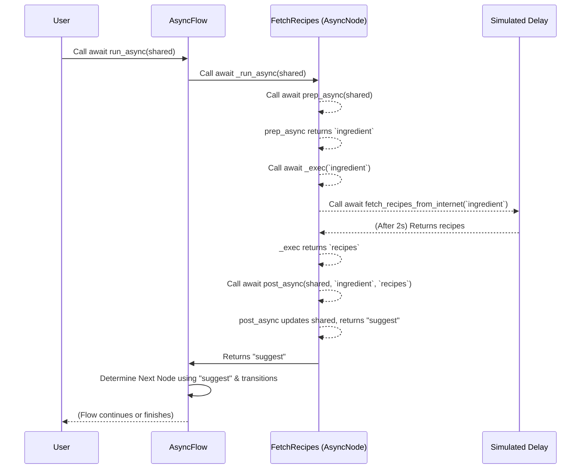

# Chapter 7: Asynchronous Execution

Welcome back! In [Chapter 6: Batch Processing (Nodes and Flows)](06_batch_processing__nodes_and_flows__.md), we explored how to process many items efficiently. Sometimes, however, the tasks involved in processing those items, or even single items, require waiting. For example, waiting for a response from an external service like an LLM (Large Language Model) API or fetching data from a website.

If your program simply stops and waits for these slow operations to complete, your entire application can freeze, becoming unresponsive. Imagine an agent that needs to ask an LLM multiple questions: if it waits for each answer sequentially, it could take a very long time!

This is where **Asynchronous Execution** comes in. It allows your PocketFlow application to perform non-blocking operations, meaning it can start a long-running task (like calling an LLM API) and then, instead of just sitting idle, it can potentially do other useful work or simply remain responsive until the long task is finished.

### What Problem Does Asynchronous Execution Solve?

Think about ordering food at a restaurant:

*   **Blocking (Synchronous)**: You tell the chef your order. The chef then *stops everything else* they're doing, cooks *only your meal*, and only when it's perfectly done do they start on the next customer's order. If your meal takes a long time, everyone else waits. This is how traditional, synchronous code often works: one task blocks all others until it's finished.

*   **Non-blocking (Asynchronous)**: You tell the chef your order. The chef writes it down, starts your meal cooking (e.g., puts water on to boil, which takes time), and then immediately turns to the next customer's order or starts chopping vegetables for another dish. When your water boils, they come back to your meal. This is asynchronous: you "await" for a long task, but the program can yield control to other tasks while waiting.

In PocketFlow, many powerful agents rely on external services (like LLM APIs, web search APIs, or databases) that introduce delays. Asynchronous execution is **crucial for efficiency and responsiveness** when dealing with these "waiting" operations.

### Key Concepts: `async` and `await`

Python achieves asynchronous programming primarily through the `async` and `await` keywords, built upon the `asyncio` library.

*   **`async def`**: You use `async def` to define a function that is a "coroutine." This means the function can be paused and resumed later. When a coroutine needs to wait for something (like a network request), it can "yield" control back to the `asyncio` event loop, allowing other tasks to run.
*   **`await`**: You use `await` inside an `async def` function before calling another coroutine or an asynchronous operation (like `asyncio.sleep` or an `httpx.get` request). When Python encounters `await`, it pauses the current coroutine's execution, gives control back to the event loop, and resumes the coroutine only when the `await`-ed operation is complete.

You cannot use `await` outside of an `async def` function.

### `AsyncNode`: The Asynchronous Work Unit

An `AsyncNode` is the asynchronous version of a regular [Node](02_node__and_variants__.md). Just like a `Node`, it has lifecycle methods (`prep`, `exec`, `post`), but for `AsyncNode`s, these methods are `async` coroutines.

*   **`prep_async(self, shared)`**: The asynchronous preparation method. It can `await` for setup tasks.
*   **`exec_async(self, prep_res)`**: The asynchronous execution method, where the main `await`-able work happens (e.g., calling an LLM API).
*   **`post_async(self, shared, prep_res, exec_res)`**: The asynchronous post-processing method. It can also `await` for final cleanup or updates.

When you define an `AsyncNode`, you inherit from `pocketflow.AsyncNode` and use `async def` for these methods.

**Example: An `AsyncNode` calling an LLM**

Let's look at a simplified `FetchRecipes` node from `cookbook/pocketflow-async-basic/nodes.py`. This node needs to ask the user for an ingredient and then "fetch" recipes (simulating a slow network call).

```python
import asyncio # Used for async operations
from pocketflow import AsyncNode

# Dummy async function to simulate fetching recipes over network
async def fetch_recipes_from_internet(ingredient):
    print(f"🌐 Fetching recipes for '{ingredient}'... (simulating 2 sec delay)")
    await asyncio.sleep(2) # Pauses this task, but not the whole program!
    print(f"✅ Recipes for '{ingredient}' fetched!")
    return ["Pizza", "Pasta", "Salad"]

class FetchRecipes(AsyncNode):
    async def prep_async(self, shared):
        """Asynchronously get ingredient from shared state or user."""
        ingredient = shared.get("user_ingredient", "chicken")
        return ingredient
    
    async def exec_async(self, ingredient):
        """Asynchronously fetch recipes using an awaitable function."""
        # We 'await' the external call; this pauses THIS node, not the program.
        recipes = await fetch_recipes_from_internet(ingredient)
        return recipes
    
    async def post_async(self, shared, prep_res, recipes):
        """Asynchronously store recipes and signal next step."""
        shared["recipes"] = recipes
        shared["ingredient"] = prep_res
        print(f"Stored recipes for {shared['ingredient']}.")
        return "suggest" # Action to go to the next node
```
Notice the `async def` for each method and the `await` keyword inside `exec_async`. This is the core of asynchronous programming in PocketFlow.

### `AsyncFlow`: Orchestrating Asynchronous Workflows

Just as a regular [Flow](05_flow__and_variants__.md) orchestrates `Nodes`, an `AsyncFlow` orchestrates `AsyncNodes` (and can also include regular `Nodes` within its sequence). It uses Python's `asyncio` event loop to manage these concurrent tasks, ensuring your application remains responsive.

When you have an `AsyncNode` in your workflow, you *must* use an `AsyncFlow` to run it.

**Example: Creating and Running an `AsyncFlow`**

Let's create a simple `AsyncFlow` using our `FetchRecipes` `AsyncNode` and a dummy `SuggestRecipe` node.

```python
import asyncio
from pocketflow import AsyncFlow, Node # AsyncFlow for orchestration, Node for dummy

# Assume FetchRecipes is defined as above

class SuggestRecipe(Node): # This can be a regular Node, even in an AsyncFlow
    def post(self, shared, prep_res, suggestion):
        print(f"💡 Suggestion: {shared.get('recipes', [])[0]}")
        return "done" # End the flow

def create_recipe_flow():
    fetch_node = FetchRecipes()
    suggest_node = SuggestRecipe()
    
    # Connect them using Node Transitions, same as regular Flows!
    fetch_node - "suggest" >> suggest_node
    
    # Create an AsyncFlow, starting with our async node
    flow = AsyncFlow(start=fetch_node)
    return flow

async def run_async_demo():
    my_flow = create_recipe_flow()
    initial_shared = {"user_ingredient": "chicken"}
    print("Starting async recipe flow...")
    
    # Crucial: You MUST 'await' an AsyncFlow's run_async method
    await my_flow.run_async(initial_shared)
    
    print("\nAsync recipe flow finished.")

if __name__ == "__main__":
    # To run an async function (like run_async_demo) at the top level,
    # you use asyncio.run().
    asyncio.run(run_async_demo())
```

**Expected Output:**
```
Starting async recipe flow...
🌐 Fetching recipes for 'chicken'... (simulating 2 sec delay)
✅ Recipes for 'chicken' fetched!
Stored recipes for chicken.
💡 Suggestion: Pizza

Async recipe flow finished.
```
Notice that the "simulating 2 sec delay" message appears, but your program doesn't "freeze." If you had other `async` tasks running concurrently (e.g., in a web server), they could execute during that 2-second `await` period.

### Internal Implementation: How Asynchronous Execution Works

At its core, `AsyncNode` and `AsyncFlow` extend their synchronous counterparts to support `async`/`await` operations. The fundamental pattern of `prep` -> `exec` -> `post` remains, but it's now handled asynchronously.

#### The Async Orchestration Steps

When you call `await async_flow.run_async(shared)`:

1.  The `AsyncFlow` (our orchestrator) begins its `_orch_async` loop.
2.  Inside the loop, it checks if the `current node` is an `AsyncNode`.
3.  If it is an `AsyncNode`, the `AsyncFlow` calls `await curr._run_async(shared)`. This `await` keyword is key: it tells the `AsyncFlow` to pause *itself* until `curr._run_async` finishes, but it doesn't block the underlying `asyncio` event loop. Other asynchronous tasks (if scheduled) can run during this pause.
4.  `curr._run_async` then calls `await self.prep_async(shared)`, `await self._exec(p)`, and `await self.post_async(shared, p, e)`. Each of these `await` calls behaves similarly, allowing the overall system to remain responsive.
5.  If the `current node` is a regular `Node`, `AsyncFlow` calls `curr._run(shared)` synchronously, as usual.
6.  Once the `current node` finishes, the `AsyncFlow` determines the `next node` using the [Node Transitions (>>, -)](04_node_transitions_________.md) and continues the loop until the flow completes.

Here's a simplified sequence diagram for an `AsyncFlow` running an `AsyncNode`:



#### A Peek Under the Hood

Let's look at the actual (simplified) code in `pocketflow/__init__.py`.

**`AsyncNode`'s Internal Methods**:

```python
# From pocketflow/__init__.py (simplified AsyncNode class)
class AsyncNode(Node):
    # Your methods will override these:
    async def prep_async(self,shared): pass
    async def exec_async(self,prep_res): pass
    async def post_async(self,shared,prep_res,exec_res): pass
    
    # This internal method wraps your exec_async with retry logic
    async def _exec(self,prep_res): 
        # For retries, it awaits your exec_async
        return await self.exec_async(prep_res) 
            
    # This is the main asynchronous entry point for an AsyncNode
    async def _run_async(self,shared): 
        # It awaits all three lifecycle methods
        p = await self.prep_async(shared)
        e = await self._exec(p) # Calls the async _exec above
        return await self.post_async(shared,p,e)

    # Important: Prevents calling regular .run() on an AsyncNode
    def _run(self,shared): raise RuntimeError("Use run_async.")
```
As you can see, `_run_async` ensures that `prep_async`, `exec_async`, and `post_async` are all properly `await`-ed.

**`AsyncFlow`'s Internal Methods**:

```python
# From pocketflow/__init__.py (simplified AsyncFlow class)
class AsyncFlow(Flow, AsyncNode): # It inherits from both Flow and AsyncNode
    async def _orch_async(self,shared,params=None):
        curr = copy.copy(self.start_node)
        last_action = None
        
        while curr:
            curr.set_params(params or self.params)
            
            # The key decision: if the current node is an AsyncNode, await its _run_async
            if isinstance(curr,AsyncNode):
                last_action = await curr._run_async(shared)
            else:
                # If it's a regular Node, run it synchronously
                last_action = curr._run(shared)
                
            curr = copy.copy(self.get_next_node(curr,last_action))
            
        return last_action
    
    # The public run_async method that you call
    async def _run_async(self,shared): 
        # AsyncFlow also has async prep/post for its own lifecycle
        p = await self.prep_async(shared)
        o = await self._orch_async(shared) # Calls the async orchestrator
        return await self.post_async(shared,p,o)
```
The `_orch_async` method is the core loop that intelligently runs each node. It adapts its behavior based on whether the current node is an `AsyncNode` (and thus needs `await`) or a regular `Node`.

As a reminder from [Chapter 6: Batch Processing (Nodes and Flows)](06_batch_processing__nodes_and_flows__.md), PocketFlow also offers `AsyncBatchNode`, `AsyncParallelBatchNode`, `AsyncBatchFlow`, and `AsyncParallelBatchFlow`. These variants combine the power of batch processing with asynchronous capabilities, allowing for incredibly efficient and responsive workflows, especially when dealing with many parallel I/O-bound tasks. Their internal implementation largely relies on `asyncio.gather` to run multiple asynchronous tasks concurrently.

### Conclusion

Asynchronous execution is a vital concept in modern Python applications, especially when interacting with external services that might introduce delays. PocketFlow makes it easy to build non-blocking workflows using `AsyncNode` for individual asynchronous steps and `AsyncFlow` for orchestrating them. By embracing asynchrony, your PocketFlow applications can remain responsive, efficient, and scalable, truly unlocking their full potential for building sophisticated agents and data pipelines.

This concludes our journey through the core concepts of PocketFlow! You now have a solid understanding of how to manage state, build modular steps, connect them into dynamic workflows, handle batches of data, and leverage asynchronous processing for optimal performance.

---

Generated by [AI Codebase Knowledge Builder](https://github.com/The-Pocket/Tutorial-Codebase-Knowledge)