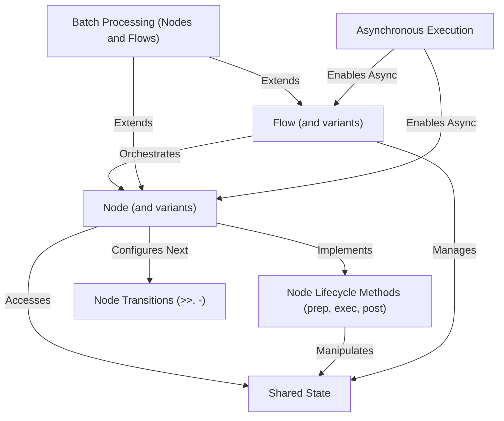

# Tutorial: PocketFlow

PocketFlow is a **workflow framework** that helps you break down complex tasks into smaller, manageable units called *Nodes*. These nodes are then connected together to form *Flows*, which define the sequence of operations. It uses a *Shared State* to allow all nodes to communicate and pass data seamlessly, and supports both *synchronous and asynchronous processing* for efficient execution, including handling multiple items in *batches*.

**Source Repository:** [https://github.com/The-Pocket/PocketFlow](https://github.com/The-Pocket/PocketFlow)

## Chapters

1. [Shared State
](01_shared_state_.md)
2. [Node (and variants)
](02_node__and_variants__.md)
3. [Node Lifecycle Methods (prep, exec, post)
](03_node_lifecycle_methods__prep__exec__post__.md)
4. [Node Transitions (>>, -)
](04_node_transitions_________.md)
5. [Flow (and variants)
](05_flow__and_variants__.md)
6. [Batch Processing (Nodes and Flows)
](06_batch_processing__nodes_and_flows__.md)
7. [Asynchronous Execution
](07_asynchronous_execution_.md)

---

Generated by [AI Codebase Knowledge Builder](https://github.com/The-Pocket/Tutorial-Codebase-Knowledge)