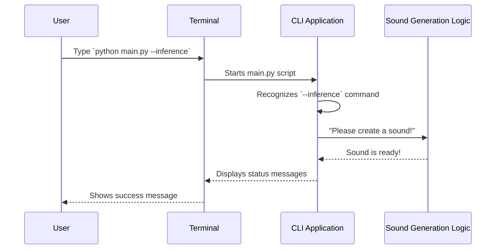
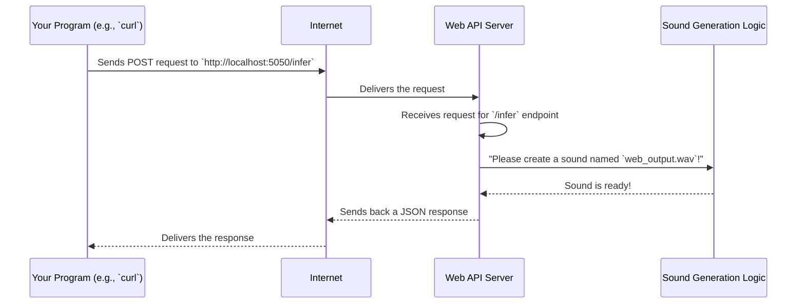

# Chapter 1: Application Interfaces

Welcome to the exciting world of SoundGan! In this chapter, we're going to explore how you, or other computer programs, can interact with our amazing sound-generating project. Think of **Application Interfaces** as the "front doors" to SoundGan – they are the ways you tell the project what you want it to do, like making a cool new sound!

## Why do we need "front doors"?

Imagine you have a super-smart robot that can create any sound you ask for. How would you talk to it? You could:

1.  **Directly type commands** to it on a screen.
2.  **Build another robot** that sends requests to your sound-making robot over a network, like the internet.

SoundGan offers both these ways! We have two main "front doors" to access its powerful sound generation capabilities:

1.  **Command-Line Interface (CLI)**: This is for when you want to run SoundGan directly from your computer's terminal by typing simple commands. It's great for quick tasks like generating a sound file or starting a training process.
2.  **Web API (Application Programming Interface)**: This is for when other computer programs or even websites want to ask SoundGan to make sounds. It allows programs to "talk" to SoundGan over the internet, making it easy to build bigger systems that use SoundGan's power.

Let's dive into how to use each of these "front doors" to achieve a common goal: **making a new sound!**

## The Command-Line Interface (CLI)

The CLI is like directly typing instructions to SoundGan. Our `main.py` script is the gateway for this.

### How to Make a Sound with CLI

Open your terminal (Command Prompt on Windows, Terminal on macOS/Linux). Navigate to your SoundGan project folder.

To tell SoundGan to create a new sound file, you'll use a simple command:

```bash
python main.py --inference
```

**What happens when you run this?**

*   `python main.py`: This tells your computer to run our main SoundGan script.
*   `--inference`: This is a special "flag" that tells the `main.py` script, "Hey, I want to use the sound generation (inference) part of the project!"

You should see output similar to this, indicating that SoundGan is busy creating your sound:

```
Starting to create a new sound file...
Sound created and saved as output.wav!
```

After it finishes, you'll find a new audio file named `output.wav` in your project folder, containing your newly generated sound!

### Inside the CLI (Simplified)

Let's peek at a super simplified version of `main.py` to see how it knows what to do:

```python
# gan/main.py (Simplified)
import argparse # A tool to understand commands you type

def main():
    # This helps our program understand your commands like --inference
    parser = argparse.ArgumentParser()
    parser.add_argument('--inference', action='store_true', help='Make new sounds.')
    # It also has --training for teaching the model (Chapter 3!)
    args = parser.parse_args() # Reads what you typed

    if args.inference:
        print("Starting to create a new sound file...")
        # Here, the actual sound generation magic happens!
        # This will involve our [GAN Inference Pipeline](06_gan_inference_pipeline_.md)
        # and it will use settings from our [Configuration Manager](02_configuration_manager_.md).
        print("Sound created and saved as output.wav!")
    else:
        print("Please specify what to do. Try: python main.py --inference")

if __name__ == "__main__":
    # When you run 'python main.py', this line makes the 'main' function start.
    main()
```

When you run `python main.py --inference`, the `argparse` part figures out you've asked for `--inference`. Then, the `if args.inference:` block gets activated, which leads to the sound being created.

Here's a simple diagram to show the flow:



## The Web API

The Web API is like setting up a special "sound-making service" that other programs can access over the internet. Our `app.py` script, using a tool called FastAPI, sets this up.

### How to Make a Sound with Web API

First, you need to start the SoundGan API server. Open a terminal and run:

```bash
python app.py
```

You'll see messages indicating the server is starting, typically ending with something like:

```
INFO:     Uvicorn running on http://0.0.0.0:5050 (Press CTRL+C to quit)
```

This means your SoundGan API is now listening for requests on port `5050`! Keep this terminal window open.

Now, open a **different** terminal window. To tell the running API server to create a sound, you'll send it a special message using a tool like `curl` (which is often pre-installed on many systems).

```bash
curl -X POST http://localhost:5050/infer -H "Content-Type: application/json" -d '{"output_file": "web_output.wav"}'
```

**Let's break down this command:**

*   `curl -X POST`: This tells `curl` to send a "POST" request, which is usually used when you want to send data to a server (like telling it what to do).
*   `http://localhost:5050/infer`: This is the address where your SoundGan API is listening. `localhost` means "your own computer," `5050` is the port it's using, and `/infer` is the specific "button" (or endpoint) you're pressing to make a sound.
*   `-H "Content-Type: application/json"`: This tells the server that the data we're sending is in JSON format.
*   `-d '{"output_file": "web_output.wav"}'`: This is the actual data! We're sending a little message that says, "Please save the new sound as `web_output.wav`."

**What happens when you run this?**

In the terminal where you sent the `curl` command, you'll get a response back from the server:

```json
{"output_path":"web_output.wav","error":""}
```

And in the terminal where `app.py` is running, you'll see a message like:

```
Web request received to create sound: web_output.wav
```

This means the API successfully received your request and started creating the sound! You'll find `web_output.wav` in your project folder.

### Inside the Web API (Simplified)

Let's look at a simplified `app.py`:

```python
# gan/app.py (Simplified)
from fastapi import FastAPI # The tool to build web APIs
import uvicorn # The tool to run the web server

app = FastAPI() # Create our web application!

# This special line means: "When someone sends a POST request to '/infer'..."
@app.post("/infer")
def infer(input_data: dict):
    # 'input_data' will contain things like {"output_file": "..."}
    output_filename = input_data.get("output_file", "default_web_output.wav")
    print(f"Web request received to create sound: {output_filename}")

    # Here, the core sound generation logic from [GAN Inference Pipeline](06_gan_inference_pipeline_.md)
    # would be called, using settings from our [Configuration Manager](02_configuration_manager_.md).

    # We send back a message confirming what happened.
    return {"output_path": output_filename, "error": ""}

if __name__ == '__main__':
    # This line tells Uvicorn to start the web server so it can listen for requests.
    uvicorn.run(debug=True, port=5050, host="0.0.0.0")
```

When you run `python app.py`, `uvicorn` starts the web server. When you send the `curl` command, `FastAPI` (through `uvicorn`) catches the request to `/infer`, and the `infer` function runs, processes your request, and then sends back a response.

Here's a simple diagram to illustrate the flow for the Web API:



## Conclusion

In this chapter, we've learned about the two main "front doors" to the SoundGan project:

*   The **Command-Line Interface (CLI)**, accessed via `main.py`, for direct interaction from your terminal.
*   The **Web API**, accessed via `app.py` and FastAPI, for allowing other programs to request sound generation over a network.

Both interfaces solve the problem of interacting with SoundGan, but they do it in different ways, suitable for different situations.

Next, we'll dive into how SoundGan manages all its settings and preferences, which is crucial for both training and inference. Get ready to explore the [Configuration Manager](02_configuration_manager_.md)!

---

Built by [Cadalytix.com](https://github.com/kmishra1204/codalytix-web)
