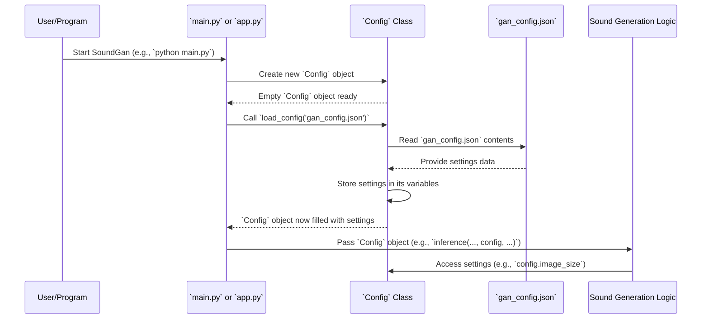

# Chapter 2: Configuration Manager

In [Chapter 1: Application Interfaces](01_application_interfaces_.md), we learned how to "talk" to SoundGan, whether directly through your terminal using the Command-Line Interface (CLI) or by letting other programs talk to it using the Web API. You saw that when you ask SoundGan to make a sound, it does some behind-the-scenes magic. But how does SoundGan know *how* to do that magic? For example, what size should the sound "image" be? Where should it save the results?

This is where the **Configuration Manager** comes in!

## What is a Configuration Manager?

Imagine playing a video game. Before you start, you might go into the "Settings" menu. Here, you can change things like screen resolution, sound volume, or control preferences. You change these settings once, and the game remembers them.

The **Configuration Manager** (which is our `Config` class in SoundGan) is exactly like that "Settings" panel for our project. It's a special part of SoundGan that handles all the important setup details. It makes sure that every part of SoundGan, from generating a sound to training the models, uses the *same* agreed-upon settings. This is super important for consistency and makes the project easy to manage.

**The main problem it solves:** Instead of hardcoding numbers and file paths directly into our code (which would be a mess to change later!), we put all these settings into one special file. The Configuration Manager then reads this file, making it the **central source of truth** for SoundGan's setup.

## The Settings File: `gan_config.json`

So, where does our `Config` class get these settings from? It reads them from a file named `gan_config.json`.

What is a `.json` file? It's just a simple, human-readable way to store data, like a shopping list or a recipe. It uses "key-value" pairs, similar to a dictionary.

Here's a simplified example of what `gan_config.json` might look like:

```json
{
    "image_size": [64, 64],
    "num_epochs": 100,
    "saveroot": "runs",
    "dataroot": "data/processed_spectrograms"
}
```

**Let's break it down:**

*   `{ ... }`: This indicates a JSON "object," like a container for our settings.
*   `"image_size": [64, 64]`: This is a "key-value" pair. `"image_size"` is the key (the name of the setting), and `[64, 64]` is its value (a list telling SoundGan that the internal "image" representation of sound should be 64 pixels wide and 64 pixels tall).
*   `"num_epochs": 100`: This tells SoundGan to train its models for 100 "epochs" (training steps). We'll learn more about training in [Chapter 3: GAN Training Orchestrator](03_gan_training_orchestrator_.md).
*   `"saveroot": "runs"`: This tells SoundGan where to save important files, like generated sounds or trained models. In this case, it's a folder named `runs`.
*   `"dataroot": "data/processed_spectrograms"`: This specifies where SoundGan can find the sound data it needs for training.

Using a JSON file means you can easily change these settings without touching the Python code itself!

## The `Config` Class: Your Settings Assistant

In SoundGan, the `Config` class is found in the `gan/sources/config_loader.py` file. Its job is very simple: it loads all the settings from `gan_config.json` and makes them easily available to other parts of the project.

### How to Use the `Config` Class

Let's revisit our `main.py` and `app.py` files from [Chapter 1: Application Interfaces](01_application_interfaces_.md) to see how they use the `Config` class.

**Example 1: Using `Config` in `main.py` (CLI)**

When you run `python main.py --inference`, the `main.py` script first needs to know the settings.

```python
# gan/main.py (Simplified)
from sources.config_loader import Config # Bring in our Config tool

def main():
    # 1. Create a Config object
    config = Config()
    # 2. Tell it to load settings from our JSON file
    config.load_config('gan_config.json')

    # Now, 'config' holds all our settings!
    # For example, config.image_size will be [64, 64]
    # We pass 'config' to the inference function:
    # inference(device, config, "output.wav")
    print(f"Image size from config: {config.image_size}")
    # ... rest of the main.py logic ...

if __name__ == "__main__":
    main()
```

**What happens here?**
1.  `config = Config()`: We create an empty "settings panel."
2.  `config.load_config('gan_config.json')`: We tell this "settings panel" to read all its options from the `gan_config.json` file.
3.  Once loaded, any part of the `main.py` script (or functions it calls, like `inference` or `training`) can access these settings directly, like `config.image_size` or `config.saveroot`. This ensures consistency.

**Example 2: Using `Config` in `app.py` (Web API)**

The `app.py` file, which runs our Web API, also needs the same settings:

```python
# gan/app.py (Simplified)
from sources.config_loader import Config # Import our Config tool
from fastapi import FastAPI

app = FastAPI()

@app.post("/infer")
def infer(input_data: dict):
    # Just like in main.py, we create and load the config
    config = Config()
    config.load_config('gan_config.json')

    print(f"Saving to root: {config.saveroot}")
    # The inference function also receives the config:
    # inference(device, config, input_data["output_file"], prod=True)
    # ... rest of the app.py logic ...
    return {"output_path": input_data["output_file"], "error": ""}
```

**What happens here?**
Every time a web request comes in to make a sound, `app.py` (through the `infer` function) loads the configuration. This makes sure that even when multiple requests come in, they all use the same, correct settings for generating sounds.

## Under the Hood: How `Config` Works

Let's take a closer look at the `Config` class in `gan/sources/config_loader.py` to understand its inner workings.

### Step-by-Step Flow

When `main.py` (or `app.py`) uses the `Config` class, here’s what generally happens:



### The `Config` Class Code (Simplified)

The `Config` class has two main parts:
1.  **`__init__(self)`**: This is run when you first create a `Config` object (`config = Config()`). It sets up empty "slots" for all the settings.
2.  **`load_config(self, config_path)`**: This is the method you call to actually read the settings from the `gan_config.json` file and fill those "slots."

Let's look at `gan/sources/config_loader.py`:

```python
# gan/sources/config_loader.py
import json # Python's tool for working with JSON files

class Config:
    def __init__(self):
        # These are the "slots" (variables) where our settings will go.
        # They are all empty (None) until we load the config file.
        self.saveroot = None
        self.dataroot = None
        self.num_epochs = None
        self.image_size = None
        # ... many more settings slots ...

    def load_config(self, config_path):
        # 1. Open the JSON file
        with open(config_path, 'r') as f:
            # 2. Read its content and turn it into a Python dictionary
            config_data = json.load(f)
        
        # 3. Take values from the dictionary and put them into our "slots"
        self.saveroot = config_data.get('saveroot')
        self.dataroot = config_data.get('dataroot')
        self.num_epochs = config_data.get('num_epochs')
        self.image_size = config_data.get('image_size')
        # .get() is safer: if a setting is missing, it returns None instead of crashing
        # ... get many more settings ...
```

**Explanation:**
*   In `__init__`, we define all the possible settings that our `Config` object might hold. They are initially `None` because we haven't loaded any values yet.
*   In `load_config`, `json.load(f)` does the heavy lifting of reading the JSON file (`gan_config.json`) and converting it into a Python dictionary (like `{"image_size": [64, 64], "num_epochs": 100, ...}`).
*   Then, lines like `self.saveroot = config_data.get('saveroot')` take the value associated with the key `'saveroot'` from that dictionary and store it in the `Config` object's `saveroot` variable.

Once `load_config` is finished, your `config` object is full of all the settings from `gan_config.json`, and any other part of SoundGan can easily access them, ensuring everyone is on the same page.

For example, when we build our neural networks later, like the [Generator Neural Network](04_generator_neural_network_.md) and [Discriminator Neural Network](05_discriminator_neural_network_.md), they will be created using dimensions and parameters (like `image_size` or `ngf`) pulled directly from this `Config` object. The [GAN Inference Pipeline](06_gan_inference_pipeline_.md) also relies on these settings to generate sounds correctly.

## Conclusion

In this chapter, we've uncovered the secret behind SoundGan's consistent operations: the **Configuration Manager**. We learned that:

*   It acts like a central "settings panel" for the entire project.
*   All its settings are loaded from a human-readable `gan_config.json` file.
*   The `Config` class reads this file, storing all parameters in one easy-to-access object.
*   This ensures that all parts of SoundGan, from training to sound generation, use consistent and easily modifiable settings.

Next, we'll dive into the exciting process of how SoundGan actually learns to make sounds! Get ready to explore the [GAN Training Orchestrator](03_gan_training_orchestrator_.md)!

---

Built by [Cadalytix.com](https://github.com/kmishra1204/codalytix-web)
