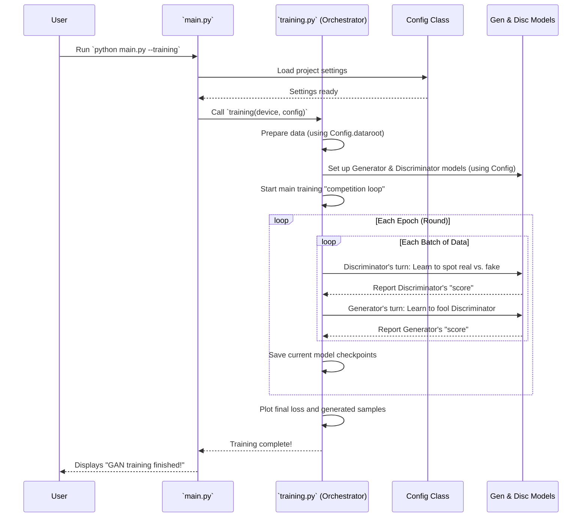

# Chapter 3: GAN Training Orchestrator

In [Chapter 2: Configuration Manager](02_configuration_manager_.md), we learned how SoundGan manages all its settings, like where to find data or how many training steps to take. These settings are crucial, but they don't explain *how* SoundGan actually learns to make sounds. That's the real magic!

This is where the **GAN Training Orchestrator** comes in.

## What is the GAN Training Orchestrator?

Imagine a highly competitive sports league with two teams:
*   **The Generator (G)**: This is like an **artist** team, whose goal is to create realistic sound "images" (called spectrograms) that are so good, they look exactly like real sounds.
*   **The Discriminator (D)**: This is like a **critic** team, whose goal is to tell the difference between a real sound "image" and a fake one created by the Generator.

The problem is, training a Generative Adversarial Network (GAN) like SoundGan isn't just about training one team. You have two teams that need to get better by *competing against each other*. This competition needs a manager.

The **GAN Training Orchestrator** is that manager. In SoundGan, this role is played by the `training` function, which you'll find in `gan/sources/training.py`.

**It solves the problem of coordinating this two-team rivalry:**
The `training` function sets up the "game," prepares the "training data" (our real sound images), and then guides both the Generator and Discriminator through many rounds of competition. It ensures they learn from each other's attempts to outsmart one another, constantly adjusting their strategies until the Generator can create highly realistic outputs that even the clever Discriminator can't tell are fake!

## How to Make SoundGan Learn (Train it!)

The core use case for the GAN Training Orchestrator is simply to **start the learning process** for SoundGan. Just like we used `--inference` to make sounds, we'll use a different command to train.

### Running the Training Process

To start the training, you'll use our `main.py` script again, but with a different instruction:

Open your terminal and navigate to your SoundGan project folder. Then type:

```bash
python main.py --training
```

**What happens when you run this?**

*   `python main.py`: Starts our main SoundGan application.
*   `--training`: This special "flag" tells `main.py`, "Hey, I want to start the training process for the models!"

You will see many lines of output in your terminal as the training progresses, showing the "scores" (losses) of the Generator and Discriminator in each round. It might look something like this:

```
Starting GAN training process...
Coach is preparing the game...
Loaded 1234 sound images from data/processed_spectrograms
Generator (Artist) model created.
Discriminator (Critic) model created.
Starting the competition rounds...
Epoch [0/100], Batch [0/200]    Loss_D: 0.8765  Loss_G: 0.9234
Epoch [0/100], Batch [50/200]   Loss_D: 0.4500  Loss_G: 1.2000
... (many more lines as it trains) ...
Training complete! Models saved.
GAN training finished!
```

After the training finishes (which can take a long time, depending on your settings and computer!), you'll find a few new files in your project:
*   `model_G.pt` and `model_D.pt`: These are the *trained* Generator and Discriminator models (the "artist" and "critic" teams) themselves, ready to be used to make new sounds.
*   `loss.png`: A graph showing how the Generator and Discriminator's "scores" changed over time.
*   `real_fake.png`: An image comparing some real sound spectrograms with some generated ones, showing how well the Generator learned.

### Simplified `main.py` for Training

Let's quickly peek at how `main.py` uses our Orchestrator:

```python
# gan/main.py (Simplified for training)
import argparse
import torch
from sources.training import training # Import our Orchestrator!
from sources.config_loader import Config # And our settings manager

def main():
    config = Config()
    config.load_config('gan_config.json') # Load all training settings
    
    # Determine where calculations will happen (GPU if available, otherwise CPU)
    device = torch.device("cuda:0" if torch.cuda.is_available() else "cpu") 
    
    if args.training:
        print("Starting GAN training process...")
        training(device, config) # Call the Orchestrator!
        print("GAN training finished!")
    # ... (other modes like inference skipped) ...

if __name__ == "__main__":
    main()
```
When you run `python main.py --training`, the `main` function first loads all the settings using our [Configuration Manager](02_configuration_manager_.md). Then, it calls the `training` function (our Orchestrator) and passes it the computing `device` (like your GPU) and all the `config` settings. The `training` function then takes over to manage the entire learning process.

## Under the Hood: The Orchestrator's Role (`training.py`)

The `training` function in `gan/sources/training.py` is the heart of SoundGan's learning process. It manages everything, from loading data to saving the final trained models.

### Step-by-Step Orchestration

Here's a high-level view of what happens when the `training` function is called:



### The Orchestrator's Code (Simplified)

Let's look at the main parts of the `training` function in `gan/sources/training.py` to understand its role.

First, the `training` function itself is the "coach" that sets up the game:

```python
# gan/sources/training.py (Simplified)
import torch.utils.data # For managing data loading
from sources.generator import Generator # We'll explore this in Chapter 4!
from sources.discriminator import Discriminator # And this in Chapter 5!
from sources.plotting import plot_loss, plot_real_fake # For visual results

def training(device, config): # The coach takes the field!
    print("Coach is preparing the game...")
    
    # 1. Prepare the Training Data (sound "images")
    dataloader = prepare_data(config) 
    
    # 2. Set up the Teams (Generator and Discriminator neural networks)
    netG = setup_generator(config, device) # Our "artist"
    netD = setup_discriminator(config, device) # Our "critic"

    # 3. Set up their strategies for learning (Optimizers)
    optimizerD = torch.optim.Adam(netD.parameters(), lr=config.lr_D) 
    optimizerG = torch.optim.Adam(netG.parameters(), lr=config.lr_G) 

    # 4. Start the main training competition (the core learning loop!)
    print("Starting the competition rounds...")
    img_list, G_losses, D_losses = training_loop(netD, netG, optimizerD, optimizerG, dataloader, device, config)

    # 5. After competition, review the game's results!
    plot_loss(G_losses, D_losses) # Creates a graph of their scores
    real_batch = next(iter(dataloader)) # Get a real sound image for comparison
    plot_real_fake(real_batch, img_list, device) # Shows real vs. generated sound images
    print("Training complete! Models saved.")
    # (Other details like notifications are skipped for simplicity)
```
This `training` function orchestrates everything by calling other smaller, specialized functions. It receives the `device` (CPU/GPU) and the `config` object, making sure all parts of the training process use the same settings from our [Configuration Manager](02_configuration_manager_.md).

### Preparing the Data

Before training, the Orchestrator needs to get the sound "images" ready. This is handled by `prepare_data`:

```python
# gan/sources/training.py (Simplified)
import torchvision.datasets as datasets
import torchvision.transforms as transforms
import torch.utils.data

def prepare_data(config):
    # This function turns our sound files into "image" format (spectrograms)
    # It finds them in the folder specified by `config.dataroot`.
    dataset = datasets.ImageFolder(root=config.dataroot,
                                   transform=transforms.Compose([
                                           transforms.Resize(config.image_size), # Adjust size
                                           transforms.CenterCrop(config.image_size), # Crop to fit
                                           transforms.ToTensor(), # Convert to numbers (tensors)
                                           transforms.Normalize((0.5, 0.5, 0.5), (0.5, 0.5, 0.5)),
                                   ]))
    # This prepares the data to be fed to the models in small batches.
    dataloader = torch.utils.data.DataLoader(dataset, batch_size=config.batch_size, shuffle=True)
    print(f"Loaded {len(dataset)} sound images from {config.dataroot}")
    return dataloader
```
The `prepare_data` function uses information from the `config` (like `dataroot` and `image_size`) to load our pre-processed sound data. It makes sure the data is in the correct format and size for our neural networks to understand.

### Setting Up the Teams (Models)

The Orchestrator then sets up the Generator and Discriminator models themselves. We'll dive deep into these in future chapters, but for now, know that their setup also relies on our `config` settings:

```python
# gan/sources/training.py (Simplified)
from sources.generator import Generator # From Chapter 4!
from sources.discriminator import Discriminator # From Chapter 5!

def setup_generator(config, device):
    # This creates our "artist" neural network.
    # It uses config parameters like the size of the sound image it will create.
    netG = Generator(config).to(device) # '.to(device)' sends it to GPU/CPU
    print("Generator (Artist) model created.")
    return netG

def setup_discriminator(config, device):
    # This creates our "critic" neural network.
    # It also uses config parameters, like the expected size of sound images.
    netD = Discriminator(config).to(device) # '.to(device)' sends it to GPU/CPU
    print("Discriminator (Critic) model created.")
    return netD
```
The `setup_generator` and `setup_discriminator` functions initialize the neural networks. They need the `config` object to know how to build themselves (e.g., how many layers, what size inputs/outputs). You'll learn all about these networks in [Chapter 4: Generator Neural Network](04_generator_neural_network_.md) and [Chapter 5: Discriminator Neural Network](05_discriminator_neural_network_.md).

### The Core Training Loop (The Competition!)

Finally, the `training_loop` is where the actual competition between the Generator and Discriminator happens over many rounds (`epochs`) and many batches of data:

```python
# gan/sources/training.py (Simplified)
def training_loop(netD, netG, optimizerD, optimizerG, dataloader, device, config):
    G_losses = [] # List to track Generator's "score" (loss)
    D_losses = [] # List to track Discriminator's "score" (loss)
    
    print("Entering the main competition loop...")
    for epoch in range(config.num_epochs): # Loop for a set number of 'epochs' (e.g., 100 rounds)
        for i, data in enumerate(dataloader, 0): # Loop through each small batch of sound data
            # --- Discriminator's Turn to Learn ---
            # It sees real sound images and tries to correctly identify them as "real".
            # It also sees fake sound images from the Generator and tries to identify them as "fake".
            # It then adjusts its internal strategy (weights) to get better at this.
            # (Detailed math for loss and updates is complex, so we'll skip it for now!)
            lossD = 0.5 # Placeholder for Discriminator's score
            
            # --- Generator's Turn to Learn ---
            # It creates *new* fake sound images.
            # It then tries to trick the Discriminator into thinking its fakes are "real".
            # It adjusts its internal strategy (weights) to get better at fooling the Discriminator.
            # (Detailed math for loss and updates is skipped!)
            lossG = 0.5 # Placeholder for Generator's score

            # Store their scores for later analysis
            G_losses.append(lossG)
            D_losses.append(lossD)
            
            if i % 50 == 0: # Print status update every 50 steps
                print(f'Epoch [{epoch}/{config.num_epochs}], Batch [{i}/{len(dataloader)}]\tLoss_D: {lossD:.4f}\tLoss_G: {lossG:.4f}')

        # After each epoch (round), the Orchestrator saves the current state of the teams.
        # (Detailed saving commands removed for simplicity)
        
    return [], G_losses, D_losses # Returns placeholder list and recorded scores
```
The `training_loop` tirelessly runs round after round. In each round, it first lets the Discriminator try to get better at distinguishing real from fake, then lets the Generator try to get better at fooling the Discriminator. This back-and-forth competition is how both networks improve. The Orchestrator also keeps track of their "scores" (losses) and saves their progress periodically.

## Conclusion

In this chapter, we've explored the **GAN Training Orchestrator**, which is the `training` function in `gan/sources/training.py`. We learned that it acts like a sports coach, managing the rivalry between the Generator (artist) and Discriminator (critic) to ensure both learn effectively.

We saw how to start the training process using `python main.py --training` and got a glimpse of the internal steps the Orchestrator performs: preparing data, setting up the models, running the competitive training loop, and saving the results.

Next, we'll peel back another layer and dive into the "artist" team itself: the [Generator Neural Network](04_generator_neural_network_.md)!

---

Built by [Cadalytix.com](https://github.com/kmishra1204/codalytix-web)
