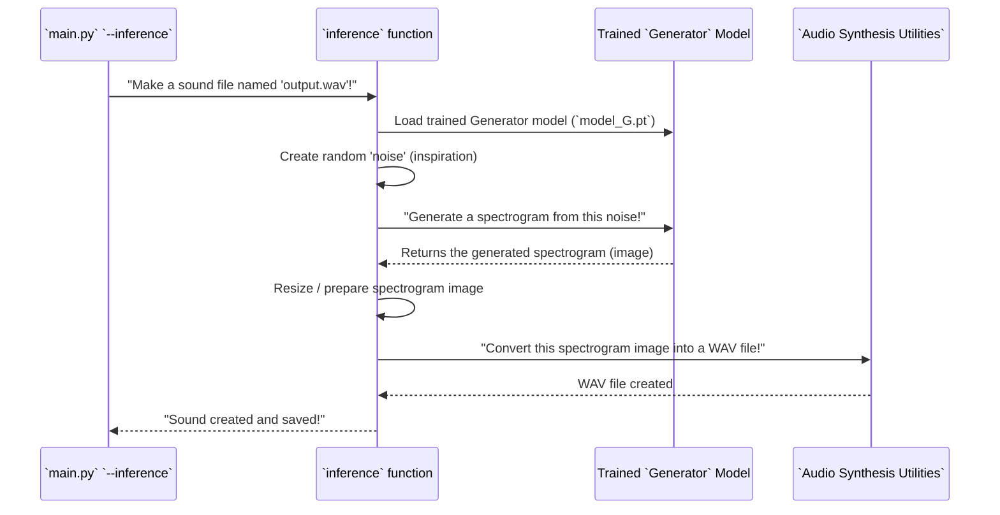

# Chapter 6: GAN Inference Pipeline

In [Chapter 4: Generator Neural Network](04_generator_neural_network_.md), we learned about our "artist" – the Generator. And in [Chapter 5: Discriminator Neural Network](05_discriminator_neural_network_.md), we met the "critic" that helps the artist get better. After countless rounds of training, the Generator becomes a true master at creating new sound "paintings" (spectrograms) that are so convincing, even the Discriminator can't tell them apart from real ones.

But what happens after the artist is fully trained? How do we get it to produce its final masterpieces that we can actually listen to?

This is where the **GAN Inference Pipeline** comes in!

## What is the GAN Inference Pipeline?

Imagine our trained Generator artist is finally ready for a public performance. The **GAN Inference Pipeline** is the entire process of making that happen. It's how SoundGan takes the highly skilled (trained) Generator, gives it a little "inspiration" (random noise), and asks it to create a brand new sound.

**The main problem it solves:** Training a GAN teaches it to generate. But using that learned ability to create an actual, usable output (like a `.wav` file) requires a specific sequence of steps. The Inference Pipeline automates these steps, making it easy to turn a trained model into a functional sound-generating tool.

Its core job is to:
1.  Load the trained Generator model.
2.  Give it some fresh, random "inspiration" (noise).
3.  Get the Generator to draw a new spectrogram (its "painting").
4.  Transform this visual "painting" into an actual sound file (like a WAV).

This is the "performance stage" where the trained GAN produces its final creative output for you to enjoy!

## How to Make SoundGan Generate a New Sound (Inference!)

You've already seen this in [Chapter 1: Application Interfaces](01_application_interfaces_.md)! The most direct way to activate the GAN Inference Pipeline is using the command-line interface.

### Running the Inference Process

To tell SoundGan to create a new sound file, you'll use the simple command:

Open your terminal and navigate to your SoundGan project folder. Then type:

```bash
python main.py --inference
```

**What happens when you run this?**

*   `python main.py`: Starts our main SoundGan application.
*   `--inference`: This special "flag" tells `main.py`, "Hey, I want to use the sound generation (inference) part of the project!"

You will see output similar to this:

```
Starting to create a new sound file...
Sound created and saved as output.wav!
```

After it finishes, you'll find a new audio file named `output.wav` in your project folder, containing your newly generated sound! This entire process, from the command to the final `.wav` file, is the GAN Inference Pipeline in action.

### Simplified `main.py` for Inference

Let's quickly revisit `main.py` to see where it activates our Inference Pipeline:

```python
# gan/main.py (Simplified for inference)
import argparse
import torch
from sources.inference import inference # Import our Inference Pipeline!
from sources.config_loader import Config # And our settings manager

parser = argparse.ArgumentParser()
parser.add_argument('--inference', action='store_true', help='Inference mode.')
args = parser.parse_args()

def main():
    config = Config()
    config.load_config('gan_config.json') # Load all necessary settings
    
    # Determine where calculations will happen (GPU if available, otherwise CPU)
    device = torch.device("cuda:0" if torch.cuda.is_available() else "mps") 
    
    if args.inference:
        print("Starting to create a new sound file...")
        inference(device, config, "output.wav") # Call the Inference Pipeline!
    else:
        print("Please specify training or inference mode.")

if __name__ == "__main__":
    main()
```
When you run `python main.py --inference`, the `main` function first loads all the settings using our [Configuration Manager](02_configuration_manager_.md). Then, it calls the `inference` function (our Inference Pipeline) and passes it the computing `device` (like your GPU), all the `config` settings, and the desired `output_file` name. The `inference` function then takes over to generate the sound.

## Under the Hood: The Pipeline's Steps (`inference.py`)

The `inference` function in `gan/sources/inference.py` is the core of our GAN Inference Pipeline. It brings together the trained Generator and the tools needed to convert its visual output into an audible sound.

### Step-by-Step Flow of Inference

Here's a high-level view of what happens when the `inference` function is called:



### The Inference Pipeline's Code (Simplified)

Let's look at the main parts of the `inference` function in `gan/sources/inference.py` to understand its operations.

```python
# gan/sources/inference.py (Simplified)
import torch
import cv2 # For resizing images
from scipy.io.wavfile import write # To save WAV files

# This function (from Chapter 7) converts the image into actual sound
from .audio_synthesis_utilities import spectrogram_to_wav 

def inference(device, config, output_file="output.wav", prod=False):
    # 1. Load the trained Generator model (our artist from Chapter 4!)
    netG = torch.load(f"{config.saveroot}/model_G.pt", map_location=device)
    netG = netG.to(device) # Send it to the correct device (CPU/GPU)
    netG.eval() # Tell the model it's in 'evaluation' mode (not learning)

    # 2. Create the 'creative spark' (random noise)
    b_size = 1 # We want to generate one sound at a time
    # config.nz is the size of the random noise vector (e.g., 100 numbers)
    z = torch.randn(b_size, config.nz, 1, 1, device=device)  # Random latent vector

    # 3. Ask the Generator to create a sound image!
    # This is where the Generator (from Chapter 4) does its magic!
    imgs = netG(z) 
    
    # 4. Prepare the generated image for conversion to sound
    imgs = imgs.cpu().detach().numpy() # Move to CPU and convert to a normal Python array
    img = imgs[0] # Get the first (and only) generated image
    
    # Resize the image to its original dimensions from the config
    img = cv2.resize(img,
                    (config.original_image_size[1], config.original_image_size[0]),
                    interpolation=cv2.INTER_CUBIC)
    
    # 5. Transform the image into an actual sound file!
    # The [0] is because our spectrograms are grayscale, so we pick the first channel.
    spectrogram_to_wav(img[0], output_file) 
    
    print(f"Sound created and saved as {output_file}!")
    
    # (Optional: If not in production mode, also save a picture of the spectrogram)
    # This part is skipped for simplicity but draws the image you see on disk.
```

**Explanation:**
1.  **`netG = torch.load(...)`**: This line is crucial! It loads the previously saved, trained `Generator` model (which we discussed in [Chapter 4: Generator Neural Network](04_generator_neural_network_.md)). This `model_G.pt` file contains all the "knowledge" and "skills" the Generator learned during training.
2.  **`netG.eval()`**: This puts the Generator into "evaluation mode." It tells the model, "Hey, you're not learning anymore; just produce outputs." This is important because some parts of neural networks behave differently during training vs. evaluation.
3.  **`z = torch.randn(...)`**: Here, we create the "inspiration" – a tensor (a special type of numerical array) filled with random numbers. This `z` (often called a "latent vector" or "noise vector") is the starting point for the Generator's creativity. The `config.nz` value comes from our [Configuration Manager](02_configuration_manager_.md) and defines how many random numbers are in this vector.
4.  **`imgs = netG(z)`**: This is where the magic happens! We feed the random noise (`z`) into our trained Generator (`netG`). The Generator processes this noise through all its internal layers (as learned in [Chapter 4: Generator Neural Network](04_generator_neural_network_.md)) and outputs a spectrogram image (`imgs`).
5.  **`imgs = imgs.cpu().detach().numpy()`**: After the Generator produces the spectrogram, it's often still on the GPU (if you have one) and in a special PyTorch format. This line moves it to the CPU and converts it into a standard NumPy array, which is easier to work with for image processing and saving.
6.  **`img = cv2.resize(...)`**: The Generator might produce spectrograms at a specific internal size. This line uses the `cv2` (OpenCV) library to resize the generated spectrogram `img` to the `original_image_size` specified in our [Configuration Manager](02_configuration_manager_.md). This ensures the output spectrogram is the right size before converting it to sound.
7.  **`spectrogram_to_wav(img[0], output_file)`**: Finally, the prepared spectrogram image is passed to a helper function, `spectrogram_to_wav`. This function, which is part of our [Audio Synthesis Utilities](07_audio_synthesis_utilities_.md) (the next chapter!), takes the visual spectrogram and performs the complex task of turning it into audible sound, saving it to the `output_file` (like `output.wav`).

The `inference` function effectively ties together the trained Generator with the necessary image and audio processing steps to deliver the final creative output of SoundGan.

## Conclusion

In this chapter, we've explored the **GAN Inference Pipeline**, which is the `inference` function in `gan/sources/inference.py`. We learned that it's the full process of using a trained Generator to produce a brand new sound.

We saw how to trigger this pipeline using `python main.py --inference`, and then looked under the hood at the key steps: loading the trained Generator, providing it with random "inspiration," letting it generate a spectrogram, and finally transforming that spectrogram into an audible WAV file.

Next, we'll dive deeper into how that final, crucial step of turning the spectrogram "image" into an actual "sound" happens! Get ready to explore the [Audio Synthesis Utilities](07_audio_synthesis_utilities_.md)!

---

Built by [Cadalytix.com](https://github.com/kmishra1204/codalytix-web)
