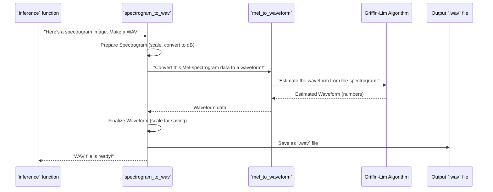

# Chapter 7: Audio Synthesis Utilities

In [Chapter 6: GAN Inference Pipeline](06_gan_inference_pipeline_.md), we saw how our amazing Generator (the "artist") creates beautiful new sound "paintings" – also known as **spectrograms**. These spectrograms are essentially images that show how the frequencies in a sound change over time. But here's the catch: an image of a sound isn't a sound you can *listen* to! It's like having a blueprint for a house but no actual house.

This is where the **Audio Synthesis Utilities** come in!

## What are Audio Synthesis Utilities?

Imagine you have a detailed drawing of a musical score – all the notes, rhythms, and instruments are there, but it's just a picture on paper. To actually hear the music, you need a musician or an orchestra to read that score and play it.

Our **Audio Synthesis Utilities** are those "musicians" for SoundGan. They are special tools that know how to read the spectrogram "blueprints" generated by our Generator and then turn them into actual, audible audio waveforms (like the `.wav` files you listen to).

**The main problem they solve:** The Generator produces abstract, visual representations of sound (spectrograms). These utilities bridge the gap between that visual data and the tangible, playable sound file. They perform complex "reverse engineering" to reconstruct the sound from its visual patterns.

## How are They Used in SoundGan?

You don't directly call these utilities yourself. Instead, they are a crucial last step *inside* the [GAN Inference Pipeline](06_gan_inference_pipeline_.md). When you run `python main.py --inference`, the pipeline first gets a spectrogram from the Generator, and then it hands that spectrogram over to these utilities to be converted into a `.wav` file.

The primary function responsible for this conversion is `spectrogram_to_wav`, which you'll find in `gan/sources/inference.py`.

Let's look at the crucial line from the `inference` function in `gan/sources/inference.py` where this happens:

```python
# gan/sources/inference.py (Simplified)
# ... (imports and other setup) ...

# This function (from Chapter 7) converts the image into actual sound
from .audio_synthesis_utilities import spectrogram_to_wav 

def inference(device, config, output_file="output.wav", prod=False):
    # ... (Generator generates 'imgs' - the spectrogram) ...
    img = imgs[0] # Our generated spectrogram image
    
    # Resize the image to its original dimensions from the config
    img = cv2.resize(img,
                    (config.original_image_size[1], config.original_image_size[0]),
                    interpolation=cv2.INTER_CUBIC)
    
    # 5. Transform the image into an actual sound file!
    # The [0] is because our spectrograms are grayscale, so we pick the first channel.
    spectrogram_to_wav(img[0], output_file) 
    
    print(f"Sound created and saved as {output_file}!")
    # ... (rest of inference function) ...
```
As you can see, `spectrogram_to_wav(img[0], output_file)` is the call that takes the generated spectrogram `img[0]` and the desired `output_file` name, and then performs all the magic to create your sound!

## Under the Hood: The Conversion Process

Turning a spectrogram back into an audio waveform is a bit like reverse-engineering a cake from a recipe. You have the ingredients (frequencies, time) and the baking instructions (how they change), but putting it all back together to get the *taste* (the sound) requires specific steps.

The `spectrogram_to_wav` function uses signal processing techniques, especially something called **Griffin-Lim algorithm**, to achieve this.

### Step-by-Step Conversion Flow

Here's how the `spectrogram_to_wav` utility generally works:



### The `spectrogram_to_wav` Function (Simplified)

Let's dive into the `spectrogram_to_wav` function in `gan/sources/inference.py`:

```python
# gan/sources/inference.py (Simplified spectrogram_to_wav)
import numpy as np
from scipy.io.wavfile import write # To save WAV files
import librosa # The powerful audio processing library

# (This function is defined below in the same file)
def mel_to_waveform(S_dB, sr, n_fft, hop_length): # Our inner musician
    # ... details handled by librosa ...
    return waveform

def spectrogram_to_wav(img, output_path, sr=22050, hop_length=512, n_fft=1024):
    # 1. Prepare the image data
    img = img.astype(np.float32) # Ensure numbers are correct type
    img = (img - img.min()) / (img.max() - img.min()) # Scale from 0 to 1
    
    # 2. Convert to Mel Spectrogram in Decibels (dB)
    # Spectrograms are often represented in decibels (a logarithmic scale for sound intensity).
    S_dB = (img * 80.0) - 80.0 # Convert 0-1 scale back to a typical dB range (e.g., -80 to 0 dB)
    
    # 3. Use mel_to_waveform to get the actual sound waves!
    waveform = mel_to_waveform(S_dB, sr=sr, n_fft=n_fft, hop_length=hop_length)
    
    # 4. Finalize the waveform for saving
    # Ensure it's a single channel if it somehow ended up with multiple.
    if len(waveform.shape) > 1 and waveform.shape[0] > 1:
        waveform = np.mean(waveform, axis=0) # Average multiple channels
    
    # Scale waveform values to fit within the range for a standard audio file (e.g., -32768 to 32767 for int16).
    max_val = np.max(np.abs(waveform))
    waveform = waveform / max_val if max_val > 0 else waveform # Normalize volume
    scaled_waveform = np.clip(waveform * 32767, -32768, 32767).astype(np.int16)
    
    # Make array contiguous (technical detail for efficient saving)
    scaled_waveform = np.ascontiguousarray(scaled_waveform)
    
    # 5. Save the waveform as a WAV file
    write(output_path, sr, scaled_waveform) # Save the sound!
```
This function takes the raw generated image data (`img`), scales it correctly, converts it to decibels (a common way to represent sound intensity), and then passes it to `mel_to_waveform` to do the heavy lifting of sound reconstruction. Finally, it scales the resulting sound waves (`waveform`) to the correct format and saves them as a `.wav` file using `scipy.io.wavfile.write`.

### The `mel_to_waveform` Function: The Core Magician

The real "magic" of reconstructing the sound from its visual representation lies within the `mel_to_waveform` function, also in `gan/sources/inference.py`. It uses the `librosa` library, a powerful tool for audio analysis and synthesis.

```python
# gan/sources/inference.py (Simplified mel_to_waveform)
import librosa # The powerful audio processing library

def mel_to_waveform(S_dB, sr=22050, n_fft=1024, hop_length=512):
    # 1. Convert from Decibels (dB) to Power Spectrogram
    # S_dB is our input spectrogram in decibel scale.
    S_power = librosa.db_to_power(S_dB) # Convert to raw energy (power)
    
    # 2. Invert Mel Scale to Linear Spectrogram (STFT)
    # The spectrogram from our GAN is likely in the "Mel scale" (a human-perception based frequency scale).
    # This step "undoes" that, converting it back to a standard frequency scale (STFT).
    linear_spectrogram = librosa.feature.inverse.mel_to_stft(S_power, sr=sr, n_fft=n_fft)
    
    # 3. Reconstruct Waveform using Griffin-Lim
    # This is the most complex step! Griffin-Lim is an algorithm that tries to
    # estimate the phase information (which is lost when creating a spectrogram)
    # to reconstruct the actual audio waveform. It's an iterative process.
    waveform = librosa.griffinlim(linear_spectrogram, hop_length=hop_length, n_iter=256)
    
    return waveform # Returns the actual sound wave (a series of numbers)
```
**Explanation:**
1.  **`librosa.db_to_power(S_dB)`**: Spectrograms often use a logarithmic decibel (dB) scale for better human perception of loudness. This step converts the values from that dB scale back to a linear "power" scale, representing the raw energy of the sound at different frequencies.
2.  **`librosa.feature.inverse.mel_to_stft(...)`**: Our GAN typically works with "Mel spectrograms," which are filtered to match how humans hear different frequencies. This function undoes that Mel-scale transformation, converting it back into a standard "linear" spectrogram (often called a Short-Time Fourier Transform or STFT). The STFT is a more direct representation of frequency content over time, but it still lacks crucial "phase" information needed for exact sound reconstruction.
3.  **`librosa.griffinlim(...)`**: This is the real star! The Griffin-Lim algorithm is a signal processing trick that iteratively estimates the missing "phase" information from the STFT to reconstruct the actual time-domain audio waveform. Think of it like this: if you have the volume and pitch of a sound at every moment, but you don't know the exact "start point" of each wave, Griffin-Lim tries to guess the best start points to make a coherent sound. It's an approximation, but it works surprisingly well! The `n_iter=256` means it takes 256 "guesses" to get a good result.

Once `griffinlim` completes its work, we have the raw audio waveform – a series of numbers that, when played through your speakers, create the sound you hear!

## Conclusion

In this chapter, we've explored the **Audio Synthesis Utilities**, which are the vital last step in turning SoundGan's generated "image" into an actual "sound." We learned that:

*   They act as a "translator," converting visual spectrograms into audible audio waveforms.
*   The `spectrogram_to_wav` function is the primary utility, orchestrating the conversion.
*   The `mel_to_waveform` function, relying on powerful `librosa` tools like `griffinlim`, performs the core task of reconstructing sound waves from frequency information.

These utilities ensure that the creative power of our Generator can be fully realized, bringing AI-generated sounds to your ears! This marks the end of our beginner-friendly tutorial for SoundGan. We hope you've enjoyed learning about how this exciting project works!

---

Built by [Cadalytix.com](https://github.com/kmishra1204/codalytix-web)
