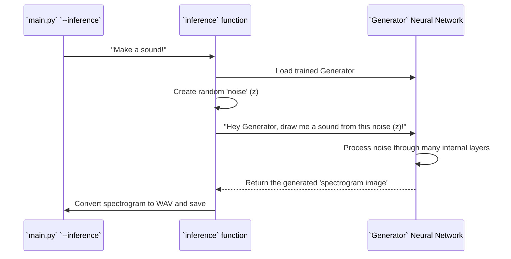

# Chapter 4: Generator Neural Network

In [Chapter 3: GAN Training Orchestrator](03_gan_training_orchestrator_.md), we learned about the "coach" that manages the intense rivalry between two teams: the Generator (the artist) and the Discriminator (the critic). The orchestrator makes sure they both get better by competing. Now, it's time to meet one of those teams up close: the **Generator Neural Network**!

## What is the Generator? The Aspiring Artist

Imagine the Generator as an aspiring artist who wants to create convincing fake paintings. In SoundGan, this neural network (called the `Generator` class in our code) has one main job: **to take random "noise" as input and try to produce realistic-looking audio spectrograms.**

**What problem does it solve?** Humans can't just type "make a happy sound" and expect a computer to magically understand and create it. We need a way for the computer to *learn* how to create new, complex data like sounds. The Generator is our creative engine. It learns to transform simple random numbers into intricate sound "images" (spectrograms).

Its ultimate goal is to get so good that its creations are indistinguishable from real ones, fooling even the cleverest critic (the Discriminator). It's constantly improving its art based on the Discriminator's feedback during training.

## How the Generator Creates Sound (During Inference)

While the Generator is mainly focused on *learning* during training, its most exciting use for us is **creating new sounds** once it's fully trained. You don't directly "run" the Generator yourself. Instead, you tell SoundGan to make a sound using the `--inference` command (as you learned in [Chapter 1: Application Interfaces](01_application_interfaces_.md)), and SoundGan then uses a **trained** Generator behind the scenes.

**Use Case: Generating a New Sound**

When you run `python main.py --inference`, here's how the Generator plays its role:

1.  **Loading the Artist**: SoundGan loads the pre-trained Generator model, which is like bringing the artist back into the studio with all their learned skills.
2.  **Getting the Creative Spark (Noise)**: The Generator needs a starting point, a "creative spark." This is provided by a batch of random numbers, often called "latent noise" or "latent vector." Think of this as the initial idea or inspiration for the new sound.
3.  **Painting the Sound (Generating Spectrogram)**: The Generator takes this random noise and, using all its learned internal connections, transforms it step-by-step into a complex audio spectrogram. This spectrogram is a visual representation of the sound, like a painting of frequencies over time.
4.  **Saving the Masterpiece**: Finally, this generated spectrogram is converted into an actual audio file (like a `.wav` file), which is your brand new, AI-generated sound!

Let's look at a simplified version of the `inference` function (from `gan/sources/inference.py`) to see where the Generator comes into play:

```python
# gan/sources/inference.py (Simplified)
import torch
from sources.generator import Generator # Our Artist!

def inference(device, config, output_file="output.wav"):
    # 1. Load the trained Generator model (our artist!)
    # It loads 'model_G.pt' which is the saved Generator.
    netG = torch.load(f"{config.saveroot}/model_G.pt", map_location=device)
    netG.eval() # Tell the model to be in 'evaluation' mode (not learning)

    # 2. Create the 'creative spark' (random noise)
    # config.nz is the size of our noise vector.
    z = torch.randn(1, config.nz, 1, 1, device=device)

    # 3. Ask the Generator to create a sound image!
    imgs = netG(z) # This is where the magic happens!
    
    # 4. Process the image and save the sound
    # (Details for converting spectrogram to WAV are skipped for now)
    print(f"Sound created and saved as {output_file}!") 

```
In this snippet, `netG = torch.load(...)` brings our trained artist (the Generator) to life. Then, `z = torch.randn(...)` creates the random starting idea. The most crucial line is `imgs = netG(z)`, where the Generator takes the random numbers (`z`) and transforms them into an `imgs` (the spectrogram), which is then saved as an audio file.

## Under the Hood: The Generator's Anatomy (`generator.py`)

The `Generator` class, located in `gan/sources/generator.py`, is built using PyTorch, a powerful library for creating neural networks. It's designed specifically to take a small input (the random noise) and expand it into a larger output (the detailed sound spectrogram).

### How the Generator "Draws" a Spectrogram

Think of the Generator as having many layers, like an artist building a painting layer by layer. It starts with a tiny, abstract idea (the noise) and adds more and more detail through its layers until it becomes a full, realistic image.

Here's a simplified sequence of how the Generator works:



### The Generator's Internal Structure (Simplified Code)

Let's look at the `Generator` class in `gan/sources/generator.py`. It has two main parts:
1.  **`__init__(self, config)`**: This is like setting up the artist's studio – deciding how many canvases they have, what brushes they'll use, etc. It defines all the building blocks (layers) of the neural network.
2.  **`forward(self, z)`**: This is the actual drawing process – taking the input noise (`z`) and passing it through all the layers defined in `__init__` to produce the final output.

Here's a simplified look at the `__init__` method:

```python
# gan/sources/generator.py (Simplified __init__)
import torch.nn as nn # PyTorch's neural network tools

class Generator(nn.Module): # Our Generator is a type of neural network module
    def __init__(self, config):
        super(Generator, self).__init__() # Always start with this line!
        
        # 'config' holds settings like 'nz' (noise size), 'ngf' (generator features), 
        # and 'nc' (number of channels, usually 1 for grayscale spectrograms).
        
        # Layer 1: Takes noise and starts expanding it
        self.conv1 = nn.ConvTranspose2d(config.nz, config.ngf * 32, kernel_size=4, stride=1, padding=0, bias=False)
        self.relu1 = nn.LeakyReLU(0.2, inplace=True) # Adds non-linearity

        # Layer 2-6: More 'upsampling' layers to add detail and size
        # ConvTranspose2d is like a reverse convolution, expanding the image.
        self.conv2 = nn.ConvTranspose2d(config.ngf * 32, config.ngf * 16, kernel_size=4, stride=2, padding=1, bias=False)
        self.relu2 = nn.LeakyReLU(0.2, inplace=True)
        # ... many more similar layers (conv3, conv4, conv5, conv6) ...
        
        # Final Layer: Produces the actual spectrogram image
        self.conv7 = nn.ConvTranspose2d(config.ngf, config.nc, kernel_size=4, stride=2, padding=1, bias=False)
        self.tanh = nn.Tanh() # Squishes output values to -1 to 1 (useful for images)

        # (Weight initialization methods are skipped for simplicity)
```
In `__init__`, we define several `nn.ConvTranspose2d` layers. These are crucial: they are convolution layers that work in reverse, *upsampling* the input. This means they take a small "image" and create a larger one, filling in details as they go. Each layer also has an "activation function" like `LeakyReLU` or `Tanh`, which helps the network learn complex patterns by adding non-linearity, similar to how an artist uses different techniques to add texture and depth.

Now, let's look at the `forward` method, which describes the flow of data through these layers:

```python
# gan/sources/generator.py (Simplified forward method)
import torch # For tensor operations

class Generator(nn.Module):
    # ... (init method from above) ...

    def forward(self, z: torch.Tensor) -> torch.Tensor:
        # 'z' is our input random noise
        # This is like the artist applying their first strokes
        x = self.relu1(self.conv1(z)) 
        
        # Then building up the painting layer by layer
        x = self.relu2(self.conv2(x))
        # ... and so on for conv3, conv4, conv5, conv6 ...
        
        # Finally, the last stroke, producing the finished spectrogram
        x = self.tanh(self.conv7(x)) 
        return x # This 'x' is our generated spectrogram!
```
The `forward` method simply defines the path that the input `z` (the noise) takes through the network. It's a sequence of applying the `ConvTranspose2d` layers followed by their activation functions, progressively building up the spectrogram from the initial random numbers until it reaches the desired size and complexity defined in our [Configuration Manager](02_configuration_manager_.md).

## Conclusion

In this chapter, we've focused on the **Generator Neural Network**, the "artist" of our SoundGan project. We learned that:

*   Its main job is to take random "noise" and transform it into realistic audio spectrograms.
*   During sound generation (inference), a trained Generator is loaded and used to turn this noise into a brand new sound.
*   Internally, the Generator uses layers like `ConvTranspose2d` to "upsample" and add detail, progressively building up the spectrogram from simple random input.

Next, we'll meet the other critical player in the GAN competition: the [Discriminator Neural Network](05_discriminator_neural_network_.md), the "critic" that helps the Generator become a master artist!

---

Built by [Cadalytix.com](https://github.com/kmishra1204/codalytix-web)
