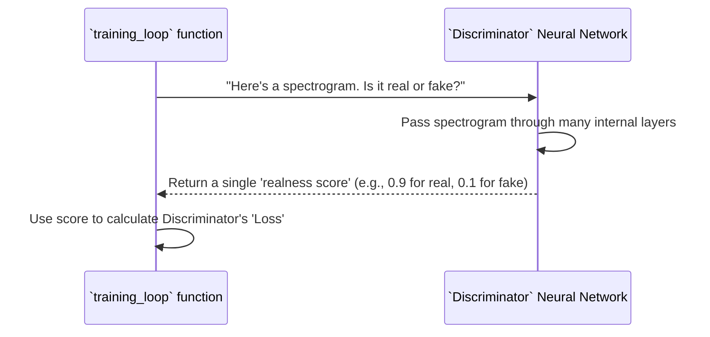

# Chapter 5: Discriminator Neural Network

In [Chapter 4: Generator Neural Network](04_generator_neural_network_.md), we met the "artist" of our SoundGan project, the Generator, whose job is to create new sound "paintings" (spectrograms). But what's an artist without a critic? This is where the **Discriminator Neural Network** comes in!

## What is the Discriminator? The Astute Critic

Picture the Discriminator as an experienced art critic. Its job is simple, yet crucial: **to look at a spectrogram (a visual representation of sound) and decide if it's a genuine piece (from the real dataset) or a forgery (created by the Generator).**

**What problem does it solve?** The Generator, left to its own devices, might create sounds that look realistic but aren't quite "right." We need a way to tell the Generator if its creations are good enough. The Discriminator acts as the Generator's teacher, providing essential feedback. It constantly tries to catch the Generator's fakes, pushing the Generator to get better and better in this adversarial (competitive) game.

Its ultimate goal is to become an expert at distinguishing real sounds from fake ones. By doing so, it forces the Generator to become an equally expert forger, until the fakes are truly undetectable.

## How the Discriminator Learns (During Training)

You don't directly "ask" the Discriminator to tell you if a sound is real or fake. Its primary role is entirely behind the scenes, as a critical part of the **training process** that we discussed in [Chapter 3: GAN Training Orchestrator](03_gan_training_orchestrator_.md).

**Use Case: Guiding the Generator's Learning**

When you run `python main.py --training` (as learned in [Chapter 3: GAN Training Orchestrator](03_gan_training_orchestrator_.md)), the Discriminator is actively involved in every round of the "competition."

Here's how its role plays out within the training loop (which is part of the `training` function in `gan/sources/training.py`):

1.  **See Real Art**: The Discriminator is shown a batch of *real* spectrograms from our sound dataset. It learns to correctly identify these as "real."
2.  **See Fake Art**: The Generator creates a new batch of *fake* spectrograms. The Discriminator is then shown these fakes and learns to correctly identify them as "fake."
3.  **Give Feedback (Loss)**: Based on how well it identified real vs. fake, the Discriminator calculates a "score" (called `lossD`). If it correctly identified everything, its score is low (good!). If it got fooled, its score is high (bad!).
4.  **Improve Strategy**: The Discriminator uses this score to adjust its internal "filters" and connections, getting better at spotting the differences.
5.  **Challenge the Artist**: It then challenges the Generator by saying, "I caught your fakes!" This feedback (indirectly through the loss scores) tells the Generator, "Your art isn't good enough yet, try harder!"

Let's look at a very simplified part of the `training_loop` function (from `gan/sources/training.py`) to see where the Discriminator does its work:

```python
# gan/sources/training.py (Simplified training_loop for Discriminator's turn)
# ... (inside the main competition loop) ...
        
        # --- Discriminator's Turn to Learn ---
        netD.zero_grad() # Clear previous learning adjustments

        # 1. Show Discriminator a REAL sound image
        real_images = data[0].to(device) # Get real images from dataset
        real_output = netD(real_images).view(-1) # Ask Discriminator: "Is this real?"

        # 2. Generator creates a FAKE sound image
        noise = torch.randn(b_size, config.nz, 1, 1, device=device)
        fake_images = netG(noise).detach() # Generator creates fakes

        # 3. Show Discriminator the FAKE sound image
        fake_output = netD(fake_images).view(-1) # Ask Discriminator: "Is this fake?"

        # 4. Calculate Discriminator's 'score' (loss) and improve
        # The goal is for 'real_output' to be high, and 'fake_output' to be low.
        lossD = -real_output.mean() + fake_output.mean() # Simplified loss
        lossD.backward() # Calculate how to adjust internal settings
        optimizerD.step() # Apply the adjustments
        
        # ... (Generator's turn and other details skipped) ...
```
In this simplified code, `netD(real_images)` and `netD(fake_images)` are where the Discriminator makes its judgment. It takes a spectrogram (`real_images` or `fake_images`) and outputs a score (`real_output` or `fake_output`) indicating how "real" it believes the image is. The `lossD` then tells the Discriminator how well it did, allowing it to adjust its "critic's eye" using `lossD.backward()` and `optimizerD.step()`.

## Under the Hood: The Discriminator's Anatomy (`discriminator.py`)

The `Discriminator` class, located in `gan/sources/discriminator.py`, is also built using PyTorch. Unlike the Generator, which expands a small input into a large output, the Discriminator does the opposite: **it takes a large input (a detailed spectrogram) and shrinks it down to a single value, representing its "realness" score.**

### How the Discriminator "Judges" a Spectrogram

Think of the Discriminator as having many layers, like a detective inspecting clues. It starts with the full image, then processes it through layers that gradually extract more important features and reduce the amount of data, until it arrives at a simple "yes" or "no" (or a score very close to 1 for "real" or 0 for "fake").

Here's a simplified sequence of how the Discriminator processes an image:



### The Discriminator's Internal Structure (Simplified Code)

Let's look at the `Discriminator` class in `gan/sources/discriminator.py`. Like the Generator, it has two main parts:
1.  **`__init__(self, config)`**: This sets up the critic's "tools" – defining all the layers that will process and reduce the input image.
2.  **`forward(self, x)`**: This is the actual judgment process – taking the input spectrogram (`x`) and passing it through all the layers to produce the final "realness" score.

Here's a simplified look at the `__init__` method:

```python
# gan/sources/discriminator.py (Simplified __init__)
import torch.nn as nn # PyTorch's neural network tools
import math # Used for calculating output sizes (internal detail)

class Discriminator(nn.Module): # Our Discriminator is a type of neural network
    def __init__(self, config):
        super(Discriminator, self).__init__() # Always start with this line!
        
        # 'config' holds settings like 'nc' (number of channels, usually 1)
        # and 'ndf' (discriminator features).
        
        # Layer 1: Takes the input spectrogram and starts processing it
        # nn.Conv2d performs convolution, which can extract features and reduce size.
        self.conv1 = nn.Conv2d(config.nc, config.ndf, kernel_size=4, stride=2, padding=1, bias=False)
        self.relu1 = nn.LeakyReLU(0.2) # Adds non-linearity

        # Layer 2-5: More 'downsampling' layers to extract features and shrink the image
        # Each Conv2d layer here reduces the size of the image further.
        self.conv2 = nn.Conv2d(config.ndf, config.ndf * 2, kernel_size=4, stride=2, padding=1, bias=False)
        self.relu2 = nn.LeakyReLU(0.2)
        # ... many more similar layers (conv3, conv4, conv5) ...
        
        # Final Layer: Produces the single 'realness' score
        # The last convolution reduces the image to a single 1x1 pixel.
        self.conv6 = nn.Conv2d(config.ndf * 16, 1, kernel_size=4, stride=1, padding=0, bias=False)
        self.flatten = nn.Flatten() # Turns the 1x1 pixel into a single number
        
        # (Weight initialization methods and helper functions are skipped for simplicity)
```
In `__init__`, we define several `nn.Conv2d` layers. These are convolutional layers that perform two main actions: they extract important features from the image (like edges or patterns) and typically *downsample* (shrink) the image size with each step. An "activation function" like `LeakyReLU` helps the network learn complex patterns. Notice how `Conv2d` is used here to reduce dimensions, while the Generator used `ConvTranspose2d` to expand them.

Now, let's look at the `forward` method, which defines the flow of a spectrogram through these layers:

```python
# gan/sources/discriminator.py (Simplified forward method)
import torch # For tensor operations

class Discriminator(nn.Module):
    # ... (init method from above) ...

    def forward(self, x: torch.Tensor) -> torch.Tensor:
        # 'x' is our input spectrogram image
        # This is like the critic's first glance
        x = self.relu1(self.conv1(x)) 
        
        # Then closer inspection, layer by layer
        x = self.relu2(self.conv2(x))
        # ... and so on for conv3, conv4, conv5 ...
        
        # Finally, the definitive judgment, squashed to a single number
        x = self.conv6(x) 
        x = self.flatten(x) # Convert the 1x1 image into a single number
        return x # This 'x' is the Discriminator's 'realness' score!
```
The `forward` method simply defines the path that the input spectrogram `x` takes through the network. It's a sequence of applying the `Conv2d` layers followed by their activation functions, progressively extracting features and reducing the image size until it becomes a single number, which is the Discriminator's final judgment.

## Conclusion

In this chapter, we've explored the **Discriminator Neural Network**, the "critic" of our SoundGan project. We learned that:

*   Its main job is to distinguish between real spectrograms from the dataset and fake ones generated by the Generator.
*   It's a crucial part of the training process, providing feedback to the Generator, helping it improve its ability to create realistic sounds.
*   Internally, the Discriminator uses layers like `Conv2d` to "downsample" and extract important features, reducing a complex spectrogram to a single "realness" score.

Together, the Generator and Discriminator engage in a fascinating adversarial game, driven by the [GAN Training Orchestrator](03_gan_training_orchestrator_.md), until the Generator can create truly convincing sound spectrograms.

Next, we'll see how SoundGan uses these trained models to actually generate new audio files, ready for you to listen to! Get ready to explore the [GAN Inference Pipeline](06_gan_inference_pipeline_.md)!

---

Built by [Cadalytix.com](https://github.com/kmishra1204/codalytix-web)
