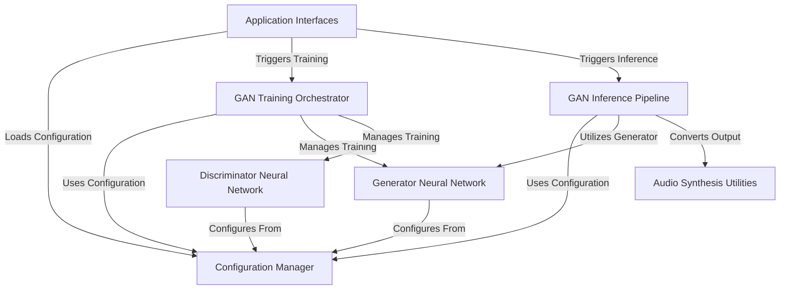

# Tutorial: SoundGan

SoundGan is a project that leverages **Generative Adversarial Networks (GANs)** to create *synthetic audio*. It functions by training two neural networks: a **Generator**, which learns to produce realistic audio spectrograms from random noise, and a **Discriminator**, acting as a critic to distinguish real spectrograms from those created by the Generator. Once trained, the system can utilize the **Generator** to produce new, unique audio files by converting the generated spectrograms into audible sound waveforms.

**Source Repository:** [https://github.com/Fosowl/SoundGan](https://github.com/Fosowl/SoundGan)

## Chapters

1. [Application Interfaces
](01_application_interfaces_.md)
2. [Configuration Manager
](02_configuration_manager_.md)
3. [GAN Training Orchestrator
](03_gan_training_orchestrator_.md)
4. [Generator Neural Network
](04_generator_neural_network_.md)
5. [Discriminator Neural Network
](05_discriminator_neural_network_.md)
6. [GAN Inference Pipeline
](06_gan_inference_pipeline_.md)
7. [Audio Synthesis Utilities
](07_audio_synthesis_utilities_.md)

---

Built by [Cadalytix.com](https://github.com/kmishra1204/codalytix-web)
