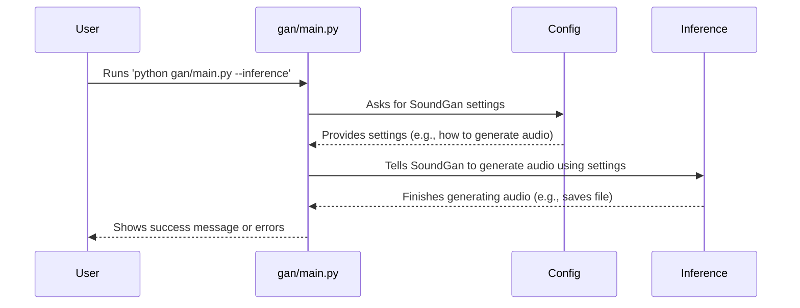
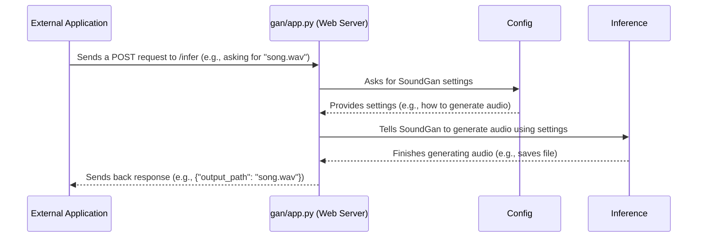

# Chapter 1: System Entry Points

Welcome to the world of `SoundGan`! Imagine `SoundGan` as a powerful robot that can create amazing new sounds and music. But like any robot, you need a way to tell it what to do. How do you give it instructions? How do you ask it to generate a new piece of music?

This is where "System Entry Points" come in! Think of entry points as the main "doorways" or "buttons" you can press to make `SoundGan` work. They are the different ways you, or another computer program, can interact with `SoundGan` and tell it what task to perform.

So, what problem does this solve? Well, if `SoundGan` only had one way to interact, it might not be flexible enough. For example, you might want to:
1.  **Directly train `SoundGan`** on your computer to learn new sounds, or
2.  **Ask `SoundGan` to create a sound** right now from your computer, or
3.  **Build a website or app** that lets *other people* generate sounds using `SoundGan` without them needing to run complex commands.

`SoundGan` provides different entry points for these different needs, making it super versatile!

## The Two Main Doorways of `SoundGan`

`SoundGan` has two primary "doorways" you can use to interact with it:

1.  **The Command-Line Interface (CLI)**: This is like talking directly to `SoundGan` using text commands in your computer's terminal (a program like Command Prompt on Windows or Terminal on macOS/Linux). It's great for direct control and running tasks yourself. The code for this lives mainly in `gan/main.py`.
2.  **The Web API (Application Programming Interface)**: This is like `SoundGan` setting up a server that other programs can talk to. It's fantastic if you want to integrate `SoundGan` into another application (like a website or a mobile app) so that they can request `SoundGan` to generate audio. The code for this lives mainly in `gan/app.py`.

Let's explore each doorway!

## Doorway 1: The Command-Line Interface (`main.py`)

This doorway is for when you want to directly control `SoundGan` from your computer's terminal. It's perfect for things like teaching `SoundGan` new things (called "training") or making it generate a single sound file (called "inference").

### How to Use `main.py`

Imagine you want `SoundGan` to generate a new sound for you. You can do this by opening your terminal, navigating to the `SoundGan` project folder, and running a simple command.

To tell `SoundGan` to generate a sound (this is called "inference"):

```bash
python gan/main.py --inference
```

If you wanted to teach `SoundGan` new things (this is called "training"):

```bash
python gan/main.py --training
```

When you run these commands, `SoundGan` will start working on your request. If you specify `--inference`, it will try to create a sound file named `output.wav` (by default). If you specify `--training`, it will begin the process of learning.

### What's Inside `main.py`? (Simplified Look)

Let's peek behind the curtain of `main.py`. It uses a tool called `argparse` to understand what you're asking it to do (like `--training` or `--inference`).

```python
# File: gan/main.py (Simplified)

import argparse
# ... other imports like torch, training, inference, Config ...

# This part helps SoundGan understand your commands
parser = argparse.ArgumentParser()
parser.add_argument('--training', action='store_true', help='Training mode.')
parser.add_argument('--inference', action='store_true', help='Inference mode.')
args = parser.parse_args()

def main():
    # We'll learn about Config in [Chapter 2: Configuration Management](02_configuration_management_.md)!
    # config = Config()
    # config.load_config('gan_config.json')

    # This figures out if you have a powerful graphics card (GPU)
    # or if it should use your computer's main processor (CPU).
    # device = torch.device("cuda:0" if torch.cuda.is_available() else "mps")

    if args.inference:
        # If you asked for inference, SoundGan generates a sound!
        print("SoundGan is now generating audio...")
        # inference(device, config, "output.wav") # Details in [Chapter 5: Inference and Audio Synthesis](05_inference_and_audio_synthesis_.md)!
    elif args.training:
        # If you asked for training, SoundGan learns!
        print("SoundGan is now learning to create audio...")
        # training(device, config) # Details in [Chapter 4: Training Process](04_training_process_.md)!
    else:
        print("Please tell SoundGan what to do: --training or --inference")

if __name__ == "__main__":
    main()
```
**Explanation:**
*   The `argparse` part is like a "command interpreter" for `SoundGan`, helping it understand `—training` or `—inference`.
*   The `if args.inference:` and `elif args.training:` blocks are like switches. Depending on your command, `SoundGan` will either call the `inference` function (to create sound) or the `training` function (to learn). Don't worry about the `device` or `config` lines for now; we'll cover `Config` in [Chapter 2: Configuration Management](02_configuration_management_.md). The `inference` and `training` processes are big topics, so they get their own chapters: [Chapter 5: Inference and Audio Synthesis](05_inference_and_audio_synthesis_.md) and [Chapter 4: Training Process](04_training_process_.md).

## Doorway 2: The Web API (`app.py`)

This doorway is for when other computer programs want to talk to `SoundGan`. Imagine you're building a website where users can click a button to generate custom sound effects. That website won't run `python gan/main.py` itself. Instead, it will send a request to a `SoundGan` server. This is where the Web API comes in.

### How to Use `app.py`

First, you need to start the `SoundGan` web server. Open your terminal and run:

```bash
python gan/app.py
```
This command makes `SoundGan` "listen" for requests on a specific address (like `http://0.0.0.0:5050`).

Once the server is running, another program can send a message (called a "request") to it, asking it to generate audio. For example, using a tool called `curl` (which lets you send web requests), you could ask `SoundGan` to generate an audio file named `my_new_song.wav`:

```bash
curl -X POST -H "Content-Type: application/json" -d '{"output_file": "my_new_song.wav"}' http://127.0.0.1:5050/infer
```

**Expected Output (if successful):**

```json
{"output_path": "my_new_song.wav", "error": ""}
```

This output tells the requesting program where `SoundGan` saved the generated audio file.

### What's Inside `app.py`? (Simplified Look)

`app.py` uses a library called `FastAPI` to create the web server.

```python
# File: gan/app.py (Simplified)

import uvicorn
from fastapi import FastAPI
# ... other imports like torch, inference, Config ...

app = FastAPI() # This creates our web application

@app.post("/infer")
def infer(input_data: dict):
    # We'll learn about Config in [Chapter 2: Configuration Management](02_configuration_management_.md)!
    # config = Config()
    # config.load_config('gan_config.json')

    # This figures out if you have a powerful graphics card (GPU)
    # or if it should use your computer's main processor (CPU).
    # device = torch.device("cuda:0" if torch.cuda.is_available() else "mps")

    try:
        # The 'input_data' dictionary contains info like the desired output filename.
        print(f"Web API received request to generate: {input_data['output_file']}")
        # inference(device, config, input_data["output_file"], prod=True) # Details in [Chapter 5: Inference and Audio Synthesis](05_inference_and_audio_synthesis_.md)!
        return {"output_path": input_data["output_file"], "error": ""}
    except Exception as e:
        return {"output_path": "", "error": str(e)}

if __name__ == '__main__':
    # This line starts the web server, making SoundGan listen for requests!
    print("SoundGan web server is starting...")
    uvicorn.run(debug=True, port=5050, host="0.0.0.0")
```
**Explanation:**
*   `app = FastAPI()` sets up the core of our web server.
*   `@app.post("/infer")` tells `SoundGan` that if someone sends a `POST` request to the `/infer` address (like `http://127.0.0.1:5050/infer`), it should run the `infer` function.
*   The `infer` function receives `input_data` (like `{"output_file": "my_new_song.wav"}`) and then calls the same `inference` process that `main.py` uses.
*   `uvicorn.run(...)` is the command that actually starts the server, making `SoundGan` ready to receive web requests.

## How It All Works Under the Hood

Let's visualize the journey when you use these entry points.

### CLI (`main.py`) Workflow

When you run a command like `python gan/main.py --inference`, here's a simplified step-by-step process:


1.  **You (the User)** type a command into your terminal and press Enter.
2.  **`gan/main.py`** starts running. It immediately reads your command (`--inference` or `--training`).
3.  `main.py` then needs to know *how* to do what you asked. It talks to the `Config` (short for [Configuration Management](02_configuration_management_.md)) to load all the necessary settings.
4.  Once it has the settings, `main.py` calls the specific part of `SoundGan` responsible for either `training` or `inference`.
5.  After the task is done, `main.py` lets you know if it was successful or if there were any problems.

### Web API (`app.py`) Workflow

When another program (like a website) sends a request to `SoundGan`'s web API, here's what happens:


1.  First, **`gan/app.py`** must be running as a server, waiting for requests.
2.  An **External Application** (like your website) sends a special message (a "POST request") to the `SoundGan` server's `/infer` "address", telling it what audio file name to use.
3.  **`gan/app.py`** receives this request. Just like `main.py`, it talks to the `Config` to load `SoundGan`'s settings.
4.  Then, `app.py` calls the `inference` process within `SoundGan` to create the audio.
5.  Finally, `app.py` sends a reply back to the External Application, telling it where the new audio file was saved, or if something went wrong.

## Conclusion

In this chapter, we learned that `SoundGan` is not just one big program but has two main "doorways" or "entry points" for interacting with it:

*   **`main.py` for Command-Line Interface (CLI)**: This is for direct, manual control from your terminal, ideal for training or one-off audio generation tasks.
*   **`app.py` for Web API**: This turns `SoundGan` into a server that other applications can talk to, making it easy to integrate `SoundGan`'s audio generation capabilities into websites or other services.

Understanding these entry points helps you choose the right way to make `SoundGan` work for your specific needs. In the next chapter, we'll dive into how `SoundGan` manages all its settings and preferences, which is crucial for both training and inference.

[Next Chapter: Configuration Management](02_configuration_management_.md)

---

Built by [Codalytix.com](Codalytix.com)
