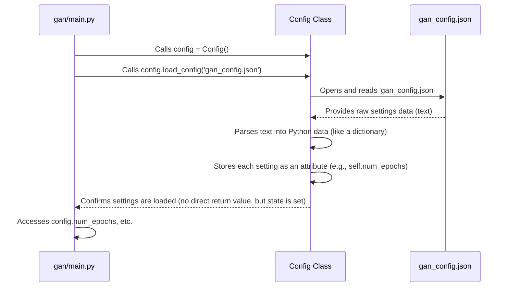

# Chapter 2: Configuration Management

Welcome back to the `SoundGan` journey! In [Chapter 1: System Entry Points](01_system_entry_points_.md), we learned how to tell `SoundGan` what to do using different "doorways" like the Command-Line Interface (`main.py`) or the Web API (`app.py`). You might have noticed some mysterious lines in those files, like `config = Config()` that were commented out. Well, the mystery is about to be solved!

Imagine `SoundGan` as a powerful audio creation robot. When you tell it to *train* (learn to make sounds) or *infer* (create a sound), it needs to know *how* to do it. How many times should it practice? What size "pictures" of sound should it look at? How fast should it learn? These are all "settings" or "parameters" that guide `SoundGan`'s work.

## The Problem: Hardcoding Settings

What if these settings were buried deep inside the code?

```python
# A hypothetical bad example (DO NOT DO THIS!)
def training_function():
    num_epochs = 100 # Oh no, what if I want to train for 200 epochs?
    image_size = 64  # What if I want 128?
    # ... lots of other settings hardcoded here ...
    print(f"Training for {num_epochs} epochs with image size {image_size}")
    # ... training logic ...
```

If you wanted to change `num_epochs` from 100 to 200, you'd have to edit the code directly, save the file, and then run it again. This is messy, error-prone, and makes it hard to remember what settings you used for different experiments. It's like having a robot whose instruction manual is written directly onto its circuits!

## The Solution: Configuration Management!

This is where "Configuration Management" comes to the rescue! Think of it as the "settings menu" for `SoundGan`. Instead of embedding these values directly into the code, we load them from a special, easy-to-read file. This file acts like a central "recipe book" for `SoundGan`.

### Why is this important?

*   **Flexibility:** You can easily change settings (like the number of training epochs or image sizes) without touching the core code. This is perfect for trying out different "recipes" for your SoundGan robot.
*   **Consistency:** Everyone working on `SoundGan` can use the same set of default settings, ensuring consistency across different runs and environments.
*   **Experimentation:** You can quickly switch between different configurations (e.g., one for quick tests, one for long, high-quality training) by simply loading a different settings file.

## `SoundGan`'s Settings Menu: The `Config` Class and `gan_config.json`

`SoundGan` uses a special Python class called `Config` to manage all its settings. This `Config` class reads all the values from a separate file, usually named `gan_config.json`. A `.json` file (JSON stands for JavaScript Object Notation) is a popular, simple format for storing data in a way that both humans and computers can easily understand.

### Example `gan_config.json` File

Let's look at a simplified version of what `gan_config.json` might contain:

```json
{
    "num_epochs": 500,
    "image_size": 128,
    "batch_size": 64,
    "lr_G": 0.0002,
    "saveroot": "gan_results/",
    "dataroot": "gan_data/"
}
```
**Explanation:**
*   This file stores key-value pairs, like a dictionary.
*   `"num_epochs": 500` tells `SoundGan` to train for 500 "epochs" (one full pass through the training data).
*   `"image_size": 128` means `SoundGan` will process sound data as 128x128 pixel "images" (more on this in [Chapter 3: GAN Models](03_gan_models__generator___discriminator__.md)).
*   `"saveroot": "gan_results/"` specifies where `SoundGan` should save its output, like generated audio or training progress.

## How to Use the `Config` System

Let's see how `SoundGan` uses this settings menu. Remember those commented-out lines in `main.py` and `app.py`? Now we'll uncomment them!

Here's how you'd typically use `Config` in `main.py` (or `app.py`):

```python
# File: gan/main.py (Simplified - showing Config usage)

# 1. First, we need the Config class itself
from gan.sources.config_loader import Config
# ... other imports like torch, training, inference ...

def main():
    # 2. Create an empty Config object (like an empty settings menu)
    config = Config()

    # 3. Tell the Config object to load settings from our JSON file
    config.load_config('gan_config.json')

    # Now, all our settings are loaded and ready to use!
    print(f"SoundGan is configured to train for {config.num_epochs} epochs.")
    print(f"Output will be saved in: {config.saveroot}")

    # ... rest of main.py logic (using config values for training/inference) ...
    # training(device, config) # This 'training' function would use config.num_epochs, etc.

if __name__ == "__main__":
    main()
```
**Explanation:**
1.  `from gan.sources.config_loader import Config`: This line imports the `Config` class, making it available in our `main.py` file. It's like bringing the "settings manager" into the room.
2.  `config = Config()`: This creates a new, empty instance of our `Config` object. It's like opening an empty settings menu.
3.  `config.load_config('gan_config.json')`: This is the crucial step! We tell our `config` object to read all the settings from the `gan_config.json` file. Now, our settings menu is filled with all the values from the file.
4.  `config.num_epochs`, `config.saveroot`: After loading, you can access any setting by using `config.` followed by the setting's name (e.g., `num_epochs`, `image_size`, `saveroot`).

When you run `python gan/main.py`, it will now print the values loaded from your `gan_config.json` file. If you change `num_epochs` in the JSON file and rerun `main.py`, you'll see the updated value without touching any Python code!

## Under the Hood: How `Config` Works

Let's peek inside the `gan/sources/config_loader.py` file to understand how the `Config` class does its magic.

### The Workflow of Loading Settings

When `config.load_config('gan_config.json')` is called, here's what happens:



1.  **`main.py` creates `Config`:** You first create an empty `Config` object.
2.  **`main.py` tells `Config` to load:** You then tell the `Config` object to `load_config` from `gan_config.json`.
3.  **`Config` reads the JSON file:** The `Config` object opens the `gan_config.json` file and reads its content (which is text).
4.  **`Config` parses the JSON:** It uses Python's built-in `json` library to convert this text into a Python dictionary. This is like turning a written recipe into actual ingredients you can work with.
5.  **`Config` stores the settings:** It then takes each key-value pair from that dictionary (e.g., `num_epochs: 500`) and stores it as an attribute within itself (e.g., `self.num_epochs = 500`).
6.  **`main.py` uses stored settings:** Now, when `main.py` asks for `config.num_epochs`, the `Config` object simply provides the `500` value it stored.

### The `Config` Class Code (`config_loader.py`)

Let's look at the simplified code for the `Config` class:

```python
# File: gan/sources/config_loader.py (Simplified)
import json # We need this to read JSON files

class Config:
    def __init__(self):
        # When a Config object is first created,
        # all its settings start as empty (None)
        self.saveroot = None
        self.dataroot = None
        self.num_epochs = None
        self.image_size = None
        self.batch_size = None
        self.lr_G = None
        # ... many more settings are defined here as None initially ...

    def load_config(self, config_path):
        # This function takes the path to your settings file (e.g., 'gan_config.json')
        with open(config_path, 'r') as f:
            # 1. Open the file and read its content using json.load()
            # This turns the JSON text into a Python dictionary
            config_data = json.load(f)

        # 2. Now, take each value from the dictionary and store it
        # as an attribute (a variable) within our Config object.
        # We use .get() to safely retrieve values, in case a setting is missing.
        self.saveroot = config_data.get('saveroot')
        self.dataroot = config_data.get('dataroot')
        self.num_epochs = config_data.get('num_epochs')
        self.image_size = config_data.get('image_size')
        self.batch_size = config_data.get('batch_size')
        self.lr_G = config_data.get('lr_G')
        # ... all other settings are assigned here in the same way ...
```
**Explanation:**
*   `import json`: This line brings in Python's built-in `json` library, which is a powerful tool for working with JSON data.
*   `class Config:`: This defines our "settings manager" blueprint.
*   `def __init__(self):`: This is a special method that runs automatically when you create a new `Config()` object. It sets up all the possible settings as `None` (meaning "no value yet"). This prepares the `Config` object to hold settings.
*   `def load_config(self, config_path):`: This is the method you call to load settings.
    *   `with open(config_path, 'r') as f:`: This opens the specified file (like `gan_config.json`) in "read" (`'r'`) mode. The `with` statement ensures the file is automatically closed afterwards.
    *   `config_data = json.load(f)`: This is the magic! The `json.load()` function reads the entire content of the file `f` and automatically converts the JSON text into a Python dictionary. For example, the `gan_config.json` above would become a Python dictionary like `{"num_epochs": 500, "image_size": 128, ...}`.
    *   `self.saveroot = config_data.get('saveroot')`: After `json.load()` gives us the dictionary, this line takes the value associated with the key `'saveroot'` from that dictionary and assigns it to the `saveroot` attribute of our `Config` object (e.g., `config.saveroot` will now be `"gan_results/"`). It does this for all the defined settings.

## Conclusion

In this chapter, we've unlocked the power of "Configuration Management" in `SoundGan`. We learned that instead of hardcoding values directly into the program, `SoundGan` uses:

*   A `gan_config.json` file as its central "settings menu" or "recipe book."
*   The `Config` class (from `gan/sources/config_loader.py`) as the "manager" that reads this recipe book and makes all the settings available to other parts of `SoundGan`.

This system provides incredible flexibility, allowing you to easily adjust `SoundGan`'s behavior for different tasks (like training duration or output paths) without ever changing the core Python code. This separation of concerns is a fundamental concept in software development!

Now that we understand how `SoundGan` knows *what to do*, we're ready to dive into the core components that actually *make* and *distinguish* sounds: the Generator and Discriminator models.

[Next Chapter: GAN Models (Generator & Discriminator)](03_gan_models__generator___discriminator__.md)

---

Built by [Codalytix.com](Codalytix.com)
