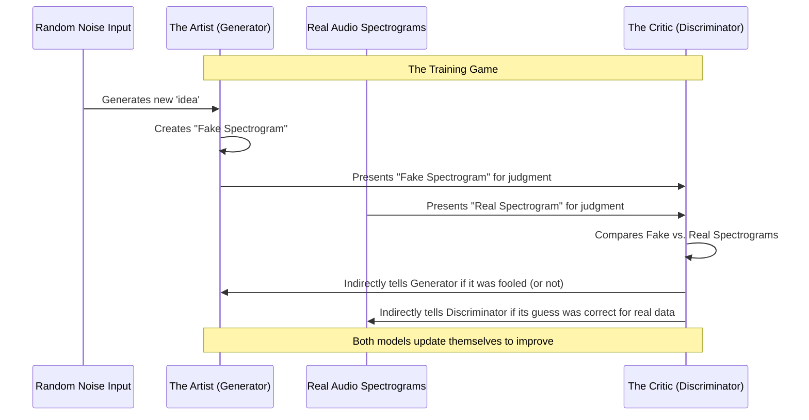

# Chapter 3: GAN Models (Generator & Discriminator)

Welcome back to the `SoundGan` journey! In [Chapter 2: Configuration Management](02_configuration_management_.md), we learned how `SoundGan` uses a `Config` file to load all its settings, acting like a recipe book for how it operates. Now that `SoundGan` knows *what kind* of sounds to create (based on its configuration), let's explore *who* actually creates these sounds and *who* judges them.

### The Problem: How to Invent New Sounds?

Imagine you want `SoundGan` to create a brand new piece of music, a unique sound effect, or even a voice that's never existed before. It's not about mixing existing sounds; it needs to *invent* something from scratch that still sounds realistic and believable. How can a computer learn to be so creative?

This is where Generative Adversarial Networks (GANs) come in! They are a special type of Artificial Intelligence (AI) designed to generate new data (like images, text, or in our case, audio spectrograms) that looks and feels so real, it's hard to tell the difference from actual data.

## What is a GAN?

GAN stands for **G**enerative **A**dversarial **N**etwork. Let's break down that fancy name:

*   **Generative**: This means it *creates* new things. In `SoundGan`'s case, it generates new "pictures" of sound.
*   **Adversarial**: This is the exciting part! It means two different parts of the network are *competing* against each other, like opponents in a game.
*   **Network**: It's made of special computer programs called neural networks, which are inspired by how our brains work.

The core of any GAN, including `SoundGan`, relies on these two competing parts: the **Generator** and the **Discriminator**. Let's meet them!

### Audio Spectrograms: The "Pictures" of Sound

Before we meet our two main characters, it's important to understand what `SoundGan` actually "creates." `SoundGan` doesn't directly output raw audio waves. Instead, it works with **audio spectrograms**.

Imagine taking a sound, like a musical note or a drum beat, and turning it into a picture. This picture, called a spectrogram, visually shows how the sound changes over time. Different colors or brightness in the picture represent different frequencies (like high notes vs. low notes) and how strong they are.

So, when `SoundGan` "generates audio," it's actually creating these detailed spectrogram "pictures." Once these pictures are made, another part of `SoundGan` (which we'll cover in [Chapter 5: Inference and Audio Synthesis](05_inference_and_audio_synthesis_.md)) converts them back into actual sound you can hear!

## Meet the Players: Generator and Discriminator

Think of the Generator and Discriminator as an artist and an art critic playing a continuous game.

### 1. The Generator: The Creative Artist

*   **Role**: The Generator is like an aspiring artist who wants to create masterpieces. In `SoundGan`, its job is to create **fake audio spectrograms** that look and sound as real as possible.
*   **Goal**: To fool the Discriminator into thinking its creations are genuine.
*   **Input**: It starts with random "noise" – imagine a blank canvas or a burst of random ideas.
*   **Output**: A newly generated, fake audio spectrogram.

The Generator learns by trying to make its fakes so convincing that the Discriminator can't tell them apart from real spectrograms.

### 2. The Discriminator: The Strict Art Critic

*   **Role**: The Discriminator is like a seasoned art critic who can tell a real masterpiece from a forgery. In `SoundGan`, its job is to look at an audio spectrogram and decide if it's **real** (from a dataset of actual sounds) or **fake** (created by the Generator).
*   **Goal**: To correctly identify real spectrograms and spot the fakes.
*   **Input**: An audio spectrogram (which could be either a real one from a dataset or a fake one from the Generator).
*   **Output**: A "judgment" – essentially a score that says how "real" it thinks the input spectrogram is.

The Discriminator learns by trying to become a better detective, improving its ability to spot even the most convincing forgeries.

## The "Game": Adversarial Training

The magic of GANs happens when these two models play a game against each other. This game is what we call **adversarial training**.

Here's how it works in simple steps:

1.  **Generator's Turn**: The Generator takes some random noise and tries to create a new, fake audio spectrogram.
2.  **Discriminator's Challenge**: The Discriminator is shown two kinds of spectrograms:
    *   Some are **real** spectrograms taken from `SoundGan`'s training data (actual sound recordings).
    *   Others are the **fake** spectrograms just created by the Generator.
3.  **Discriminator's Judgment**: The Discriminator then tries its best to label each spectrogram correctly: "This is real" or "This is fake."
4.  **Learning and Improving**:
    *   If the Discriminator correctly identifies a fake, the **Generator learns to make better fakes** next time.
    *   If the Discriminator is fooled by a fake, the **Discriminator learns to be a better critic** next time.

This constant back-and-forth competition pushes both models to improve. The Generator becomes incredibly good at producing realistic new sounds, and the Discriminator becomes highly skilled at identifying even subtle imperfections. It's like an arms race between a forger and a detective!

## How `SoundGan` Uses Them (High-Level)

You don't typically "use" the Generator and Discriminator separately in the traditional sense like running a single command. Instead, they are the fundamental components that power `SoundGan`'s ability to learn and create.

The primary way you interact with them is during the [Training Process](04_training_process_.md), where they play their adversarial game. Once `SoundGan` is trained, the Generator is then used on its own to perform [Inference and Audio Synthesis](05_inference_and_audio_synthesis_.md) – that is, to create new audio from random noise!

## Under the Hood: The Inner Workings

Let's visualize the "game" they play and then peek at their code to see how they are built.

### The Adversarial Workflow

When `SoundGan` is training, here’s a simplified look at the flow between the Generator and Discriminator:



This cycle repeats many, many times during training, refining both the Generator's creativity and the Discriminator's critical eye.

### Inside the Generator (`gan/sources/generator.py`)

The Generator's job is to take a small, random input and "expand" it into a full, detailed audio spectrogram. It uses special layers called `ConvTranspose2d` (also known as "deconvolutional" layers) that are good at upscaling data.

```python
# File: gan/sources/generator.py (Simplified)
import torch.nn as nn

class Generator(nn.Module):
    def __init__(self, config):
        super(Generator, self).__init__()
        # config.nz: Size of the random noise input (e.g., 100)
        # config.ngf: Base number of features for the Generator
        # config.nc: Number of color channels in the output spectrogram (often 1 for grayscale)
        
        # This layer takes the small random noise and starts "building" a larger image
        self.conv1 = nn.ConvTranspose2d(config.nz, config.ngf * 32, kernel_size=4, stride=1, padding=0, bias=False)
        self.relu1 = nn.LeakyReLU(0.2, inplace=True) # Activation function
        
        # ... more ConvTranspose2d layers here, each making the image bigger and more detailed ...
        
        # The final layer outputs the complete spectrogram, with 'config.nc' channels
        self.conv7 = nn.ConvTranspose2d(config.ngf, config.nc, kernel_size=4, stride=2, padding=1, bias=False)
        self.tanh = nn.Tanh() # Scales the output values to a useful range (-1 to 1)

    def forward(self, z: torch.Tensor) -> torch.Tensor:
        # 'z' is the input random noise (like a seed for the creative process)
        x = self.relu1(self.conv1(z))
        # ... data flows through all the other layers ...
        x = self.tanh(self.conv7(x)) # The final generated spectrogram
        return x
```

**Explanation:**
The Generator receives a `config` object (from [Chapter 2: Configuration Management](02_configuration_management_.md)) to know how big the random noise should be (`config.nz`), how many intermediate features to use (`config.ngf`), and the final size of the spectrogram it needs to produce. The `forward` method describes the step-by-step process of how the random noise `z` is transformed through these layers into the final generated `x` (the spectrogram).

### Inside the Discriminator (`gan/sources/discriminator.py`)

The Discriminator's job is to take an input spectrogram (either real or fake) and "shrink" it down to a single "real or fake" score. It uses standard `Conv2d` layers (convolutional layers) that are good at finding patterns and reducing image size.

```python
# File: gan/sources/discriminator.py (Simplified)
import torch.nn as nn

# This helper is just for calculating output sizes, not part of the GAN's core logic.
def conv_output_size(input_size, kernel_size, stride, padding):
    return (input_size + 2 * padding - kernel_size) // stride + 1

class Discriminator(nn.Module):
    def __init__(self, config):
        super(Discriminator, self).__init__()
        # config.nc: Number of channels in the input spectrogram
        # config.ndf: Base number of features for the Discriminator
        # config.image_size: Dimensions (width, height) of the spectrogram it judges
        
        # This layer starts processing the input spectrogram, looking for patterns
        self.conv1 = nn.Conv2d(config.nc, config.ndf, kernel_size=4, stride=2, padding=1, bias=False)
        self.relu1 = nn.LeakyReLU(0.2) # Activation function
        
        # ... more Conv2d layers here, each reducing the image and extracting more complex features ...
        
        # The final layer outputs a single value that represents its "realness" score
        self.conv6 = nn.Conv2d(config.ndf * 16, 1, kernel_size=4, stride=1, padding=0, bias=False)
        self.flatten = nn.Flatten() # Converts the final output into a single score

    def forward(self, x: torch.Tensor) -> torch.Tensor:
        # 'x' is the input spectrogram (could be real or fake)
        x = self.relu1(self.conv1(x))
        # ... data flows through all the other layers ...
        x = self.conv6(x)
        x = self.flatten(x) # The final "realness" score
        return x
```

**Explanation:**
The Discriminator also takes a `config` object to know the input spectrogram's channels (`config.nc`) and its internal processing details (`config.ndf`). The `forward` method shows how the input spectrogram `x` is processed through multiple layers. Each `Conv2d` layer helps it analyze the image and reduce its size, until the `flatten` layer converts the final patterns into a single number representing its judgment: Is it real or fake?

## Conclusion

In this chapter, we've unveiled the core players of any Generative Adversarial Network: the **Generator** and the **Discriminator**.

*   The **Generator** is `SoundGan`'s creative artist, learning to produce highly realistic audio spectrograms from random noise.
*   The **Discriminator** is `SoundGan`'s strict art critic, learning to distinguish between real spectrograms and the Generator's fakes.

Through their continuous "game," both models push each other to become better, ultimately allowing `SoundGan` to generate new, convincing audio. Now that we understand *who* the models are, we're ready to dive into *how* this "game" is actually played and how they learn and improve during the **training process**.

[Next Chapter: Training Process](04_training_process_.md)

---

Built by [Codalytix.com](Codalytix.com)
