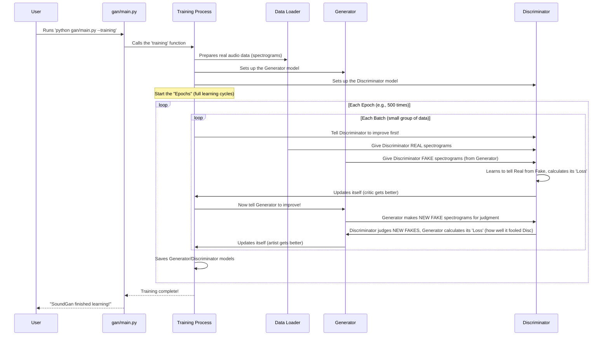

# Chapter 4: Training Process

Welcome back to the `SoundGan` journey! In [Chapter 3: GAN Models (Generator & Discriminator)](03_gan_models__generator___discriminator__.md), we met our two main characters: the creative **Generator** (the artist) and the strict **Discriminator** (the critic). We learned what they are and their roles in the "game" of creating new sounds. But how do they actually *learn* to play this game? How do they get better over time?

### The Problem: How Does `SoundGan` Learn to Be Creative?

Imagine you have a new artist and a new art critic. They both need practice to get really good at their jobs. The artist needs to learn what makes art look realistic, and the critic needs to learn how to spot even the most clever fakes. This learning doesn't happen instantly; it requires a structured, repetitive process of trial and error.

For `SoundGan`, this learning phase is called the **Training Process**. It's where the Generator and Discriminator repeatedly play their adversarial game, constantly improving their skills until the Generator can create highly realistic audio spectrograms that are almost indistinguishable from real ones.

## What is the Training Process? (The "School" for `SoundGan`)

The "Training Process" is like sending `SoundGan` to a specialized school where the Generator and Discriminator endlessly practice their roles. It's the core learning phase that involves:

1.  **Loading Data:** Showing `SoundGan` lots of real examples (real audio spectrograms).
2.  **Playing the Game (Iterations & Epochs):** Letting the Generator and Discriminator play their "art game" over and over again.
3.  **Measuring Performance (Loss):** Calculating "scores" to see how well each model is doing and where they made mistakes.
4.  **Adjusting Internal "Weights" (Optimization):** Using these scores to tell the models how to fix their mistakes and improve.
5.  **Special Techniques:** Using advanced "coaching tricks" to make the learning more stable and effective.

Let's dive into how this school operates!

## How to Start Training `SoundGan`

Remember in [Chapter 1: System Entry Points](01_system_entry_points_.md) when we discussed `main.py`? That's your primary "doorway" to tell `SoundGan` to start learning.

To begin the training process, you simply open your terminal, navigate to your `SoundGan` project, and run:

```bash
python gan/main.py --training
```

When you run this command, `SoundGan` will:
1.  Load its settings from `gan_config.json` (thanks to [Chapter 2: Configuration Management](02_configuration_management_.md)!).
2.  Set up the Generator and Discriminator models (as discussed in [Chapter 3: GAN Models](03_gan_models__generator___discriminator__.md)).
3.  Then, it will start the long, iterative process of playing the adversarial game, adjusting its models, and saving its progress!

## The Training Game: Step by Step

Let's visualize the "school day" for `SoundGan`'s Generator and Discriminator.



This diagram shows the main flow. Now, let's look at some simplified code from `gan/sources/training.py` to see how these steps are implemented.

### 1. Setting Up (from `gan/sources/training.py`)

The `training` function is the main orchestrator for the entire process. It sets up everything needed before the learning game begins.

```python
# File: gan/sources/training.py (Simplified)
import torch
import torch.optim as optim
import torch.utils.data
from sources.generator import Generator
from sources.discriminator import Discriminator
from sources.plotting import plot_loss # For later monitoring

def training(device, config):
    # 1. Prepare Data: Load our real audio spectrograms
    dataloader = prepare_data(config)

    # 2. Setup Models: Bring our artist and critic to the stage
    netG = setup_generator(config, device) # The Generator
    netD = setup_discriminator(config, device) # The Discriminator

    # 3. Setup Optimizers: These are like the "coaches" for our models,
    # telling them how to adjust their "weights" (internal knowledge)
    optimizerD = optim.Adam(netD.parameters(), lr=config.lr_D, betas=(config.beta1, 0.999))
    optimizerG = optim.Adam(netG.parameters(), lr=config.lr_G, betas=(config.beta1, 0.999))

    # 4. Start the main training loop!
    img_list, G_losses, D_losses = training_loop(netD, netG, optimizerD, optimizerG, dataloader, device, config)

    # After training, we might plot graphs or save final models
    # plot_loss(G_losses, D_losses)
    # ... more saving and reporting logic ...
```

**Explanation:**
*   `prepare_data(config)`: This function (we'll see it next) gets all the real audio spectrograms ready for `SoundGan` to learn from.
*   `setup_generator(config, device)` and `setup_discriminator(config, device)`: These functions create the actual Generator and Discriminator models (the ones we learned about in [Chapter 3: GAN Models](03_gan_models__generator___discriminator__.md)) and put them on the correct `device` (CPU or GPU).
*   `optimizerD` and `optimizerG`: These are crucial. An "optimizer" is a special algorithm that tells a neural network *how* to change its internal "weights" (its learned knowledge) based on the "loss" (its mistakes). `Adam` is a popular choice for this. `lr` (learning rate) determines how big of a step the models take when adjusting.
*   `training_loop(...)`: This is where the core "game" takes place.

### 2. Preparing the Data

Before the training game starts, `SoundGan` needs to load its "training material" – the real audio spectrograms.

```python
# File: gan/sources/training.py (Simplified)
import torchvision.datasets as datasets
import torchvision.transforms as transforms
import torch.utils.data

def prepare_data(config):
    # This loads images from the 'dataroot' folder (from config.dataroot)
    dataset = datasets.ImageFolder(root=config.dataroot,
                                   transform=transforms.Compose([
                                           transforms.Resize(config.image_size), # Resize all images to a standard size
                                           transforms.CenterCrop(config.image_size), # Crop to make sure they are square
                                           transforms.ToTensor(), # Convert images to a format PyTorch understands
                                           transforms.Normalize((0.5,), (0.5,)), # Adjust pixel values for better training
                                   ]))
    # A DataLoader helps efficiently feed batches of images to the models
    dataloader = torch.utils.data.DataLoader(dataset,
                                             batch_size=config.batch_size, # Number of images to process at once
                                             shuffle=True, # Mix up the images each time
                                             num_workers=config.workers) # Use multiple workers for faster loading
    return dataloader
```

**Explanation:**
*   `datasets.ImageFolder`: This is a convenient tool that finds all image files (our spectrograms) inside the folder specified by `config.dataroot`.
*   `transforms.Compose`: Spectrograms come in various sizes. These "transforms" make sure every spectrogram is resized, cropped, and prepared in a consistent way (e.g., all 128x128 pixels, normalized to a -1 to 1 range) before being fed into the models.
*   `torch.utils.data.DataLoader`: Instead of loading all images at once (which can use a lot of memory), the `DataLoader` delivers them in small groups called "batches." This is more efficient. `shuffle=True` means the order of images changes each "epoch," helping the models learn better.

### 3. The Core Training Loop (`training_loop` function)

This is the heart of the training process, where the Generator and Discriminator play their game for many "epochs."

```python
# File: gan/sources/training.py (Simplified)
import torch # For tensors and operations
# ... other imports for netD, netG, optimizers, etc. ...

def training_loop(netD, netG, optimizerD, optimizerG, dataloader, device, config):
    print("start training...")
    for epoch in range(config.num_epochs): # Outer loop: Number of times SoundGan sees ALL data
        for i, data in enumerate(dataloader, 0): # Inner loop: Iterating through batches of data

            ############################
            # 1. Update Discriminator: Make the critic better!
            ###########################
            netD.zero_grad() # Clear old "mistake" records for Discriminator

            # a. Train with REAL spectrograms
            real_cpu = data[0].to(device) # Get a batch of real spectrograms
            noisy_real = add_instance_noise(real_cpu, current_noise_std) # Add a tiny bit of noise (a stability trick!)
            real_output = netD(noisy_real).view(-1) # Discriminator judges real images

            # b. Train with FAKE spectrograms (created by the Generator)
            noise = torch.randn(b_size, config.nz, 1, 1, device=device) # Get some random input for Generator
            fakes = netG(noise) # Generator creates fake spectrograms
            noisy_fakes = add_instance_noise(fakes.detach(), current_noise_std) # Add noise to fakes (another trick)
            fake_output = netD(noisy_fakes).view(-1) # Discriminator judges fake images

            # c. Calculate Discriminator's total "mistake" (Loss)
            # This combines how well it judged real, fake, and a "gradient penalty" (stability trick for GANs)
            gp = gradient_penalty(netD, noisy_real, noisy_fakes, device)
            lossD = -real_output.mean() + fake_output.mean() + 10 * gp # This is the "Wasserstein GAN" loss

            lossD.backward() # Tells PyTorch to figure out how much each part of Discriminator contributed to the mistake
            optimizerD.step() # Discriminator's "coach" tells it how to adjust its knowledge

            ############################
            # 2. Update Generator: Make the artist better at fooling!
            ###########################
            netG.zero_grad() # Clear old "mistake" records for Generator

            # Generator creates new fakes, and we see how well Discriminator is fooled by them
            output = netD(fakes).view(-1) # Discriminator judges the *new* fakes from Generator
            lossG = -output.mean() # Generator wants Discriminator to think its fakes are real (so output should be high)

            lossG.backward() # Tells PyTorch to figure out how much each part of Generator contributed to its mistake
            optimizerG.step() # Generator's "coach" tells it how to adjust its knowledge

            # Print progress and save current loss values
            if i % 50 == 0:
                print(f'[{epoch}/{config.num_epochs}][{i}/{len(dataloader)}]\tLoss_D: {lossD.item():.4f}\tLoss_G: {lossG.item():.4f}')

        # After each epoch, save the current models
        torch.save(netD.state_dict(), f"{config.saveroot}/checkpoints/checkpoint_D_{epoch}.pt")
        torch.save(netG.state_dict(), f"{config.saveroot}/checkpoints/checkpoint_G_{epoch}.pt")

    # Save final models after all epochs are done
    torch.save(netD, f"{config.saveroot}/model_D.pt")
    torch.save(netG, f"{config.saveroot}/model_G.pt")
    # ... return losses for plotting ...
```

**Explanation of `training_loop`'s core concepts:**

*   **`for epoch in range(config.num_epochs)`:** This is the outer loop. An "epoch" means the Generator and Discriminator have processed every single real spectrogram in the training dataset *once*. We usually run hundreds or thousands of epochs.
*   **`for i, data in enumerate(dataloader, 0)`:** This is the inner loop. In each epoch, we go through the data in small "batches." An "iteration" refers to processing one batch.
*   **`netD.zero_grad()` / `netG.zero_grad()`:** Before calculating new mistakes, we clear any old "mistake memory" from the previous steps.
*   **Discriminator Update (`Update D network` section):**
    *   **Real Data:** The Discriminator looks at `real_cpu` (real spectrograms) and tries to say "this is real." `real_output` is its judgment.
    *   **Fake Data:** The Generator (`netG`) creates `fakes` from random `noise`. The Discriminator then looks at these `fakes` and tries to say "this is fake." `fake_output` is its judgment.
    *   **`gradient_penalty` (`gp`):** This is a special technique unique to Wasserstein GANs (a type of GAN) that helps stabilize training and prevent common issues. It essentially encourages the Discriminator's judgments to behave in a smooth, predictable way.
    *   **`lossD`:** This is the Discriminator's "mistake score." It combines how well it correctly identified real images, how well it identified fake images, and includes the `gradient_penalty`. The goal for the Discriminator is to minimize this loss.
    *   **`lossD.backward()`:** This is where the magic of "backpropagation" happens. It tells the Discriminator's internal weights how much they contributed to the `lossD` mistake.
    *   **`optimizerD.step()`:** Based on the `backward()` calculation, the `optimizerD` adjusts the Discriminator's weights to make it better at its job next time.
*   **Generator Update (`Update G network` section):**
    *   The Generator (`netG`) creates `fakes` again.
    *   The Discriminator judges these `fakes` (`output`).
    *   **`lossG`:** This is the Generator's "mistake score." The Generator *wants* to fool the Discriminator, so its loss is calculated based on how `real` the Discriminator thinks its `fakes` are. The goal for the Generator is to maximize its ability to fool, which means minimizing this loss.
    *   **`lossG.backward()` and `optimizerG.step()`:** Similar to the Discriminator, this calculates and applies updates to the Generator's weights based on its `lossG`.
*   **`add_instance_noise`:** This is another "trick" to help GANs train more stably. It adds a very small amount of random noise to both real and fake images before they go into the Discriminator. It's like blurring the lines slightly to make the critic's job a tiny bit harder, which helps the models learn better overall.
*   **`torch.save(...)`:** After each epoch, `SoundGan` saves the current state of both the Generator and Discriminator models. These "checkpoints" are vital because if training stops unexpectedly, you can restart from the last saved point. Also, you can pick the best performing model from all epochs.

This entire dance between the Generator and Discriminator, repeated thousands or millions of times over many hours or days, is how `SoundGan` gradually learns to produce amazing, realistic audio spectrograms from nothing but random noise!

## Conclusion

In this chapter, we've gone deep into the "Training Process" – the core learning phase of `SoundGan`. We learned that it's an iterative game between the **Generator** (the artist) and the **Discriminator** (the critic), guided by "loss" calculations and "optimizers" that help them improve.

We saw how to kick off training using `main.py --training` and got a peek under the hood at how data is prepared, models are set up, and how the core adversarial game unfolds in the `training_loop`, with special techniques like `gradient_penalty` and `add_instance_noise` helping the process.

With `SoundGan` now having completed its "schooling" and learned to create realistic spectrograms, the next exciting step is to see how we can use this trained knowledge to actually generate new audio that you can hear!

[Next Chapter: Inference and Audio Synthesis](05_inference_and_audio_synthesis_.md)

---

Built by [Codalytix.com](Codalytix.com)
