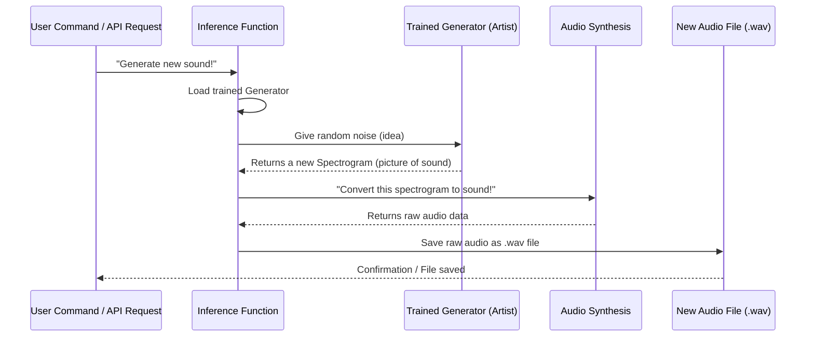

# Chapter 5: Inference and Audio Synthesis

Welcome back to the `SoundGan` journey! In [Chapter 4: Training Process](04_training_process_.md), we witnessed the incredible "schooling" of our `SoundGan` models, where the **Generator** (the artist) and the **Discriminator** (the critic) learned to play their adversarial game. By the end of this process, our Generator has become incredibly skilled at creating realistic "pictures" of sound (spectrograms) from just random ideas.

### The Problem: Turning Pictures into Playable Sounds

Now, what do we do with our highly trained "artist"? It can draw beautiful spectrograms, but how do we turn those abstract images into actual, audible sounds that we can listen to, share, or use in our projects? A spectrogram is a picture, not an audio file!

This is where "Inference and Audio Synthesis" comes in! It's the exciting final step where we put our trained Generator to work, giving it a random "idea" and letting it create a brand new spectrogram. Then, using clever signal processing techniques, we transform that generated spectrogram "picture" into a real, listenable audio file (like a `.wav` file). It's the process that brings the abstract data to life as sound!

## What is Inference and Audio Synthesis?

Let's break down this concept into its two main parts:

1.  **Inference**: This is about using our already **trained Generator model**. Remember, during training, the Generator learned how to create spectrograms that fool the Discriminator. "Inference" simply means we're *inferring* or *generating* new data (spectrograms) using that learned knowledge. We don't need the Discriminator anymore for this step, just our creative artist!
2.  **Audio Synthesis**: This is the process of taking the generated spectrogram "picture" and converting it into an actual **audible sound wave**. This involves some specialized signal processing to reverse the process of creating a spectrogram from sound.

Think of it this way: the Generator is like an artist who can draw detailed blueprints (spectrograms) for a building. Audio Synthesis is like the construction crew that takes those blueprints and turns them into a real, tangible building (an audio file).

## How to Create New Sounds with `SoundGan`

As we saw in [Chapter 1: System Entry Points](01_system_entry_points_.md), `SoundGan` offers two main ways to interact with it: the Command-Line Interface (CLI) and the Web API. Both can be used to perform inference!

### 1. Using the Command-Line Interface (`main.py`)

This is the simplest way to tell `SoundGan` to generate a single audio file right from your computer's terminal.

```bash
python gan/main.py --inference
```

**What happens:**
*   `SoundGan` loads its settings (from [Chapter 2: Configuration Management](02_configuration_management_.md)).
*   It then loads your *trained* Generator model (the artist).
*   It gives the Generator a random "idea" (a "noise" vector).
*   The Generator creates a new spectrogram.
*   `SoundGan` then converts that spectrogram into a `.wav` file, usually named `output.wav` by default, and saves it in your project folder. You can then play this file!

### 2. Using the Web API (`app.py`)

If you want another program (like a website or a mobile app) to request `SoundGan` to generate audio, you'd use the Web API.

First, you need to start the `SoundGan` web server:

```bash
python gan/app.py
```

Once the server is running, another program (or you, using a tool like `curl`) can send a request to generate an audio file, specifying the desired output name:

```bash
curl -X POST -H "Content-Type: application/json" -d '{"output_file": "my_new_sound.wav"}' http://127.0.0.1:5050/infer
```

**What happens:**
*   The `SoundGan` web server (`app.py`) receives the request.
*   It then performs the same inference steps as the CLI: loads the trained Generator, generates a spectrogram, and converts it to a `.wav` file (e.g., `my_new_sound.wav`).
*   It sends a confirmation back to the requesting program.

In both cases, the core "Inference and Audio Synthesis" process is the same; it's just triggered differently.

## Under the Hood: From Idea to Sound Wave

Let's see the journey from a random "idea" to an actual sound file.

### The Inference Workflow

When `SoundGan` performs inference, here's a simplified step-by-step process:



Now, let's dive into the actual code within `gan/sources/inference.py` that makes this magic happen.

### 1. The `inference` Function (`gan/sources/inference.py`)

This function orchestrates the entire process.

```python
# File: gan/sources/inference.py (Simplified)
import torch
import cv2 # For image resizing
import matplotlib.pyplot as plt # For saving image preview
# ... other imports for audio synthesis ...

def inference(device, config, output_file="output.wav", prod=False):
    # 1. Load the trained Generator model (our artist!)
    netG = torch.load(f"{config.saveroot}/model_G.pt", map_location=device)
    netG.eval() # Tell the model to be in 'evaluation' mode (not training)

    # 2. Generate a random "idea" (noise vector) for the Generator
    b_size = 1 # We want to generate one sound at a time
    z = torch.randn(b_size, config.nz, 1, 1, device=device)

    # 3. Let the Generator create a new spectrogram from the noise
    imgs = netG(z) # The Generator creates our "picture of sound"

    # 4. Prepare the spectrogram for audio conversion
    img = imgs.cpu().detach().numpy() # Move data to CPU and convert to numpy
    img = img[0] # Get the first (and only) spectrogram
    img = cv2.resize(img,
                    (config.original_image_size[1], config.original_image_size[0]),
                    interpolation=cv2.INTER_CUBIC) # Resize to original dimensions

    # 5. Convert the spectrogram "picture" to an actual .wav sound file
    spectrogram_to_wav(img[0], output_file)

    # 6. (Optional) Save a visual of the generated spectrogram
    if prod == False:
        plt.imshow(img[0], cmap='viridis', aspect='auto')
        plt.axis('off')
        plt.savefig("runs/output_inference.png")
        plt.close()
```

**Explanation:**
*   `netG = torch.load(...)`: This loads the *saved* Generator model. During [Training Process](04_training_process_.md), `SoundGan` saves the `model_G.pt` file, which contains all the Generator's learned knowledge.
*   `netG.eval()`: This line is important for neural networks. It tells the Generator to stop learning and just focus on generating, which can make its output more consistent.
*   `z = torch.randn(...)`: This creates the "random idea" (a "noise" vector). It's just a bunch of random numbers that act as a seed for the Generator's creativity. `config.nz` (from [Chapter 2: Configuration Management](02_configuration_management_.md)) defines how many random numbers are in this "idea."
*   `imgs = netG(z)`: This is where the magic happens! We feed the random `z` into our trained `netG` (Generator), and it outputs `imgs`, which are our newly generated spectrograms.
*   `img = cv2.resize(...)`: The Generator often creates spectrograms at a specific size (e.g., 128x128 pixels). This line resizes it back to its original desired dimensions, which can be important for accurate audio conversion.
*   `spectrogram_to_wav(img[0], output_file)`: This is the critical step that calls a separate function to perform the actual "audio synthesis" – turning the spectrogram image data into a `.wav` file. We'll look at this function next.
*   The `plt.savefig` part is just to create a visual image file of the generated spectrogram, so you can see what the "picture" looks like before it's converted to sound.

### 2. Audio Synthesis: `spectrogram_to_wav` and `mel_to_waveform`

These two functions are responsible for the "Audio Synthesis" part, turning the spectrogram image into sound. They are found in the same `gan/sources/inference.py` file.

#### `spectrogram_to_wav` Function (Simplified)

```python
# File: gan/sources/inference.py (Simplified)
import numpy as np
import cv2
from scipy.io.wavfile import write # For saving WAV files
# ... import librosa for mel_to_waveform ...

def spectrogram_to_wav(img, output_path, sr=22050, hop_length=512, n_fft=1024):
    # 1. Prepare the image data (normalize it)
    img = img.astype(np.float32)
    img = (img - img.min()) / (img.max() - img.min())

    # 2. Convert the image to a decibel-scaled mel spectrogram
    # (This scales the pixel values to sound intensity levels)
    S_dB = (img * 80.0) - 80.0 # Standard conversion for mel spectrograms

    # 3. Use a specialized function to convert mel spectrogram to waveform
    waveform = mel_to_waveform(S_dB, sr=sr, n_fft=n_fft, hop_length=hop_length)

    # 4. Normalize the waveform (adjust volume) and convert to a savable format
    max_val = np.max(np.abs(waveform))
    waveform = waveform / max_val if max_val > 0 else waveform
    scaled_waveform = np.clip(waveform * 32767, -32768, 32767).astype(np.int16)
    scaled_waveform = np.ascontiguousarray(scaled_waveform) # Make sure it's ready for saving

    # 5. Save the final sound to a WAV file
    write(output_path, sr, scaled_waveform)
```

**Explanation:**
*   `img = (img - img.min()) / (img.max() - img.min())`: This line simply ensures the image's pixel values are between 0 and 1.
*   `S_dB = (img * 80.0) - 80.0`: This is a standard way to convert the normalized pixel values back into a "decibel" (dB) scale, which represents the intensity of sound. A spectrogram is often displayed in decibels.
*   `waveform = mel_to_waveform(...)`: This is the core conversion function that does the heavy lifting, which we'll look at next.
*   The scaling and clipping steps (`waveform / max_val`, `waveform * 32767`, `np.clip`) prepare the raw sound data to be saved as a standard `.wav` file, adjusting its volume and ensuring it fits within the proper range.
*   `write(output_path, sr, scaled_waveform)`: This `scipy` function takes the processed sound data (`scaled_waveform`) and saves it as a `.wav` file at the specified `output_path` with the correct sample rate (`sr`).

#### `mel_to_waveform` Function (Simplified)

```python
# File: gan/sources/inference.py (Simplified)
import librosa # A powerful audio analysis library
import numpy as np

def mel_to_waveform(S_dB, sr=22050, n_fft=1024, hop_length=512):
    # 1. Convert decibel (dB) spectrogram to power spectrogram
    # This reverses the logarithmic scaling used for human hearing
    S_power = librosa.db_to_power(S_dB)

    # 2. Convert mel-scaled spectrogram to linear-frequency spectrogram (STFT)
    # This transforms the "picture" from a human-hearing-focused scale
    # to a more direct representation of sound frequencies
    linear_spectrogram = librosa.feature.inverse.mel_to_stft(S_power, sr=sr, n_fft=n_fft)

    # 3. Reconstruct waveform using Griffin-Lim algorithm
    # This is the "magic" step! It's an algorithm that tries to guess
    # the missing phase information (which is needed to convert frequencies
    # back into an actual sound wave) and reconstruct the sound.
    waveform = librosa.griffinlim(linear_spectrogram, hop_length=hop_length, n_iter=256)
    return waveform
```

**Explanation:**
This function uses the amazing `librosa` library, which is a common tool for audio analysis and synthesis in Python.
*   `librosa.db_to_power(S_dB)`: Spectrograms are often stored using a decibel scale (logarithmic) because that's how humans perceive sound intensity. This converts it back to a linear "power" scale.
*   `librosa.feature.inverse.mel_to_stft(...)`: `SoundGan`'s spectrograms are "mel-scaled," meaning they are designed to represent frequencies similar to how the human ear hears them. This function `inverse` transforms them back to a standard "Short-Time Fourier Transform" (STFT) spectrogram, which is a more direct mathematical representation of sound frequencies.
*   `librosa.griffinlim(...)`: This is the final and most critical step for audio synthesis from a spectrogram. When a sound is converted to a spectrogram, some information (called "phase") is lost. The Griffin-Lim algorithm is a clever way to *estimate* this lost information and iteratively reconstruct a waveform (the actual sound wave) that closely matches the input spectrogram. It's like having the blueprints (spectrogram) and trying to figure out the exact materials and assembly order (phase) to build the house (waveform). `n_iter` means how many times it tries to refine its guess.

This multi-step process effectively reverses the transformation from sound to spectrogram, allowing `SoundGan` to bring its generated "pictures of sound" to life!

## Conclusion

In this chapter, we've brought `SoundGan` full circle! We learned that "Inference and Audio Synthesis" is the process of using our trained **Generator** (the artist) to:

1.  Take a random "idea" (noise vector).
2.  Create a brand new "picture of sound" (spectrogram).
3.  Then, using clever signal processing techniques (like `librosa.griffinlim`), transform that spectrogram into an actual, audible `.wav` audio file.

We saw how to trigger this process using both the `main.py` CLI and the `app.py` Web API, and we peeked under the hood to understand how the `inference` function works and how `spectrogram_to_wav` and `mel_to_waveform` convert abstract data into listenable sound.

Now that `SoundGan` can generate sounds, how do we keep track of its performance, especially during the long training process? That's what we'll explore in the next chapter: "Monitoring and Reporting."

[Next Chapter: Monitoring and Reporting](06_monitoring_and_reporting_.md)

---

Built by [Codalytix.com](Codalytix.com)
