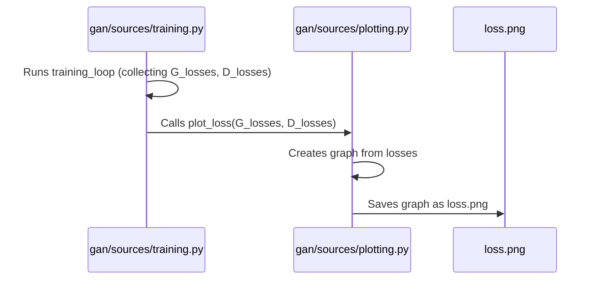
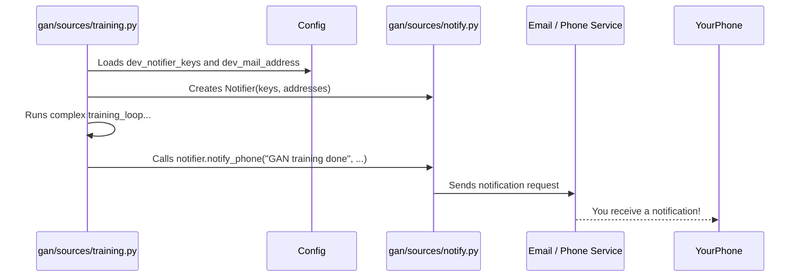

# Chapter 6: Monitoring and Reporting

Welcome back to the `SoundGan` journey! In [Chapter 5: Inference and Audio Synthesis](05_inference_and_audio_synthesis_.md), we saw how our trained **Generator** can create entirely new sounds from scratch. That's exciting! But before `SoundGan` can generate amazing audio, it first needs to go through a long and often complex [Training Process](04_training_process_.md).

### The Problem: Is `SoundGan` Learning Well?

Imagine you're teaching a student a very complex new skill, like playing a musical instrument for the first time. You wouldn't just tell them to practice for 100 hours and come back. You'd want to check on their progress regularly: Are they holding the instrument correctly? Are they hitting the right notes? Are they improving?

Training a Generative Adversarial Network (GAN) like `SoundGan` is very similar. It's a long process, often taking hours or even days, and it can be tricky. You need to know:
*   Is it actually learning, or is it stuck?
*   Are both the **Generator** and **Discriminator** improving properly?
*   Is the quality of the generated sounds getting better?
*   What happens if the training finishes, or if something goes wrong, and you're not sitting in front of your computer?

This is where "Monitoring and Reporting" comes in! It's like having a helpful assistant or a "dashboard" that keeps an eye on `SoundGan`'s health and performance during training. It makes sure you're kept informed, whether through graphs, visual examples, or even automated alerts.

## What is Monitoring and Reporting?

This concept focuses on observing the progress and performance of `SoundGan` during training and after it's completed. It includes:
1.  **Visualizing Key Metrics**: Showing how well the **Generator** and **Discriminator** are performing over time using graphs (like their "losses").
2.  **Saving Visual Examples**: Taking "snapshots" of the spectrograms `SoundGan` is generating so you can see their quality.
3.  **Sending Notifications**: Alerting you when training starts, finishes, or encounters an issue.

Let's explore how `SoundGan` provides these valuable insights.

## How `SoundGan` Monitors Its Training

The "Monitoring and Reporting" features are primarily active when you run the [Training Process](04_training_process_.md) using the command line:

```bash
python gan/main.py --training
```

When you run this, `SoundGan` doesn't just train; it also automatically logs its progress and reports back to you!

### 1. Visualizing Progress with Graphs (Loss Plots)

Remember from [Chapter 4: Training Process](04_training_process_.md) that both the **Generator** and **Discriminator** have a "loss" value, which is like their "mistake score." During training, `SoundGan` tracks these scores. After training finishes, it automatically creates a graph showing how these losses changed over time.

**What to expect:**
After `SoundGan` completes its training, you'll find a file named `loss.png` in your `SoundGan` project folder. This image will show you two lines: one for the Generator's loss and one for the Discriminator's loss. You want to see them generally decreasing and possibly balancing out, indicating healthy competition and learning.

**Under the Hood: `gan/sources/plotting.py` (plot_loss function)**

The `training` function in `gan/sources/training.py` collects the loss values during the entire training process. Once training is complete, it calls a function from `gan/sources/plotting.py` to create and save this graph.

Here's a simplified look at the `plot_loss` function:

```python
# File: gan/sources/plotting.py (Simplified)
from matplotlib import pyplot as plt

def plot_loss(G_losses, D_losses):
    plt.figure(figsize=(10,5))
    plt.title("Generator and Discriminator Loss During Training")
    plt.plot(G_losses, label="G") # Plot Generator's losses
    plt.plot(D_losses, label="D") # Plot Discriminator's losses
    plt.xlabel("iterations")
    plt.ylabel("Loss")
    plt.legend()
    plt.savefig("loss.png") # Saves the graph as an image file
```

**Explanation:**
*   `matplotlib.pyplot as plt`: This imports a popular Python library called Matplotlib, which is excellent for creating all sorts of graphs.
*   `plot_loss(G_losses, D_losses)`: This function takes two lists of numbers (`G_losses` for Generator mistakes, `D_losses` for Discriminator mistakes).
*   `plt.plot(...)`: These lines draw the actual lines on the graph.
*   `plt.savefig("loss.png")`: This important line saves the finished graph as an image file named `loss.png` in your project folder.

**How the `training` function uses it:**



This ensures that every time you finish training `SoundGan`, you automatically get a visual summary of how well it learned!

### 2. Seeing What `SoundGan` Creates (Spectrogram Examples)

Beyond just numbers, it's very helpful to *see* what `SoundGan` is generating. Are the spectrograms starting to look realistic? Are they just static? `SoundGan` helps you by saving a visual comparison of real spectrograms and the fake ones created by the **Generator**.

**What to expect:**
After training, you'll find another file named `real_fake.png` in your `SoundGan` project folder. This image will show you a grid of real spectrograms (from the training data) next to a grid of fake spectrograms (generated by the **Generator** at the end of training). This allows you to visually inspect the quality of the `SoundGan`'s output.

**Under the Hood: `gan/sources/plotting.py` (plot_real_fake function)**

Similar to the loss plot, the `training` function calls another function from `gan/sources/plotting.py` to create this visual comparison.

Here's a simplified look at the `plot_real_fake` function:

```python
# File: gan/sources/plotting.py (Simplified)
import numpy as np
import torchvision.utils as vutils # For arranging images in a grid
from matplotlib import pyplot as plt

def plot_real_fake(real_batch, img_list, device):
    plt.figure(figsize=(15,15))
    plt.subplot(1,2,1)
    plt.axis("off")
    plt.title("Real spectrogram")
    # Displays a grid of real spectrograms
    plt.imshow(np.transpose(vutils.make_grid(real_batch[0].to(device)[:64], padding=5, normalize=True).cpu(),(1,2,0)))
    
    plt.subplot(1,2,2)
    plt.axis("off")
    plt.title("Fake spectrogram")
    # Displays a grid of fake spectrograms from the Generator
    plt.imshow(np.transpose(img_list[-1],(1,2,0)))
    plt.savefig("real_fake.png") # Saves the comparison image
```

**Explanation:**
*   `plot_real_fake(real_batch, img_list, device)`: This function takes a batch of `real_batch` spectrograms and the last set of `fake` spectrograms generated by the **Generator** (`img_list`).
*   `vutils.make_grid(...)`: This helps arrange multiple spectrograms into a nice grid for display.
*   `plt.imshow(...)`: These lines display the real and fake spectrograms side-by-side.
*   `plt.savefig("real_fake.png")`: This saves the visual comparison as an image file.

These plots provide a crucial "health check" on your `SoundGan`'s learning process.

### 3. Getting Alerted: Automated Notifications

Training can take a very long time, especially for complex models or large datasets. You might not want to sit and watch your computer screen for hours! `SoundGan` offers a way to send you automated notifications, so you know when training finishes.

**How to use it:**
To receive notifications, you first need to configure your `gan_config.json` file (as discussed in [Chapter 2: Configuration Management](02_configuration_management_.md)) with your notification keys or email addresses.

Here's an example of what you might add to `gan_config.json`:

```json
{
    "num_epochs": 500,
    // ... other settings ...
    "dev_notifier_keys": ["YOUR_PHONE_NOTIFIER_KEY_HERE"],
    "dev_mail_address": ["your_email@example.com"]
}
```
**Important:** You would replace `"YOUR_PHONE_NOTIFIER_KEY_HERE"` and `"your_email@example.com"` with your actual keys/addresses. `SoundGan` uses a service like MyNotifier.app for phone alerts, and Gmail for email, which require setting up credentials.

Once configured, simply run your training:

```bash
python gan/main.py --training
```

`SoundGan` will send a notification when the training completes!

**Under the Hood: `gan/sources/notify.py` (Notifier class)**

The `gan/sources/notify.py` file contains the `Notifier` class, which handles sending these alerts. The `training` function uses this class.

Here's a simplified view of the `Notifier` class:

```python
# File: gan/sources/notify.py (Simplified)
import requests # For sending web requests (like to a phone notifier service)
import base64
from email.mime.text import MIMEText
# ... imports for Gmail API ...

class Notifier:
    def __init__(self, dev_notifier_keys=[], dev_mail_address=[]):
        self.users_key = dev_notifier_keys
        self.mail_address = dev_mail_address
        # ... setup for Gmail API (can be complex, might fail if credentials not set) ...

    def send_email(self, subject: str, description: str) -> None:
        if not self.mail_address: return # Don't send if no address
        # ... prepares email message and sends via Gmail API ...
        print(f"Email sent: {subject}")

    def notify_phone(self, message: str, description: str) -> None:
        if not self.users_key: return # Don't send if no key
        for key in self.users_key:
            # Sends a request to MyNotifier.app with your message
            requests.post('https://api.mynotifier.app', {
                "apiKey": key,
                "message": message,
                "description": description,
            })
            print(f"Phone notification sent: {message}")
```

**Explanation:**
*   `Notifier.__init__`: When a `Notifier` object is created, it takes the keys and email addresses from your `gan_config.json` file. It also tries to set up for Gmail, but this part can be complex and might be skipped if not configured correctly.
*   `send_email`: This method constructs an email and uses Google's Gmail API to send it.
*   `notify_phone`: This method sends a request to a service like `MyNotifier.app` (a third-party notification service) using your provided API key to trigger a phone alert.

**How the `training` function uses it:**



By integrating `Notifier`, `SoundGan` can actively report its status to you, freeing you from constantly checking on it.

### 4. Advanced Tracking: MLflow (Brief Mention)

`SoundGan` also includes code to interact with **MLflow**, which is a powerful platform for tracking machine learning experiments. It allows you to log parameters (like `num_epochs`), metrics (like `Loss_G`, `Loss_D`), and even models themselves in a structured way.

While `MLflow` is a great tool for more advanced tracking and comparing different training runs, for a beginner's tutorial focused on the core monitoring concepts, just know that `SoundGan` has this capability built-in to help you manage your experiments. You'll see lines like `mlflow.log_metric("Loss_G", lossG.item(), epoch)` inside the `training_loop` in `gan/sources/training.py`.

## Conclusion

In this chapter, we've explored the crucial role of "Monitoring and Reporting" in `SoundGan`. We learned that because GAN training can be a long and complex process, it's vital to have tools that provide feedback. `SoundGan` helps you by automatically:

*   **Plotting Loss Graphs (`loss.png`)**: Visualizing the **Generator** and **Discriminator** "mistake scores" over time.
*   **Saving Spectrogram Examples (`real_fake.png`)**: Showing you visual comparisons of real and generated sounds.
*   **Sending Automated Notifications**: Alerting you via email or phone when training completes or if there's an issue.

These features, largely managed by the `training` function in `gan/sources/training.py` using helpers from `gan/sources/plotting.py` and `gan/sources/notify.py`, provide a "dashboard" and "alert system" for `SoundGan`'s health, ensuring you're kept informed every step of the way.

This concludes our journey through the core concepts of the `SoundGan` project. You now have a foundational understanding of how `SoundGan` is structured, how it learns, and how it transforms abstract data into amazing new sounds!

---

Built by [Codalytix.com](Codalytix.com)
