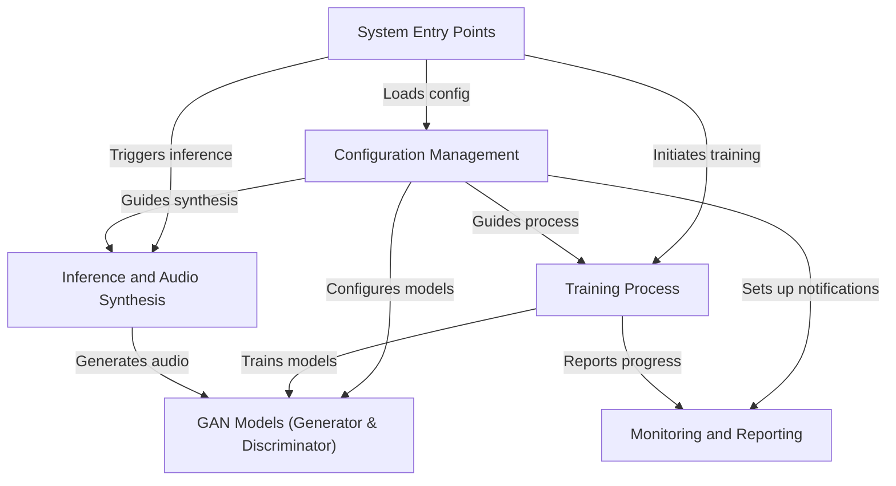

# Tutorial: SoundGan

SoundGan is a project that uses a **Generative Adversarial Network (GAN)** to create *new and unique audio* from scratch. It works by training two neural networks, a **Generator** and a **Discriminator**, in a competitive game. The Generator learns to produce *realistic audio spectrograms*, which are then converted into audible sound files, while the Discriminator learns to distinguish real audio from generated fakes. This allows users to either *train their own audio generation models* or *synthesize new sounds* using a pre-trained model.

**Source Repository:** [https://github.com/Fosowl/SoundGan.git](https://github.com/Fosowl/SoundGan.git)

## Chapters

1. [System Entry Points
](01_system_entry_points_.md)
2. [Configuration Management
](02_configuration_management_.md)
3. [GAN Models (Generator & Discriminator)
](03_gan_models__generator___discriminator__.md)
4. [Training Process
](04_training_process_.md)
5. [Inference and Audio Synthesis
](05_inference_and_audio_synthesis_.md)
6. [Monitoring and Reporting
](06_monitoring_and_reporting_.md)

---

Built by [Codalytix.com](Codalytix.com)
