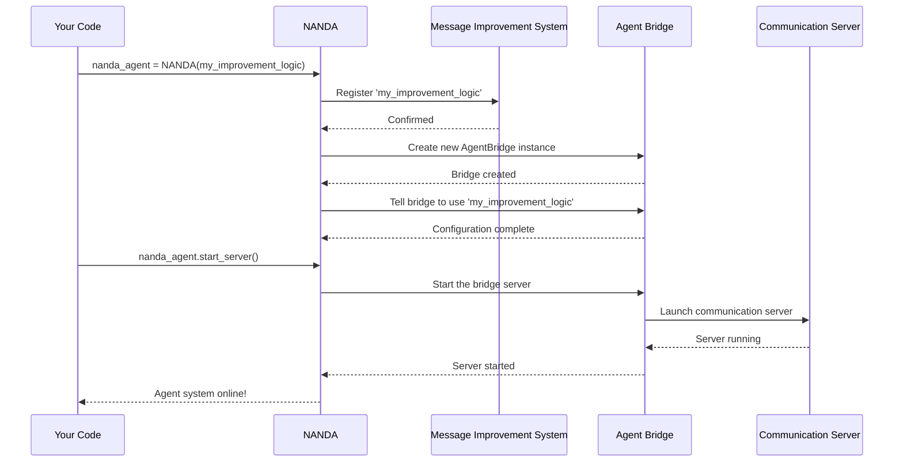

# Chapter 1: NANDA Framework Core (NANDA Class)

Welcome to the NANDA Agent Framework! In this first chapter, we're going to meet the star of the show: the `NANDA` class. Think of `NANDA` as the **master builder** or **primary controller** for your very own custom AI agent.

### What problem does NANDA solve?

Imagine you want to create an AI agent that always adds a special "Improved: " prefix to any message it processes. Building an AI agent from scratch, with all its communication systems and rules, can be really complicated. That's where `NANDA` comes in! It simplifies all those underlying complexities, letting you focus on the fun part: defining your agent's unique behavior.

With `NANDA`, you just tell it *what* you want your agent to do with messages (like adding that "Improved: " prefix), and it handles *how* to set up and run the entire communication system.

### Your First NANDA Agent: Adding a Prefix

Let's make our first NANDA agent. Our goal is simple: an agent that takes any message and returns it with "Improved: " in front.

Here's how you'll typically use the `NANDA` class:

1.  **Define your agent's unique behavior:** This is a simple Python function that takes a message (as text) and returns the modified message.
2.  **Give your behavior to NANDA:** You create an instance of the `NANDA` class, passing your function to it.
3.  **Launch your agent:** Tell NANDA to start its communication system.

Let's see this in action:

```python
# 1. First, we need the NANDA class from our framework
from nanda_adapter import NANDA

# 2. Define your agent's unique message improvement rule
def my_improvement_logic(message_text: str) -> str:
    """This function adds 'Improved: ' to the front of any message."""
    return f"Improved: {message_text}"

# 3. Create your NANDA agent, giving it your special rule
nanda_agent = NANDA(my_improvement_logic)

# 4. Tell NANDA to start the entire communication system for your agent
# (Note: This will usually run indefinitely until you stop it)
# nanda_agent.start_server()
```

**What's happening here?**

*   `from nanda_adapter import NANDA`: This line imports the `NANDA` class, making it available for us to use.
*   `def my_improvement_logic(...)`: This is a regular Python function. It takes one piece of text (`message_text`) and returns a new piece of text with "Improved: " added. This is your agent's "brain" for message modification.
*   `nanda_agent = NANDA(my_improvement_logic)`: This is the core step! You're creating an instance of the `NANDA` class, and you're handing it your `my_improvement_logic` function. `NANDA` now knows what kind of agent it needs to build.
*   `nanda_agent.start_server()`: If you uncomment and run this line, `NANDA` takes over. It sets up all the necessary components (which we'll explore in future chapters) and launches your AI agent, making it ready to receive and process messages according to your `my_improvement_logic`.

This simple example shows how `NANDA` abstracts away the complexity. You don't need to worry about network connections, message queues, or API gateways at this stage. You just focus on `my_improvement_logic`, and `NANDA` handles the rest.

### Behind the Scenes: How NANDA Works (High Level)

So, what does `NANDA` actually do when you give it your `improvement_logic` and tell it to `start_server()`? Let's look at a simplified sequence of events:



1.  **You Hand Over the Logic:** When you create `NANDA(my_improvement_logic)`, you're essentially giving `NANDA` the "blueprint" for how your agent should behave with messages.
2.  **NANDA Registers Your Logic:** `NANDA` doesn't just store your function; it registers it with an internal [Message Improvement System](03_message_improvement_system_.md). This system keeps track of all possible ways messages can be improved.
3.  **NANDA Builds the Bridge:** Next, `NANDA` creates an instance of the [Agent Bridge](02_agent_bridge__agentbridge_class__.md). Think of the Agent Bridge as the main communication hub for your agent.
4.  **NANDA Connects Logic to Bridge:** `NANDA` then tells this newly created [Agent Bridge](02_agent_bridge__agentbridge_class__.md) to use *your specific `my_improvement_logic`* as its primary way to process incoming messages.
5.  **NANDA Launches the Server:** Finally, when you call `start_server()`, `NANDA` instructs the [Agent Bridge](02_agent_bridge__agentbridge_class__.md) to start listening for messages, making your custom AI agent live and operational.

### Diving Deeper into the Code

Let's peek into the `NANDA` class itself to see these steps in code. You can find this code in `nanda_adapter/core/nanda.py`.

The `NANDA` class primarily works through its `__init__` method (which runs when you create `NANDA(...)`) and its `start_server` method.

#### The `NANDA` Constructor (`__init__`)

```python
# File: nanda_adapter/core/nanda.py

class NANDA:
    """NANDA class to create agent_bridge with custom improvement logic"""
    
    def __init__(self, improvement_logic):
        """
        Initialize NANDA with custom improvement logic
        
        Args:
            improvement_logic: Function that takes (message_text: str) -> str
        """
        self.improvement_logic = improvement_logic
        self.bridge = None # Placeholder for the Agent Bridge
        print(f"🤖 NANDA initialized with custom improvement logic: {improvement_logic.__name__}")
        
        # Register the custom improvement logic
        self.register_custom_improver()
        
        # Create agent bridge with custom logic
        self.create_agent_bridge()
```

*   `self.improvement_logic = improvement_logic`: `NANDA` simply stores the function you gave it so it can use it later.
*   `self.register_custom_improver()`: This method is called to tell the global [Message Improvement System](03_message_improvement_system_.md) about your specific logic.
*   `self.create_agent_bridge()`: This method sets up the actual communication hub, the [Agent Bridge](02_agent_bridge__agentbridge_class__.md), and tells it to use your custom logic.

#### Registering Your Custom Logic

Let's look at `register_custom_improver()`:

```python
# File: nanda_adapter/core/nanda.py

    def register_custom_improver(self):
        """Register the custom improvement logic with agent_bridge"""
        # We use a special function from the Agent Bridge module
        from .agent_bridge import register_message_improver 
        
        register_message_improver("nanda_custom", self.improvement_logic)
        print(f"🔧 Custom improvement logic '{self.improvement_logic.__name__}' registered")
```

Here, `NANDA` uses `register_message_improver`. This is a crucial part of the [Message Improvement System](03_message_improvement_system_.md), which allows different "improver" functions to be known and selected later. `NANDA` registers your function under the name "nanda\_custom".

#### Creating the Agent Bridge

Now, how does `NANDA` connect your logic to the communication system? Through `create_agent_bridge()`:

```python
# File: nanda_adapter/core/nanda.py

    def create_agent_bridge(self):
        """Create AgentBridge with custom improvement logic"""
        # We need the AgentBridge class
        from .agent_bridge import AgentBridge 

        # Create a standard AgentBridge instance
        self.bridge = AgentBridge()
        
        # Set our custom improver as the active one for this bridge
        self.bridge.set_message_improver("nanda_custom")
        print(f"✅ AgentBridge created with custom improve_message_direct: {self.improvement_logic.__name__}")
```

This method first creates an instance of the `AgentBridge` class (which we'll explore in the next chapter!). Then, it tells this `AgentBridge` instance to use the "nanda\_custom" message improver (which is *your* `my_improvement_logic` function) as its default way to improve messages.

#### Starting the Server

Finally, when you call `nanda_agent.start_server()`, `NANDA` orchestrates the launch of the communication system. It sets up various environment variables (like API keys and ports) and then ultimately calls a function (from the [Agent Bridge](02_agent_bridge__agentbridge_class__.md) module) to actually start the web server that listens for incoming messages.

```python
# File: nanda_adapter/core/nanda.py

    def start_server(self):
        """Start the agent_bridge server with custom improvement logic"""
        print("🚀 NANDA starting agent_bridge server with custom logic...")
        
        # ... (simplified: lots of environment setup and logging) ...

        # This is the core call to start the server!
        # It uses a function from the Agent Bridge module.
        from .agent_bridge import run_server
        run_server(self.bridge, host="0.0.0.0", port=PORT)
```

As you can see, `NANDA` acts as a high-level orchestrator. It takes your specific message improvement logic and correctly configures and launches the underlying [Agent Bridge](02_agent_bridge__agentbridge_class__.md) to make your custom agent live.

### Conclusion

In this chapter, you've learned that the `NANDA` class is your go-to starting point for building custom AI agents with the NANDA Agent Framework. It acts as the "master builder," taking your unique message improvement rules (as a simple Python function) and handling all the complex setup to get your agent running. You saw how `NANDA` registers your logic and connects it to the core communication system, the [Agent Bridge](02_agent_bridge__agentbridge_class__.md).

Now that you understand `NANDA`'s role in initiating your custom agent, let's dive deeper into the very heart of the communication system: the [Agent Bridge](02_agent_bridge__agentbridge_class__.md).

[Next Chapter: Agent Bridge (AgentBridge Class)](02_agent_bridge__agentbridge_class__.md)

---

Built by [Codalytix.com](Codalytix.com)
