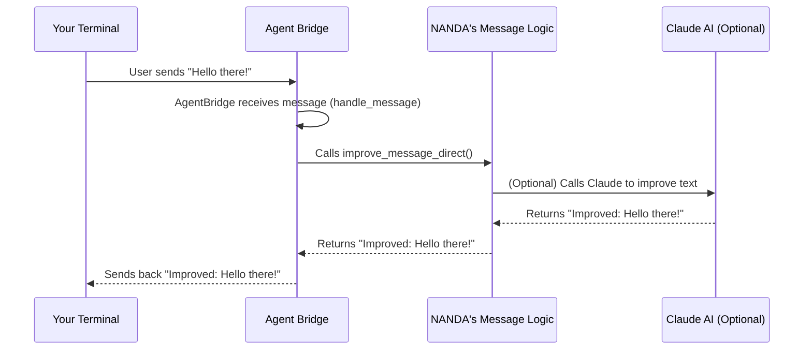

# Chapter 2: Agent Bridge (AgentBridge Class)

Welcome back! In [Chapter 1: NANDA Framework Core (NANDA Class)](01_nanda_framework_core__nanda_class__.md), we learned that the `NANDA` class is your "master builder" for creating a custom AI agent. You give `NANDA` your special logic (like adding "Improved: " to messages), and it handles all the complex setup.

But once `NANDA` has built your agent, how does that agent actually *talk* to anyone? How does it receive messages from you, or send messages to other AI agents across a network? That's where our next star comes in: the `AgentBridge` class.

### What is the Agent Bridge?

Imagine the `AgentBridge` as the **central post office and call center** for your AI agent. Every single message that your agent sends or receives passes through this bridge.

It solves a crucial problem: **How do different parts of an AI system, and even human users, communicate smoothly and reliably?** Without a central hub, messages would be chaotic, lost, or sent to the wrong place. The `AgentBridge` brings order to this communication.

Think of it this way:

*   **Receiving Messages:** Like a post office receiving all incoming mail (from a human user typing in a terminal, or from another AI agent sending a message, or even from an external tool).
*   **Routing Messages:** Like the post office sorting clerk who intelligently decides where each letter goes next:
    *   To your agent's "brain" (the custom logic you defined with `NANDA`).
    *   To another AI agent across the network.
    *   Back to your screen for you to read.
*   **Processing Messages:** It can also apply rules to messages, like improving their quality before sending them out (which is where your `NANDA` logic comes in!).

It's the core traffic controller for all agent communications, ensuring messages get to their correct destination.

### How NANDA Uses the Agent Bridge

You usually don't directly create an `AgentBridge` yourself. Instead, your `NANDA` agent (from Chapter 1) automatically creates and configures one for you. `NANDA` tells the `AgentBridge` *what* your agent's special message improvement rule is and then tells the `AgentBridge` to "start listening" for messages.

Let's quickly revisit a part of `NANDA`'s setup from Chapter 1. Remember `nanda_agent.create_agent_bridge()`?

```python
# From nanda_adapter/core/nanda.py
# ... inside the NANDA class ...

    def create_agent_bridge(self):
        """Create AgentBridge with custom improvement logic"""
        from .agent_bridge import AgentBridge # Import the AgentBridge class

        # 1. NANDA creates an AgentBridge instance
        self.bridge = AgentBridge()

        # 2. NANDA tells the AgentBridge to use YOUR custom logic
        # (registered as "nanda_custom" in the Message Improvement System)
        self.bridge.set_message_improver("nanda_custom")
        print(f"✅ AgentBridge created with custom improve_message_direct: {self.improvement_logic.__name__}")
```

Here, `NANDA` essentially sets up the "post office" (`AgentBridge`) and tells it: "Hey, when you need to improve a message, use *this specific rule* I gave you (my `my_improvement_logic` function)."

### The Agent Bridge in Action: A Message's Journey

Let's see what happens when a message (like "Hello there!") goes through your agent's `AgentBridge`.



In this diagram:
1.  **Your Terminal** sends a message.
2.  The **Agent Bridge** (your agent's "post office") receives it.
3.  The `AgentBridge` immediately sends it to **NANDA's Message Logic** (your `my_improvement_logic` function, which `NANDA` configured for the bridge).
4.  (Optional) If your NANDA logic uses an AI model (like Claude), it interacts with the **Claude AI**.
5.  **NANDA's Message Logic** returns the improved message.
6.  The **Agent Bridge** then sends this improved message back to **Your Terminal** so you can see the result.

This is the fundamental flow for how your agent processes messages using the `AgentBridge`.

### Diving Deeper: Inside the Agent Bridge Code

The `AgentBridge` class is defined in `nanda_adapter/core/agent_bridge.py`. Let's look at its key parts.

#### It's a Server! (`AgentBridge` Class Definition)

The `AgentBridge` is actually a specialized type of server. It inherits from `A2AServer`, which comes from a library (`python_a2a`) that handles the low-level network communication. This means `AgentBridge` automatically knows how to listen for incoming messages and send responses over the network.

```python
# File: nanda_adapter/core/agent_bridge.py

from python_a2a import A2AServer # The base class for network communication
# ... other imports ...

class AgentBridge(A2AServer):
    """Global Agent Bridge - Can be used for any agent in the network."""

    def __init__(self, *args, **kwargs):
        super().__init__(*args, **kwargs) # Initialize the A2AServer part
        self.active_improver = "default_claude" # Sets a default way to improve messages
        # ... rest of init ...
```

*   `class AgentBridge(A2AServer):`: This line means `AgentBridge` gets all the "server" abilities (like listening on a port) from `A2AServer`.
*   `super().__init__(*args, **kwargs)`: This ensures that the `A2AServer` part of the `AgentBridge` is set up correctly.
*   `self.active_improver = "default_claude"`: The bridge keeps track of which message improvement rule it should use. By default, it uses a Claude-based one, but `NANDA` changes this to *your* custom logic.

#### Setting Your Custom Logic (`set_message_improver`)

Remember how `NANDA` calls `self.bridge.set_message_improver("nanda_custom")`? Here's what that method does inside `AgentBridge`:

```python
# File: nanda_adapter/core/agent_bridge.py
# ... inside the AgentBridge class ...

    def set_message_improver(self, improver_name):
        """Set the active message improver by name"""
        # Checks if the name (like "nanda_custom") is known
        if improver_name in message_improvement_decorators:
            self.active_improver = improver_name # Updates which rule to use
            print(f"Message improver set to: {improver_name}")
            return True
        else:
            print(f"Unknown improver: {improver_name}. Available: {list_message_improvers()}")
            return False
```

This method simply updates a setting (`self.active_improver`) within the `AgentBridge` to point to the specific message improvement function you (via `NANDA`) want to use. This function is stored in a global dictionary called `message_improvement_decorators` (which we'll explore more in [Chapter 3: Message Improvement System](03_message_improvement_system_.md)).

#### Using the Active Logic (`improve_message_direct`)

When the `AgentBridge` actually needs to improve a message, it calls this method:

```python
# File: nanda_adapter/core/agent_bridge.py
# ... inside the AgentBridge class ...

    def improve_message_direct(self, message_text: str) -> str:
        """Improve a message using the active registered improver."""
        improver_func = message_improvement_decorators.get(self.active_improver)

        if improver_func:
            try:
                return improver_func(message_text) # Calls YOUR function!
            except Exception as e:
                print(f"Error with improver '{self.active_improver}': {e}")
                return message_text
        else:
            print(f"No improver found: {self.active_improver}")
            return message_text
```

This is where the magic happens! `improve_message_direct` looks up the `improver_func` based on `self.active_improver` (which `NANDA` set to your `my_improvement_logic`). Then, it simply calls *your* function with the message text, and returns the result. This connects the `AgentBridge`'s core communication flow directly to your agent's unique "brain."

#### The Master Coordinator: `handle_message`

The most important method in `AgentBridge` is `handle_message`. This method is automatically called whenever the `AgentBridge` (as an `A2AServer`) receives *any* incoming message. It's the "sorting clerk" of the post office.

Here's a simplified look at what `handle_message` does:

```python
# File: nanda_adapter/core/agent_bridge.py
# ... inside the AgentBridge class ...

    def handle_message(self, msg: Message) -> Message:
        user_text = msg.content.text
        agent_id = get_agent_id() # Your agent's ID

        print(f"Agent {agent_id}: Received text: {user_text[:50]}...")

        # 1. Is it a special "external message" from another agent?
        if user_text.startswith('__EXTERNAL_MESSAGE__'):
            return handle_external_message(user_text, conversation_id, msg)

        # 2. Is it a message intended FOR another agent (starts with @)?
        elif user_text.startswith("@"):
            target_agent = user_text.split(" ", 1)[0][1:]
            message_text = user_text.split(" ", 1)[1]
            message_text = self.improve_message_direct(message_text) # Improve it!
            send_to_agent(target_agent, message_text, conversation_id) # Send it out!
            return Message(...) # Acknowledge sending

        # 3. Is it an internal command (starts with # or /)?
        elif user_text.startswith("#") or user_text.startswith("/"):
            # Handle commands like #mcp_query or /help, /query, /quit
            # These don't go through the message improver for general messages
            # They might call specific functions like run_mcp_query or call_claude
            # ... (complex command parsing logic) ...
            return Message(...) # Return command result

        # 4. Otherwise, it's a regular message for THIS agent to process locally
        else:
            # First, apply YOUR custom message improvement logic
            processed_text = self.improve_message_direct(user_text)

            # Then, maybe call an AI model (like Claude) for a response
            claude_response = call_claude(processed_text, ...)
            
            # Return the final response to the user
            return Message(
                role = MessageRole.AGENT,
                content = TextContent(text=f"[AGENT {agent_id}] {claude_response}"),
                parent_message_id = msg.message_id,
                conversation_id = conversation_id
            )
```

As you can see, `handle_message` is like a decision tree:
*   It first checks for special message formats, like those coming from another agent (`__EXTERNAL_MESSAGE__`).
*   Then, it checks for instructions to send messages to *other* agents (messages starting with `@`). For these, it uses `self.improve_message_direct` to enhance the message *before* sending it out with `send_to_agent`.
*   It also handles built-in commands (like `/query` or `/help`).
*   If none of the above, it assumes it's a message meant for *this* agent to process locally. In this case, it sends the message through `self.improve_message_direct` (your NANDA logic!) and might then call an AI model (`call_claude`) for a response before sending it back to the user.

### Conclusion

The `AgentBridge` truly is the communication heart of your NANDA agent. While `NANDA` helps you define your agent's unique behavior, the `AgentBridge` is the active "post office" that receives, routes, processes, and sends all messages, ensuring your agent can interact seamlessly with users, other agents, and external tools. It's responsible for applying your custom message improvement logic (set by `NANDA`) to messages as they flow through the system.

Now that you understand how messages are handled by the `AgentBridge`, let's delve into the flexible system that allows you to plug in different ways of "improving" these messages: the [Message Improvement System](03_message_improvement_system_.md).

[Next Chapter: Message Improvement System](03_message_improvement_system_.md)

---

Built by [Codalytix.com](Codalytix.com)
