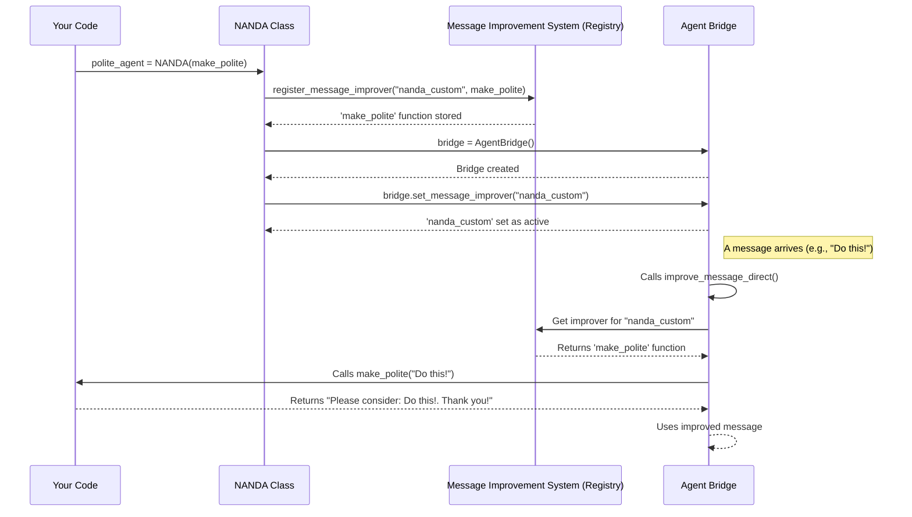

# Chapter 3: Message Improvement System

Welcome back! In [Chapter 1: NANDA Framework Core (NANDA Class)](01_nanda_framework_core__nanda_class__.md), we introduced `NANDA` as your "master builder" for creating a custom AI agent. Then, in [Chapter 2: Agent Bridge (AgentBridge Class)](02_agent_bridge__agentbridge_class__.md), we explored the `AgentBridge` as the "central post office" that handles all messages for your agent.

Now, let's talk about how the messages themselves can be **transformed** and **improved** as they pass through your agent. Imagine your `AgentBridge` has a built-in "language editor" or a "professional copywriter" on staff. This is exactly what the **Message Improvement System** does!

### What Problem Does It Solve?

Think of it this way: not every message needs to be sent exactly as it's received. Sometimes, you want your agent to refine messages, make them clearer, more concise, or more compelling, *before* sending them to their final destination (like another agent or an AI model).

The **Message Improvement System** solves the problem of **how to easily apply custom text transformations** to messages within your agent's workflow. It allows you to:

*   **Enhance clarity:** Make confusing sentences easy to understand.
*   **Be concise:** Shorten lengthy messages without losing important details.
*   **Add a specific tone:** Make messages polite, formal, or more friendly.
*   **Standardize communication:** Ensure all outgoing messages follow a certain format.

The NANDA framework allows you to easily **plug in your own custom "editors"** (which are just Python functions!) or use the default one that's powered by an AI like Claude.

### How It Works: The Pluggable System

The core idea is **flexibility**. Instead of hardcoding one way to improve messages, the system allows you to define multiple "improver" functions and then tell your `AgentBridge` which one to use at any given time.

Here are the key concepts:

1.  **Improver Functions:** These are simple Python functions that take a message (as text) and return an improved version of that text.
2.  **Registration:** You need a way to tell the system about your improver functions and give them a unique name (like "my\_polite\_improver").
3.  **Active Improver:** The `AgentBridge` keeps track of which registered improver is currently active. When it needs to improve a message, it calls *that* specific function.

### Your First Custom Improver: The "Polite Agent"

Let's build on our previous examples. In Chapter 1, our NANDA agent added "Improved: " to messages. Now, let's create a *new* NANDA agent whose goal is to make every message sound very **polite**.

Here's how you'd define your new "polite" message improvement rule:

```python
# 1. Define your agent's unique message improvement rule
def make_polite(message_text: str) -> str:
    """This function adds a polite phrase to the front of any message."""
    return f"Please consider: {message_text}. Thank you!"
```

Now, let's create a `NANDA` agent that uses this `make_polite` logic:

```python
# From nanda_adapter import NANDA (already imported in your main script)

# 2. (Re-define if in a new file, or assume it's above)
def make_polite(message_text: str) -> str:
    """This function adds a polite phrase to the front of any message."""
    return f"Please consider: {message_text}. Thank you!"

# 3. Create your NANDA agent, giving it your special polite rule
polite_agent = NANDA(make_polite)

# 4. If you were to start this agent, it would use the 'make_polite' logic:
# polite_agent.start_server()
```

**What happens when `polite_agent.start_server()` runs?**

When you start this `polite_agent`, `NANDA` automatically takes your `make_polite` function and registers it with the Message Improvement System under the name `"nanda_custom"`. It then tells its `AgentBridge` instance to use this `"nanda_custom"` improver as its active one.

So, if you sent a message like "Do this quickly!" to your `polite_agent`, the `AgentBridge` would use `make_polite`, and the message would become: "Please consider: Do this quickly!. Thank you!"

### Behind the Scenes: How it Works

The Message Improvement System isn't a single "class" like `NANDA` or `AgentBridge`. Instead, it's a clever combination of a **dictionary** (to store improver functions) and some helper **functions** that allow you to register, retrieve, and set these improvers.

Let's trace how your `make_polite` function becomes the active improver.



1.  **Registration:** When you create `NANDA(make_polite)`, `NANDA` calls `register_message_improver` to add your `make_polite` function to a central storage.
2.  **Activation:** `NANDA` then tells the `AgentBridge` instance to make this newly registered function (`"nanda_custom"`) its *active* message improver.
3.  **Usage:** Whenever the `AgentBridge` needs to improve a message (which happens at various points in `handle_message`), it looks up the currently active improver and calls it with the message text.

### Diving Deeper into the Code

All the components of the Message Improvement System are found in `nanda_adapter/core/agent_bridge.py`.

#### The Improver Registry

At the top of `agent_bridge.py`, there's a simple Python dictionary that acts as the registry for all message improvers:

```python
# File: nanda_adapter/core/agent_bridge.py

# Message improvement decorator system
message_improvement_decorators = {}
```

This dictionary stores functions. The keys are the names (like `"default_claude"` or `"nanda_custom"`), and the values are the actual Python functions that perform the improvement.

#### Registering Improvers

There are two primary ways to register an improver:

1.  **Using a decorator (`@message_improver`):** This is a convenient Python feature used to register functions when the `agent_bridge.py` file is loaded.
    ```python
    # File: nanda_adapter/core/agent_bridge.py

    def message_improver(name=None):
        """Decorator to register message improvement functions"""
        def decorator(func):
            decorator_name = name or func.__name__
            message_improvement_decorators[decorator_name] = func
            return func
        return decorator

    # --- Example: How the default Claude improver is registered ---
    @message_improver("default_claude")
    def default_claude_improver(message_text: str) -> str:
        """Default Claude-based message improvement"""
        # ... (complex logic involving Claude API calls) ...
        return message_text
    ```
    When `@message_improver("default_claude")` is above `default_claude_improver`, it automatically adds `default_claude_improver` to `message_improvement_decorators` with the key `"default_claude"`.

2.  **Using a function (`register_message_improver`):** This is how `NANDA` registers your custom logic. You call this function directly with the name and the function itself.
    ```python
    # File: nanda_adapter/core/agent_bridge.py

    def register_message_improver(name, improver_func):
        """Register a custom message improver function"""
        message_improvement_decorators[name] = improver_func
    ```
    This is what `NANDA` calls internally:
    ```python
    # File: nanda_adapter/core/nanda.py (inside NANDA.register_custom_improver)
    from .agent_bridge import register_message_improver
    
    # This line registers YOUR 'make_polite' function as "nanda_custom"
    register_message_improver("nanda_custom", self.improvement_logic)
    ```

You can also list all registered improvers:
```python
# File: nanda_adapter/core/agent_bridge.py

def list_message_improvers():
    """List all registered message improvers"""
    return list(message_improvement_decorators.keys())

# Example of usage (if you ran an agent with a custom improver):
# from nanda_adapter import list_message_improvers
# print(list_message_improvers())
# # Expected output: ['default_claude', 'nanda_custom']
```

#### Setting the Active Improver in `AgentBridge`

The `AgentBridge` class has a method to choose which of the registered improvers it should use:

```python
# File: nanda_adapter/core/agent_bridge.py (inside AgentBridge class)

class AgentBridge(A2AServer):
    # ... (other code) ...

    def __init__(self, *args, **kwargs):
        super().__init__(*args, **kwargs)
        self.active_improver = "default_claude"  # Starts with the default

    def set_message_improver(self, improver_name):
        """Set the active message improver by name"""
        if improver_name in message_improvement_decorators:
            self.active_improver = improver_name # Update the chosen improver
            print(f"Message improver set to: {improver_name}")
            return True
        else:
            print(f"Unknown improver: {improver_name}. Available: {list_message_improvers()}")
            return False
```
`NANDA` uses this method to ensure its `AgentBridge` uses your custom logic:
```python
# File: nanda_adapter/core/nanda.py (inside NANDA.create_agent_bridge)

    self.bridge.set_message_improver("nanda_custom")
```

#### Using the Active Improver

Finally, when the `AgentBridge` needs to improve a message, it calls its `improve_message_direct` method. This method simply looks up the function stored under `self.active_improver` in `message_improvement_decorators` and calls it:

```python
# File: nanda_adapter/core/agent_bridge.py (inside AgentBridge class)

    def improve_message_direct(self, message_text: str) -> str:
        """Improve a message using the active registered improver."""
        improver_func = message_improvement_decorators.get(self.active_improver)
        
        if improver_func:
            try:
                # This is where YOUR function (like make_polite) gets called!
                return improver_func(message_text)
            except Exception as e:
                print(f"Error with improver '{self.active_improver}': {e}")
                return message_text
        else:
            print(f"No improver found: {self.active_improver}")
            return message_text
```

As you saw in [Chapter 2: Agent Bridge (AgentBridge Class)](02_agent_bridge__agentbridge_class__.md), the `AgentBridge`'s `handle_message` method calls `self.improve_message_direct` at key points, such as when sending a message to another agent or before processing a local message. This ensures your custom improvement logic is applied seamlessly.

### Conclusion

The Message Improvement System is a powerful and flexible feature of the NANDA framework. It allows you to easily plug in your own custom logic (simple Python functions) to modify and enhance messages as they flow through your agent's `AgentBridge`. Whether you want to make messages polite, concise, or translate them, this system provides the mechanism to do it, letting you focus on the desired transformation rather than the underlying communication details.

Now that you understand how individual agents handle and improve messages, let's learn how multiple agents can discover and communicate with each other in a larger network using the **Agent Registry**.

[Next Chapter: Agent Registry](04_agent_registry_.md)

---

Built by [Codalytix.com](Codalytix.com)
