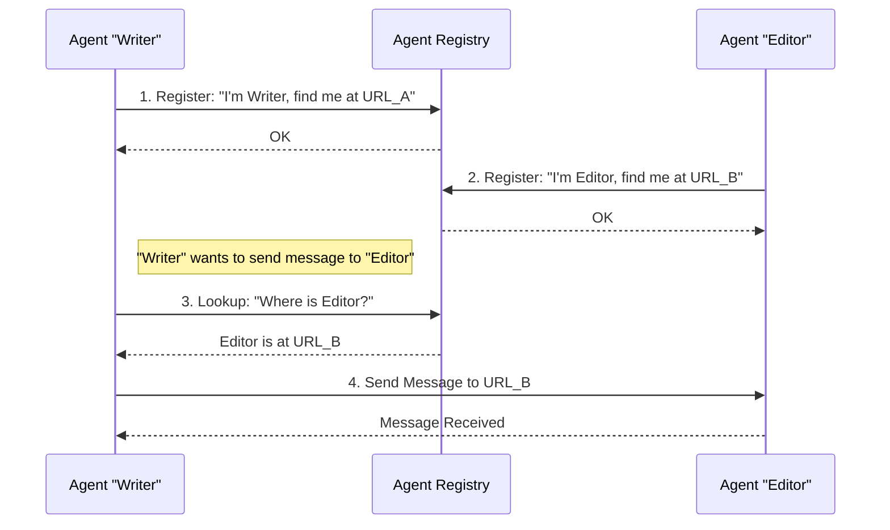

# Chapter 4: Agent Registry

Welcome back! In [Chapter 1: NANDA Framework Core (NANDA Class)](01_nanda_framework_core__nanda_class__.md), you learned how to build your custom AI agent with `NANDA`. In [Chapter 2: Agent Bridge (AgentBridge Class)](02_agent_bridge__agentbridge_class__.md), we saw how the `AgentBridge` acts as the communication hub for your agent, sending and receiving messages. And in [Chapter 3: Message Improvement System](03_message_improvement_system_.md), you learned how to make your agent's messages clearer and more effective.

Now, imagine you have *multiple* AI agents, each running its own `AgentBridge` and perhaps its own unique message improvement logic. How do these agents find each other? How does Agent "Writer" send a message to Agent "Editor" if "Writer" doesn't know where "Editor" lives on the network?

This is where the **Agent Registry** comes in!

### What Problem Does the Agent Registry Solve?

Think of the **Agent Registry** as a **global phone book or a directory service for all AI agents** participating in the network. Just like you'd look up a friend's phone number in a phone book, an AI agent can look up another agent's network address (its URL) in the Agent Registry.

It solves the crucial problem of **agent discovery and inter-agent communication**. Without it, agents would be isolated, unable to find or talk to each other across a distributed network.

**Central Use Case:** Agent "Writer" wants to send a revised document to Agent "Editor".

*   **Problem:** Agent "Writer" knows "Editor" by name (its `agent_id`), but doesn't know the exact web address (URL) where "Editor" is currently listening for messages.
*   **Solution (with Agent Registry):** Agent "Writer" asks the Agent Registry, "Hey, where can I find Agent 'Editor'?" The Registry replies with "Editor's" current network address, allowing "Writer" to send the message directly.

This enables agents to interact seamlessly without needing to know each other's precise network locations beforehand.

### Key Concepts of the Agent Registry

The Agent Registry functions based on a few simple ideas:

1.  **Registration:** Each agent, when it starts up, tells the central registry: "Here I am! My ID is 'Writer', and you can reach me at this specific network address (URL)."
2.  **Lookup:** When an agent wants to talk to another agent, it asks the Registry: "What's the address for 'Editor'?" The Registry then provides the stored address.
3.  **Listing:** Agents can also ask the Registry: "Show me a list of *all* agents currently online and registered."

### How to Use the Agent Registry

You usually don't interact with the Agent Registry directly in your daily agent building. Instead, your `NANDA` agent (and its underlying `AgentBridge`) automatically handles the registration and lookup process for you!

Let's see how `NANDA` uses it during startup, and how your agent communicates with others.

#### 1. Agent Startup (Automatic Registration)

When you launch your NANDA agent by running your Python script (e.g., `python your_agent_script.py`), it automatically tries to register itself with the Agent Registry. This happens if you've set up a `PUBLIC_URL` environment variable.

You don't write special code for this in your `NANDA` agent. It's built into the framework's startup process!

```python
# This happens automatically when your agent starts
# (e.g., via the main part of nanda_adapter/core/agent_bridge.py)

# 1. Your agent gets its ID (e.g., 'writer-agent') and its public URL
agent_id = os.getenv("AGENT_ID", "default")
public_url = os.getenv("PUBLIC_URL")

if public_url:
    # 2. The system calls a function to register with the registry
    from nanda_adapter.core.agent_bridge import register_with_registry
    register_with_registry(agent_id, public_url, api_url="http://your-api-url.com")
else:
    print("WARNING: PUBLIC_URL not set. Agent will not be registered.")
```
**What's happening here?**
*   The `agent_bridge.py` script automatically checks for `PUBLIC_URL` when it starts.
*   If `PUBLIC_URL` is set, it calls `register_with_registry`, passing your agent's unique ID and its public network address. This tells the "phone book" that your agent is online and where to find it.

#### 2. Sending a Message to Another Agent (Automatic Lookup)

When your agent needs to send a message to another agent (e.g., you type `@editor Hey, check this out!` in your agent's terminal), your `AgentBridge` handles the lookup automatically.

```python
# From nanda_adapter/core/agent_bridge.py (simplified part of handle_message)

def handle_message(self, msg: Message) -> Message:
    user_text = msg.content.text
    # ... (other checks) ...

    # If the message starts with '@', it's for another agent
    if user_text.startswith("@"):
        parts = user_text.split(" ", 1)
        target_agent_id = parts[0][1:] # e.g., 'editor'
        message_to_send = parts[1]

        # The system automatically looks up the agent and sends the message
        from nanda_adapter.core.agent_bridge import send_to_agent
        result = send_to_agent(target_agent_id, message_to_send, msg.conversation_id)
        
        return Message(
            role=MessageRole.AGENT,
            content=TextContent(text=f"Sent to {target_agent_id}: {result}")
        )
    # ... (rest of handle_message) ...
```

**What's happening here?**
*   When your agent receives a message starting with `@`, it knows you want to talk to another agent.
*   It extracts the `target_agent_id` (like "editor").
*   Crucially, it calls `send_to_agent`, which internally handles the **lookup** process for you. It finds "editor's" address and sends the message directly. You don't need to manually find the URL!

#### 3. Manually Listing Registered Agents

You can also ask the registry directly for a list of all currently registered agents. This can be useful for debugging or just to see who's online.

```python
# Example: In a separate script or interactive Python session
from nanda_adapter.core.agent_bridge import list_registered_agents

print("Listing all registered agents:")
agents = list_registered_agents()

if agents:
    for agent_data in agents:
        print(f"  ID: {agent_data['agent_id']}, URL: {agent_data['agent_url']}")
else:
    print("No agents currently registered.")

# Example Output:
# Listing all registered agents:
#   ID: writer-agent, URL: http://my-writer-agent.com:6000/a2a
#   ID: editor-agent, URL: http://my-editor-agent.com:6001/a2a
```

**What's happening here?**
*   You call `list_registered_agents()`.
*   This function queries the central Agent Registry server.
*   The Registry returns a list of all agents it knows about, including their IDs and URLs.

### Behind the Scenes: How the Agent Registry Works

The Agent Registry itself is a separate web service (server) that keeps a database of all active agents. Your `NANDA` agent interacts with this service using simple web requests (like visiting a website).

Here's a high-level view of how agents discover each other using the Registry:



1.  **Registration:** Both "Writer" and "Editor" agents start up and tell the Agent Registry their unique ID and their current network address (URL).
2.  **Lookup:** When "Writer" needs to send a message to "Editor", it first asks the Agent Registry for "Editor's" address.
3.  **Direct Communication:** The Registry provides "Editor's" URL. "Writer" then uses this URL to send the message directly to "Editor's" `AgentBridge`.

#### Diving Deeper into the Code

The core functions for interacting with the Agent Registry are found in `nanda_adapter/core/agent_bridge.py`. They use the `requests` library to make HTTP calls to the external Registry server.

First, let's see how the agent knows where the registry *itself* is:

```python
# File: nanda_adapter/core/agent_bridge.py

def get_registry_url():
    """Get the registry URL from file or use default"""
    try:
        if os.path.exists("registry_url.txt"):
            with open("registry_url.txt", "r") as f:
                registry_url = f.read().strip()
                print(f"Using registry URL from file: {registry_url}")
                return registry_url
    except Exception as e:
        print(f"Error reading registry URL from file: {e}")
    
    # Default if file doesn't exist or error occurs
    default_url = "https://chat.nanda-registry.com:6900"
    print(f"Using default registry URL: {default_url}")
    return default_url
```
**Explanation:** This function is called first to figure out the address of the Agent Registry server. It tries to read it from a file (`registry_url.txt`) or uses a default URL if the file isn't found.

Now, let's look at the functions that perform the core registry operations:

##### Registration (`register_with_registry`)

```python
# File: nanda_adapter/core/agent_bridge.py

def register_with_registry(agent_id, agent_url, api_url):
    """Register this agent with the registry"""
    registry_url = get_registry_url() # Get the registry's address
    try:
        data = {
            "agent_id": agent_id,
            "agent_url": agent_url, # Your agent's public URL
            "api_url": api_url      # Your API gateway's public URL
        }
        print(f"Registering agent {agent_id} with URL {agent_url} at registry {registry_url}...")
        response = requests.post(f"{registry_url}/register", json=data) # Send registration data
        if response.status_code == 200:
            print(f"Agent {agent_id} registered successfully")
            return True
        else:
            print(f"Failed to register agent: {response.text}")
            return False
    except Exception as e:
        print(f"Error registering agent: {e}")
        return False
```
**Explanation:** This function takes your agent's ID and its public URL. It then makes an HTTP `POST` request to the `/register` endpoint of the Agent Registry, sending this information. The Registry saves it in its "phone book".

##### Lookup (`lookup_agent`)

```python
# File: nanda_adapter/core/agent_bridge.py

def lookup_agent(agent_id):
    """Look up an agent's URL in the registry"""
    registry_url = get_registry_url() # Get the registry's address
    try:
        print(f"Looking up agent {agent_id} in registry {registry_url}...")
        response = requests.get(f"{registry_url}/lookup/{agent_id}") # Send lookup request
        if response.status_code == 200:
            agent_url = response.json().get("agent_url") # Get the agent's URL from the response
            print(f"Found agent {agent_id} at URL: {agent_url}")
            return agent_url
        print(f"Agent {agent_id} not found in registry")
        return None
    except Exception as e:
        print(f"Error looking up agent {agent_id}: {e}")
        return None
```
**Explanation:** This function takes the `agent_id` of the agent you want to find. It then makes an HTTP `GET` request to the `/lookup/{agent_id}` endpoint of the Agent Registry. The Registry searches its "phone book" and, if found, returns the corresponding `agent_url`.

##### Listing (`list_registered_agents`)

```python
# File: nanda_adapter/core/agent_bridge.py

def list_registered_agents():
    """Get a list of all registered agents from the registry"""
    registry_url = get_registry_url() # Get the registry's address
    try:
        print(f"Requesting list of agents from registry {registry_url}...")
        response = requests.get(f"{registry_url}/list") # Send list request
        if response.status_code == 200:
            agents = response.json() # Get the list of agents from the response
            return agents
        print(f"Failed to get list of agents from registry")
        return None
    except Exception as e:
        print(f"Error getting list of agents: {e}")
        return None
```
**Explanation:** This function makes an HTTP `GET` request to the `/list` endpoint of the Agent Registry. The Registry responds with a complete list of all agents currently registered with it.

The Agent Registry is a crucial piece that allows individual `NANDA` agents, each running its own `AgentBridge`, to form a cohesive network and communicate with each other seamlessly.

### Conclusion

The Agent Registry is the "phone book" of your AI agent network. It provides a central service for agents to register their presence and discover the network addresses of other agents. This capability is fundamental for enabling distributed AI systems where multiple specialized agents can collaborate and send messages to each other, even if their exact locations change. Thanks to the Registry, your `NANDA` agents can truly become part of a larger, interconnected ecosystem.

Now that you understand how agents find each other, let's explore how external users or applications can easily interact with your agent network using the **Flask API Gateway**.

[Next Chapter: Flask API Gateway](05_flask_api_gateway_.md)

---

Built by [Codalytix.com](Codalytix.com)
