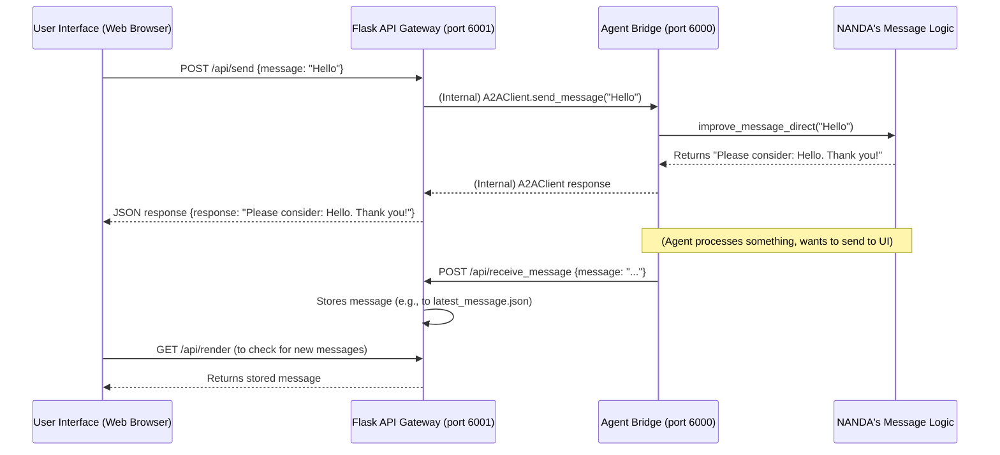

# Chapter 5: Flask API Gateway

Welcome back! In [Chapter 4: Agent Registry](04_agent_registry_.md), we explored how our `NANDA` agents can find and communicate with each other across a network using a central "phone book." But what if you want your AI agent to talk to *you* through a simple chat application in your web browser? Or what if another service on the internet needs to send a message to your agent?

Your `AgentBridge` (from [Chapter 2: Agent Bridge (AgentBridge Class)](02_agent_bridge__agentbridge_class__.md)) is great for internal agent-to-agent communication, but it's not designed to be easily accessed by standard web browsers or mobile apps. This is where the **Flask API Gateway** comes in.

### What Problem Does the Flask API Gateway Solve?

Imagine your NANDA agent is a brilliant chef working diligently in a professional kitchen. The [Agent Bridge](02_agent_bridge__agentbridge_class__.md) is the internal communication system for the kitchen staff. But what if a customer outside wants to order food or get an update on their order? They don't go into the kitchen! They go to the **front desk** or the **restaurant's website**.

The **Flask API Gateway** is precisely this "front desk" or "website" for your AI agent. It solves the problem of **how external users, web applications, or other services can easily interact with your NANDA agent using standard web requests (like visiting a website or using a mobile app).**

**Central Use Case:** A user wants to send a chat message to your NANDA agent from a simple web browser chat interface and receive the agent's response.

Without the Flask API Gateway, it would be very difficult for a regular web page to "talk" to your agent directly. The Gateway provides easy-to-use web addresses (called "endpoints") that any web-connected application can understand.

### Key Concepts

1.  **Flask:** This is a popular and easy-to-use Python framework for building web applications and APIs. It allows us to define specific URLs (like `/api/send`) that perform actions when someone visits them.
2.  **API (Application Programming Interface):** Think of an API as a menu of options that another program can use to interact with your agent. Instead of talking directly to your agent's brain, an external program uses these predefined "menu items" (endpoints) to send messages, ask for status, or receive data.
3.  **Gateway:** Just like a physical gateway is an entrance, the Flask API Gateway is the entry point for messages coming from outside your agent's internal network. It translates simple web requests into messages that your agent's [Agent Bridge](02_agent_bridge__agentbridge_class__.md) can understand, and vice versa.
4.  **Standard Web Endpoints:** These are specific web addresses (URLs) that perform actions. For example:
    *   `/api/send`: To send a message *to* your agent.
    *   `/api/receive_message`: To receive messages *from* your agent (when it wants to "push" a message to a user interface).
    *   `/api/health`: To check if your agent's web interface is running.

### How to Use It: Launching Your Agent with a Web Interface

You don't need to write any Flask code yourself! The `NANDA` class provides a special method, `start_server_api`, that automatically sets up and launches this Flask API Gateway for you.

Let's create our "Polite Agent" from [Chapter 3: Message Improvement System](03_message_improvement_system_.md) and give it a web interface:

```python
# 1. First, we need the NANDA class
from nanda_adapter import NANDA
import os # To set environment variables

# 2. Define our polite message improvement logic
def make_polite(message_text: str) -> str:
    """This function adds a polite phrase to the front of any message."""
    return f"Please consider: {message_text}. Thank you!"

# 3. Create your NANDA agent with the polite rule
polite_agent = NANDA(make_polite)

# --- Important Setup for the API Gateway ---
# You need to provide an Anthropic API Key (or other AI provider key)
# as the default message improver might use it.
os.environ["ANTHROPIC_API_KEY"] = "sk-YOUR_ANTHROPIC_API_KEY"
os.environ["AGENT_ID"] = "polite-agent" # A unique ID for your agent
os.environ["PUBLIC_URL"] = "http://your-server-ip:6000/a2a" # Your Agent Bridge's external URL
os.environ["API_URL"] = "http://your-server-ip:6001" # Your Flask API Gateway's external URL

# 4. Launch your agent with the Flask API Gateway
# This will start BOTH the Agent Bridge and the Flask API
polite_agent.start_server_api(
    anthropic_key=os.environ["ANTHROPIC_API_KEY"],
    domain="your-server-ip", # Use your server's IP or domain
    agent_id=os.environ["AGENT_ID"],
    port=6000, # Port for the Agent Bridge
    api_port=6001, # Port for the Flask API Gateway
    ssl=False # Set to True if you have SSL certificates for HTTPS
)
```

**What happens when you run this?**

When `polite_agent.start_server_api()` is called, it does a lot of work for you:
1.  It automatically detects your server's public IP address.
2.  It sets up various environment variables (like your `AGENT_ID` and `PUBLIC_URL`) that the system needs.
3.  It **registers your agent** with the [Agent Registry](04_agent_registry_.md) (if `PUBLIC_URL` is set), so other agents can find your "polite-agent" by its `AGENT_ID`.
4.  It starts your agent's internal communication hub (the [Agent Bridge](02_agent_bridge__agentbridge_class__.md)) in a **separate background process/thread**. This bridge will listen on `port=6000`.
5.  It starts the **Flask API Gateway** in *another* **separate background process/thread**. This Flask app will listen on `api_port=6001` and expose the web endpoints.

You'll see messages in your terminal confirming that both servers are running.

### How a Web Client Interacts (The Use Case Solved)

Now that your Flask API Gateway is running, a web page (like a simple chat UI) can interact with your agent.

**1. Sending a Message to Your Agent:**
The web UI would make a standard `POST` request to your API Gateway's `/api/send` endpoint.

**Hypothetical Web UI Code (Conceptual):**

```javascript
// Imagine this running in your web browser
async function sendMessageToAgent(userMessage) {
    const response = await fetch("http://your-server-ip:6001/api/send", {
        method: "POST",
        headers: { "Content-Type": "application/json" },
        body: JSON.stringify({ message: userMessage })
    });
    const data = await response.json();
    console.log("Agent's response:", data.response);
    // Expected: "Please consider: Hello Agent!. Thank you!"
}

sendMessageToAgent("Hello Agent!");
```
*   The web UI sends "Hello Agent!" to the `/api/send` endpoint.
*   The Flask API Gateway receives it, passes it to your `AgentBridge` (which applies `make_polite`), gets the processed response, and sends it back to the web UI.

**2. Receiving Messages Initiated by the Agent:**
Sometimes, the agent might need to send a message *to* the user interface on its own (e.g., a notification or a long-form response). For this, the Flask API Gateway also exposes an endpoint where the agent can *push* messages.

**Conceptual Flow:**
*   Your `AgentBridge` (the internal hub) knows where your Flask API Gateway lives (`API_URL`).
*   When your `AgentBridge` processes something and needs to "send" a message back to the UI, it makes a `POST` request *to its own* Flask API Gateway's `/api/receive_message` endpoint.
*   The Flask API Gateway then makes this message available for the UI to "render" or display.

This is how external web applications can seamlessly communicate with your sophisticated NANDA agent.

### Behind the Scenes: How the Flask API Gateway Works

Let's peek under the hood to see how `NANDA` orchestrates this and how the Flask app handles the requests.



1.  **`NANDA.start_server_api()`:** This method in `nanda_adapter/core/nanda.py` is the conductor. It sets up environment variables and then, crucially, launches both the `AgentBridge` and the Flask app in separate threads.

    ```python
    # File: nanda_adapter/core/nanda.py (simplified)

    class NANDA:
        # ... (init and other methods) ...

        def start_server_api(self, anthropic_key, domain, agent_id=None, port=6000, api_port=6001, # ...
                            ssl=True):
            # ... (sets environment variables like ANTHROPIC_API_KEY, AGENT_ID, etc.) ...

            # Start the Agent Bridge in a separate thread
            def start_bridge_server():
                self.start_server() # This calls the bridge's run_server
            bridge_thread = threading.Thread(target=start_bridge_server, daemon=False)
            bridge_thread.start()

            # Give the bridge a moment to start
            time.sleep(2)

            # Start the Flask API server in a separate thread
            def start_flask_server():
                from . import run_ui_agent_https # Import the Flask app
                run_ui_agent_https.app.run(
                    host='0.0.0.0',
                    port=api_port,
                    threaded=True,
                    ssl_context=ssl_context # Handles HTTPS if enabled
                )
            flask_thread = threading.Thread(target=start_flask_server, daemon=False)
            flask_thread.start()

            # ... (prints info and keeps main thread alive) ...
    ```
    This setup is important: your `NANDA` agent manages two distinct servers running concurrently: the `AgentBridge` for core agent logic and the Flask app for web interactions.

2.  **The Flask Application (`nanda_adapter/core/run_ui_agent_https.py`):** This file contains the actual Flask application definition and its web endpoints.

    ```python
    # File: nanda_adapter/core/run_ui_agent_https.py (simplified)

    from flask import Flask, request, jsonify
    from flask_cors import CORS # To allow web browsers to talk to it
    from python_a2a import A2AClient, Message, TextContent, MessageRole

    app = Flask(__name__)
    CORS(app, resources={r"/api/*": {"origins": "*"}}, supports_credentials=True)

    @app.route('/api/send', methods=['POST', 'OPTIONS'])
    def send_message():
        # Handles OPTIONS preflight for CORS
        if request.method == 'OPTIONS':
            return app.make_default_options_response()

        data = request.json
        message_text = data['message']
        conversation_id = data.get('conversation_id')

        # Create an A2AClient to talk to the local Agent Bridge
        bridge_url = f"http://localhost:{os.getenv('PORT')}/a2a" # Get bridge port from env
        client = A2AClient(bridge_url, timeout=60)

        # Send message to the Agent Bridge
        response_msg = client.send_message(
            Message(
                role=MessageRole.USER,
                content=TextContent(text=message_text),
                conversation_id=conversation_id
            )
        )
        return jsonify({
            "response": response_msg.content.text,
            "conversation_id": response_msg.conversation_id,
            "agent_id": os.getenv('AGENT_ID')
        })
    ```
    *   `app = Flask(__name__)`: This creates the Flask web application.
    *   `CORS(app, ...)`: This is crucial for web browsers. It adds special headers that allow a web page from one domain (e.g., `chat.nanda-registry.com`) to send requests to your Flask app running on a different domain/IP.
    *   `@app.route('/api/send', methods=['POST', 'OPTIONS'])`: This decorator registers the `send_message` function to handle `POST` requests (and `OPTIONS` requests for CORS) to the `/api/send` URL.
    *   `client = A2AClient(bridge_url, timeout=60)`: This is the key! Inside the Flask app, when a message comes in from a web browser, it *doesn't* process it directly. Instead, it creates a local `A2AClient` (like a mini-version of what the `AgentBridge` uses internally for agent-to-agent communication) and uses it to send the message to the *local* `AgentBridge` (which is running on `http://localhost:6000/a2a`).
    *   The `AgentBridge` processes the message (applying your `make_polite` logic from `NANDA`), and returns the result to the `A2AClient`, which then gives it back to the Flask app, and finally to the web browser.

    ```python
    # File: nanda_adapter/core/run_ui_agent_https.py (simplified)

    @app.route('/api/receive_message', methods=['POST'])
    def receive_message():
        data = request.json
        message = data.get('message', '')
        from_agent = data.get('from_agent', '')
        conversation_id = data.get('conversation_id', '')

        print(f"--- New message received from Agent: {from_agent} ---")
        print(f"Message: {message}")

        # Store the message temporarily for the UI to retrieve later
        # In a real app, you might use a database or a more robust queue
        message_file = f"latest_message.json"
        with open(message_file, "w") as f:
            json.dump({
                "message": message,
                "from_agent": from_agent,
                "conversation_id": conversation_id
            }, f)

        return jsonify({"status": "received"})

    @app.route('/api/render', methods=['GET'])
    def render_on_ui():
        # This endpoint is for the UI to *fetch* the latest message
        message_file = f"latest_message.json"
        if os.path.exists(message_file):
            latest_message = json.load(open(message_file))
            os.remove(message_file) # Remove after reading
            return jsonify(latest_message)
        return jsonify({})
    ```
    *   `/api/receive_message`: This is a `POST` endpoint that the `AgentBridge` (or another agent in the network) can *send* messages to when it wants to deliver something to the UI. For example, if your agent decides to send a proactive notification, it would call this endpoint.
    *   `/api/render`: This `GET` endpoint is how the web UI typically *retrieves* messages that were "pushed" to `/api/receive_message`. The UI periodically checks this endpoint for new content.

### Conclusion

The Flask API Gateway acts as the essential web-facing "front desk" for your NANDA agent. It allows any external web application, mobile app, or service to seamlessly communicate with your agent using standard HTTP requests. By abstracting away the internal communication complexities, it makes your powerful AI agent accessible and integrateable into a wider web ecosystem.

Now that you understand how external users interact with your agent via a web API, let's explore how your agent can initiate communication with other specialized services using a standard protocol called **MCP (Microservice Communication Protocol) Client**.

[Next Chapter: MCP (Microservice Communication Protocol) Client](06_mcp__microservice_communication_protocol__client_.md)

---

Built by [Codalytix.com](Codalytix.com)
