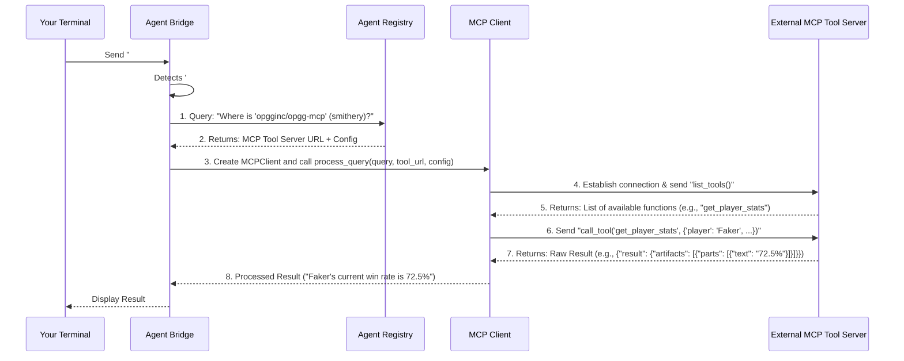

# Chapter 6: MCP (Microservice Communication Protocol) Client

Welcome back! In our journey through the NANDA framework, we've covered a lot of ground. In [Chapter 4: Agent Registry](04_agent_registry_.md), we saw how agents find each other, and in [Chapter 5: Flask API Gateway](05_flask_api_gateway_.md), we learned how to expose your agent to external web users.

Now, imagine your AI agent has learned to talk to you, and even to other agents. But what if your agent needs to do something outside its "brain"? What if it needs to check the current weather, pull up a stock price, or send an email through an external service? Your agent can't do these things by itself! It needs a way to use external "tools."

This is where the **MCP (Microservice Communication Protocol) Client** comes in.

### What Problem Does the MCP Client Solve?

Think of your AI agent as a brilliant human assistant. They're great at understanding, processing, and responding to information. But if you ask them to "check today's stock price for Google," they can't just *know* it. They need a **specialized tool** (like a stock market app) and they need to know **how to use that tool** (its interface and what commands it understands).

The **MCP Client** acts as this specialized **translator and tool-user** for your agent. It solves the problem of **how your AI agent can reliably and efficiently interact with external microservices or "tools"** that live outside its immediate environment.

**Central Use Case:** Your agent needs to get the current win rate for a famous e-sports player from a specialized game statistics service.

Without the MCP Client, your agent would be limited to only the information it already has or can generate internally. The MCP Client extends your agent's capabilities by allowing it to:

*   **Connect to External Tools:** It knows how to "call out" to other programs or services on the internet.
*   **Speak Their Language:** It communicates using a standard protocol called MCP, ensuring that your agent and the external tool understand each other.
*   **Discover What Tools Do:** It can ask the tool, "What can you do?" (e.g., "Can you get player stats?").
*   **Execute Specific Commands:** Once it knows what a tool can do, it can send precise requests, like "Get win rate for Faker."

This means your agent can go beyond just chatting and actually *perform actions* in the real world by leveraging external services.

### How to Use the MCP Client

You won't directly create an `MCPClient` instance yourself in your typical agent code. Instead, your `AgentBridge` (the communication hub from [Chapter 2: Agent Bridge (AgentBridge Class)](02_agent_bridge__agentbridge_class__.md)) is smart enough to detect when you want to use an external tool and will then orchestrate the use of the MCP Client for you.

To tell your agent to use an MCP-enabled tool, you'll use a special command format in your agent's terminal:

`#registry_provider:mcp_server_name query_text`

Let's break that down with an example:

```text
#smithery:opgginc/opgg-mcp What is Faker's win rate in the latest tournament?
```

Here's what each part means:

*   `#`: This tells your `AgentBridge` that you want to run an MCP query.
*   `smithery`: This is the `registry_provider`. It tells the system *where* to look for the MCP server. Think of it as a category or a specific directory for tools.
*   `opgginc/opgg-mcp`: This is the `mcp_server_name` (also called `qualified_name`). This is the unique identifier for the specific tool you want to use. Like a specific app name in an app store.
*   `What is Faker's win rate in the latest tournament?`: This is the `query_text`. This is the actual question or command you want the external tool to process.

When you type this into your agent's terminal, your agent will:

1.  **Recognize the Command:** The `AgentBridge` sees the `#` and knows it's an MCP query.
2.  **Find the Tool:** It then uses the [Agent Registry](04_agent_registry_.md) (the "phone book" for agents and services) to look up where the `opgginc/opgg-mcp` tool is located.
3.  **Form the Request:** It prepares the query and the tool's address.
4.  **Execute the Query:** It uses the MCP Client to send your query to the tool.
5.  **Get the Result:** The tool processes your query and sends back a response.
6.  **Display the Result:** Your agent receives the result and shows it to you in the terminal.

**Example Input and Output:**

If you input:

```text
#smithery:opgginc/opgg-mcp What is Faker's current win rate?
```

Your agent might respond with something like:

```text
[AGENT polite-agent]: Faker's current win rate is 72.5% over the last 100 games.
```

This demonstrates how a simple command allows your agent to interact with complex external services and bring back real-time information.

### Behind the Scenes: How the MCP Client Works

When you type that special `#` command, a series of steps unfold within your agent system:



1.  **Command Detection:** Your input reaches the `AgentBridge`'s `handle_message` method. It recognizes the `#` prefix.
2.  **Tool Discovery (Registry Lookup):** The `AgentBridge` needs to know *where* the `opgginc/opgg-mcp` tool is located. It asks the [Agent Registry](04_agent_registry_.md) (our "phone book") for the specific URL and any configuration details for that tool.
3.  **URL Preparation:** If the tool requires an API key (like for `smithery` tools), the `AgentBridge` will properly format the URL to include this key.
4.  **MCP Client Activation:** The `AgentBridge` then activates the `MCPClient`, providing it with the query and the prepared tool URL.
5.  **Tool Interaction:** The `MCPClient` connects to the external MCP Tool Server. It first asks the tool what functions it offers (`list_tools()`). Then, using an AI model (like Claude) to figure out which tool function to call and with what arguments based on your `query_text`, it sends the actual command (e.g., `get_player_stats("Faker")`) to the tool.
6.  **Result Processing:** The MCP Tool Server processes the command and sends back a response. The `MCPClient` receives this, extracts the useful information from it, and sends it back to the `AgentBridge`.
7.  **Display:** The `AgentBridge` formats the result and displays it in your terminal.

This intricate dance allows your agent to tap into a vast array of specialized external services, making it incredibly powerful.

### Diving Deeper into the Code

The logic for the MCP Client is split across two main files: `nanda_adapter/core/agent_bridge.py` (which orchestrates the call) and `nanda_adapter/core/mcp_utils.py` (which contains the core `MCPClient` functionality).

#### Orchestration in `AgentBridge` (`handle_message`)

The `AgentBridge`'s `handle_message` method is the traffic controller. It's where the `#` command is first detected.

```python
# File: nanda_adapter/core/agent_bridge.py (simplified inside AgentBridge.handle_message)

    def handle_message(self, msg: Message) -> Message:
        user_text = msg.content.text
        # ... (other checks and logging) ...

        if user_text.startswith("#"):
            parts = user_text.split(" ", 1)
            # Example: #registry:server_name query
            if len(parts) > 1 and len(parts[0][1:].split(":",1)) == 2:
                requested_registry, mcp_server_to_call = parts[0][1:].split(":",1)
                query = parts[1]

                # Step 1: Find the MCP server URL and config from the registry
                response = get_mcp_server_url(requested_registry, mcp_server_to_call)
                if response is None:
                    return Message(...) # Error: server not found

                mcp_server_url, config_details, registry_name = response

                # Step 2: Form the final URL (add API keys etc.)
                mcp_server_final_url = form_mcp_server_url(mcp_server_url, config_details, registry_name)
                if mcp_server_final_url is None:
                    return Message(...) # Error: API key missing

                # Step 3: Run the MCP query using the MCPClient
                result = asyncio.run(run_mcp_query(query, mcp_server_final_url))

                return Message( # Return the result to the user
                    role=MessageRole.AGENT,
                    content=TextContent(text=f"{result}"),
                    parent_message_id=msg.message_id,
                    conversation_id=conversation_id
                )
            # ... (else: invalid command format) ...
```
When `handle_message` sees a message starting with `#`, it extracts the registry provider, the MCP server name, and the query. It then calls `get_mcp_server_url` to find the tool's base URL, `form_mcp_server_url` to prepare the URL with any necessary authentication (like API keys), and finally, `run_mcp_query` to actually execute the command. Notice `asyncio.run` because MCP operations are asynchronous.

#### Retrieving MCP Tool Information (`get_mcp_server_url`)

This function in `agent_bridge.py` is responsible for asking the central [Agent Registry](04_agent_registry_.md) about the requested MCP tool.

```python
# File: nanda_adapter/core/agent_bridge.py

def get_mcp_server_url(requested_registry: str, qualified_name: str) -> Optional[tuple]:
    """
    Query registry endpoint to find MCP server URL based on qualifiedName.
    """
    try:
        registry_url = get_registry_url() # Gets the registry's address
        endpoint_url = f"{registry_url}/get_mcp_registry"

        # Make an HTTP request to the registry to look up the MCP server
        response = requests.get(endpoint_url, params={
            'registry_provider': requested_registry,
            'qualified_name': qualified_name
        })

        if response.status_code == 200:
            result = response.json()
            # Returns the tool's endpoint URL, its config, and its registry name
            return result.get("endpoint"), json.loads(result.get("config")), result.get("registry_provider")
        else:
            print(f"No MCP server found for qualified_name: {qualified_name}")
            return None
    except Exception as e:
        print(f"Error querying MCP server URL: {e}")
        return None
```
This function contacts the [Agent Registry](04_agent_registry_.md) at a specific endpoint (`/get_mcp_registry`) with the `registry_provider` (e.g., "smithery") and `qualified_name` (e.g., "opgginc/opgg-mcp"). The registry then returns the tool's network address (endpoint) and any special configuration needed.

#### Preparing the Tool URL (`form_mcp_server_url`)

Some MCP tools require an API key or other configuration in their URL. This function handles that.

```python
# File: nanda_adapter/core/agent_bridge.py

def form_mcp_server_url(url: str, config: dict, registry_name: str) -> Optional[str]:
    """
    Form the MCP server URL based on the URL and config.
    """
    try:
        if registry_name == "smithery": # If it's a "smithery" tool, add API key
            smithery_api_key = SMITHERY_API_KEY # Get API key from environment
            if not smithery_api_key:
                print("❌ SMITHERY_API_KEY not found in environment.")
                return None
            config_b64 = base64.b64encode(json.dumps(config).encode())
            mcp_server_url = f"{url}?api_key={smithery_api_key}&config={config_b64.decode()}"
        else:
            mcp_server_url = url # Otherwise, use the URL as is
        return mcp_server_url
    except Exception as e:
        print(f"Issues with form_mcp_server_url: {e}")
        return None
```
This function checks the `registry_name`. If it's a "smithery" tool, it takes the `SMITHERY_API_KEY` (which you would set as an environment variable) and includes it, along with a base64-encoded version of the tool's configuration, into the final URL. This is how the tool knows who is calling it and if they are authorized.

#### Running the Query (`run_mcp_query`)

Still in `agent_bridge.py`, this function wraps the actual interaction with the `MCPClient`.

```python
# File: nanda_adapter/core/agent_bridge.py

async def run_mcp_query(query: str, updated_url: str) -> str:
    try:
        # Determine transport type (e.g., 'sse' or 'http')
        from urllib.parse import urlparse
        parsed_url = urlparse(updated_url)
        transport_type = "sse" if parsed_url.path.endswith("/sse") else "http"

        async with MCPClient() as client: # Create and manage the MCPClient
            result = await client.process_query(query, updated_url, transport_type)
            return result
    except Exception as e:
        error_msg = f"Error processing MCP query: {str(e)}"
        return error_msg
```
This function is crucial because it creates an `MCPClient` and calls its `process_query` method. The `async with` statement ensures the client is properly set up and cleaned up. It also determines the communication method (`transport_type`) with the MCP tool server.

#### The `MCPClient` Class (`mcp_utils.py`)

This is where the direct interaction with MCP tools happens. It uses the `mcp` library to manage the connection and tool calls.

```python
# File: nanda_adapter/core/mcp_utils.py (simplified)

import asyncio
from contextlib import AsyncExitStack
from mcp import ClientSession
from mcp.client.sse import sse_client
from mcp.client.streamable_http import streamablehttp_client
from anthropic import Anthropic
import json

class MCPClient:
    def __init__(self):
        self.session = None
        self.exit_stack = AsyncExitStack()
        # The Anthropic client is used here to let Claude pick the right tool
        self.anthropic = Anthropic(api_key=os.getenv("ANTHROPIC_API_KEY"))

    async def connect_to_mcp_and_get_tools(self, mcp_server_url, transport_type="http"):
        """Connect to MCP server and return available tools."""
        try:
            # Connect using either SSE or HTTP transport
            if transport_type.lower() == "sse":
                transport = await self.exit_stack.enter_async_context(sse_client(mcp_server_url))
            else:
                transport = await self.exit_stack.enter_async_context(streamablehttp_client(mcp_server_url))

            # Create an MCP client session
            read_stream, write_stream, *_ = transport # Unpack based on transport type
            self.session = await self.exit_stack.enter_async_context(
                ClientSession(read_stream, write_stream)
            )
            await self.session.initialize() # Initialize the MCP session

            # Ask the tool what functions it has
            tools_result = await self.session.list_tools()
            return tools_result.tools
        except Exception as e:
            print(f"Error connecting to MCP server: {e}")
            return None
```
The `MCPClient` prepares to connect (`__init__`). The `connect_to_mcp_and_get_tools` method actually establishes the connection to the external MCP Tool Server using the correct `transport_type` (HTTP or SSE). Once connected, it asks the tool for a list of all the functions it provides using `self.session.list_tools()`.

```python
# File: nanda_adapter/core/mcp_utils.py (simplified inside MCPClient)

    async def process_query(self, query, mcp_server_url, transport_type="http"):
        try:
            # 1. Connect and get available tools from the MCP server
            tools = await self.connect_to_mcp_and_get_tools(mcp_server_url, transport_type)
            if not tools:
                return "Failed to connect to MCP server or get tools"

            # Prepare tool definitions for Claude
            available_tools = [{"name": tool.name, "description": tool.description, "input_schema": tool.inputSchema} for tool in tools]

            messages = [{"role": "user", "content": query}]

            # 2. Use Claude to decide which tool to call based on the user's query
            message = self.anthropic.messages.create(
                model="claude-3-5-sonnet-20241022",
                max_tokens=1024,
                messages=messages,
                tools=available_tools # Provide Claude with the available tools
            )

            # 3. Loop: If Claude wants to use a tool, call it and feed back the result
            while True:
                has_tool_calls = False
                for block in message.content:
                    if block.type == "tool_use":
                        has_tool_calls = True
                        tool_name = block.name
                        tool_args = block.input

                        # Call the tool using the MCP session
                        result = await self.session.call_tool(tool_name, tool_args)
                        processed_result = parse_jsonrpc_response(result) # Format the result

                        # Add tool_use and tool_result messages back to history for Claude
                        messages.append({"role": "assistant", "content": [{"type": "tool_use", "id": block.id, "name": tool_name, "input": tool_args}]})
                        messages.append({"role": "user", "content": [{"type": "tool_result", "tool_use_id": block.id, "content": str(processed_result)}]})

                if not has_tool_calls: # If Claude didn't call any tools, we have the final answer
                    break

                # Ask Claude again with the updated message history (including tool results)
                message = self.anthropic.messages.create(
                    model="claude-3-5-sonnet-20241022",
                    max_tokens=1024,
                    messages=messages,
                    tools=available_tools
                )

            # 4. Extract and return the final text response from Claude
            final_response = ""
            for block in message.content:
                if block.type == "text":
                    final_response += block.text + "\n"
            return parse_jsonrpc_response(final_response.strip()) if final_response else "No response generated"

        except Exception as e:
            print(f"Error processing query: {e}")
            return f"Error: {str(e)}"
```
The `process_query` method is the heart of the `MCPClient`:
1.  It first connects to the MCP tool server and gets a list of its available functions (`tools`).
2.  It then gives these `tools` and your `query` to an AI model (like Claude). Claude's job is to figure out if any of the available tools can answer your query and, if so, which one and with what arguments.
3.  It enters a loop: if Claude decides to use a tool, the `MCPClient` calls that tool (`await self.session.call_tool(...)`) and gets the result. It then sends this result back to Claude, so Claude has the context. This continues until Claude gives a final answer without needing more tool calls.
4.  Finally, it extracts the text from Claude's final response and returns it.

The `__aenter__` and `__aexit__` methods are part of Python's `async with` statement, ensuring that the `MCPClient`'s connection is properly opened and closed when it's used.

### Conclusion

The MCP (Microservice Communication Protocol) Client is a powerful abstraction that bridges the gap between your NANDA AI agent and the vast world of external services and tools. It acts as your agent's expert "tool-user," enabling it to discover, interact with, and execute queries on specialized microservices using a standard protocol. By leveraging the MCP Client, your NANDA agent can extend its capabilities far beyond internal reasoning, allowing it to fetch real-time data, trigger external actions, and become a truly versatile digital assistant.

This marks the end of our beginner-friendly tutorial on the NANDA Agent Framework core concepts! You now have a foundational understanding of how to build, connect, and extend your custom AI agents.

---

Built by [Codalytix.com](Codalytix.com)
