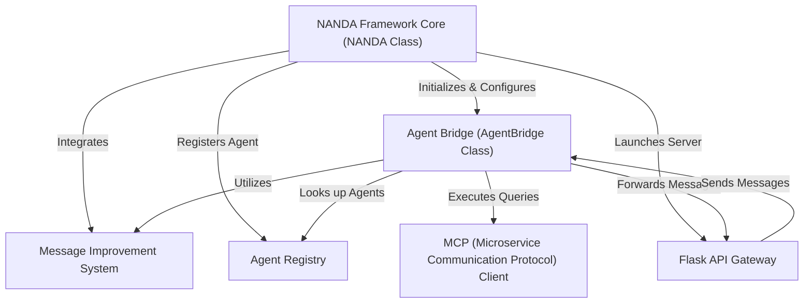

# Tutorial: adapter

The **NANDA Agent Framework** is a flexible system for building *customizable AI agents*. It provides a central **Agent Bridge** for agents to communicate with each other and human users. A key feature is its *pluggable message improvement system*, which refines messages before they are sent. Agents can also *integrate with external microservices* through a specialized client and expose their functionalities via a **Flask API Gateway** for easy web interaction.

**Source Repository:** [https://github.com/projnanda/adapter.git](https://github.com/projnanda/adapter.git)

## Chapters

1. [NANDA Framework Core (NANDA Class)
](01_nanda_framework_core__nanda_class__.md)
2. [Agent Bridge (AgentBridge Class)
](02_agent_bridge__agentbridge_class__.md)
3. [Message Improvement System
](03_message_improvement_system_.md)
4. [Agent Registry
](04_agent_registry_.md)
5. [Flask API Gateway
](05_flask_api_gateway_.md)
6. [MCP (Microservice Communication Protocol) Client
](06_mcp__microservice_communication_protocol__client_.md)

---

Built by [Codalytix.com](Codalytix.com)
