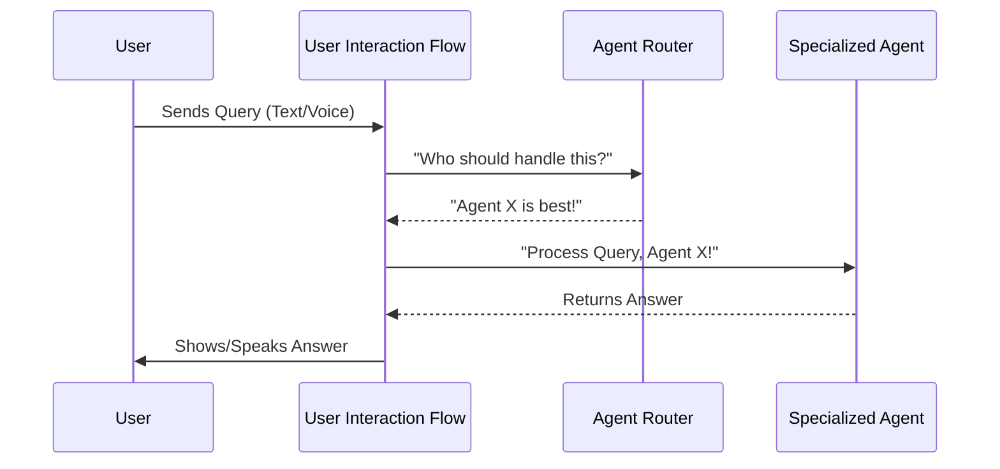

# Chapter 1: User Interaction Flow

Imagine you're talking to a super smart AI assistant. You speak or type a question, and it understands, thinks, and replies, sometimes even speaking back to you! How does all that magic happen so smoothly?

That's where the **User Interaction Flow** comes in! Think of it as the main control panel or the conductor of an orchestra. Its job is to manage the entire conversation between you (the user) and `agenticSeek`. It ensures that your questions are heard, sent to the right expert AI, and their answers are brought back to you in a clear way.

**The Big Problem It Solves:** Without this flow, talking to an AI would be like shouting into a void. You'd have no way to get your input to the right part of the AI system, and no way to get an answer back. The User Interaction Flow creates a seamless, continuous dialogue, even though many different AI "brains" might be working behind the scenes.

Let's look at a simple use case: **Asking AgenticSeek a question like "What is the capital of France?" and getting an answer.**

---

### What is the User Interaction Flow? (Key Concepts)

The User Interaction Flow, handled mainly by a component called `Interaction` in `agenticSeek`, involves several key steps:

1.  **Input**: It listens for your query, whether you type it or speak it.
2.  **Routing**: It acts like a traffic cop, figuring out which specialized AI "expert" (called an [Agent System](02_agent_system_.md) in `agenticSeek`) is best suited to answer your question.
3.  **Processing**: It hands your query to that chosen expert [Agent System](02_agent_system_.md). The agent then does its work to find an answer.
4.  **Output**: Once the agent has an answer, the User Interaction Flow collects it and presents it back to you, either as text on your screen or as synthesized speech.

This entire process happens very quickly, making it feel like a single, natural conversation.

---

### How to Use the User Interaction Flow

Let's see how `agenticSeek` uses this flow to handle your questions. When you run `agenticSeek` from your command line, it uses a script called `cli.py` (which stands for Command Line Interface).

Here’s a simplified look at how `cli.py` sets up and uses the User Interaction Flow:

```python
# cli.py (simplified)
import asyncio
from sources.interaction import Interaction
from sources.agents import CasualAgent # Just an example agent type

async def main():
    # ... setup (not shown for simplicity) ...

    # Create a list of 'agents' (the specialized AI experts)
    # The Interaction flow will decide which one to use.
    agents = [
        CasualAgent(name="Main Agent", prompt_path="...", provider="...", verbose=False),
        # ... other agents like CoderAgent, BrowserAgent ...
    ]

    # Initialize the Interaction flow, enabling speech if configured
    interaction = Interaction(agents, tts_enabled=True, stt_enabled=True)

    # The main conversation loop
    while interaction.is_active:
        # Step 1: Get user input (text or speech)
        interaction.get_user()

        # Check if the user wants to exit
        if not interaction.is_active:
            break

        # Step 2 & 3: Decide which agent to use and let it 'think'
        if await interaction.think():
            # Step 4: Show and speak the answer
            interaction.show_answer()
            interaction.speak_answer()

if __name__ == "__main__":
    asyncio.run(main())
```

**Explanation:**

*   **`interaction = Interaction(...)`**: This line creates our main "control panel" object. We give it a list of `agents` (the specialized AI experts it can use) and tell it if we want Text-to-Speech (`tts_enabled`) or Speech-to-Text (`stt_enabled`) enabled.
*   **`while interaction.is_active:`**: This is the heart of the conversation. It keeps running as long as you want to talk to AgenticSeek.
*   **`interaction.get_user()`**: This method waits for you to speak or type your question. It then stores your question so `agenticSeek` can process it.
*   **`await interaction.think()`**: This is where the magic happens! The `interaction` object takes your question, decides which specialized [Agent System](02_agent_system_.md) should handle it, and then tells that agent to "think" and come up with an answer.
*   **`interaction.show_answer()` and `interaction.speak_answer()`**: Once the thinking is done, these methods present the agent's answer to you on the screen and, if enabled, speak it aloud.

When you type "What is the capital of France?" into the command line, this simplified loop is what makes AgenticSeek receive your question, process it, and give you "Paris" back!

`agenticSeek` also provides a web-based API (Application Programming Interface) for other applications to interact with it. This is handled by `api.py`. It uses the same `Interaction` object:

```python
# api.py (simplified)
from fastapi import FastAPI
from sources.interaction import Interaction
from sources.schemas import QueryRequest # To define how queries look

api = FastAPI(...) # Setup our web server

# Initialize the same Interaction flow
interaction = Interaction(agents, tts_enabled=False, stt_enabled=False) # Simplified options

@api.post("/query")
async def process_query(request: QueryRequest):
    # Get the query from the web request
    query = request.query
    
    # Let the Interaction flow handle the thinking
    success = await interaction.think() # This is where the core logic from cli.py's loop happens

    # Prepare the response to send back over the web
    if success:
        return {"answer": interaction.last_answer, "status": "success"}
    else:
        return {"answer": "Error processing query", "status": "failure"}

# ... more API endpoints ...
```

**Explanation:** This snippet shows that even when a web application sends a query, the `Interaction` object is still the central hub responsible for managing the "thinking" process, just like in the command-line version.

---

### Under the Hood: The Interaction Flow's Inner Workings

Let's peek behind the curtain to understand what happens step-by-step inside the `Interaction` flow when you ask `agenticSeek` a question.

Here's a simple diagram illustrating the flow:



1.  **User Input**: You type "What is Python?" or speak it.
2.  **`Interaction` receives the input**: The `get_user()` method inside `sources/interaction.py` captures your input. If Speech-to-Text (STT) is enabled, it uses components to convert your voice to text. Otherwise, it reads your keyboard input.
    ```python
    # sources/interaction.py (simplified get_user method)
    class Interaction:
        # ... other methods ...

        def get_user(self) -> str:
            """Get the user input from the microphone or the keyboard."""
            if self.stt_enabled:
                query = self.transcription_job() # Converts speech to text
            else:
                query = self.read_stdin() # Reads from keyboard
            
            if query is None: # User typed 'exit' or 'goodbye'
                self.is_active = False
                return None
            self.last_query = query # Store the query
            return query
    ```
    **Explanation:** This method is the "ears and eyes" of `agenticSeek`, waiting for your input and making sure it's stored.

3.  **Routing to the Right Agent**: After getting your query, the `think()` method in `sources/interaction.py` then asks the `AgentRouter` (a clever component that knows all about the different [Agent System](02_agent_system_.md)s) to pick the best expert for the job. For "What is Python?", it might pick the `CasualAgent`.
    ```python
    # sources/interaction.py (simplified think method)
    class Interaction:
        # ... other methods ...

        async def think(self) -> bool:
            """Request AI agents to process the user input."""
            if self.last_query is None or len(self.last_query) == 0:
                return False
            
            # The router decides which agent is best
            agent = self.router.select_agent(self.last_query)
            if agent is None:
                return False
            
            self.current_agent = agent # Remember which agent is active

            # Ask the chosen agent to process the query
            self.last_answer, self.last_reasoning = await agent.process(self.last_query, self.speech)
            return True
    ```
    **Explanation:** The `select_agent` part is crucial. It's like the `Interaction` object saying, "I have a question about programming, `CoderAgent`, you're up!" or "This is a general question, `CasualAgent`, please handle this." You'll learn more about these "agents" in the next chapter, [Agent System](02_agent_system_.md).

4.  **Agent Processes the Query**: The chosen [Agent System](02_agent_system_.md) (e.g., `CasualAgent`) then does its work to generate an answer. This might involve using a powerful language model (an [LLM Integration (Provider)](03_llm_integration__provider__.md)) or even using [Tool System](04_tool_system_.md)s to look up information. The answer is sent back to the `Interaction` object.

5.  **Outputting the Answer**: Finally, `Interaction` takes the agent's answer and presents it to you.
    ```python
    # sources/interaction.py (simplified output methods)
    class Interaction:
        # ... other methods ...

        def speak_answer(self) -> None:
            """Speak the answer to the user."""
            if self.tts_enabled and self.last_answer and self.speech:
                # Speaks the answer in a separate thread so the main program isn't blocked
                self.speech.speak(self.last_answer)
        
        def show_answer(self) -> None:
            """Show the answer to the user."""
            if self.current_agent is not None:
                self.current_agent.show_answer() # Displays the answer on screen
    ```
    **Explanation:** These methods are `agenticSeek`'s "voice and display." They ensure you receive the answer clearly, either by seeing it printed or hearing it spoken.

---

### Conclusion

In this chapter, we learned that the **User Interaction Flow** is the central command center of `agenticSeek`. It's responsible for managing the entire conversation, from receiving your input to routing it to the correct specialized AI agent and then presenting the answer back to you. The `Interaction` class is the key component that orchestrates this seamless dialogue.

You now understand how your questions travel through `agenticSeek` to get an answer. But what exactly are these "specialized agents" that `Interaction` talks to? That's what we'll explore in the next chapter!

[Next Chapter: Agent System](02_agent_system_.md)

---

Generated by [AI Codebase Knowledge Builder](https://github.com/The-Pocket/Tutorial-Codebase-Knowledge)