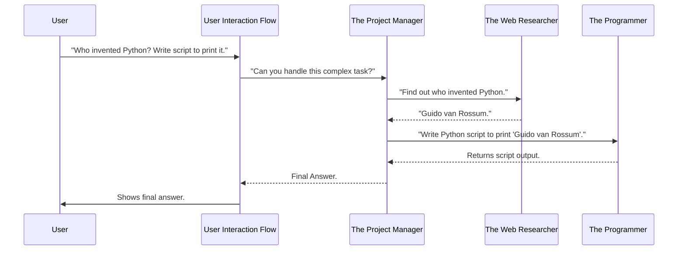

# Chapter 2: Agent System

In Chapter 1, we learned about the [User Interaction Flow](01_user_interaction_flow_.md), which acts like the main control panel, listening to your questions and routing them to the right "specialized AI expert." But what exactly are these "experts" that AgenticSeek talks to?

That's where the **Agent System** comes in!

Imagine you have a big, complex task, like building a house. You wouldn't hire just one person to do everything, right? You'd hire an architect to design, a builder to construct, a plumber for pipes, and an electrician for wiring. Each person is a specialist.

The **Agent System** in AgenticSeek works just like that. It's a team of specialized AI "personalities" or "experts." Each agent is designed with unique abilities and knowledge to handle specific kinds of problems. This way, AgenticSeek can tackle much more complex requests by breaking them down and assigning them to the right specialist.

**The Big Problem It Solves:** A single, giant AI that tries to do everything can be good at nothing. By having specialized agents, AgenticSeek can be exceptionally good at many different things – from writing code to browsing the web, or just having a casual chat. This modular approach makes the AI powerful and versatile.

Let's consider a practical example: **You ask AgenticSeek, "Find out who invented Python, then write a simple Python script to print that name."**

This single request is actually two different tasks! One requires general knowledge lookup, and the other requires coding. This is a perfect scenario for the Agent System.

---

### What is an Agent? (Key Concepts)

At its heart, an "Agent" in AgenticSeek is a self-contained AI expert ready to perform specific duties. All agents are built upon a common blueprint, but they are specialized for different tasks.

Here are the core ideas behind every agent:

1.  **Specialized Role:** Each agent has a specific job. For example, the `CoderAgent` is an expert at writing and executing code, while the `BrowserAgent` is skilled at navigating the web.
2.  **"Brain" (LLM Integration):** Every agent has a powerful "brain" – a Large Language Model (LLM) that it uses for thinking, understanding, and generating responses. You'll learn more about this in [Chapter 3: LLM Integration (Provider)](03_llm_integration__provider__.md).
3.  **"Toolkit" (Tool System):** Agents aren't just thinkers; they're also doers! They have a set of specialized "tools" they can use to perform actions, like running code, searching the web, or reading files. This is covered in [Chapter 4: Tool System](04_tool_system_.md).
4.  **"Memory" (Memory Management):** Agents remember what they've done and said, and what you've told them. This helps them stay on track and have coherent conversations. We'll dive into this in [Chapter 5: Memory Management](05_memory_management_.md).

Think of agents as members of an expert team:

*   `CasualAgent`: Your friendly conversationalist for general questions.
*   `CoderAgent`: Your personal programmer and debugger.
*   `BrowserAgent`: Your web-savvy research assistant.
*   `FileAgent`: Your file system manager.
*   `PlannerAgent`: The project manager who breaks down big tasks and assigns them to other agents.

---

### How Agents Work Together (Solving Our Use Case)

Let's go back to our example: "Find out who invented Python, then write a simple Python script to print that name."

Here's how the Agent System, guided by the [User Interaction Flow](01_user_interaction_flow_.md), handles this:



As you can see, the initial request goes to the `PlannerAgent` (the "Project Manager"). This agent is smart enough to realize the task has multiple parts and delegates to other specialized agents.

1.  The `PlannerAgent` first instructs the `BrowserAgent` (the "Web Researcher") to find the inventor's name.
2.  The `BrowserAgent` uses its web search tools and provides the answer ("Guido van Rossum").
3.  Then, the `PlannerAgent` passes this information to the `CoderAgent` (the "Programmer").
4.  The `CoderAgent` writes and perhaps even runs a Python script (using its code execution tools) to print the name.
5.  Finally, the `PlannerAgent` collects all the pieces and gives the complete answer back to the [User Interaction Flow](01_user_interaction_flow_.md), which presents it to you.

This shows the power of modular agents collaborating to solve problems far beyond what a single AI could achieve.

---

### Under the Hood: The Agent's Blueprint and Specializations

All agents in AgenticSeek are built on a common foundation: the `Agent` class in `sources/agents/agent.py`. Think of it as the basic blueprint for any AI expert.

```python
# sources/agents/agent.py (simplified)
class Agent():
    """An abstract class for all agents."""
    def __init__(self, name: str, prompt_path: str, provider, verbose=False, browser=None) -> None:
        self.agent_name = name # E.g., "CoderAgent"
        self.llm = provider   # The agent's "brain" (LLM)
        self.memory = None    # Where the agent stores its thoughts
        self.tools = {}       # The agent's "toolkit"
        # ... other setup ...
    
    @abstractmethod
    def process(self, prompt, speech_module) -> str:
        """
        Abstract method, implementation in child class.
        Process the prompt and return the answer of the agent.
        """
        pass
    
    async def llm_request(self) -> Tuple[str, str]:
        """Asynchronously ask the LLM to process the prompt."""
        # This is where the agent "thinks" using its LLM brain
        # ... (simplified) ...
        answer, reasoning = self.llm.respond(self.memory.get(), self.verbose)
        self.memory.push('assistant', answer)
        return answer, reasoning

    def execute_modules(self, answer: str) -> Tuple[bool, str]:
        """
        Execute all the tools the agent has and return the result.
        """
        # This is where the agent "acts" using its tools
        # ... (simplified, involves finding and running code blocks) ...
        return True, "Execution successful"
```

**Explanation:**

*   **`__init__`**: When an agent is created, it's given a `name`, a path to its specific `prompt` (how it's told to behave), an `LLM provider` (its brain), and potentially other components like a `browser`.
*   **`process`**: This is the core method for *any* agent. When the [User Interaction Flow](01_user_interaction_flow_.md) or `PlannerAgent` asks an agent to do something, it calls this `process` method. It's marked `@abstractmethod` because each specific agent (like Coder, Browser) will have its own unique way of processing.
*   **`llm_request`**: This method is how an agent uses its `llm` (brain) to think. It sends the current conversation (from its `memory`) to the LLM and gets back a thought and an answer.
*   **`execute_modules`**: After thinking, if the agent decides it needs to perform an action (like running code or searching), it calls this method. This is where its `tools` come into play.

Now, let's look at a few specialized agents:

#### `CasualAgent`: Your Chat Buddy

The `CasualAgent` (from `sources/agents/casual_agent.py`) is designed for general conversation. It's simple because it doesn't need complex tools.

```python
# sources/agents/casual_agent.py (simplified)
class CasualAgent(Agent):
    def __init__(self, name, prompt_path, provider, verbose=False):
        super().__init__(name, prompt_path, provider, verbose, None)
        self.tools = {} # No tools for the casual agent
        self.role = "talk"
        self.type = "casual_agent"
        # ... memory setup ...
    
    async def process(self, prompt, speech_module) -> str:
        self.memory.push('user', prompt)
        # Just uses its LLM brain to respond
        answer, reasoning = await self.llm_request() 
        self.last_answer = answer
        return answer, reasoning
```

**Explanation:** This agent primarily uses its `llm_request` to respond to casual prompts, making it perfect for "What is the capital of France?" type questions. It has an empty `tools` dictionary because it doesn't need to execute external commands.

#### `CoderAgent`: The Programmer

The `CoderAgent` (from `sources/agents/code_agent.py`) is much more hands-on. It's equipped with various programming language interpreters and file system tools.

```python
# sources/agents/code_agent.py (simplified)
class CoderAgent(Agent):
    def __init__(self, name, prompt_path, provider, verbose=False):
        super().__init__(name, prompt_path, provider, verbose, None)
        self.tools = {
            "bash": BashInterpreter(),  # For command line operations
            "python": PyInterpreter(),  # For running Python code
            "file_finder": FileFinder() # For managing files
            # ... other interpreters (C, Go, Java) ...
        }
        self.role = "code"
        self.type = "code_agent"
        # ... memory setup ...

    async def process(self, prompt, speech_module) -> str:
        attempt = 0
        while attempt < 5 and not self.stop:
            # 1. Agent thinks (uses LLM) to generate code
            answer, reasoning = await self.llm_request()
            
            # If no code block, just return answer
            if not "```" in answer: 
                self.last_answer = answer
                break

            # 2. Agent executes the generated code (using tools)
            exec_success, feedback = self.execute_modules(answer) 
            self.last_answer = self.remove_blocks(answer) # Remove code blocks from final display
            
            # 3. If execution failed, agent uses feedback to try again
            if not exec_success:
                self.memory.push('user', feedback) # Tells itself what went wrong
                pretty_print(f"Execution failure:\n{feedback}", color="failure")
                attempt += 1
            else:
                break # Success!

        return self.last_answer, reasoning
```

**Explanation:** The `CoderAgent`'s `process` method shows a loop: it "thinks" (using `llm_request`) to write code, then "acts" (using `execute_modules`) to run that code. If the code fails, it gets `feedback` from the tools and pushes it into its `memory` as if *you* told it about the error, allowing its LLM brain to correct the mistake in the next "thought" cycle. This makes it robust at coding tasks.

#### `BrowserAgent`: The Web Surfer

The `BrowserAgent` (from `sources/agents/browser_agent.py`) focuses on web interaction.

```python
# sources/agents/browser_agent.py (simplified)
class BrowserAgent(Agent):
    def __init__(self, name, prompt_path, provider, verbose=False, browser=None):
        super().__init__(name, prompt_path, provider, verbose, browser)
        self.tools = {
            "web_search": searxSearch(), # A tool for web searching
        }
        self.browser = browser # The actual browser control
        self.role = "web"
        self.type = "browser_agent"
        # ... memory setup and other web-related state ...
    
    async def process(self, user_prompt: str, speech_module) -> Tuple[str, str]:
        complete = False
        while not complete and not self.stop:
            # 1. Agent thinks (uses LLM) to decide what to search or navigate
            ai_prompt, reasoning = await self.llm_decide(self.search_prompt(user_prompt))

            # 2. If it decided to search, it uses its "web_search" tool
            search_result_raw = self.tools["web_search"].execute([ai_prompt])
            search_result = self.jsonify_search_results(search_result_raw)

            # 3. Agent thinks again to decide which link to navigate to
            self.memory.clear() # Clear memory for new navigation context
            prompt = self.make_newsearch_prompt(user_prompt, search_result)
            answer, reasoning = await self.llm_decide(prompt)
            
            # 4. Agent "acts" by navigating the browser
            link = self.select_link(self.parse_answer(answer))
            if link and self.browser.go_to(link):
                self.current_page = link
                page_text = self.get_page_text(limit_to_model_ctx=True)
                self.navigable_links = self.browser.get_navigable()
                # 5. Agent thinks again based on new page content
                prompt = self.make_navigation_prompt(user_prompt, page_text)
            else:
                # Handle navigation failure or no link found
                pass 
            
            # Agent decides if task is complete or needs more navigation
            if "REQUEST_EXIT" in answer: # Or some other completion criteria
                complete = True
        
        # Finally, summarize findings (uses LLM again)
        summary_prompt = self.conclude_prompt(user_prompt)
        final_answer, final_reasoning = await self.llm_request()
        self.last_answer = final_answer
        return final_answer, final_reasoning
```

**Explanation:** The `BrowserAgent`'s `process` method is a complex loop. It constantly "thinks" (using its LLM) about what to search, what link to click, or whether it has found the answer. It then "acts" by using its `web_search` tool or controlling the `browser` to visit pages. It analyzes the page content and decides its next step, iterating until the task is complete.

#### `PlannerAgent`: The Task Master

The `PlannerAgent` (from `sources/agents/planner_agent.py`) is unique because its primary "job" is to manage *other* agents. It's the project manager who decides which team member (agent) is best for each sub-task.

```python
# sources/agents/planner_agent.py (simplified)
class PlannerAgent(Agent):
    def __init__(self, name, prompt_path, provider, verbose=False, browser=None):
        super().__init__(name, prompt_path, provider, verbose, None)
        self.agents = {
            "coder": CoderAgent(name, "prompts/base/coder_agent.txt", provider),
            "file": FileAgent(name, "prompts/base/file_agent.txt", provider),
            "web": BrowserAgent(name, "prompts/base/browser_agent.txt", provider, browser=browser),
            "casual": CasualAgent(name, "prompts/base/casual_agent.txt", provider)
        }
        self.role = "planification"
        self.type = "planner_agent"
        # ... memory setup ...

    async def make_plan(self, prompt: str) -> List[dict]:
        """Asks the LLM to make a plan."""
        # PlannerAgent asks its LLM brain to create a step-by-step plan 
        # involving other agents (e.g., in JSON format).
        answer, _ = await self.llm_request()
        return self.parse_agent_tasks(answer) # Extracts the tasks for other agents

    async def start_agent_process(self, task: dict, required_infos: dict | None) -> str:
        """Starts the agent process for a given task."""
        # This is where PlannerAgent delegates to another agent!
        agent_prompt = self.make_prompt(task['task'], required_infos)
        target_agent = self.agents[task['agent'].lower()]
        answer, reasoning = await target_agent.process(agent_prompt, None)
        return target_agent.raw_answer_blocks(answer), target_agent.get_success

    async def process(self, goal: str, speech_module) -> Tuple[str, str]:
        agents_tasks = await self.make_plan(goal) # Planner creates the overall plan
        agents_work_result = dict()

        for i, (task_name, task) in enumerate(agents_tasks):
            pretty_print(f"I will {task_name}.", color="info")
            # PlannerAgent tells the chosen agent to start its work
            answer, success = await self.start_agent_process(task, agents_work_result)
            agents_work_result[task['id']] = answer # Stores the result for future tasks
            
            # PlannerAgent might update the plan if a sub-task failed
            agents_tasks = await self.update_plan(goal, agents_tasks, agents_work_result, task['id'], success)

        return answer, ""
```

**Explanation:** The `PlannerAgent`'s `process` method first calls `make_plan` to use its LLM to break down your complex `goal` into a series of sub-tasks. Then, it iterates through these tasks, calling `start_agent_process` for each. This method effectively "activates" another specialized agent (like `CoderAgent` or `BrowserAgent`), gives it its specific sub-task, and collects its result. This allows AgenticSeek to handle multi-step, multi-domain problems.

---

### Conclusion

In this chapter, we've explored the **Agent System**, the heart of AgenticSeek's intelligence. We learned that agents are specialized AI "personalities" – each with its own "brain" (LLM), "toolkit" (tools), and "memory" (memory). By having different agents like `CasualAgent`, `CoderAgent`, `BrowserAgent`, and the orchestrating `PlannerAgent`, AgenticSeek can break down and solve diverse and complex problems through collaboration.

You now understand how `agenticSeek` leverages a team of AI experts. But what powers these agents' "brains"? That's what we'll explore in the next chapter!

[Next Chapter: LLM Integration (Provider)](03_llm_integration__provider__.md)

---

Generated by [AI Codebase Knowledge Builder](https://github.com/The-Pocket/Tutorial-Codebase-Knowledge)