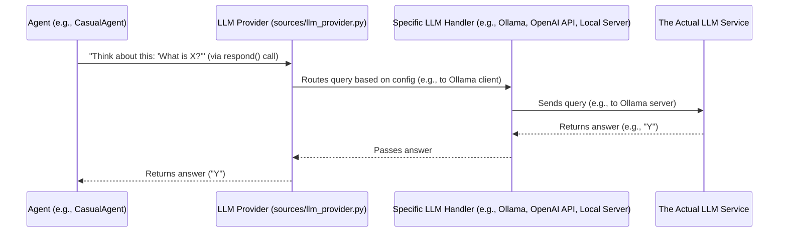

# Chapter 3: LLM Integration (Provider)

In [Chapter 2: Agent System](02_agent_system_.md), we discovered that `agenticSeek` uses a team of specialized AI "experts" called Agents. We learned that each agent has a "brain" – a Large Language Model (LLM) – which it uses for thinking, understanding, and generating responses. But how does an agent actually *talk* to this brain? How does it send its thoughts and receive the AI's answers?

That's where the **LLM Integration (Provider)** comes in!

Imagine you have a fantastic universal remote control. This remote can connect to your TV, your sound system, your lights, and even your air conditioner, even if they're all made by different brands. It simplifies everything by speaking the right "language" for each device.

The **LLM Integration (Provider)** acts just like that universal remote for `agenticSeek`. It's the "brain connector" that allows `agenticSeek` to communicate with various Large Language Models (LLMs). These LLMs could be:

*   **Ollama**: A popular tool for running LLMs directly on your computer.
*   **OpenAI**: A cloud-based service providing powerful models like GPT-4.
*   **A custom local server**: Your own dedicated server running an LLM.
*   And many more!

**The Big Problem It Solves:** Without this integration, `agenticSeek` would be stuck using only one type of LLM, or it would need entirely different code for each LLM it wanted to use. The LLM Integration (Provider) handles the complexities of sending your request to the chosen LLM and receiving the AI's "thoughts" or responses. It's like having a universal adapter that lets `agenticSeek` use different powerful AI brains, depending on your setup, preference, and even cost considerations, ensuring flexibility and broad compatibility.

Let's look at a simple use case: **An agent needs to send a request like "What is the capital of France?" to an LLM and get the answer back.** This is a core function for any `agenticSeek` agent.

---

### What is an LLM Provider? (Key Concepts)

An LLM Provider is essentially a piece of software that knows how to talk to a specific Large Language Model.

1.  **The LLM ("Brain"):** At the very core is the Large Language Model itself. This is the actual AI that understands language, generates text, and can "think." Examples include models like Llama 3, Mixtral, GPT-4, etc.
2.  **The Provider ("Adapter"):** This is `agenticSeek`'s code that acts as an adapter. It takes a message from an agent, translates it into the format the chosen LLM understands, sends it off, waits for the response, and then brings that response back to the agent.
3.  **Why Different Providers?**
    *   **Flexibility:** You might want to use a free, open-source model like those available through Ollama for local, private use. Or you might prefer a powerful, cloud-based model like OpenAI's GPT-4 for more complex tasks.
    *   **Cost:** Some cloud LLMs charge per use, while local ones might be free but require powerful hardware.
    *   **Privacy:** Running models locally (e.g., with Ollama) means your data never leaves your computer.
    *   **Speed:** Local models can sometimes be faster if your hardware is optimized, while cloud models have dedicated infrastructure.

In `agenticSeek`, you configure which LLM provider and model you want to use, typically in a `config.ini` file. This tells `agenticSeek` which "brain" to connect to.

---

### How an Agent Uses an LLM Provider (Solving Our Use Case)

Let's revisit our simple example: a `CasualAgent` needs to answer "What is the capital of France?".

As seen in [Chapter 2: Agent System](02_agent_system_.md), agents have a `process` method, and they use `self.llm_request()` to make their "thoughts." This `self.llm` object is exactly our LLM Integration (Provider)!

```python
# sources/agents/agent.py (simplified)
class Agent():
    def __init__(self, name: str, prompt_path: str, provider, verbose=False, browser=None) -> None:
        # ... other setup ...
        self.llm = provider   # This is where the LLM Provider is set up!
        # ... more setup ...
    
    async def llm_request(self) -> Tuple[str, str]:
        """Asynchronously ask the LLM to process the prompt."""
        # This is where the agent "thinks" using its LLM brain
        answer, reasoning = self.llm.respond(self.memory.get(), self.verbose)
        self.memory.push('assistant', answer)
        return answer, reasoning

# sources/agents/casual_agent.py (simplified)
class CasualAgent(Agent):
    # ... __init__ and other methods ...
    async def process(self, prompt, speech_module) -> str:
        self.memory.push('user', prompt)
        # The CasualAgent simply calls llm_request to get its answer
        answer, reasoning = await self.llm_request() 
        self.last_answer = answer
        return answer, reasoning
```

**Explanation:**

*   When a `CasualAgent` is created, it's given a `provider` object (our universal remote).
*   When it needs to "think" (e.g., to answer your question), its `process` method calls `await self.llm_request()`.
*   Inside `llm_request`, the agent calls `self.llm.respond(...)`. This is the critical step! It passes the conversation history (from its `memory`) to the LLM Provider.
*   The LLM Provider then handles all the communication with the actual LLM, gets the answer, and returns it to the agent.

So, if you ask "What is the capital of France?", the `CasualAgent` formats this into a message, hands it to its `llm` (the Provider), and the Provider makes sure it reaches the LLM and brings "Paris" back.

---

### Under the Hood: Connecting to the Brain

Let's peek behind the curtain to understand how the `LLM Integration (Provider)` works to connect `agenticSeek` to different AI brains.

Here's a simple diagram illustrating the flow:



1.  **Agent asks the Provider**: An `Agent` (like `CasualAgent`) calls `self.llm.respond(history, verbose)`.
2.  **Provider Routes the Request**: The `Provider` class (found in `sources/llm_provider.py`) acts as the central dispatcher. Based on the `provider_name` configured (e.g., "ollama", "openai", "server"), it calls the correct internal function to handle that specific LLM connection.
3.  **Specific LLM Handler Communicates**: This internal function (e.g., `ollama_fn` for Ollama, `openai_fn` for OpenAI, or `server_fn` for a custom local server) knows exactly how to talk to that particular LLM service using its specific API or protocol.
4.  **Actual LLM Processes**: The request reaches the actual LLM service (e.g., your local Ollama instance, the OpenAI cloud, or your custom `llm_server` running Llama.cpp). It processes the request and generates a response.
5.  **Response Flows Back**: The answer travels back through the specific handler, then to the `Provider`, and finally back to the `Agent`.

Let's look at the code that makes this happen.

#### The `Provider` Class: The Universal Adapter (`sources/llm_provider.py`)

This class is `agenticSeek`'s "universal remote." It's initialized with the name of the LLM provider you want to use (like "ollama" or "openai").

```python
# sources/llm_provider.py (simplified)
from openai import OpenAI # Used for OpenAI, LM Studio, OpenRouter, Google, DeepSeek, Together
from ollama import Client as OllamaClient # Used for Ollama
import requests # Used for custom local server (server_fn)

class Provider:
    def __init__(self, provider_name, model, server_address="127.0.0.1:5000", is_local=False):
        self.provider_name = provider_name.lower() # e.g., "ollama"
        self.model = model # e.g., "llama3"
        self.server_ip = server_address # IP if connecting to a local server
        self.is_local = is_local # Is this a local setup?
        
        # This dictionary maps provider names to the functions that handle them
        self.available_providers = {
            "ollama": self.ollama_fn,
            "server": self.server_fn,
            "openai": self.openai_fn,
            # ... many more providers ...
        }
        # ... other setup ...

    def respond(self, history, verbose=True):
        """
        Main method: uses the chosen provider to generate text.
        """
        llm_function = self.available_providers[self.provider_name]
        try:
            thought = llm_function(history, verbose) # Call the specific provider function
        except Exception as e:
            # Handles errors like connection issues
            raise Exception(f"Provider {self.provider_name} failed: {str(e)}") from e
        return thought
```

**Explanation:**

*   **`__init__`**: When you create a `Provider` object, you tell it which `provider_name` (like "ollama") and `model` (like "llama3") to use. It also sets up a `available_providers` dictionary, which is like a menu of all the different "brains" it knows how to talk to.
*   **`respond(history, verbose)`**: This is the main method an `Agent` calls. It looks up the correct function in `available_providers` (e.g., `self.ollama_fn` if `provider_name` is "ollama") and then calls that function, passing the conversation `history`.

#### Example: Talking to Ollama (`ollama_fn`)

Let's see a simplified example of how `Provider` talks to an Ollama server:

```python
# sources/llm_provider.py (simplified ollama_fn)
class Provider:
    # ... other methods ...

    def ollama_fn(self, history, verbose=False):
        """
        Uses local or remote Ollama server to generate text.
        """
        thought = ""
        # Create an Ollama client (like a messenger for Ollama)
        host = f"http://{self.server_address}" # Or internal_url for Docker
        client = OllamaClient(host=host)

        try:
            # Send the messages (history) to Ollama and get a streaming response
            stream = client.chat(
                model=self.model,
                messages=history,
                stream=True, # Get chunks of text as they are generated
            )
            for chunk in stream:
                content = chunk["message"]["content"]
                if verbose:
                    print(content, end="", flush=True) # Show text as it comes
                thought += content # Build up the full answer
        except Exception as e:
            # Handles connection errors, model not found, etc.
            raise Exception(f"Ollama connection failed at {host}. Is the server running?") from e
        return thought
```

**Explanation:**

*   This `ollama_fn` uses the `ollama` Python library to communicate directly with an Ollama server (which you would have running on your machine).
*   It creates an `OllamaClient`, which is like setting up a direct phone line to the Ollama server.
*   It then sends the `history` (your prompt and previous turns) to the `client.chat` method.
*   The `stream=True` part means it gets the answer back piece by piece, which makes it feel faster as you see the AI typing.
*   It collects all these pieces into the `thought` variable, which is then returned to the calling `Agent`.

Similar `_fn` methods exist for `openai_fn` (using the OpenAI Python library to talk to OpenAI's cloud API), `lm_studio_fn`, `huggingface_fn`, and others, each tailored to communicate with their respective LLM services.

#### The Custom LLM Server Option (`llm_server/app.py`)

`agenticSeek` also provides its own optional `llm_server`. This is a Python application (`llm_server/app.py`) that you can run separately. If you choose `provider_name = "server"` in your `config.ini`, then the `Provider`'s `server_fn` method will connect to *this* local server.

This `llm_server` itself acts as an intermediary, and it uses specific handlers like `LlamacppLLM` (from `llm_server/sources/llamacpp_handler.py`) or `OllamaLLM` (from `llm_server/sources/ollama_handler.py`) to *then* talk to the LLMs.

```python
# llm_server/app.py (simplified)
from flask import Flask, jsonify, request
from sources.llamacpp_handler import LlamacppLLM # Can handle Llama.cpp models
from sources.ollama_handler import OllamaLLM # Can handle Ollama models

app = Flask(__name__) # Our web server for the LLM

# 'generator' will be either LlamacppLLM or OllamaLLM based on how server is started
generator = None # Initialized based on command line arguments

@app.route('/generate', methods=['POST'])
def start_generation():
    data = request.get_json()
    history = data.get('messages', [])
    # Tells the chosen handler (LlamacppLLM or OllamaLLM) to start generating
    if generator.start(history): 
        return jsonify({"message": "Generation started"}), 202
    return jsonify({"error": "Generation already in progress"}), 402

# llm_server/sources/generator.py (simplified base class)
class GeneratorLLM():
    # ... __init__ ...
    @abstractmethod
    def generate(self, history: list) -> None:
        """Abstract method, implemented by specific handlers like OllamaLLM or LlamacppLLM."""
        pass
    
    def start(self, history: list) -> bool:
        # Puts generation in a separate thread so the server stays responsive
        threading.Thread(target=self.generate, args=(history,)).start()
        return True

# llm_server/sources/ollama_handler.py (simplified)
import ollama
class OllamaLLM(GeneratorLLM):
    # ... __init__ ...
    def generate(self, history):
        # This is where the server's Ollama handler talks to Ollama
        stream = ollama.chat(model=self.model, messages=history, stream=True)
        # Reads chunks and updates a buffer for clients to read
        for chunk in stream:
            content = chunk['message']['content']
            self.state.current_buffer += content # Stores the generated text
        # ... signals completion ...
```

**Explanation:**

*   If `agenticSeek` is configured to use `provider_name = "server"`, its `Provider` object will make HTTP requests to this `llm_server` (using `requests` in `Provider.server_fn`).
*   The `llm_server` (our intermediary) then uses its own internal `GeneratorLLM` (like `OllamaLLM` or `LlamacppLLM`) to communicate with the *actual* LLM.
*   This setup is useful if you want to run a specific LLM (like a Llama.cpp model) that doesn't have a direct client library or if you want finer control over how `agenticSeek` streams responses from local models.

Regardless of whether you choose a direct API connection (like Ollama or OpenAI) or the custom `llm_server` intermediary, the `Provider` class in `sources/llm_provider.py` is the abstraction that `agenticSeek`'s agents interact with. It hides all the complexity of talking to different LLMs, providing a single, consistent way for agents to "think."

---

### Conclusion

In this chapter, we've unpacked the **LLM Integration (Provider)**, the crucial component that allows `agenticSeek`'s agents to communicate with various powerful Large Language Models. We learned that the `Provider` acts as a universal adapter, handling the complexities of different LLM APIs and ensuring that `agenticSeek` remains flexible and compatible with a wide range of AI "brains."

You now understand how `agenticSeek`'s agents get their smarts from LLMs. But what about when an agent needs to do something more than just "think" – like browse the web, run code, or read a file? That's what we'll explore in the next chapter!

[Next Chapter: Tool System](04_tool_system_.md)

---

Generated by [AI Codebase Knowledge Builder](https://github.com/The-Pocket/Tutorial-Codebase-Knowledge)