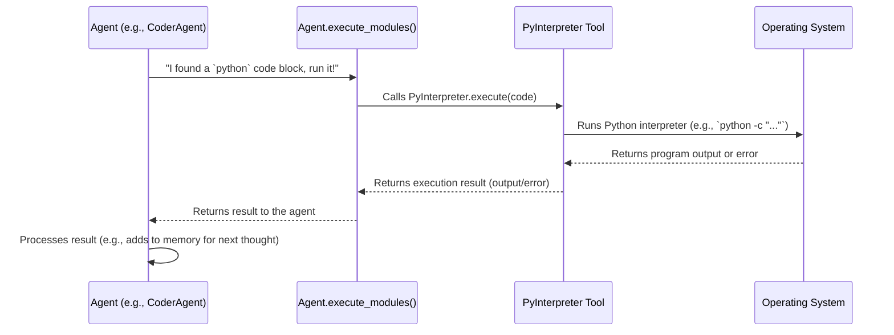

# Chapter 4: Tool System

In [Chapter 3: LLM Integration (Provider)](03_llm_integration__provider__.md), we learned how `agenticSeek`'s agents get their "brains" from powerful Large Language Models (LLMs). These LLMs are amazing at understanding, thinking, and generating text. But imagine a super-smart brain with no body – it can think of brilliant ideas, but it can't *do* anything in the real world.

That's where the **Tool System** comes in!

The Tool System provides `agenticSeek`'s agents with "hands" and "eyes" to interact with the outside world. It's a collection of specialized utilities, like a toolbox filled with different gadgets. Agents can "pick up" and use these tools to perform actions beyond just generating text. This enables them to truly "act" in their environment by reading files, writing new ones, running commands, or even searching the web to achieve complex objectives.

**The Big Problem It Solves:** An LLM on its own is limited to what it was trained on. It can't browse the *live* internet, run code on your computer, or interact with files. The Tool System bridges this gap, giving `agenticSeek` the ability to be an active participant, not just a conversationalist. This makes `agenticSeek` much more powerful and useful for real-world tasks.

Let's consider a practical example: **You ask `agenticSeek`, "Write a Python script to list all `.py` files in the current directory and then run it."**

To solve this, `agenticSeek` needs to do more than just "think." It needs to:
1.  **Write** the Python code (thought).
2.  **Execute** that Python code (action, using a tool).
3.  **Read** the output from the execution (action, using a tool's "eyes").

---

### What is a Tool? (Key Concepts)

At its core, a "Tool" in `agenticSeek` is a specialized capability that an agent can invoke. Think of them as individual applications or functions that perform a very specific task.

Here are the core ideas behind the Tool System:

1.  **Specialized Utility:** Each tool is designed for one job. For example, `PyInterpreter` runs Python code, `BashInterpreter` runs command line commands, `FileFinder` manages files, and `searxSearch` searches the web.
2.  **Encapsulated Action:** Each tool knows *how* to perform its task, so the agent doesn't need to worry about the nitty-gritty details. It just says, "Hey `PyInterpreter`, run this Python code!"
3.  **"Executable Blocks":** Agents communicate with tools by outputting special "code blocks" in their generated text. These blocks tell `agenticSeek` which tool to use and what input to give it.
4.  **Feedback Loop:** After a tool executes, it provides feedback (success or failure, along with the output) back to the agent. This allows the agent to learn, correct mistakes, or continue its task.

`agenticSeek` comes with several built-in tools:

*   `PyInterpreter`: Runs Python code.
*   `BashInterpreter`: Runs shell commands (like `ls` or `cd`).
*   `CInterpreter`, `GoInterpreter`, `JavaInterpreter`: Run code in other programming languages.
*   `FileFinder`: Reads information about files and their contents.
*   `searxSearch`: Performs web searches.
*   `FlightSearch`: Searches for flight information.
*   `MCP_finder`: Finds and queries other specialized "MCP" servers.

---

### How Agents Use Tools (Solving Our Use Case)

Let's go back to our example: "Write a Python script to list all `.py` files in the current directory and then run it."

Here's how an agent, specifically the `CoderAgent` (which you learned about in [Chapter 2: Agent System](02_agent_system_.md)), would use the Tool System:

When the `CoderAgent` receives your request, it uses its LLM "brain" to think about the best way to solve it. Its LLM might generate a response that looks something like this (simplified):

```
Okay, I will write a Python script to list Python files in this directory.

```python
import os

for file in os.listdir('.'):
    if file.endswith('.py'):
        print(file)
```
```

Notice the special ````python` and ```` tags. This is how the `CoderAgent` (or rather, the `Agent` class it inherits from) knows that the text inside is meant to be executed by the `PyInterpreter` tool. It's like the agent saying, "Here are the instructions for my Python 'hands'!"

Once the agent's "thinking" process (which involves its LLM) produces this text, the `agenticSeek` system steps in. It detects these special blocks, extracts the code, and passes it to the correct tool for execution. The tool runs the code, and its output (like a list of `.py` files) is then sent back to the agent for it to process further or present to you.

---

### Under the Hood: The Tool System's Inner Workings

Let's peek behind the curtain to understand what happens step-by-step when an agent uses a tool.

Here's a simple diagram illustrating the flow:



1.  **Agent Generates Code:** The `Agent` (e.g., `CoderAgent`) uses its LLM to generate a response that includes an "executable block" (like ````python ... ````).
2.  **`execute_modules` is Triggered:** The `Agent` class has a method, `execute_modules`, that scans its LLM's output for these special blocks.
3.  **Tool Identification:** `execute_modules` finds the ````python` tag, identifies that the `PyInterpreter` tool should handle this block, and extracts the Python code.
4.  **Tool Execution:** `execute_modules` then calls the specific `PyInterpreter.execute()` method, passing the extracted Python code to it.
5.  **Operating System Interaction:** The `PyInterpreter` tool (internally) uses Python's `subprocess` module to run the given Python code as if you typed it into your command line.
6.  **Results and Feedback:** The operating system returns the output (or any errors) to the `PyInterpreter`. The `PyInterpreter` then formats this into useful "feedback" and returns it to the `execute_modules` method.
7.  **Agent Learns:** Finally, the `execute_modules` method passes this feedback back to the main `Agent` loop. The agent can then add this output to its [Memory Management](05_memory_management_.md) to inform its next "thought" or to present the final answer to you.

Let's look at the code that makes this happen.

#### The Base `Tools` Class: The Blueprint (`sources/tools/tools.py`)

All tools in `agenticSeek` inherit from the `Tools` class. This is like the blueprint for all the "gadgets" in the toolbox. It defines common methods that every tool must have.

```python
# sources/tools/tools.py (simplified)
from abc import abstractmethod # Used to mark methods that *must* be implemented

class Tools():
    def __init__(self):
        self.tag = "undefined" # e.g., "python", "bash", "web_search"
        self.name = "undefined"
        self.description = "undefined"
        self.work_dir = self.create_work_dir() # Where files/code might run
        self.excutable_blocks_found = False # Flag for agent to know if blocks were found
        # ... other setup ...

    @abstractmethod
    def execute(self, blocks:list[str], safety:bool) -> str:
        """Abstract method: run the tool's main function (e.g., execute code, search web)."""
        pass

    @abstractmethod
    def execution_failure_check(self, output:str) -> bool:
        """Abstract method: check if the tool's execution failed."""
        pass

    @abstractmethod
    def interpreter_feedback(self, output:str) -> str:
        """Abstract method: format the tool's output into feedback for the AI."""
        pass

    def load_exec_block(self, llm_text: str):
        """Extract code/query blocks from LLM text based on the tool's tag (e.g., ```python)."""
        start_tag = f'```{self.tag}'
        end_tag = '```'
        code_blocks = []
        # ... (simplified: logic to find text between start_tag and end_tag) ...
        if start_tag in llm_text:
            # Found executable blocks, agent will know to process them
            self.excutable_blocks_found = True
            # ... actual extraction logic ...
            content = "extracted code/query" # Placeholder
            code_blocks.append(content)
        return code_blocks, None # Also returns a save path if specified
```

**Explanation:**
*   `__init__`: Sets up basic information like the `tag` (the keyword used in ```` tags, like `python` or `bash`) and the `work_dir` where operations happen.
*   `execute`, `execution_failure_check`, `interpreter_feedback`: These are marked `abstractmethod`. This means any specific tool (like `PyInterpreter`) *must* provide its own way to do these things.
*   `load_exec_block`: This is a helper function that the `Agent` uses. It scans the LLM's generated text for blocks starting with ````<tool_tag>` and ending with ````. This is how the system recognizes when an agent wants to use a specific tool.

#### Example Tool: The Python Interpreter (`sources/tools/PyInterpreter.py`)

The `PyInterpreter` is a specific tool that knows how to run Python code. It extends the base `Tools` class.

```python
# sources/tools/PyInterpreter.py (simplified)
import sys
from io import StringIO
from sources.tools.tools import Tools

class PyInterpreter(Tools):
    def __init__(self):
        super().__init__()
        self.tag = "python" # This tool recognizes ```python blocks
        self.name = "Python Interpreter"
        self.description = "This tool allows the agent to execute python code."

    def execute(self, codes:str, safety = False) -> str:
        """Execute python code."""
        output = ""
        stdout_buffer = StringIO()
        sys.stdout = stdout_buffer # Redirect print statements to our buffer
        code = '\n\n'.join(codes) # Join multiple code blocks
        try:
            exec(code, {'__builtins__': __builtins__}) # Run the Python code!
            output = stdout_buffer.getvalue() # Get what was printed
        except Exception as e:
            output = "code execution failed:" + str(e) # Capture errors
        finally:
            sys.stdout = sys.__stdout__ # Restore normal print behavior
        return output

    def interpreter_feedback(self, output:str) -> str:
        """Provide feedback based on the output of the code execution."""
        if self.execution_failure_check(output):
            feedback = f"[failure] Error in execution:\n{output}"
        else:
            feedback = "[success] Execution success, code output:\n" + output
        return feedback
    
    def execution_failure_check(self, feedback:str) -> bool:
        """Check if the code execution failed (simplified)."""
        return "failed" in feedback or "exception" in feedback
```

**Explanation:**
*   `__init__`: Sets its `tag` to `"python"`, so `load_exec_block` knows to look for ````python` blocks.
*   `execute`: This is the core. It takes the `codes` (the Python code extracted from the LLM's output), uses `StringIO` to capture anything printed, and then `executes` the code directly. Any output or errors are returned.
*   `interpreter_feedback` and `execution_failure_check`: These methods analyze the output from `execute` and create a clear message (`[success]` or `[failure]`) for the `Agent` to understand.

#### Example Tool: The Bash Interpreter (`sources/tools/BashInterpreter.py`)

Similar to the Python interpreter, the `BashInterpreter` handles shell commands.

```python
# sources/tools/BashInterpreter.py (simplified)
import subprocess
from sources.tools.tools import Tools

class BashInterpreter(Tools):
    def __init__(self):
        super().__init__()
        self.tag = "bash" # This tool recognizes ```bash blocks
        self.name = "Bash Interpreter"
        self.description = "This tool allows the agent to execute bash commands."
    
    def execute(self, commands: str, safety=False, timeout=300):
        """Execute bash commands."""
        concat_output = ""
        for command in commands:
            # ... safety checks and work_dir changes ...
            try:
                process = subprocess.Popen( # Run command in a new process
                    command, shell=True, stdout=subprocess.PIPE, stderr=subprocess.STDOUT, text=True
                )
                command_output = ""
                for line in process.stdout: # Read output as it comes
                    command_output += line
                return_code = process.wait(timeout=timeout) # Wait for command to finish
                if return_code != 0:
                    return f"Command {command} failed with return code {return_code}:\n{command_output}"
                concat_output += f"Output of {command}:\n{command_output.strip()}\n"
            except Exception as e:
                return f"Command {command} failed:\n{str(e)}"
        return concat_output

    def interpreter_feedback(self, output):
        # Similar logic to PyInterpreter for feedback
        # ...
        return output

    def execution_failure_check(self, feedback):
        # Similar logic to PyInterpreter for checking failure patterns
        # ...
        return "error" in feedback
```

**Explanation:**
*   `__init__`: Sets its `tag` to `"bash"`.
*   `execute`: This uses Python's `subprocess` module to run command-line `commands`. It captures the output and errors, just like `PyInterpreter`.

#### How Agents Put it All Together

Finally, let's look back at how an `Agent` (like `CoderAgent`) actually uses these tools:

```python
# sources/agents/code_agent.py (simplified CoderAgent)
from sources.agents.agent import Agent # The base Agent class
from sources.tools import PyInterpreter, BashInterpreter # Import the tools

class CoderAgent(Agent):
    def __init__(self, name, prompt_path, provider, verbose=False):
        super().__init__(name, prompt_path, provider, verbose, None)
        self.tools = { # The CoderAgent's specific toolkit!
            "bash": BashInterpreter(),
            "python": PyInterpreter(),
            # ... other tools like FileFinder etc. ...
        }
        # ... memory setup ...

    async def process(self, prompt, speech_module) -> str:
        self.memory.push('user', prompt) # Add user's request to memory
        attempt = 0
        while attempt < 5:
            answer, reasoning = await self.llm_request() # 1. Agent thinks (uses LLM)
            
            # Check if the LLM's answer contains tool-executable blocks
            bash_blocks, _ = self.tools["bash"].load_exec_block(answer)
            python_blocks, _ = self.tools["python"].load_exec_block(answer)
            
            exec_success = True
            feedback = ""

            if bash_blocks:
                feedback = self.tools["bash"].execute(bash_blocks)
                exec_success = not self.tools["bash"].execution_failure_check(feedback)
            elif python_blocks:
                feedback = self.tools["python"].execute(python_blocks)
                exec_success = not self.tools["python"].execution_failure_check(feedback)
            
            if not exec_success:
                # 2. If execution failed, agent adds feedback to memory to try again
                self.memory.push('user', self.tools["bash"].interpreter_feedback(feedback) if bash_blocks else self.tools["python"].interpreter_feedback(feedback))
                attempt += 1
            else:
                # 3. If successful, agent cleans up answer and stops
                self.last_answer = self.remove_blocks(answer) # Remove code blocks from final display
                break
        return self.last_answer, reasoning
```

**Explanation:**
*   `self.tools = {...}`: In its `__init__` method, the `CoderAgent` gets its specific set of tools. It stores instances of `BashInterpreter` and `PyInterpreter`.
*   `await self.llm_request()`: The agent asks its LLM brain for a response to the prompt.
*   `load_exec_block(...)`: The agent then asks its tools if the LLM's `answer` contains any executable blocks (e.g., ````python` or ````bash`).
*   `execute(...)`: If blocks are found, the agent calls the `execute` method of the relevant tool.
*   `execution_failure_check(...)` and `interpreter_feedback(...)`: After execution, the agent checks if the tool reported a failure. If it did, the feedback is added back to the agent's `memory` (as if you, the user, told it about the error), prompting the LLM to "think" again and try to fix the issue. This creates a powerful self-correction loop!

This continuous loop of "think, act, observe, learn" is what allows `agenticSeek` to perform complex, multi-step tasks by leveraging its tools.

---

### Conclusion

In this chapter, we've explored the **Tool System**, which provides `agenticSeek`'s agents with the ability to "act" in the real world. We learned that tools are specialized utilities (like `PyInterpreter` for Python code or `searxSearch` for web searches) that agents invoke by generating special "executable blocks" in their output. This system allows `agenticSeek` to go beyond just thinking and truly interact with its environment, making it a powerful and versatile AI assistant.

You now understand how `agenticSeek`'s agents use tools to perform actions. But how do agents remember all their thoughts, actions, and the results from their tools? That's what we'll explore in the next chapter!

[Next Chapter: Memory Management](05_memory_management_.md)

---

Generated by [AI Codebase Knowledge Builder](https://github.com/The-Pocket/Tutorial-Codebase-Knowledge)