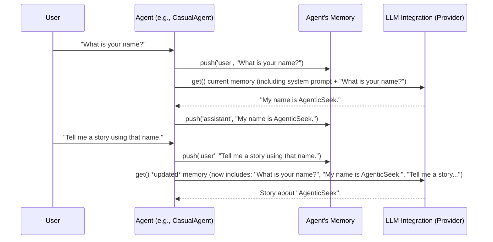

# Chapter 5: Memory Management

In [Chapter 4: Tool System](04_tool_system_.md), we explored how `agenticSeek`'s agents get their "hands" and "eyes" to interact with the world, allowing them to perform actions like running code or browsing the web. Agents can think and act, but what happens when you have a long conversation? How does `agenticSeek` remember what you said five minutes ago, or what it learned in an earlier step of a complex task?

Imagine you're trying to explain a detailed problem to a friend. If your friend kept forgetting what you just told them, the conversation would be very frustrating! Large Language Models (LLMs), the "brains" of our agents, have a similar challenge: they have a limited "short-term memory" called a **context window**. This means they can only "see" and process a certain amount of text at any given time. If a conversation gets too long, older parts simply "fall out" of their view, and they forget them.

That's where **Memory Management** comes in!

Think of Memory Management as the AI's personal, magical notebook. It meticulously records every message you send and every response `agenticSeek` gives. This way, agents can recall past information and maintain a consistent, ongoing conversation, even across many turns. But this notebook is extra smart: it also has clever ways to "summarize" or "compress" older notes, preventing the notebook from becoming too long and ensuring the AI always has the most relevant context readily available without getting overwhelmed.

**The Big Problem It Solves:** Without a good memory system, `agenticSeek` would suffer from "amnesia." Each new question would be treated as if it were the first, making long, meaningful interactions impossible. Memory Management ensures continuity, allows agents to build upon previous interactions, and helps them complete multi-step tasks by remembering context and results, without exceeding the LLM's limitations.

Let's look at a simple use case: **You ask `agenticSeek`, "What is your name?" and then in the next turn, "Tell me a story using that name."** To answer the second question correctly, `agenticSeek` *must* remember its name from the first interaction.

---

### What is Memory Management? (Key Concepts)

Memory Management in `agenticSeek` is handled primarily by the `Memory` class. Here are its core ideas:

1.  **Conversation History**: This is the most basic form of memory. The `Memory` class stores a list of all messages exchanged, usually in a "role" (like 'user' for your messages or 'assistant' for AI's messages) and "content" (the actual text).
2.  **Context Window**: This is a crucial limitation of LLMs. Every LLM can only process a certain number of words or "tokens" at once. If the conversation history gets longer than this context window, the LLM won't be able to "see" the beginning of the conversation.
3.  **Summarization/Compression**: To deal with the context window limitation, `agenticSeek` can intelligently summarize older parts of the conversation. It uses a smaller AI model specifically for summarization. This keeps the memory compact and relevant, fitting into the LLM's context window, so the main LLM (the agent's "brain") doesn't get overloaded.
4.  **Persistence**: `agenticSeek` can save your conversation history to a file. This means if you close `agenticSeek` and reopen it later, it can "recover" your last session and remember where you left off. This is like bookmarking your magical notebook.
5.  **Agent-Specific Memory**: Each agent (like `CasualAgent`, `CoderAgent`, etc.) typically has its own `Memory` instance. This helps keep their specialized contexts separate and focused.

---

### How Agents Use Memory (Solving Our Use Case)

Let's go back to our example: "What is your name?" followed by "Tell me a story using that name."

Here's how an agent uses its memory:



As you can see, the key is the `push` and `get` operations on the `Memory` object:

*   **`push`**: When you type a message, the `Agent` first `push`es your message into its `Memory`. When the agent responds, it also `push`es its own response into memory.
*   **`get`**: Before asking the LLM to "think" and generate a response, the `Agent` uses `get` to retrieve the *entire* current conversation history from its `Memory`. This complete history is then sent to the LLM. The LLM can then use this full context to generate a coherent and relevant response that builds on previous turns.

This simple `push` and `get` mechanism, combined with intelligent compression, is what makes continuous conversations possible.

---

### Under the Hood: The Memory System's Inner Workings

Let's peek behind the curtain to understand how the `Memory` class in `agenticSeek` handles these tasks. The core of this system is in `sources/memory.py`.

#### The `Memory` Class: The AI's Notebook (`sources/memory.py`)

Every agent has an instance of this `Memory` class.

```python
# sources/memory.py (simplified __init__)
import json
import os
import configparser
from sources.utility import animate_thinking
from sources.logger import Logger

config = configparser.ConfigParser()
config.read('config.ini')

class Memory():
    def __init__(self, system_prompt: str,
                 recover_last_session: bool = False,
                 memory_compression: bool = True,
                 model_provider: str = "deepseek-r1:14b"):
        self.memory = [{'role': 'system', 'content': system_prompt}] # Start with AI's core instructions
        
        self.logger = Logger("memory.log")
        # ... other session tracking (like ID, time) ...
        
        self.memory_compression = memory_compression # Is compression enabled?
        self.model_provider = model_provider # Which LLM brain is being used?
        self.model = None # This will be the summarization model
        self.tokenizer = None # For the summarization model
        if self.memory_compression:
            self.download_model() # Load the special summarization model
        
        if recover_last_session:
            self.load_memory() # Try to load a past conversation
```

**Explanation:**
*   **`__init__`**: When a `Memory` object is created, it's given a `system_prompt` (which tells the AI its basic role). It also checks if `memory_compression` is enabled and, if so, `download_model()` is called to set up the smaller AI model responsible for summarization. It also checks if it should `load_memory` from a previous session.

#### Adding to Memory: `push()`

This method adds new messages to the conversation history. It also contains the logic to trigger compression if the memory gets too long.

```python
# sources/memory.py (simplified push method)
class Memory():
    # ... other methods ...

    def push(self, role: str, content: str) -> int:
        """Push a message to the memory."""
        # ideal_ctx represents the LLM's max context size (e.g., 4096 tokens)
        ideal_ctx = self.get_ideal_ctx(self.model_provider) 
        
        # If compression is on AND the content is very long, try to compress
        if self.memory_compression and ideal_ctx is not None and len(content) > ideal_ctx * 1.5:
            self.logger.info(f"Compressing memory: Content {len(content)} > {ideal_ctx} model context.")
            self.compress() # Call the compression method!
            
        curr_idx = len(self.memory)
        # Add the new message to the list
        self.memory.append({'role': role, 'content': content})
        return curr_idx-1
```

**Explanation:**
*   **`ideal_ctx`**: This line tries to estimate the context window size of the main LLM being used (e.g., Llama 3, GPT-4). This helps `Memory` decide when to compress.
*   **Compression Check**: Before adding the new message, it checks if `memory_compression` is active and if the *current* conversation (represented by `content` length being very long) is already approaching or exceeding the LLM's context limit. If so, it calls `self.compress()` to summarize older messages.
*   **Appending Message**: Finally, the new message (with its `role` and `content`) is added to the `self.memory` list.

#### Getting Memory: `get()`

This is the simplest method, simply returning the entire current conversation history.

```python
# sources/memory.py (simplified get method)
class Memory():
    # ... other methods ...

    def get(self) -> list:
        """Return the current conversation memory."""
        return self.memory
```

**Explanation:**
*   When an `Agent` calls `self.llm_request()`, it uses `self.memory.get()` to retrieve the `self.memory` list. This list, containing all the conversation turns (including summarized ones), is then sent to the main LLM for processing.

#### Summarizing Memory: `summarize()` and `compress()`

These are the core methods for intelligent memory management.

```python
# sources/memory.py (simplified summarize and compress methods)
import torch # Used by the summarization model
from transformers import AutoTokenizer, AutoModelForSeq22SeqLM # For the summarization model

class Memory():
    # ... other methods ...

    def download_model(self):
        """Download the model for memory summarization."""
        animate_thinking("Loading memory compression model...", color="status")
        # Loads a pre-trained summarization model (like LED-base-book-summary)
        self.tokenizer = AutoTokenizer.from_pretrained("pszemraj/led-base-book-summary")
        self.model = AutoModelForSeq2SeqLM.from_pretrained("pszemraj/led-base-book-summary")
        self.logger.info("Memory compression system initialized.")
    
    def summarize(self, text: str, min_length: int = 64) -> str:
        """Summarize the text using the AI model."""
        if self.tokenizer is None or self.model is None or len(text) < min_length * 1.5:
            return text # Don't summarize if model isn't loaded or text is too short

        # Prepare the text for the summarization model
        input_text = "summarize: " + text
        inputs = self.tokenizer(input_text, return_tensors="pt", max_length=512, truncation=True)
        
        # Generate the summary using the specialized model
        summary_ids = self.model.generate(
            inputs['input_ids'],
            max_length=len(text) // 2 if len(text) > min_length * 2 else min_length * 2,
            min_length=min_length,
            num_beams=4, # Helps get a better summary
            early_stopping=True
        )
        summary = self.tokenizer.decode(summary_ids[0], skip_special_tokens=True)
        self.logger.info(f"Memory summarized from len {len(text)} to {len(summary)}.")
        return summary
    
    def compress(self) -> None:
        """Compress (summarize) the memory by summarizing long messages."""
        if self.tokenizer is None or self.model is None:
            self.logger.warning("No tokenizer or model to perform memory compression.")
            return

        # Loop through each message in memory (skipping the system prompt)
        for i in range(len(self.memory)):
            if self.memory[i]['role'] == 'system':
                continue # Don't touch the initial system instructions
            
            # If a message's content is very long (e.g., over 1024 characters)
            if len(self.memory[i]['content']) > 1024:
                # Replace the original long content with its summary
                self.memory[i]['content'] = self.summarize(self.memory[i]['content'])
```

**Explanation:**
*   **`download_model`**: This method is called once during initialization if `memory_compression` is enabled. It downloads and loads a pre-trained `transformers` model (specifically designed for summarization) and its `tokenizer`. This is a *separate, smaller AI* dedicated just to summarizing.
*   **`summarize(text)`**: This is the actual workhorse that takes a long piece of `text` and uses the loaded summarization model to generate a shorter version. It's smart enough not to summarize very short texts.
*   **`compress()`**: This method iterates through the `self.memory` list. For each message (skipping the initial system message), it checks if the `content` is very long (e.g., over 1024 characters). If it is, it calls `self.summarize()` on that content and replaces the original long message with its concise summary. This keeps the total memory size manageable.

#### Saving and Loading Memory: `save_memory()` and `load_memory()`

These methods handle the persistence of conversations.

```python
# sources/memory.py (simplified save_memory and load_memory)
class Memory():
    # ... other methods ...

    def save_memory(self, agent_type: str = "casual_agent") -> None:
        """Save the session memory to a file."""
        # Creates a folder like "conversations/casual_agent/"
        save_path = os.path.join(self.conversation_folder, agent_type)
        os.makedirs(save_path, exist_ok=True) # Ensure folder exists
        
        # Creates a unique filename (e.g., memory_2023-10-27_15-30-00.txt)
        filename = f"memory_{self.session_time.strftime('%Y-%m-%d_%H-%M-%S')}.json"
        path = os.path.join(save_path, filename)
        
        # Writes the entire memory list as a JSON file
        with open(path, 'w') as f:
            json.dump(self.memory, f)
            self.logger.info(f"Saved memory json at {path}")
    
    def load_memory(self, agent_type: str = "casual_agent") -> None:
        """Load the memory from the last session."""
        pretty_print(f"Loading {agent_type} past memories... ", color="status")
        
        # Finds the path to the most recent conversation file for this agent type
        save_path = os.path.join(self.conversation_folder, agent_type)
        if not os.path.exists(save_path):
            pretty_print("No memory to load.", color="success")
            return
        
        filename = self.find_last_session_path(save_path) # Helper to find latest file
        if filename is None:
            pretty_print("Last session memory not found.", color="warning")
            return
        
        path = os.path.join(save_path, filename)
        
        # Loads the JSON content back into self.memory
        with open(path, 'r') as f:
            self.memory = json.load(f)
        
        # Potentially compress the loaded memory to fit current model context
        self.compress() 
        pretty_print("Session recovered successfully", color="success")
```

**Explanation:**
*   **`save_memory`**: This method takes the current `self.memory` list (which is a list of dictionaries) and saves it as a JSON file. It organizes these files into folders based on the `agent_type` (e.g., `conversations/casual_agent/`). Each file gets a timestamp so you can track different sessions.
*   **`load_memory`**: This method looks for the most recent conversation file for a given `agent_type` and loads its content back into `self.memory`. This effectively restores the AI's "notebook" from where it left off, allowing for continuous interactions even after closing and restarting `agenticSeek`. It also calls `compress()` on the loaded memory to ensure it fits the current LLM's context window.

By combining these features, `agenticSeek`'s Memory Management system ensures that agents can maintain coherent, long-running conversations and complex task execution without "forgetting" crucial details.

---

### Conclusion

In this chapter, we've explored **Memory Management**, the essential system that gives `agenticSeek` its ability to "remember." We learned that the `Memory` class stores conversation history, intelligently compresses older messages to fit the LLM's context window, and can even save and load sessions for long-term continuity. This robust memory system is what truly enables `agenticSeek` to engage in natural, extended interactions and tackle multi-turn tasks effectively.

You now understand how `agenticSeek` keeps track of its conversations. But how does `agenticSeek` know how to structure and pass around all this information – from user queries to agent responses and memory entries? That's what we'll explore in the next chapter!

[Next Chapter: Data Schemas](06_data_schemas_.md)

---

Generated by [AI Codebase Knowledge Builder](https://github.com/The-Pocket/Tutorial-Codebase-Knowledge)